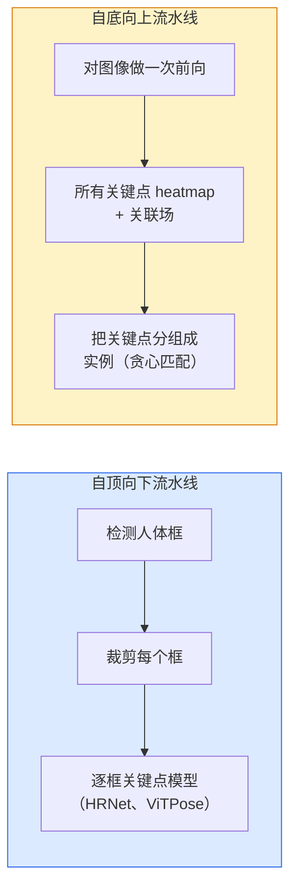

# 关键点检测与姿态估计（Keypoint Detection & Pose Estimation）

> 译注：本文译自同目录 [`en.md`](./en.md)。术语遵循仓根 [TRANSLATION_GUIDE.md](../../../../TRANSLATION_GUIDE.md)。

> 一个 pose 就是一组有序的 keypoint。keypoint 检测器就是一个 heatmap 回归器。其余都只是记账。

**Type:** Build
**Languages:** Python
**Prerequisites:** Phase 4 Lesson 06 (Detection), Phase 4 Lesson 07 (U-Net)
**Time:** ~45 minutes

## 学习目标（Learning Objectives）

- 区分 top-down 与 bottom-up 两类姿态估计，并说明各自适用场景
- 用「每个 keypoint 一个 Gaussian」目标回归 K 个 keypoint 的 heatmap，并在推理时提取 keypoint 坐标
- 解释 Part Affinity Fields（PAFs），以及 bottom-up 流水线如何把 keypoint 归并到具体实例
- 在生产环境用 MediaPipe Pose 或 MMPose 做 keypoint 估计，并理解它们的输出格式

## 问题（The Problem）

Keypoint 任务藏在很多名字背后：人体姿态（17 个身体关节）、面部 landmark（68 或 478 个点）、手部（21 个点）、动物姿态、机器人物体姿态、医学解剖 landmark。它们都共享同一个结构：在一个物体上检测 K 个离散的点，并输出它们的 (x, y) 坐标。

姿态估计是动作捕捉、健身 app、体育分析、手势控制、动画、AR 试穿和机器人抓取的基础。2D 场景已经成熟；3D 姿态（从单相机估计世界坐标系下的关节位置）则是当前研究前沿。

工程层面的问题在于规模。单图、单人姿态是 20ms 级别的问题。30 fps 下人群中的多人姿态则是另一个问题，需要不同的架构。

## 概念（The Concept）

### Top-down 与 bottom-up



- **Top-down**——先检测出人，再对每个人的 crop 跑一个 keypoint 模型。准确率最高；耗时随人数线性增长。
- **Bottom-up**——一次前向传播预测所有 keypoint 加上一个关联字段，再分组。耗时与人群规模无关，是常数时间。

Top-down（HRNet、ViTPose）是准确率王者；bottom-up（OpenPose、HigherHRNet）则是拥挤场景下的吞吐王者。

### Heatmap 回归

不直接回归 `(x, y)`，而是为每个 keypoint 预测一张 `H x W` 的 heatmap，在真值位置上放一个 Gaussian 团。

```
target[k, y, x] = exp(-((x - cx_k)^2 + (y - cy_k)^2) / (2 sigma^2))
```

推理时，每张 heatmap 的 argmax 就是预测的 keypoint 位置。

为什么 heatmap 比直接回归好用：网络的空间结构（卷积特征图）天然对齐空间输出。Gaussian 目标也起到了正则化的作用——一个小的定位误差会带来一个小的 loss，而不是零。

### 子像素定位（Sub-pixel localisation）

Argmax 只能给出整数坐标。要做到子像素精度，可以在 argmax 及其邻居上拟合一条抛物线，或者使用熟知的偏移公式 `(dx, dy) = 0.25 * (heatmap[y, x+1] - heatmap[y, x-1], ...)` 方向。

### Part Affinity Fields (PAFs)

OpenPose 用于 bottom-up 关联的小窍门。对每一对相连的 keypoint（例如左肩到左肘），预测一个 2 通道的字段，编码从一个点指向另一个点的单位向量。要把肩膀与它的肘关联起来，就沿候选对的连线对 PAF 做积分；积分最大的那一对被匹配。

```
For each connection (limb):
  PAF channels: 2 (unit vector x, y)
  Line integral: sum over sample points of (PAF . line_direction)
  Higher integral = stronger match
```

优雅，并且在任意人群规模下都能扩展，不用按人切 crop。

### COCO keypoint

标准的人体姿态数据集：每人 17 个 keypoint，指标是 PCK（Percentage of Correct Keypoints）和 OKS（Object Keypoint Similarity）。OKS 是 keypoint 版本的 IoU，也就是 COCO mAP@OKS 报告的那个。

### 2D 与 3D

- **2D 姿态**——图像坐标；MediaPipe、HRNet、ViTPose 已能给出生产级质量。
- **3D 姿态**——世界 / 相机坐标；仍是活跃的研究方向。常见做法：
  - 用一个小 MLP 把 2D 预测「抬升」到 3D（VideoPose3D）。
  - 直接从图像回归 3D（PyMAF、MHFormer）。
  - 多视角配置（CMU Panoptic）作为 ground truth。

## 动手实现（Build It）

### Step 1: Gaussian heatmap 目标

```python
import numpy as np
import torch

def gaussian_heatmap(size, cx, cy, sigma=2.0):
    yy, xx = np.meshgrid(np.arange(size), np.arange(size), indexing="ij")
    return np.exp(-((xx - cx) ** 2 + (yy - cy) ** 2) / (2 * sigma ** 2)).astype(np.float32)

hm = gaussian_heatmap(64, 32, 32, sigma=2.0)
print(f"peak: {hm.max():.3f} at ({hm.argmax() % 64}, {hm.argmax() // 64})")
```

把每个 keypoint 的 heatmap 沿通道轴堆叠，就得到完整的目标张量。

### Step 2: 极简 keypoint head

一个 U-Net 风格的模型，输出 K 个 heatmap 通道。

```python
import torch.nn as nn
import torch.nn.functional as F

class TinyKeypointNet(nn.Module):
    def __init__(self, num_keypoints=4, base=16):
        super().__init__()
        self.down1 = nn.Sequential(nn.Conv2d(3, base, 3, 2, 1), nn.ReLU(inplace=True))
        self.down2 = nn.Sequential(nn.Conv2d(base, base * 2, 3, 2, 1), nn.ReLU(inplace=True))
        self.mid = nn.Sequential(nn.Conv2d(base * 2, base * 2, 3, 1, 1), nn.ReLU(inplace=True))
        self.up1 = nn.ConvTranspose2d(base * 2, base, 2, 2)
        self.up2 = nn.ConvTranspose2d(base, num_keypoints, 2, 2)

    def forward(self, x):
        h1 = self.down1(x)
        h2 = self.down2(h1)
        h3 = self.mid(h2)
        u1 = self.up1(h3)
        return self.up2(u1)
```

输入 `(N, 3, H, W)`，输出 `(N, K, H, W)`。损失是逐像素的 MSE，对照 Gaussian 目标。

### Step 3: 推理——提取 keypoint 坐标

```python
def heatmap_to_coords(heatmaps):
    """
    heatmaps: (N, K, H, W)
    returns:  (N, K, 2) float coordinates in image pixels
    """
    N, K, H, W = heatmaps.shape
    hm = heatmaps.reshape(N, K, -1)
    idx = hm.argmax(dim=-1)
    ys = (idx // W).float()
    xs = (idx % W).float()
    return torch.stack([xs, ys], dim=-1)

coords = heatmap_to_coords(torch.randn(2, 4, 32, 32))
print(f"coords: {coords.shape}")  # (2, 4, 2)
```

推理时只要一行。要做子像素细化，就在 argmax 周围插值。

### Step 4: 合成 keypoint 数据集

很简单：在白色画布上画四个点，让模型学着把它们预测出来。

```python
def make_synthetic_sample(size=64):
    img = np.ones((3, size, size), dtype=np.float32)
    rng = np.random.default_rng()
    kps = rng.integers(8, size - 8, size=(4, 2))
    for cx, cy in kps:
        img[:, cy - 2:cy + 2, cx - 2:cx + 2] = 0.0
    hms = np.stack([gaussian_heatmap(size, cx, cy) for cx, cy in kps])
    return img, hms, kps
```

足够简单，一个小模型一分钟就能学会。

### Step 5: 训练

```python
model = TinyKeypointNet(num_keypoints=4)
opt = torch.optim.Adam(model.parameters(), lr=3e-3)

for step in range(200):
    batch = [make_synthetic_sample() for _ in range(16)]
    imgs = torch.from_numpy(np.stack([b[0] for b in batch]))
    hms = torch.from_numpy(np.stack([b[1] for b in batch]))
    pred = model(imgs)
    # Upsample pred to full resolution
    pred = F.interpolate(pred, size=hms.shape[-2:], mode="bilinear", align_corners=False)
    loss = F.mse_loss(pred, hms)
    opt.zero_grad(); loss.backward(); opt.step()
```

## 用起来（Use It）

- **MediaPipe Pose**——Google 的生产级姿态估计器；自带 WebGL + 移动端运行时，延迟低于 10ms。
- **MMPose**（OpenMMLab）——综合性研究代码库；每种 SOTA 架构都附带预训练权重。
- **YOLOv8-pose**——单次前向就完成的最快实时多人姿态。
- **transformers HumanDPT / PoseAnything**——较新的视觉-语言路线，做开放词表姿态（任意物体、任意 keypoint 集合）。

## 上线部署（Ship It）

本课产出：

- `outputs/prompt-pose-stack-picker.md`——一段 prompt，根据延迟、人群规模和 2D / 3D 需求在 MediaPipe / YOLOv8-pose / HRNet / ViTPose 之间挑选。
- `outputs/skill-heatmap-to-coords.md`——一项 skill，写出每一个生产级姿态模型都会用到的 sub-pixel heatmap-to-coordinate 子例程。

## 练习（Exercises）

1. **（简单）** 在 4 点合成数据集上训练这个 tiny keypoint 模型。汇报 200 步后预测 keypoint 与真值之间的平均 L2 误差。
2. **（中等）** 加上子像素细化：给定 argmax 位置，沿 x 和 y 各从邻居像素拟合一条 1D 抛物线。汇报相对整数 argmax 的精度提升。
3. **（困难）** 构造一个 2 人合成数据集，每张图里有两个 4-keypoint 模式的实例。训练一个带 PAF 的 bottom-up 流水线，预测每个 keypoint 属于哪一个实例，并用 OKS 评估。

## 关键术语（Key Terms）

| 术语 | 大家怎么说 | 实际含义 |
|------|----------------|----------------------|
| Keypoint | 「一个 landmark」 | 物体上一个特定的、有序的点（关节、角点、特征） |
| Pose | 「骨架」 | 属于同一个实例的一组有序 keypoint |
| Top-down | 「先检测后估姿」 | 两阶段流水线：人检测器 + 每个 crop 的 keypoint 模型；准确率最高 |
| Bottom-up | 「先 pose 后分组」 | 单次预测所有 keypoint + 分组；耗时与人群规模无关 |
| Heatmap | 「Gaussian 目标」 | 每个 keypoint 一张 H x W 的张量，峰值在真值位置；首选的回归目标 |
| PAF | 「Part Affinity Field」 | 2 通道的单位向量场，编码肢体方向；用于把 keypoint 分组到实例 |
| OKS | 「Keypoint IoU」 | Object Keypoint Similarity；COCO 用于姿态的指标 |
| HRNet | 「High-Resolution Net」 | 主流的 top-down keypoint 架构；全程保留高分辨率特征 |

## 延伸阅读（Further Reading）

- [OpenPose (Cao et al., 2017)](https://arxiv.org/abs/1812.08008)——带 PAF 的 bottom-up 方法；至今仍是该思路写得最好的论文
- [HRNet (Sun et al., 2019)](https://arxiv.org/abs/1902.09212)——top-down 的参考架构
- [ViTPose (Xu et al., 2022)](https://arxiv.org/abs/2204.12484)——以原版 ViT 作为姿态 backbone；在多项基准上是当前 SOTA
- [MediaPipe Pose](https://developers.google.com/mediapipe/solutions/vision/pose_landmarker)——生产级实时姿态；2026 年部署最快的栈
