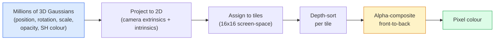

# 3D Gaussian Splatting from Scratch

> scene は数百万個の 3D Gaussians の cloud である。それぞれが position、orientation、scale、opacity、viewing direction に依存する colour を持つ。それらを rasterise し、rasterisation を通して backprop すればよい。

**種別:** 構築
**言語:** Python
**前提条件:** Phase 4 Lesson 13 (3D Vision & NeRF), Phase 1 Lesson 12 (Tensor Operations), Phase 4 Lesson 10 (Diffusion basics optional)
**所要時間:** 約90分

## 学習目標

- 2026 年に photorealistic 3D reconstruction の本番 default として 3D Gaussian Splatting が NeRF を置き換えた理由を説明する
- Gaussian ごとの 6 つの parameters (position, rotation quaternion, scale, opacity, spherical harmonics colour, optional feature) と、それぞれが何個の float を持つかを述べる
- `alpha` compositing を使う 2D Gaussian splatting rasterizer を scratch から実装し、3D case が同じ loop に projection されることを示す
- `nerfstudio`、`gsplat`、または `SuperSplat` を使って 20-50 枚の写真から scene を reconstruct し、`KHR_gaussian_splatting` glTF extension または OpenUSD 26.03 `UsdVolParticleField3DGaussianSplat` schema に export する

## 問題

NeRF は scene を MLP の weights として保存する。render される各 pixel は ray に沿って数百回 MLP query を行う。training は何時間もかかり、rendering は秒単位で、weights は編集できない。scene 内の椅子を動かしたいなら retrain が必要になる。

3D Gaussian Splatting (Kerbl, Kopanas, Leimkühler, Drettakis, SIGGRAPH 2023) はこれを置き換えた。scene は明示的な 3D Gaussians の集合である。Rendering は GPU rasterisation で 100+ fps。Training は分単位。Editing は直接的で、Gaussian の subset を translate すれば椅子を動かしたことになる。2026 年までに Khronos Group は Gaussian splats 用 glTF extension を ratify し、OpenUSD 26.03 は Gaussian splat schema を搭載し、Zillow や Apartments.com は不動産をこれで render し、3D reconstruction の新しい research papers の多くは core 3DGS idea の variants になっている。

mental model は単純だが、math には多くの可動部品があるため、多くの入門は rasterisation から始めて projection と spherical harmonics を飛ばす。この lesson では全体を作る。まず 2D version、次に 3D extension である。

## コンセプト

### Gaussian が持つもの

1 つの 3D Gaussian は、空間内の parametric blob であり、次の attributes を持つ。

```
position         mu         (3,)    centre in world coordinates
rotation         q          (4,)    unit quaternion encoding orientation
scale            s          (3,)    log-scales per axis (exponentiated at render time)
opacity          alpha      (1,)    post-sigmoid opacity [0, 1]
SH coefficients  c_lm       (3 * (L+1)^2,)   view-dependent colour
```

Rotation + scale は 3x3 covariance `Sigma = R S S^T R^T` を作る。これが 3D 内の Gaussian の shape である。Spherical harmonics により、viewing direction に応じて colour を変えられる。specular highlights、subtle sheen、view-dependent glow を per-view textures なしで表現する。SH degree 3 では colour channel ごとに 16 coefficients、つまり colour だけで Gaussian あたり 48 floats になる。

scene は通常 1-5 million Gaussians を持つ。各 Gaussian はおよそ 60 floats (3 + 4 + 3 + 1 + 48 + misc) を保存する。500 万 Gaussian の scene で 240 MB であり、per-point texture 付きの同等 point cloud よりはるかに小さく、高解像度で再 render される NeRF の MLP weights より 1 桁小さい。

### ray marching ではなく rasterisation



5 steps で、すべて GPU-friendly である。pixel ごとの MLP query はない。単一の RTX 3080 Ti で 600 万 splats を 147 fps で render できる。

### projection step

world position `mu` と 3D covariance `Sigma` を持つ 3D Gaussian は、screen position `mu'` と 2D covariance `Sigma'` を持つ 2D Gaussian に project される。

```
mu' = project(mu)
Sigma' = J W Sigma W^T J^T          (2 x 2)

W = viewing transform (rotation + translation of camera)
J = Jacobian of the perspective projection at mu'
```

2D Gaussian の footprint は、`Sigma'` の eigenvectors を axis とする ellipse である。その ellipse 内の各 pixel は Gaussian の contribution を受け取り、`exp(-0.5 * (p - mu')^T Sigma'^-1 (p - mu'))` で重み付けされる。

### alpha-compositing rule

1 pixel について、それを覆う Gaussians は back-to-front で sort される (または等価に、反転した式で front-to-back)。Colour は 1980 年代からあるすべての semi-transparent rasteriser と同じ式で composite される。

```
C_pixel = sum_i alpha_i * T_i * c_i

T_i = prod_{j < i} (1 - alpha_j)       transmittance up to i
alpha_i = opacity_i * exp(-0.5 * d^T Sigma'^-1 d)   local contribution
c_i = eval_SH(SH_i, view_direction)    view-dependent colour
```

これは **NeRF の volumetric render と同じ式** である。ただし ray に沿った dense samples ではなく、明示的で sparse な Gaussians 上で計算する。この一致が、rendered quality が NeRF と並ぶ理由である。どちらも同じ radiance-field equation を integrate している。

### differentiable である理由

projection、tile assignment、alpha compositing、SH evaluation のすべての step は Gaussian parameters に関して differentiable である。ground-truth image が与えられたら、rendered pixel loss を計算し、rasteriser を通して backprop し、すべての `(mu, q, s, alpha, c_lm)` を gradient descent で更新する。約 30,000 iterations の間に、Gaussians は正しい positions、scales、colours を見つける。

### Densification and pruning

固定された Gaussian 集合では複雑な scene を覆えない。Training には 2 つの adaptive mechanisms が含まれる。

- **Clone** gradient magnitude が高いが scale が小さい Gaussian を現在位置で clone する。この領域にはより多くの detail が必要である。
- **Split** gradient が高い大きな scale の Gaussian を 2 つの小さな Gaussian に分割する。1 つの大きな Gaussian はその領域に対して滑らかすぎる。
- **Prune** opacity が threshold 未満に落ちた Gaussians を削除する。それらは寄与していない。

Densification は N iterations ごとに走る。scene は通常、SfM points から seed された約 100k initial Gaussians から、training の最後には 1-5M まで増える。

### spherical harmonics を 1 段落で

View-dependent colour は unit sphere 上の function `c(direction)` である。Spherical harmonics は sphere の Fourier basis である。degree `L` で打ち切ると、channel ごとに `(L+1)^2` basis functions が得られる。新しい view の colour を評価することは、learned SH coefficients と viewing direction で評価された basis の dot product である。Degree 0 は 1 coefficient の constant colour。Degree 3 は 16 coefficients で、Lambertian shading、specular、軽い reflection を捉えるのに十分である。3D Gaussian Splatting papers は degree 3 を default にする。

### 2026 年の production stack

```
1. Capture         smartphone / DJI drone / handheld scanner
2. SfM / MVS       COLMAP or GLOMAP derives camera poses + sparse points
3. Train 3DGS      nerfstudio / gsplat / inria official / PostShot (~10-30 min on RTX 4090)
4. Edit            SuperSplat / SplatForge (clean floaters, segment)
5. Export          .ply -> glTF KHR_gaussian_splatting or .usd (OpenUSD 26.03)
6. View            Cesium / Unreal / Babylon.js / Three.js / Vision Pro
```

### 4D and generative variants

- **4D Gaussian Splatting** — Gaussians が time の functions になる。volumetric video に使われる (Superman 2026, A$AP Rocky's "Helicopter")。
- **Generative splats** — scene 全体を hallucinate する text-to-splat models (World Labs の Marble)。
- **3D Gaussian Unscented Transform** — autonomous driving simulation 向け NVIDIA NuRec の variant。

## 実装

### Step 1: 2D Gaussian

まず 2D rasteriser を作る。3D case は projection 後にこれへ帰着する。

```python
import torch
import torch.nn as nn
import torch.nn.functional as F


def eval_2d_gaussian(means, covs, points):
    """
    means:  (G, 2)      centres
    covs:   (G, 2, 2)   covariance matrices
    points: (H, W, 2)   pixel coordinates
    returns: (G, H, W)  density at every pixel for every Gaussian
    """
    G = means.size(0)
    H, W, _ = points.shape
    flat = points.view(-1, 2)
    inv = torch.linalg.inv(covs)
    diff = flat[None, :, :] - means[:, None, :]
    d = torch.einsum("gpi,gij,gpj->gp", diff, inv, diff)
    density = torch.exp(-0.5 * d)
    return density.view(G, H, W)
```

`einsum` はすべての (Gaussian, pixel) pair について quadratic form `diff^T Sigma^-1 diff` を計算する。

### Step 2: 2D splatting rasteriser

front-to-back の Alpha-compositing。2D では depth に意味がないため、order には Gaussian ごとの learned scalar を使う。

```python
def rasterise_2d(means, covs, colours, opacities, depths, image_size):
    """
    means:     (G, 2)
    covs:      (G, 2, 2)
    colours:   (G, 3)
    opacities: (G,)     in [0, 1]
    depths:    (G,)     per-Gaussian scalar used for ordering
    image_size: (H, W)
    returns:   (H, W, 3) rendered image
    """
    H, W = image_size
    yy, xx = torch.meshgrid(
        torch.arange(H, dtype=torch.float32, device=means.device),
        torch.arange(W, dtype=torch.float32, device=means.device),
        indexing="ij",
    )
    points = torch.stack([xx, yy], dim=-1)

    densities = eval_2d_gaussian(means, covs, points)
    alphas = opacities[:, None, None] * densities
    alphas = alphas.clamp(0.0, 0.99)

    order = torch.argsort(depths)
    alphas = alphas[order]
    colours_sorted = colours[order]

    T = torch.ones(H, W, device=means.device)
    out = torch.zeros(H, W, 3, device=means.device)
    for i in range(means.size(0)):
        a = alphas[i]
        out += (T * a)[..., None] * colours_sorted[i][None, None, :]
        T = T * (1.0 - a)
    return out
```

速くはない。本物の implementation は tile-based CUDA kernels を使う。しかし math は正しく、完全に differentiable である。

### Step 3: trainable 2D splat scene

```python
class Splats2D(nn.Module):
    def __init__(self, num_splats=128, image_size=64, seed=0):
        super().__init__()
        g = torch.Generator().manual_seed(seed)
        H, W = image_size, image_size
        self.means = nn.Parameter(torch.rand(num_splats, 2, generator=g) * torch.tensor([W, H]))
        self.log_scale = nn.Parameter(torch.ones(num_splats, 2) * math.log(2.0))
        self.rot = nn.Parameter(torch.zeros(num_splats))  # single angle in 2D
        self.colour_logits = nn.Parameter(torch.randn(num_splats, 3, generator=g) * 0.5)
        self.opacity_logit = nn.Parameter(torch.zeros(num_splats))
        self.depth = nn.Parameter(torch.rand(num_splats, generator=g))

    def covs(self):
        s = torch.exp(self.log_scale)
        c, si = torch.cos(self.rot), torch.sin(self.rot)
        R = torch.stack([
            torch.stack([c, -si], dim=-1),
            torch.stack([si, c], dim=-1),
        ], dim=-2)
        S = torch.diag_embed(s ** 2)
        return R @ S @ R.transpose(-1, -2)

    def forward(self, image_size):
        covs = self.covs()
        colours = torch.sigmoid(self.colour_logits)
        opacities = torch.sigmoid(self.opacity_logit)
        return rasterise_2d(self.means, covs, colours, opacities, self.depth, image_size)
```

`log_scale`、`opacity_logit`、`colour_logits` はすべて unconstrained parameters であり、render time に適切な activation で map される。これはすべての 3DGS implementation で使われる標準 pattern である。

### Step 4: 2D Gaussians を target image に fit する

```python
import math
import numpy as np

def make_target(size=64):
    yy, xx = np.meshgrid(np.arange(size), np.arange(size), indexing="ij")
    img = np.zeros((size, size, 3), dtype=np.float32)
    # Red circle
    mask = (xx - 20) ** 2 + (yy - 20) ** 2 < 10 ** 2
    img[mask] = [1.0, 0.2, 0.2]
    # Blue square
    mask = (np.abs(xx - 45) < 8) & (np.abs(yy - 40) < 8)
    img[mask] = [0.2, 0.3, 1.0]
    return torch.from_numpy(img)


target = make_target(64)
model = Splats2D(num_splats=64, image_size=64)
opt = torch.optim.Adam(model.parameters(), lr=0.05)

for step in range(200):
    pred = model((64, 64))
    loss = F.mse_loss(pred, target)
    opt.zero_grad(); loss.backward(); opt.step()
    if step % 40 == 0:
        print(f"step {step:3d}  mse {loss.item():.4f}")
```

200 steps で 64 Gaussians は 2 つの shapes に収まる。これが全体の考え方である。明示的な geometric primitives に対する gradient descent だ。

### Step 5: 2D から 3D へ

3D extension でも同じ loop を保つ。追加されるものは次の通り。

1. Gaussian ごとの rotation は単一 angle ではなく quaternion になる。
2. Covariance は quaternion から作った `R` と `S = diag(exp(log_scale))` を使う `R S S^T R^T` になる。
3. Projection `(mu, Sigma) -> (mu', Sigma')` は camera extrinsics と `mu` における perspective projection の Jacobian を使う。
4. Colour は spherical-harmonics expansion になる。viewing direction で評価する。
5. Depth-sort は learned scalar ではなく actual camera-space z から行う。

すべての production implementation (`gsplat`, `inria/gaussian-splatting`, `nerfstudio`) は、tile-based CUDA kernels を使って GPU 上でまさにこれを行う。

### Step 6: spherical harmonics evaluation

Degree 3 までの SH basis は channel ごとに 16 terms を持つ。Evaluation:

```python
def eval_sh_degree_3(sh_coeffs, dirs):
    """
    sh_coeffs: (..., 16, 3)   last dim is RGB channels
    dirs:      (..., 3)       unit vectors
    returns:   (..., 3)
    """
    C0 = 0.282094791773878
    C1 = 0.488602511902920
    C2 = [1.092548430592079, 1.092548430592079,
          0.315391565252520, 1.092548430592079,
          0.546274215296039]
    x, y, z = dirs[..., 0], dirs[..., 1], dirs[..., 2]
    x2, y2, z2 = x * x, y * y, z * z
    xy, yz, xz = x * y, y * z, x * z

    result = C0 * sh_coeffs[..., 0, :]
    result = result - C1 * y[..., None] * sh_coeffs[..., 1, :]
    result = result + C1 * z[..., None] * sh_coeffs[..., 2, :]
    result = result - C1 * x[..., None] * sh_coeffs[..., 3, :]

    result = result + C2[0] * xy[..., None] * sh_coeffs[..., 4, :]
    result = result + C2[1] * yz[..., None] * sh_coeffs[..., 5, :]
    result = result + C2[2] * (2.0 * z2 - x2 - y2)[..., None] * sh_coeffs[..., 6, :]
    result = result + C2[3] * xz[..., None] * sh_coeffs[..., 7, :]
    result = result + C2[4] * (x2 - y2)[..., None] * sh_coeffs[..., 8, :]

    # degree 3 terms omitted here for brevity; full 16-coefficient version in the code file
    return result
```

Learned `sh_coeffs` はその Gaussian の「すべての方向の colour」を保存する。render time には current view direction に対して評価し、3-vector RGB を得る。

## 使い方

実際の 3DGS 作業では `gsplat` (Meta) または `nerfstudio` を使う。

```bash
pip install nerfstudio gsplat
ns-download-data example
ns-train splatfacto --data path/to/data
```

`splatfacto` は nerfstudio の 3DGS trainer である。典型的な scene では RTX 4090 で 10-30 分かかる。

2026 年に重要な export options:

- `.ply` — raw Gaussian cloud (portable, largest file)。
- `.splat` — PlayCanvas / SuperSplat quantised format。
- glTF `KHR_gaussian_splatting` — Khronos standard。viewers 間で portable (Feb 2026 RC)。
- OpenUSD `UsdVolParticleField3DGaussianSplat` — USD-native。NVIDIA Omniverse と Vision Pro pipelines 向け。

4D / dynamic scenes では、`4DGS` と `Deformable-3DGS` が同じ仕組みを time-varying means と opacities で拡張する。

## 成果物

この lesson は次を生成する:

- `outputs/prompt-3dgs-capture-planner.md` — 与えられた scene type に対して capture session (写真枚数、camera path、lighting) を計画する prompt。
- `outputs/skill-3dgs-export-router.md` — downstream viewer または engine に応じて適切な export format (`.ply` / `.splat` / glTF / USD) を選ぶ skill。

## 演習

1. **(Easy)** 上の 2D splat trainer を別の synthetic image で実行する。`num_splats` を `[16, 64, 256]` で変え、それぞれの MSE vs step を plot する。diminishing returns の地点を特定する。
2. **(Medium)** 2D rasteriser を拡張し、degree-2 harmonic によって scalar "view angle" に依存する Gaussian ごとの RGB colours を support する。target images のペアで学習し、model が両方を reconstruct することを確認する。
3. **(Hard)** `nerfstudio` を clone し、手元にある任意の scene (desk, plant, face, room) の 20-photo capture で `splatfacto` を学習する。glTF `KHR_gaussian_splatting` に export し、viewer (Three.js `GaussianSplats3D`, SuperSplat, Babylon.js V9) で開く。training time、Gaussians 数、rendered fps を報告する。

## 重要用語

| 用語 | よく言われる表現 | 実際の意味 |
|------|----------------|----------------------|
| 3DGS | "Gaussian splats" | Gaussian ごとの position, rotation, scale, opacity, SH colour を持つ数百万個の 3D Gaussians による明示的 scene representation |
| Covariance | "Shape of the Gaussian" | `Sigma = R S S^T R^T`。1 つの Gaussian の orientation と anisotropic scale |
| Alpha compositing | "Back-to-front blend" | NeRF の volumetric render と同じ式を、明示的で sparse な集合上で計算する |
| Densification | "Clone and split" | reconstruction が under-fit している場所に新しい Gaussians を adaptive に追加する |
| Pruning | "Delete low-opacity" | training 中に near-zero opacity に崩れた Gaussians を削除する |
| Spherical harmonics | "View-dependent colour" | sphere 上の Fourier basis。viewing direction の関数として colour を保存する |
| Splatfacto | "nerfstudio's 3DGS" | 2026 年に 3DGS を training する最も簡単な path |
| `KHR_gaussian_splatting` | "glTF standard" | 3DGS を viewers と engines 間で portable にする Khronos 2026 extension |

## 参考資料

- [3D Gaussian Splatting for Real-Time Radiance Field Rendering (Kerbl et al., SIGGRAPH 2023)](https://repo-sam.inria.fr/fungraph/3d-gaussian-splatting/) — original paper
- [gsplat (Meta/nerfstudio)](https://github.com/nerfstudio-project/gsplat) — production-quality CUDA rasteriser
- [nerfstudio Splatfacto](https://docs.nerf.studio/nerfology/methods/splat.html) — reference training recipe
- [Khronos KHR_gaussian_splatting extension](https://github.com/KhronosGroup/glTF/blob/main/extensions/2.0/Khronos/KHR_gaussian_splatting/README.md) — 2026 portable format
- [OpenUSD 26.03 release notes](https://openusd.org/release/) — `UsdVolParticleField3DGaussianSplat` schema
- [THE FUTURE 3D State of Gaussian Splatting 2026](https://www.thefuture3d.com/blog-0/2026/4/4/state-of-gaussian-splatting-2026) — industry overview
