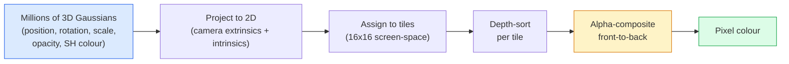

# Sıfırdan 3D Gauss Splatting

> Bir sahne milyonlarca 3D Gaussludan oluşan bir buluttur. Her birinin bakış yönüne bağlı olarak konumu, yönü, ölçeği, opaklığı ve rengi vardır. Bunları rasterleştirin, rasterleştirme yoluyla geri destek yapın, tamam.

**Tür:** Yapım
**Diller:** Python
**Önkoşullar:** Aşama 4 Ders 13 (3D Görme ve NeRF), Aşama 1 Ders 12 (Tensör İşlemleri), Aşama 4 Ders 10 (Diffüzyon temelleri isteğe bağlı)
**Süre:** ~90 dakika

## Öğrenme Hedefleri

- 2026'da fotogerçekçi 3D yeniden yapılandırma için üretim varsayılanı olarak neden 3D Gaussian Splatting'in NeRF'nin yerini aldığını açıklayın
- Gauss başına altı parametreyi (konum, dönme kuaterniyonu, ölçek, opaklık, küresel harmonik rengi, isteğe bağlı özellik) ve her birinin kaç kayan noktanın katkıda bulunduğunu belirtin
- `alpha` birleştirmeyi kullanarak sıfırdan bir 2B Gauss sıçramalı rasterleştirici uygulayın, ardından 3B durumun aynı döngüye nasıl yansıtıldığını gösterin
- 20-50 fotoğraftan bir sahneyi yeniden oluşturmak ve `KHR_gaussian_splatting` glTF uzantısına veya OpenUSD 26.03 `UsdVolParticleField3DGaussianSplat` şemasına aktarmak için `nerfstudio`, `gsplat` veya `SuperSplat` kullanın

## Sorun

NeRF, bir sahneyi MLP'nin ağırlıkları olarak saklar. İşlenen her piksel, bir ışın boyunca yüzlerce MLP sorgusudur. Eğitim saatler sürer, görüntü oluşturma saniyeler sürer ve ağırlıklar düzenlenemez; bir sahnenin içinde bir sandalyeyi hareket ettirmek istiyorsanız yeniden eğitim almanız gerekir.

3D Gauss Splatting (Kerbl, Kopanas, Leimkühler, Drettakis, SIGGRAPH 2023) tüm bunların yerini aldı. Bir sahne açık bir 3 boyutlu Gaussian kümesidir. Oluşturma, 100+ fps'de GPU rasterleştirmesidir. Eğitim dakikalar alır. Düzenleme doğrudandır: Gaussianların bir alt kümesini tercüme ettiğinizde sandalyeyi hareket ettirmiş olursunuz. 2026 yılına gelindiğinde Khronos Grubu, Gauss uyarıları için bir glTF uzantısını onayladı, OpenUSD 26.03 bir Gauss uyarı şeması gönderiyor, Zillow ve Apartments.com bunlarla gayrimenkul oluşturuyor ve 3D yeniden yapılandırmayla ilgili çoğu yeni araştırma makalesi, temel 3DGS fikrinin varyantları.

Zihinsel model basittir; matematik, çoğu tanıtımın rasterleştirmeyle başlamasını ve projeksiyonları ve küresel harmonikleri atlamasını sağlayacak kadar hareketli parçaya sahiptir. Bu ders her şeyi oluşturur; önce 2B sürüm, ardından 3B uzantı.

## Konsept

### Bir Gaussian'ın taşıdığı şey

Bir 3D Gaussian, uzayda şu özelliklere sahip parametrik bir damladır:

```
position         mu         (3,)    centre in world coordinates
rotation         q          (4,)    unit quaternion encoding orientation
scale            s          (3,)    log-scales per axis (exponentiated at render time)
opacity          alpha      (1,)    post-sigmoid opacity [0, 1]
SH coefficients  c_lm       (3 * (L+1)^2,)   view-dependent colour
```

Döndürme + ölçek, 3x3'lük bir kovaryans oluşturur: `Sigma = R S S^T R^T`. Bu Gauss'un 3 boyutlu şeklidir. Küresel harmonikler, görüntüleme başına dokuları depolamadan, rengin görüntüleme yönüne göre (aynasal vurgular, ince parlaklık, görünüme bağlı parlaklık) değişmesine olanak tanır. SH derecesi 3 ile renk kanalı başına 16 katsayı, yalnızca renk için Gaussian başına 48 kayan nokta elde edersiniz.

Bir sahnede genellikle 1-5 milyon Gauss bulunur. Her biri kabaca 60 şamandıra depolar (3 + 4 + 3 + 1 + 48 + çeşitli). Bu, beş milyon Gauss sahnesi için 240 MB'tır; nokta başına dokuya sahip eşdeğer nokta bulutundan çok daha küçüktür ve NeRF'nin yüksek çözünürlükte yeniden oluşturulan MLP ağırlıklarından daha küçük bir büyüklük sırasıdır.

### Rasterleştirme, ışın yürüyüşü değil



Beş adım, tamamı GPU dostu. Piksel başına MLP sorgusu yok. Tek bir RTX 3080 Ti, 147 fps'de 6 milyon uyarı oluşturur.

### Projeksiyon adımı

3B kovaryans `Sigma` ile `mu` dünya konumundaki 3B Gauss, 2B kovaryans `Sigma'` ile `mu'` ekran konumunda bir 2B Gaussian'a yansıtır:

```
mu' = project(mu)
Sigma' = J W Sigma W^T J^T          (2 x 2)

W = viewing transform (rotation + translation of camera)
J = Jacobian of the perspective projection at mu'
```

2B Gaussian'ın ayak izi, eksenleri `Sigma'`'nin özvektörleri olan bir elipstir. Bu elipsin içindeki her piksel, `exp(-0.5 * (p - mu')^T Sigma'^-1 (p - mu'))` ile ağırlıklandırılan Gauss katkısını alır.

### Alfa birleştirme kuralı

Bir piksel için, onu kaplayan Gauss'lar arkadan öne doğru (veya ters formülle eşdeğer şekilde önden arkaya) sıralanır. Renk, 1980'lerden bu yana tüm yarı saydam rasterleştiricilerle aynı denklemle birleştirilir:

```
C_pixel = sum_i alpha_i * T_i * c_i

T_i = prod_{j < i} (1 - alpha_j)       transmittance up to i
alpha_i = opacity_i * exp(-0.5 * d^T Sigma'^-1 d)   local contribution
c_i = eval_SH(SH_i, view_direction)    view-dependent colour
```

Bu **NeRF'nin hacimsel oluşturmasıyla aynı denklemdir**, bir ışın boyunca yoğun örnekler yerine açık bir seyrek Gauss kümesinin hemen üzerindedir. Bu kimlik, render kalitesinin NeRF ile eşleşmesinin nedenidir; her ikisi de aynı parlaklık alanı denklemini entegre etmektedir.

### Bu neden türevlenebilir?

Her adım (projeksiyon, döşeme ataması, alfa birleştirme, SH değerlendirmesi) Gauss parametrelerine göre türevlenebilir. Gerçek bir görüntü verildiğinde, oluşturulan piksel kaybını hesaplayın, rasterleştirici aracılığıyla geri destek yapın, tüm `(mu, q, s, alpha, c_lm)`'yi gradient inişiyle güncelleyin. Yaklaşık 30.000'den fazla yinelemede Gausslular doğru konumlarını, ölçeklerini ve renklerini bulur.

### Yoğunlaştırma ve budama

Sabit bir Gaussçular kümesi karmaşık bir sahneyi kapsayamaz. Eğitim iki uyarlanabilir mekanizma içerir:

- gradient büyüklüğü yüksek ancak ölçeği küçük olduğunda bir Gaussian'ı mevcut konumunda **klonlayın** — yeniden yapılandırmanın burada daha fazla ayrıntıya ihtiyacı var.
- gradient yüksek olduğunda büyük ölçekli bir Gaussian'ı iki küçük Gaussian'a bölün. Büyük bir Gaussian bölgeye sığmayacak kadar düzgündür.
- **Prune** Opaklığı bir eşiğin altına düşen Gauss'lar — katkıda bulunmuyorlar.

Yoğunlaştırma her N yinelemede çalışır. Bir sahne genellikle ~100k başlangıç ​​Gaussian'dan (SfM noktalarından tohumlanan) eğitimin sonunda 1-5M'ye kadar büyür.

### Tek paragrafta küresel harmonikler

Görünüme bağlı renk, birim küre üzerindeki `c(direction)` işlevidir. Küresel harmonikler kürenin Fourier temelidir. `L` derecesinde keserseniz kanal başına `(L+1)^2` temel fonksiyonlarını elde edersiniz. Yeni bir görünüm için rengin değerlendirilmesi, öğrenilen SH katsayıları ile izleme yönünde değerlendirilen temel arasındaki nokta çarpımdır. Derece 0 = bir katsayı = sabit renk. Derece 3 = 16 katsayı = Lambert gölgelemesini, aynasal ve hafif yansımayı yakalamak için yeterli. SD Gaussian Splatting kağıtları varsayılan olarak derece 3'ü kullanır.

### 2026 üretim yığını

```
1. Capture         smartphone / DJI drone / handheld scanner
2. SfM / MVS       COLMAP or GLOMAP derives camera poses + sparse points
3. Train 3DGS      nerfstudio / gsplat / inria official / PostShot (~10-30 min on RTX 4090)
4. Edit            SuperSplat / SplatForge (clean floaters, segment)
5. Export          .ply -> glTF KHR_gaussian_splatting or .usd (OpenUSD 26.03)
6. View            Cesium / Unreal / Babylon.js / Three.js / Vision Pro
```

### 4D ve üretken varyantlar

- **4D Gauss Splatting** — Gauss'lar zamanın fonksiyonlarıdır; hacimsel video için kullanılır (Superman 2026, A$AP Rocky'nin "Helicopter").
- **Üretken uyarılar** — tüm sahneleri halüsinasyona uğratan metinden uyarıya modeller (World Labs'tan Marble).
- **3D Gauss Kokusuz Dönüşüm** — NVIDIA NuRec'in otonom sürüş simülasyonuna yönelik çeşidi.

## İnşa Et

### Adım 1: 2B Gaussian

İlk önce bir 2D rasterleştirici oluşturuyoruz. 3 boyutlu durum projeksiyondan sonra buna indirgenir.

```python
import torch
import torch.nn as nn
import torch.nn.functional as F


def eval_2d_gaussian(means, covs, points):
    """
    means:  (G, 2)      centres
    covs:   (G, 2, 2)   covariance matrices
    points: (H, W, 2)   pixel coordinates
    returns: (G, H, W)  density at every pixel for every Gaussian
    """
    G = means.size(0)
    H, W, _ = points.shape
    flat = points.view(-1, 2)
    inv = torch.linalg.inv(covs)
    diff = flat[None, :, :] - means[:, None, :]
    d = torch.einsum("gpi,gij,gpj->gp", diff, inv, diff)
    density = torch.exp(-0.5 * d)
    return density.view(G, H, W)
```

`einsum`, her (Gauss, piksel) çifti için `diff^T Sigma^-1 diff` ikinci dereceden formunu yapar.

### Adım 2: 2D sıçratma rasterleştirici

Alfa kompozisyonu önden arkaya. 2B'de derinlik anlamsızdır, bu nedenle sıralama için Gauss'a göre öğrenilmiş bir skaler kullanırız.

```python
def rasterise_2d(means, covs, colours, opacities, depths, image_size):
    """
    means:     (G, 2)
    covs:      (G, 2, 2)
    colours:   (G, 3)
    opacities: (G,)     in [0, 1]
    depths:    (G,)     per-Gaussian scalar used for ordering
    image_size: (H, W)
    returns:   (H, W, 3) rendered image
    """
    H, W = image_size
    yy, xx = torch.meshgrid(
        torch.arange(H, dtype=torch.float32, device=means.device),
        torch.arange(W, dtype=torch.float32, device=means.device),
        indexing="ij",
    )
    points = torch.stack([xx, yy], dim=-1)

    densities = eval_2d_gaussian(means, covs, points)
    alphas = opacities[:, None, None] * densities
    alphas = alphas.clamp(0.0, 0.99)

    order = torch.argsort(depths)
    alphas = alphas[order]
    colours_sorted = colours[order]

    T = torch.ones(H, W, device=means.device)
    out = torch.zeros(H, W, 3, device=means.device)
    for i in range(means.size(0)):
        a = alphas[i]
        out += (T * a)[..., None] * colours_sorted[i][None, None, :]
        T = T * (1.0 - a)
    return out
```

Hızlı değil - gerçek bir uygulama döşeme tabanlı CUDA çekirdeklerini kullanır - ancak tam olarak doğru matematik ve tamamen türevlenebilir.

### Adım 3: Eğitilebilir bir 2 boyutlu uyarı sahnesi

```python
class Splats2D(nn.Module):
    def __init__(self, num_splats=128, image_size=64, seed=0):
        super().__init__()
        g = torch.Generator().manual_seed(seed)
        H, W = image_size, image_size
        self.means = nn.Parameter(torch.rand(num_splats, 2, generator=g) * torch.tensor([W, H]))
        self.log_scale = nn.Parameter(torch.ones(num_splats, 2) * math.log(2.0))
        self.rot = nn.Parameter(torch.zeros(num_splats))  # single angle in 2D
        self.colour_logits = nn.Parameter(torch.randn(num_splats, 3, generator=g) * 0.5)
        self.opacity_logit = nn.Parameter(torch.zeros(num_splats))
        self.depth = nn.Parameter(torch.rand(num_splats, generator=g))

    def covs(self):
        s = torch.exp(self.log_scale)
        c, si = torch.cos(self.rot), torch.sin(self.rot)
        R = torch.stack([
            torch.stack([c, -si], dim=-1),
            torch.stack([si, c], dim=-1),
        ], dim=-2)
        S = torch.diag_embed(s ** 2)
        return R @ S @ R.transpose(-1, -2)

    def forward(self, image_size):
        covs = self.covs()
        colours = torch.sigmoid(self.colour_logits)
        opacities = torch.sigmoid(self.opacity_logit)
        return rasterise_2d(self.means, covs, colours, opacities, self.depth, image_size)
```

`log_scale`, `opacity_logit` ve `colour_logits`'nin tümü, oluşturma zamanında doğru etkinleştirme yoluyla eşlenen kısıtlanmamış parametrelerdir. Bu, her 3DGS uygulaması için standart modeldir.

### Adım 4: 2D Gaussian'ları hedef görüntüye yerleştirin

```python
import math
import numpy as np

def make_target(size=64):
    yy, xx = np.meshgrid(np.arange(size), np.arange(size), indexing="ij")
    img = np.zeros((size, size, 3), dtype=np.float32)
    # Red circle
    mask = (xx - 20) ** 2 + (yy - 20) ** 2 < 10 ** 2
    img[mask] = [1.0, 0.2, 0.2]
    # Blue square
    mask = (np.abs(xx - 45) < 8) & (np.abs(yy - 40) < 8)
    img[mask] = [0.2, 0.3, 1.0]
    return torch.from_numpy(img)


target = make_target(64)
model = Splats2D(num_splats=64, image_size=64)
opt = torch.optim.Adam(model.parameters(), lr=0.05)

for step in range(200):
    pred = model((64, 64))
    loss = F.mse_loss(pred, target)
    opt.zero_grad(); loss.backward(); opt.step()
    if step % 40 == 0:
        print(f"step {step:3d}  mse {loss.item():.4f}")
```

200'den fazla adımda 64 Gausslu iki şekle yerleşir. Bütün fikir budur - açık geometrik ilkellerden gradient-iniş.

### Adım 5: 2B'den 3B'ye

3D uzantı aynı döngüyü korur. İlaveler:

1. Gauss rotasyonu tek bir açı yerine bir kuaterniyondur.
2. Kovaryans, kuaterniyon ve `S = diag(exp(log_scale))`'den oluşturulan `R` ile `R S S^T R^T`'dir.
3. Projeksiyon `(mu, Sigma) -> (mu', Sigma')`, `mu`'deki perspektif projeksiyonunun kamera dışsal özelliklerini ve Jacobian'ını kullanır.
4. Renk, küresel harmoniklerin genişlemesi haline gelir; bakış yönünde değerlendirin.
5. Derinlik sıralaması, öğrenilmiş bir skaler yerine gerçek kamera alanı z'den yapılır.

Her üretim uygulaması (`gsplat`, `inria/gaussian-splatting`, `nerfstudio`), döşeme tabanlı CUDA çekirdeklerine sahip GPU'da tam olarak bunu yapar.

### Adım 6: Küresel harmoniklerin değerlendirilmesi

Derece 3'e kadar olan SH temeli, kanal başına 16 terime sahiptir. Değerlendirme:

```python
def eval_sh_degree_3(sh_coeffs, dirs):
    """
    sh_coeffs: (..., 16, 3)   last dim is RGB channels
    dirs:      (..., 3)       unit vectors
    returns:   (..., 3)
    """
    C0 = 0.282094791773878
    C1 = 0.488602511902920
    C2 = [1.092548430592079, 1.092548430592079,
          0.315391565252520, 1.092548430592079,
          0.546274215296039]
    x, y, z = dirs[..., 0], dirs[..., 1], dirs[..., 2]
    x2, y2, z2 = x * x, y * y, z * z
    xy, yz, xz = x * y, y * z, x * z

    result = C0 * sh_coeffs[..., 0, :]
    result = result - C1 * y[..., None] * sh_coeffs[..., 1, :]
    result = result + C1 * z[..., None] * sh_coeffs[..., 2, :]
    result = result - C1 * x[..., None] * sh_coeffs[..., 3, :]

    result = result + C2[0] * xy[..., None] * sh_coeffs[..., 4, :]
    result = result + C2[1] * yz[..., None] * sh_coeffs[..., 5, :]
    result = result + C2[2] * (2.0 * z2 - x2 - y2)[..., None] * sh_coeffs[..., 6, :]
    result = result + C2[3] * xz[..., None] * sh_coeffs[..., 7, :]
    result = result + C2[4] * (x2 - y2)[..., None] * sh_coeffs[..., 8, :]

    # degree 3 terms omitted here for brevity; full 16-coefficient version in the code file
    return result
```

`sh_coeffs`'nin Gaussian için "her yöndeki rengi" sakladığını öğrendim. Oluşturma zamanında geçerli görünüm yönüne göre değerlendirme yaparsınız ve 3 vektörlü bir RGB elde edersiniz.

## Kullan onu

Gerçek 3DGS çalışması için `gsplat` (Meta) veya `nerfstudio` kullanın:

```bash
pip install nerfstudio gsplat
ns-download-data example
ns-train splatfacto --data path/to/data
```

`splatfacto`, nerfstudio'nun 3DGS eğitmenidir. Çalıştırma, tipik bir sahne için RTX 4090'da 10-30 dakika sürer.

2026'da önemli olan ihracat seçenekleri:

- `.ply` — ham Gauss bulutu (taşınabilir, en büyük dosya).
- `.splat` — PlayCanvas / SuperSplat nicelenmiş format.
- glTF `KHR_gaussian_splatting` — Khronos standardı, izleyiciler arasında taşınabilir (Şubat 2026 RC).
- OpenUSD `UsdVolParticleField3DGaussianSplat` — USD'ye özgü, NVIDIA Omniverse ve Vision Pro işlem hatları için.

4D / dinamik sahneler için `4DGS` ve `Deformable-3DGS` aynı makineyi zamanla değişen araçlar ve opaklıklarla genişletir.

## Gönderin

Bu ders şunları üretir:

- `outputs/prompt-3dgs-capture-planner.md` — belirli bir sahne türü için bir yakalama oturumu (fotoğraf sayısı, kamera yolu, aydınlatma) planlayan bir prompt.
- `outputs/skill-3dgs-export-router.md` — aşağı akış görüntüleyicisine veya motoruna göre doğru dışa aktarma formatını (`.ply` / `.splat` / glTF / USD) seçen bir beceri.

## Egzersizler

1. **(Kolay)** Yukarıdaki 2D uyarı eğiticisini farklı bir sentetik görüntü üzerinde çalıştırın. `[16, 64, 256]`'de `num_splats`'yi değiştirin ve her biri için MSE ve adım grafiğini çizin. Getirilerin azaldığı noktayı belirleyin.
2. **(Orta)** 2B rasterleştiriciyi, derece-2 harmoniği boyunca skaler "görüntüleme açısına" bağlı olan Gaussian RGB renklerini destekleyecek şekilde genişletin. Bir çift hedef görüntü üzerinde eğitim alın ve modelin her ikisini de yeniden oluşturduğunu doğrulayın.
3. **(Zor)** `nerfstudio`'yi klonlayın ve `splatfacto`'yi, sahip olduğunuz herhangi bir sahnenin (masa, bitki, yüz, oda) 20 fotoğraflık çekimi üzerinde eğitin. glTF `KHR_gaussian_splatting`'ye aktarın ve bir görüntüleyicide açın (Three.js `GaussianSplats3D`, SuperSplat, Babylon.js V9). Eğitim süresini, Gauss sayısını ve görüntülenen fps'yi raporlayın.

## Anahtar Terimler

| Dönem | İnsanlar ne diyor | Aslında ne anlama geliyor |
|------|----------------|----------------------|
| 3DGS | "Gauss uyarıları" | Her Gauss konumu, dönüşü, ölçeği, opaklığı, SH rengiyle milyonlarca 3B Gausslu olarak açık sahne temsili |
| Kovaryans | "Gauss Şekli" | `Sigma = R S S^T R^T`; bir Gauss'un yönelimi ve anizotropik ölçeği |
| Alfa birleştirme | "Arkadan öne karışım" | NeRF'nin hacimsel oluşturmasıyla aynı denklem artık açık bir seyrek küme üzerinde |
| Yoğunlaştırma | "Klonla ve böl" | Yeniden yapılanmanın yetersiz olduğu durumlarda yeni Gaussluların uyarlanabilir eklenmesi |
| Budama | "Düşük opaklığı sil" | Eğitim sırasında sıfıra yakın opaklığa çöken Gauss'ları kaldırın |
| Küresel harmonikler | "Görüntülemeye bağlı renk" | Küre üzerinde Fourier temeli; rengi görüntüleme yönünün bir fonksiyonu olarak saklar |
| Uyarı | "nerfstudio'nun 3DGS'si" | 2026'da 3DGS eğitiminin en kolay yolu |
| `KHR_gaussian_splatting` | "glTF standardı" | 3DGS'yi izleyiciler ve motorlar arasında taşınabilir hale getiren Khronos 2026 uzantısı |

## Daha Fazla Okuma

- [Gerçek Zamanlı Parlaklık Alanı Oluşturma için 3D Gauss Splatting (Kerbl ve diğerleri, SIGGRAPH 2023)](https://repo-sam.inria.fr/fungraph/3d-gaussian-splatting/) — orijinal makale
- [gsplat (Meta/nerfstudio)](https://github.com/nerfstudio-project/gsplat) — üretim kalitesinde CUDA rasterleştirici
- [nerfstudio Splatfacto](https://docs.nerf.studio/nerfology/methods/splat.html) — referans eğitim tarifi
- [Khronos KHR_gaussian_splatting uzantısı](https://github.com/KhronosGroup/glTF/blob/main/extensions/2.0/Khronos/KHR_gaussian_splatting/README.md) — 2026 taşınabilir formatı
- [OpenUSD 26.03 sürüm notları](https://openusd.org/release/) — `UsdVolParticleField3DGaussianSplat` şeması
- [Gauss Splatting'in GELECEK 3D Durumu 2026](https://www.thefuture3d.com/blog-0/2026/4/4/state-of-gaussian-splatting-2026) — sektöre genel bakış
