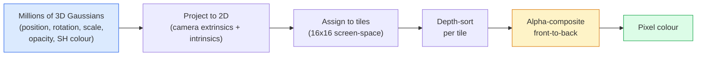

# 从零开始的3D高斯溅射

> 场景是数百万3D高斯云。每个都有位置、方向、比例、不透明度和取决于观看方向的颜色。对它们进行网格化，通过网格化反向推进，完成。

** 类型：** 构建
** 语言：** Python
** 先决条件：** 阶段4第13课（3D视觉和NeRF）、阶段1第12课（张量运算）、阶段4第10课（扩散基础知识可选）
** 时间：** ~90分钟

## 学习目标

- 解释为什么3D高斯飞溅在2026年取代NeRF成为真实感3D重建的默认制作
- 说明六个每高斯参数（位置、旋转四元数、比例、不透明度、球调和颜色、可选特征）以及每个参数贡献了多少个浮动点
- 使用“Alpha”合成从头开始实现2D高斯飞溅网格化器，然后展示3D案例如何投影到同一循环
- 使用“nerfstudio”、“gsplat”或“SuperSplat”从20-50张照片重建场景，并输出到“KHR_gaussian_splating”glTF扩展或OpenUSD 26.03“UsdVolParticleField 3DGaussianSplat”模式

## 问题

A NeRF stores a scene as the weights of an MLP. Every rendered pixel is hundreds of MLP queries along a ray. Training takes hours, rendering takes seconds, and the weights cannot be edited — if you want to move a chair inside a scene, you have to retrain.

3D 高斯飞溅（Kerbel、Kopanas、Leimkühler、Dretakis、SIGGRAPH 2023）取代了所有这些。场景是一组显式的3D高斯集。渲染是以100+帧/秒的速度进行的图形渲染。训练需要几分钟的时间。编辑是直接的：翻译高斯的一个子集，你就移动了椅子。到2026年，Khronos Group已经批准了高斯splats的glTF扩展，OpenUSD 26.03提供了高斯splat模式，Zillow和Apartments.com使用它们渲染房地产，大多数关于3D重建的新研究论文都是核心3DGS思想的变体。

心理模型很简单，数学有足够多的活动部分，大多数介绍都从网格化开始，跳过投影和球调和。本课构建了整个内容-首先是2D版本，然后是3D扩展。

## 概念

### 高斯带什么

一个3D高斯是空间中的参数斑点，具有以下属性：

```
position         mu         (3,)    centre in world coordinates
rotation         q          (4,)    unit quaternion encoding orientation
scale            s          (3,)    log-scales per axis (exponentiated at render time)
opacity          alpha      (1,)    post-sigmoid opacity [0, 1]
SH coefficients  c_lm       (3 * (L+1)^2,)   view-dependent colour
```

旋转+比例构建3x 3协方差：“Sigma = R S & T R & T &。这是3D高斯形状。球形调和使颜色随着观看方向而变化-镜面高光、微妙的光泽、与视图相关的辉光-而无需存储按视图的纹理。对于SH度3，每个颜色通道可以获得16个系数，仅对于颜色来说，每个高斯就获得48个浮动点。

一个场景通常有1- 500万高斯人。每个存储大约60个浮动（3 + 4 + 3 + 1 + 48 +混合）。对于500万高斯场景来说，这是240 MB--远小于具有每点纹理的等效点云，并且比NeRF以高分辨率重新渲染的MLP权重小一个数量级。

### 网格化，而不是射线游行



五个步骤，均支持PU。每个像素没有MLP查询。单个RTX 3080 Ti以147帧/秒的速度播放600万张照片。

### 映射步骤

世界位置“μ”（具有3D协方差“Sigma”）处的3D高斯投影到屏幕位置“μ”（具有2D协方差“Sigma”）处的2D高斯：

```
mu' = project(mu)
Sigma' = J W Sigma W^T J^T          (2 x 2)

W = viewing transform (rotation + translation of camera)
J = Jacobian of the perspective projection at mu'
```

The 2D Gaussian's footprint is an ellipse whose axes are the eigenvectors of `Sigma'`. Every pixel inside that ellipse receives the Gaussian's contribution, weighted by `exp(-0.5 * (p - mu')^T Sigma'^-1 (p - mu'))`.

### 阿尔法合成规则

对于一个像素，覆盖它的高斯按前后顺序排序（或等效地按倒置公式进行前后排序）。颜色与20世纪80年代以来的所有半透明格栅器一样，采用相同的方程式合成：

```
C_pixel = sum_i alpha_i * T_i * c_i

T_i = prod_{j < i} (1 - alpha_j)       transmittance up to i
alpha_i = opacity_i * exp(-0.5 * d^T Sigma'^-1 d)   local contribution
c_i = eval_SH(SH_i, view_direction)    view-dependent colour
```

这是 ** 与NeRF的体积渲染相同的方程 **，只是在一个显式稀疏的高斯集上，而不是沿着射线的密集样本。这就是渲染质量与NeRF匹配的原因-两者都集成了相同的辐射场方程。

### 为什么这是可区分的

每个步骤--投影、磁贴分配、Alpha合成、SH评估--都可以相对于高斯参数进行微。给定地面真实图像，计算渲染像素损失，通过网格化器反向投影，通过梯度下降更新所有“（ku，q，s，Alpha，c_lm）”。高斯迭代超过30，000次，找到了正确的位置、比例和颜色。

### 致密修剪

固定的高斯集无法覆盖复杂的场景。培训包括两种适应机制：

- ** 克隆 ** 高斯在其当前位置，当高斯梯度大小高但其规模小时-这里重建需要更多细节。
- **Split** a large-scale Gaussian into two smaller ones when its gradient is high — one big Gaussian is too smooth to fit the region.
- ** 修剪 ** 不透明度低于阈值的高斯派-他们没有做出贡献。

每N次迭代运行一次致密化。场景通常从约10万初始高斯（从SfM点种子）增长到训练结束时的1- 5 M。

### 一段中的球和声

视相关颜色是单位球面上的函数“c（方向）”。球面调和函数是球面的傅立叶基。在L阶截断，每个通道得到（L+1）^2个基函数。评估新视图的颜色是学习的SH系数与在观看方向上评估的基础之间的点积。0度=一个系数=恒定的颜色。3度= 16个系数=足以捕捉兰伯特阴影、镜面反射和温和反射。SD高斯飞溅纸张默认使用3级。

### 2026年生产堆栈

```
1. Capture         smartphone / DJI drone / handheld scanner
2. SfM / MVS       COLMAP or GLOMAP derives camera poses + sparse points
3. Train 3DGS      nerfstudio / gsplat / inria official / PostShot (~10-30 min on RTX 4090)
4. Edit            SuperSplat / SplatForge (clean floaters, segment)
5. Export          .ply -> glTF KHR_gaussian_splatting or .usd (OpenUSD 26.03)
6. View            Cesium / Unreal / Babylon.js / Three.js / Vision Pro
```

### 4D和生成变体

- **4D Gaussian Splatting** — Gaussians are functions of time; used for volumetric video (Superman 2026, A$AP Rocky's "Helicopter").
- ** 生成飞溅 ** -文本到飞溅模型（World Labs的Marble），使整个场景产生幻觉。
- **3D高斯无迹变换 ** - NVIDIA NuRec的自动驾驶模拟变体。

## 建设党

### 第1步：2D高斯

我们首先构建一个2D格栅器。投影后3D案例缩小到它。

```python
import torch
import torch.nn as nn
import torch.nn.functional as F


def eval_2d_gaussian(means, covs, points):
    """
    means:  (G, 2)      centres
    covs:   (G, 2, 2)   covariance matrices
    points: (H, W, 2)   pixel coordinates
    returns: (G, H, W)  density at every pixel for every Gaussian
    """
    G = means.size(0)
    H, W, _ = points.shape
    flat = points.view(-1, 2)
    inv = torch.linalg.inv(covs)
    diff = flat[None, :, :] - means[:, None, :]
    d = torch.einsum("gpi,gij,gpj->gp", diff, inv, diff)
    density = torch.exp(-0.5 * d)
    return density.view(G, H, W)
```

`einsum`为每个（高斯，像素）对执行二次形式`diff^T Sigma^-1 diff`。

### 第2步：2D飞溅网格化器

前后阿尔法合成。2D中的深度毫无意义，因此我们使用学习的每高斯纯量来进行排序。

```python
def rasterise_2d(means, covs, colours, opacities, depths, image_size):
    """
    means:     (G, 2)
    covs:      (G, 2, 2)
    colours:   (G, 3)
    opacities: (G,)     in [0, 1]
    depths:    (G,)     per-Gaussian scalar used for ordering
    image_size: (H, W)
    returns:   (H, W, 3) rendered image
    """
    H, W = image_size
    yy, xx = torch.meshgrid(
        torch.arange(H, dtype=torch.float32, device=means.device),
        torch.arange(W, dtype=torch.float32, device=means.device),
        indexing="ij",
    )
    points = torch.stack([xx, yy], dim=-1)

    densities = eval_2d_gaussian(means, covs, points)
    alphas = opacities[:, None, None] * densities
    alphas = alphas.clamp(0.0, 0.99)

    order = torch.argsort(depths)
    alphas = alphas[order]
    colours_sorted = colours[order]

    T = torch.ones(H, W, device=means.device)
    out = torch.zeros(H, W, 3, device=means.device)
    for i in range(means.size(0)):
        a = alphas[i]
        out += (T * a)[..., None] * colours_sorted[i][None, None, :]
        T = T * (1.0 - a)
    return out
```

速度不快--真正的实现使用基于磁块的CUDA内核--但数学完全正确且完全可区分。

### Step 3: A trainable 2D splat scene

```python
class Splats2D(nn.Module):
    def __init__(self, num_splats=128, image_size=64, seed=0):
        super().__init__()
        g = torch.Generator().manual_seed(seed)
        H, W = image_size, image_size
        self.means = nn.Parameter(torch.rand(num_splats, 2, generator=g) * torch.tensor([W, H]))
        self.log_scale = nn.Parameter(torch.ones(num_splats, 2) * math.log(2.0))
        self.rot = nn.Parameter(torch.zeros(num_splats))  # single angle in 2D
        self.colour_logits = nn.Parameter(torch.randn(num_splats, 3, generator=g) * 0.5)
        self.opacity_logit = nn.Parameter(torch.zeros(num_splats))
        self.depth = nn.Parameter(torch.rand(num_splats, generator=g))

    def covs(self):
        s = torch.exp(self.log_scale)
        c, si = torch.cos(self.rot), torch.sin(self.rot)
        R = torch.stack([
            torch.stack([c, -si], dim=-1),
            torch.stack([si, c], dim=-1),
        ], dim=-2)
        S = torch.diag_embed(s ** 2)
        return R @ S @ R.transpose(-1, -2)

    def forward(self, image_size):
        covs = self.covs()
        colours = torch.sigmoid(self.colour_logits)
        opacities = torch.sigmoid(self.opacity_logit)
        return rasterise_2d(self.means, covs, colours, opacities, self.depth, image_size)
```

“log_scale”、“opacity_logit”和“colour_logits”都是在渲染时通过正确激活映射的无约束参数。这是每个3DGS实现的标准模式。

### 第4步：将2D高斯映射到目标图像

```python
import math
import numpy as np

def make_target(size=64):
    yy, xx = np.meshgrid(np.arange(size), np.arange(size), indexing="ij")
    img = np.zeros((size, size, 3), dtype=np.float32)
    # Red circle
    mask = (xx - 20) ** 2 + (yy - 20) ** 2 < 10 ** 2
    img[mask] = [1.0, 0.2, 0.2]
    # Blue square
    mask = (np.abs(xx - 45) < 8) & (np.abs(yy - 40) < 8)
    img[mask] = [0.2, 0.3, 1.0]
    return torch.from_numpy(img)


target = make_target(64)
model = Splats2D(num_splats=64, image_size=64)
opt = torch.optim.Adam(model.parameters(), lr=0.05)

for step in range(200):
    pred = model((64, 64))
    loss = F.mse_loss(pred, target)
    opt.zero_grad(); loss.backward(); opt.step()
    if step % 40 == 0:
        print(f"step {step:3d}  mse {loss.item():.4f}")
```

64名高斯人走了200多步，进入了两个形状。这就是整个想法--显式几何基元上的梯度下降。

### 第5步：从2D到3D

3D扩展保持相同的循环。补充内容：

1. 每高斯旋转是四元数而不是单个角度。
2. 协方差为“R S S & T R & T &，其中“R &由四元数构建，并且“S = diag（BEP（log_scale）&
3. 投影“（mo，Sigma）->（mo '，Sigma '）'使用相机外推和透视投影的雅可比矩阵'。
4. 颜色变成球调和展开;在观看方向对其进行评估。
5. 深度排序来自实际的相机空间z，而不是习得的纯量。

每个生产实现（' gsplat '、' inria/gaussian-splatting '、'、'）都在具有基于磁贴的CUDA内核的图形处理器上做到了这一点。

### 第6步：球调和评估

SH基础（高达3级）每个渠道有16个学期。评价：

```python
def eval_sh_degree_3(sh_coeffs, dirs):
    """
    sh_coeffs: (..., 16, 3)   last dim is RGB channels
    dirs:      (..., 3)       unit vectors
    returns:   (..., 3)
    """
    C0 = 0.282094791773878
    C1 = 0.488602511902920
    C2 = [1.092548430592079, 1.092548430592079,
          0.315391565252520, 1.092548430592079,
          0.546274215296039]
    x, y, z = dirs[..., 0], dirs[..., 1], dirs[..., 2]
    x2, y2, z2 = x * x, y * y, z * z
    xy, yz, xz = x * y, y * z, x * z

    result = C0 * sh_coeffs[..., 0, :]
    result = result - C1 * y[..., None] * sh_coeffs[..., 1, :]
    result = result + C1 * z[..., None] * sh_coeffs[..., 2, :]
    result = result - C1 * x[..., None] * sh_coeffs[..., 3, :]

    result = result + C2[0] * xy[..., None] * sh_coeffs[..., 4, :]
    result = result + C2[1] * yz[..., None] * sh_coeffs[..., 5, :]
    result = result + C2[2] * (2.0 * z2 - x2 - y2)[..., None] * sh_coeffs[..., 6, :]
    result = result + C2[3] * xz[..., None] * sh_coeffs[..., 7, :]
    result = result + C2[4] * (x2 - y2)[..., None] * sh_coeffs[..., 8, :]

    # degree 3 terms omitted here for brevity; full 16-coefficient version in the code file
    return result
```

Learned `sh_coeffs` store the "colour in every direction" for that Gaussian. At render time you evaluate against the current view direction and get a 3-vector RGB.

## 使用它

对于真正的3DGS工作，请使用`gsplat`（Meta）或`nerfstudio`：

```bash
pip install nerfstudio gsplat
ns-download-data example
ns-train splatfacto --data path/to/data
```

`splatfacto` is nerfstudio's 3DGS trainer. The run takes 10-30 minutes on an RTX 4090 for a typical scene.

2026年重要的出口选择：

- '.ply '-原始高斯云（可移植、最大文件）。
- '.splat '- PlayCanvas / SuperSplat量化格式。
- glTF `KHR_gaussian_splatting` — Khronos standard, portable across viewers (Feb 2026 RC).
- OpenUSD ' UssdVolParticleField 3DGaussianSplat '-原生美元，适用于NVIDIA Omniverse和Vision Pro管道。

对于4D /动态场景，“4DGS”和“可变形3DGS”扩展了具有时变手段和不透明度的相同机制。

## 把它运

本课产生：

- ' outlots/prompt-3dgs-capture-planner.md '-为给定场景类型计划捕获会话（照片数量、相机路径、灯光）的提示。
- ' outputes/skill-3dgs-export-router.md '-根据下游查看器或引擎选择正确的输出格式（'.ply '/ glTF / USD）的技能。

## 演习

1. **（简单）** 在不同的合成图像上运行上面的2D splat训练器。在'[16，64，256]'中改变' num_splats '，并绘制每个的MBE与步骤。确定回报递减的点。
2. **（中等）** 扩展2D网格化器以支持每高斯色，这些颜色取决于通过2度调和的纯量“视角”。在一对目标图像上训练并验证模型是否重建了两者。
3. **（困难）** 克隆“nerfstudio”并在您拥有的任何场景（办公桌、植物、脸、房间）的20张照片捕捉上训练“spplatformact”。输出到glTF ' KHR_gaussian_splatting '并在查看器中打开它（Three.js ' GaussianSplats 3D '、SuperSplat、Babylon.js V9）。报告训练时间、高斯数量和渲染的fps。

## 关键术语

| Term | 别人怎么说 | 它实际上意味着什么 |
|------|----------------|----------------------|
| 3DGS | “高斯飞溅” | 显式场景表示为数百万个3D高斯，具有每高斯位置、旋转、比例、不透明度、SH颜色 |
| 协方差 | “高斯形状” | “Sigma = RS S ' TR ';高斯的方向和各向异性标度 |
| 阿尔法合成 | “前后融合” | 与NeRF的体积渲染相同的方程，现在在显式稀疏集上 |
| 致密化 | “克隆并分裂” | 在重建欠拟合的情况下自适应添加新高斯 |
| 修剪 | “删除低透明度” | 删除训练期间不透明度已降至接近零的高斯 |
| 球谐函数 | "View-dependent colour" | 基于球体的傅里叶基础;将颜色存储为观看方向的函数 |
| 事实上 | “nerfstudio的3DGS” | 2026年培训3DGS的最简单途径 |
| `KHR_gaussian_splatting` | “glTF标准” | Khronos 2026 extension that makes 3DGS portable across viewers and engines |

## 进一步阅读

- [3D实时辐射场渲染的高斯飞溅（Kerbel等人，SIGGRAPH 2023）]（https：//repo-sam.inria.fr/fungraph/3d-gaussian-splatting/）-原文
- [gsplat（Meta/nerfstudio）]（https：//github.com/nerfstudio-project/gsplat）-生产质量的CUDA格栅器
- [nerfstudio Splatfact]（https：//docs.nerf.studio/nerfology/Methods/splat.html）-参考培训食谱
- [Khronos KHR_gaussian_splatting扩展]（https：//github.com/KhronosGroup/glTF/blob/main/extensions/2.0/Khronos/KHR_gaussian_splatting/README.md）-2026可移植格式
- [OpenUSD 26.03发行说明]（https：//openusd.org/release/）-' UssdVolParticleField 3DGaussianSplat '架构
- [THE FUTURE 3D高斯飞溅状态2026]（https：//www.thefuture3d.com/blog-0/2026/4/4/state-of-gaussian-splatting-2026）-行业概述
