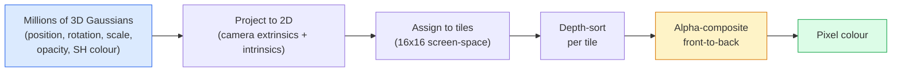

# 22 · 从零实现 3D 高斯泼溅

> 一个场景就是数百万个 3D 高斯（3D Gaussian）组成的点云。每个高斯都拥有位置、朝向、尺度、不透明度，以及一个随观察方向变化的颜色。把它们光栅化、对光栅化过程做反向传播，搞定。

**类型：** 构建
**语言：** Python
**前置：** 第 4 阶段第 13 课（3D 视觉与 NeRF）、第 1 阶段第 12 课（张量运算）、第 4 阶段第 10 课（扩散模型基础，可选）
**时长：** 约 90 分钟

## 学习目标

- 解释为什么在 2026 年，3D 高斯泼溅（3D Gaussian Splatting）取代 NeRF 成为照片级真实感 3D 重建的生产环境默认方案
- 说出每个高斯的六类参数（位置、旋转四元数、尺度、不透明度、球谐颜色、可选特征），以及各自占用多少个浮点数
- 从零实现一个使用 `alpha` 合成（alpha compositing）的 2D 高斯泼溅光栅化器，并展示 3D 情形如何投影到同一个循环
- 使用 `nerfstudio`、`gsplat` 或 `SuperSplat` 从 20-50 张照片重建一个场景，并导出到 glTF 的 `KHR_gaussian_splatting` 扩展，或 OpenUSD 26.03 的 `UsdVolParticleField3DGaussianSplat` 模式

## 问题所在

NeRF 把场景存储为一个 MLP 的权重。每渲染一个像素，都要沿光线做数百次 MLP 查询。训练耗时数小时，渲染耗时数秒，而且权重无法编辑——如果你想在场景中挪动一把椅子，就得重新训练。

3D 高斯泼溅（Kerbl、Kopanas、Leimkühler、Drettakis，SIGGRAPH 2023）把这一切都取代了。一个场景就是一组显式的 3D 高斯。渲染是 100+ fps 的 GPU 光栅化。训练只需几分钟。编辑是直接的：平移其中一部分高斯，椅子就被挪动了。到 2026 年，Khronos Group 已经批准了一个针对高斯泼溅的 glTF 扩展，OpenUSD 26.03 自带了一个高斯泼溅模式，Zillow 和 Apartments.com 用它来渲染房地产，而大多数 3D 重建领域的新研究论文都是核心 3DGS 思想的变体。

这套心智模型很简单，但其中的数学有足够多的活动部件，以至于大多数入门材料都从光栅化讲起，跳过了投影和球谐函数。本课会完整地把整套东西搭起来——先做一个 2D 版本，再做 3D 扩展。

## 核心概念

### 一个高斯携带什么

一个 3D 高斯是空间中的一个参数化斑块（blob），具有以下属性：

```
position         mu         (3,)    世界坐标中的中心
rotation         q          (4,)    编码朝向的单位四元数
scale            s          (3,)    每个轴的对数尺度（渲染时取指数）
opacity          alpha      (1,)    经 sigmoid 后的不透明度 [0, 1]
SH coefficients  c_lm       (3 * (L+1)^2,)   随观察方向变化的颜色
```

旋转 + 尺度构建出一个 3x3 的协方差：`Sigma = R S S^T R^T`。这就是高斯在 3D 中的形状。球谐函数（spherical harmonics）让颜色随观察方向变化——镜面高光、微妙的光泽、随视角变化的辉光——而无需存储每个视角的纹理。在球谐 3 阶（SH degree 3）下，每个颜色通道有 16 个系数，单单颜色就占每个高斯 48 个浮点数。

一个场景通常有 100 万到 500 万个高斯。每个高斯大约存储 60 个浮点数（3 + 4 + 3 + 1 + 48 + 杂项）。一个五百万高斯的场景就是 240 MB——远小于带逐点纹理的等价点云，也比把 NeRF 的 MLP 权重在高分辨率下重渲染所需的体量小一个数量级。

### 是光栅化，不是光线步进



五个步骤，全都对 GPU 友好。不需要为每个像素做 MLP 查询。一块 RTX 3080 Ti 就能以 147 fps 渲染 600 万个泼溅（splat）。

### 投影步骤

世界坐标位置为 `mu`、3D 协方差为 `Sigma` 的 3D 高斯，会投影成屏幕坐标位置为 `mu'`、2D 协方差为 `Sigma'` 的 2D 高斯：

```
mu' = project(mu)
Sigma' = J W Sigma W^T J^T          (2 x 2)

W = 观察变换（相机的旋转 + 平移）
J = 透视投影在 mu' 处的雅可比矩阵
```

这个 2D 高斯的覆盖区是一个椭圆，其轴向是 `Sigma'` 的特征向量。椭圆内的每个像素都会接收到该高斯的贡献，权重为 `exp(-0.5 * (p - mu')^T Sigma'^-1 (p - mu'))`。

### alpha 合成规则

对于一个像素，覆盖它的高斯被从后向前（或等价地，用反转公式从前向后）排序。颜色用自 1980 年代以来每个半透明光栅化器都在用的同一个方程来合成：

```
C_pixel = sum_i alpha_i * T_i * c_i

T_i = prod_{j < i} (1 - alpha_j)       到 i 为止的透射率
alpha_i = opacity_i * exp(-0.5 * d^T Sigma'^-1 d)   局部贡献
c_i = eval_SH(SH_i, view_direction)    随观察方向变化的颜色
```

这**和 NeRF 的体渲染是同一个方程**，只不过作用在一组显式的稀疏高斯上，而不是沿光线的稠密采样上。正是这个等价关系，使得渲染质量能与 NeRF 相当——两者积分的都是同一个辐射场（radiance field）方程。

### 为什么它可微

每一个步骤——投影、瓦片分配、alpha 合成、球谐求值——对高斯参数都是可微的。给定一张真值图像，计算渲染像素的损失，对光栅化器做反向传播，用梯度下降更新全部 `(mu, q, s, alpha, c_lm)`。经过约 30,000 次迭代，这些高斯会找到自己正确的位置、尺度和颜色。

### 稠密化与剪枝

一组固定数量的高斯无法覆盖一个复杂场景。训练包含两种自适应机制：

- **克隆（Clone）**：当一个高斯的梯度幅值很大但尺度很小时，在其当前位置克隆它——这里的重建需要更多细节。
- **分裂（Split）**：当一个大尺度高斯的梯度很大时，把它分裂成两个较小的——一个大高斯太平滑，无法贴合这块区域。
- **剪枝（Prune）**：剪掉不透明度跌破阈值的高斯——它们没有做出贡献。

稠密化每 N 次迭代运行一次。一个场景通常从约 10 万个初始高斯（由 SfM 点播种）增长到训练结束时的 100 万到 500 万个。

### 一段话讲清球谐函数

随观察方向变化的颜色是单位球面上的一个函数 `c(direction)`。球谐函数就是球面上的傅里叶基。截断到 `L` 阶，每个通道就有 `(L+1)^2` 个基函数。为新视角求颜色，就是学到的球谐系数与在观察方向上求值的基函数之间的一个点积。0 阶 = 一个系数 = 恒定颜色。3 阶 = 16 个系数 = 足以捕捉 Lambertian 着色、镜面反射以及轻微反射。SD 高斯泼溅论文默认使用 3 阶。

### 2026 年的生产技术栈

```
1. 采集（Capture）         智能手机 / DJI 无人机 / 手持扫描仪
2. SfM / MVS              COLMAP 或 GLOMAP 推导出相机位姿 + 稀疏点
3. 训练 3DGS              nerfstudio / gsplat / inria 官方 / PostShot（RTX 4090 上约 10-30 分钟）
4. 编辑（Edit）            SuperSplat / SplatForge（清理漂浮物、分割）
5. 导出（Export）          .ply -> glTF KHR_gaussian_splatting 或 .usd（OpenUSD 26.03）
6. 查看（View）            Cesium / Unreal / Babylon.js / Three.js / Vision Pro
```

### 4D 与生成式变体

- **4D 高斯泼溅（4D Gaussian Splatting）**——高斯是时间的函数；用于体积视频（2026 年的《超人》、A$AP Rocky 的《Helicopter》）。
- **生成式泼溅（Generative splats）**——文本到泼溅（text-to-splat）模型（World Labs 的 Marble），可凭空生成整个场景。
- **3D 高斯无迹变换（3D Gaussian Unscented Transform）**——NVIDIA NuRec 用于自动驾驶仿真的变体。

## 动手构建

### 第 1 步：一个 2D 高斯

我们先构建一个 2D 光栅化器。3D 情形在投影之后就归约成它。

```python
import torch
import torch.nn as nn
import torch.nn.functional as F


def eval_2d_gaussian(means, covs, points):
    """
    means:  (G, 2)      中心
    covs:   (G, 2, 2)   协方差矩阵
    points: (H, W, 2)   像素坐标
    returns: (G, H, W)  每个高斯在每个像素上的密度
    """
    G = means.size(0)
    H, W, _ = points.shape
    flat = points.view(-1, 2)
    inv = torch.linalg.inv(covs)
    diff = flat[None, :, :] - means[:, None, :]
    d = torch.einsum("gpi,gij,gpj->gp", diff, inv, diff)
    density = torch.exp(-0.5 * d)
    return density.view(G, H, W)
```

`einsum` 为每一对（高斯，像素）计算二次型 `diff^T Sigma^-1 diff`。

### 第 2 步：2D 泼溅光栅化器

从前向后做 alpha 合成。深度在 2D 中没有意义，因此我们用一个可学习的逐高斯标量来确定顺序。

```python
def rasterise_2d(means, covs, colours, opacities, depths, image_size):
    """
    means:     (G, 2)
    covs:      (G, 2, 2)
    colours:   (G, 3)
    opacities: (G,)     取值范围 [0, 1]
    depths:    (G,)     用于排序的逐高斯标量
    image_size: (H, W)
    returns:   (H, W, 3) 渲染出的图像
    """
    H, W = image_size
    yy, xx = torch.meshgrid(
        torch.arange(H, dtype=torch.float32, device=means.device),
        torch.arange(W, dtype=torch.float32, device=means.device),
        indexing="ij",
    )
    points = torch.stack([xx, yy], dim=-1)

    densities = eval_2d_gaussian(means, covs, points)
    alphas = opacities[:, None, None] * densities
    alphas = alphas.clamp(0.0, 0.99)

    order = torch.argsort(depths)
    alphas = alphas[order]
    colours_sorted = colours[order]

    T = torch.ones(H, W, device=means.device)
    out = torch.zeros(H, W, 3, device=means.device)
    for i in range(means.size(0)):
        a = alphas[i]
        out += (T * a)[..., None] * colours_sorted[i][None, None, :]
        T = T * (1.0 - a)
    return out
```

不快——真实实现会使用基于瓦片（tile-based）的 CUDA 核——但数学完全正确，且完全可微。

### 第 3 步：一个可训练的 2D 泼溅场景

```python
class Splats2D(nn.Module):
    def __init__(self, num_splats=128, image_size=64, seed=0):
        super().__init__()
        g = torch.Generator().manual_seed(seed)
        H, W = image_size, image_size
        self.means = nn.Parameter(torch.rand(num_splats, 2, generator=g) * torch.tensor([W, H]))
        self.log_scale = nn.Parameter(torch.ones(num_splats, 2) * math.log(2.0))
        self.rot = nn.Parameter(torch.zeros(num_splats))  # 2D 中是单个角度
        self.colour_logits = nn.Parameter(torch.randn(num_splats, 3, generator=g) * 0.5)
        self.opacity_logit = nn.Parameter(torch.zeros(num_splats))
        self.depth = nn.Parameter(torch.rand(num_splats, generator=g))

    def covs(self):
        s = torch.exp(self.log_scale)
        c, si = torch.cos(self.rot), torch.sin(self.rot)
        R = torch.stack([
            torch.stack([c, -si], dim=-1),
            torch.stack([si, c], dim=-1),
        ], dim=-2)
        S = torch.diag_embed(s ** 2)
        return R @ S @ R.transpose(-1, -2)

    def forward(self, image_size):
        covs = self.covs()
        colours = torch.sigmoid(self.colour_logits)
        opacities = torch.sigmoid(self.opacity_logit)
        return rasterise_2d(self.means, covs, colours, opacities, self.depth, image_size)
```

`log_scale`、`opacity_logit` 和 `colour_logits` 都是无约束的参数，在渲染时经由各自合适的激活函数映射。这是每个 3DGS 实现的标准模式。

### 第 4 步：把 2D 高斯拟合到目标图像

```python
import math
import numpy as np

def make_target(size=64):
    yy, xx = np.meshgrid(np.arange(size), np.arange(size), indexing="ij")
    img = np.zeros((size, size, 3), dtype=np.float32)
    # 红色圆
    mask = (xx - 20) ** 2 + (yy - 20) ** 2 < 10 ** 2
    img[mask] = [1.0, 0.2, 0.2]
    # 蓝色方块
    mask = (np.abs(xx - 45) < 8) & (np.abs(yy - 40) < 8)
    img[mask] = [0.2, 0.3, 1.0]
    return torch.from_numpy(img)


target = make_target(64)
model = Splats2D(num_splats=64, image_size=64)
opt = torch.optim.Adam(model.parameters(), lr=0.05)

for step in range(200):
    pred = model((64, 64))
    loss = F.mse_loss(pred, target)
    opt.zero_grad(); loss.backward(); opt.step()
    if step % 40 == 0:
        print(f"step {step:3d}  mse {loss.item():.4f}")
```

经过 200 步，这 64 个高斯稳定成两个形状。这就是全部思想——在显式几何图元（geometric primitive）上做梯度下降。

### 第 5 步：从 2D 到 3D

3D 扩展保持同样的循环。新增的部分有：

1. 逐高斯的旋转是一个四元数，而不是单个角度。
2. 协方差是 `R S S^T R^T`，其中 `R` 由四元数构建，`S = diag(exp(log_scale))`。
3. 投影 `(mu, Sigma) -> (mu', Sigma')` 使用相机外参以及透视投影在 `mu` 处的雅可比矩阵。
4. 颜色变成一个球谐展开；在观察方向上对其求值。
5. 深度排序来自真实的相机坐标系 z，而不是一个可学习的标量。

每个生产实现（`gsplat`、`inria/gaussian-splatting`、`nerfstudio`）都是用基于瓦片的 CUDA 核在 GPU 上做的正是这件事。

### 第 6 步：球谐求值

直到 3 阶的球谐基，每个通道有 16 项。求值：

```python
def eval_sh_degree_3(sh_coeffs, dirs):
    """
    sh_coeffs: (..., 16, 3)   最后一维是 RGB 通道
    dirs:      (..., 3)       单位向量
    returns:   (..., 3)
    """
    C0 = 0.282094791773878
    C1 = 0.488602511902920
    C2 = [1.092548430592079, 1.092548430592079,
          0.315391565252520, 1.092548430592079,
          0.546274215296039]
    x, y, z = dirs[..., 0], dirs[..., 1], dirs[..., 2]
    x2, y2, z2 = x * x, y * y, z * z
    xy, yz, xz = x * y, y * z, x * z

    result = C0 * sh_coeffs[..., 0, :]
    result = result - C1 * y[..., None] * sh_coeffs[..., 1, :]
    result = result + C1 * z[..., None] * sh_coeffs[..., 2, :]
    result = result - C1 * x[..., None] * sh_coeffs[..., 3, :]

    result = result + C2[0] * xy[..., None] * sh_coeffs[..., 4, :]
    result = result + C2[1] * yz[..., None] * sh_coeffs[..., 5, :]
    result = result + C2[2] * (2.0 * z2 - x2 - y2)[..., None] * sh_coeffs[..., 6, :]
    result = result + C2[3] * xz[..., None] * sh_coeffs[..., 7, :]
    result = result + C2[4] * (x2 - y2)[..., None] * sh_coeffs[..., 8, :]

    # 此处为简洁起见省略了 3 阶项；完整的 16 系数版本见代码文件
    return result
```

学到的 `sh_coeffs` 存储了该高斯在「每个方向上的颜色」。渲染时，你对照当前观察方向求值，得到一个 3 维 RGB 向量。

## 实战运用

要做真正的 3DGS 工作，请使用 `gsplat`（Meta）或 `nerfstudio`：

```bash
pip install nerfstudio gsplat
ns-download-data example
ns-train splatfacto --data path/to/data
```

`splatfacto` 是 nerfstudio 的 3DGS 训练器。对于一个典型场景，这次运行在 RTX 4090 上需要 10-30 分钟。

2026 年值得关注的导出选项：

- `.ply`——原始高斯点云（可移植，文件最大）。
- `.splat`——PlayCanvas / SuperSplat 的量化格式。
- glTF `KHR_gaussian_splatting`——Khronos 标准，可在各查看器间移植（2026 年 2 月 RC 版）。
- OpenUSD `UsdVolParticleField3DGaussianSplat`——USD 原生，面向 NVIDIA Omniverse 和 Vision Pro 流水线。

对于 4D / 动态场景，`4DGS` 和 `Deformable-3DGS` 用随时间变化的均值和不透明度扩展了同一套机制。

## 交付落地

本课会产出：

- `outputs/prompt-3dgs-capture-planner.md`——一个提示词，针对给定的场景类型规划一次采集会话（照片数量、相机路径、光照）。
- `outputs/skill-3dgs-export-router.md`——一个技能（skill），根据下游的查看器或引擎挑选正确的导出格式（`.ply` / `.splat` / glTF / USD）。

## 练习

1. **（简单）** 在一张不同的合成图像上运行上面的 2D 泼溅训练器。在 `[16, 64, 256]` 之间变化 `num_splats`，并为每种情况绘制 MSE 随步数的曲线。找出收益递减的拐点。
2. **（中等）** 扩展这个 2D 光栅化器，让逐高斯的 RGB 颜色能通过一个 2 阶谐函数依赖一个标量「视角」。在一对目标图像上训练，并验证模型能重建两者。
3. **（困难）** 克隆 `nerfstudio` 并在你拥有的任何场景（书桌、植物、人脸、房间）的 20 张照片采集上训练 `splatfacto`。导出到 glTF `KHR_gaussian_splatting`，并在一个查看器中打开它（Three.js `GaussianSplats3D`、SuperSplat、Babylon.js V9）。报告训练时间、高斯数量以及渲染 fps。

## 关键术语

| 术语 | 人们口中的说法 | 它实际的含义 |
|------|----------------|----------------------|
| 3DGS | “高斯泼溅” | 把场景显式表示为数百万个 3D 高斯，每个高斯带有位置、旋转、尺度、不透明度、球谐颜色 |
| 协方差（Covariance） | “高斯的形状” | `Sigma = R S S^T R^T`；单个高斯的朝向与各向异性尺度 |
| alpha 合成（Alpha compositing） | “从后向前混合” | 与 NeRF 体渲染相同的方程，现在作用于一组显式的稀疏高斯 |
| 稠密化（Densification） | “克隆与分裂” | 在重建欠拟合的地方自适应地添加新高斯 |
| 剪枝（Pruning） | “删除低不透明度” | 移除训练中坍缩到近零不透明度的高斯 |
| 球谐函数（Spherical harmonics） | “随观察方向变化的颜色” | 球面上的傅里叶基；把颜色存储为观察方向的函数 |
| Splatfacto | “nerfstudio 的 3DGS” | 2026 年训练 3DGS 最简单的路径 |
| `KHR_gaussian_splatting` | “glTF 标准” | Khronos 2026 年的扩展，让 3DGS 可在各查看器和引擎间移植 |

## 延伸阅读

- [3D Gaussian Splatting for Real-Time Radiance Field Rendering (Kerbl et al., SIGGRAPH 2023)](https://repo-sam.inria.fr/fungraph/3d-gaussian-splatting/) —— 原始论文
- [gsplat (Meta/nerfstudio)](https://github.com/nerfstudio-project/gsplat) —— 生产级质量的 CUDA 光栅化器
- [nerfstudio Splatfacto](https://docs.nerf.studio/nerfology/methods/splat.html) —— 参考训练配方
- [Khronos KHR_gaussian_splatting extension](https://github.com/KhronosGroup/glTF/blob/main/extensions/2.0/Khronos/KHR_gaussian_splatting/README.md) —— 2026 年的可移植格式
- [OpenUSD 26.03 release notes](https://openusd.org/release/) —— `UsdVolParticleField3DGaussianSplat` 模式
- [THE FUTURE 3D State of Gaussian Splatting 2026](https://www.thefuture3d.com/blog-0/2026/4/4/state-of-gaussian-splatting-2026) —— 行业概览
