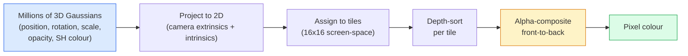

# 从头实现 3D 高斯泼溅

> 一个场景是由数百万个 3D 高斯体组成的云团。每个高斯体都有一个位置、方向、尺度、不透明度和一个依赖于观察方向的颜色。对它们进行光栅化，通过光栅化反向传播，就完成了。

**类型：** 构建
**语言：** Python
**前置条件：** 阶段 4 第 13 课（3D 视觉与 NeRF），阶段 1 第 12 课（张量操作），阶段 4 第 10 课（扩散基础，可选）
**时间：** ~90 分钟

## 学习目标

- 解释为什么 3D 高斯泼溅在 2026 年取代 NeRF 成为照片级 3D 重建的生产默认选择
- 阐述每个高斯体的六个参数（位置、旋转四元数、尺度、不透明度、球谐颜色、可选特征）以及每个参数贡献多少个浮点数
- 从头实现一个使用 alpha 混合的 2D 高斯泼溅光栅化器，然后展示 3D 情况如何投影到相同的循环中
- 使用 `nerfstudio`、`gsplat` 或 `SuperSplat` 从 20-50 张照片重建场景，并导出为 `KHR_gaussian_splatting` glTF 扩展或 OpenUSD 26.03 的 `UsdVolParticleField3DGaussianSplat` schema

## 问题

NeRF 将场景存储为 MLP 的权重。每个渲染的像素都需要沿光线进行数百次 MLP 查询。训练需要数小时，渲染需要数秒，而且权重无法编辑——如果你想在场景中移动一把椅子，你必须重新训练。

3D 高斯泼溅（Kerbl, Kopanas, Leimkühler, Drettakis, SIGGRAPH 2023）取代了这一切。场景是一组显式的 3D 高斯体。渲染是 GPU 光栅化，100+ fps。训练只需要几分钟。编辑是直接的：平移一组高斯体，你就移动了椅子。到 2026 年，Khronos Group 已经批准了用于高斯溅射的 glTF 扩展，OpenUSD 26.03 提供了高斯溅射 schema，Zillow 和 Apartments.com 用它们来渲染房地产，大多数关于 3D 重建的新研究论文都是核心 3DGS 思路的变体。

心智模型很简单，但数学有足够多的活动部件，以至于大多数介绍从光栅化开始，跳过投影和球谐函数。本课构建了完整的系统——先是 2D 版本，然后是 3D 扩展。

## 概念

### 高斯体携带的内容

一个 3D 高斯体是空间中的一个参数化斑点，具有以下属性：

```
position         mu         (3,)    世界坐标中的中心
rotation         q          (4,)    编码方向的单位四元数
scale            s          (3,)    每轴的对数尺度（渲染时指数化）
opacity          alpha      (1,)    经过 sigmoid 后的不透明度 [0, 1]
SH coefficients  c_lm       (3 * (L+1)^2,)   视角相关颜色
```

旋转 + 尺度构建了一个 3x3 协方差：`Sigma = R S S^T R^T`。这是 3D 中高斯体的形状。球谐函数让颜色随观察方向变化——镜面高光、微妙光泽、视角相关辉光——而无需存储每视角纹理。使用 SH 阶数 3，每个颜色通道有 16 个系数，每个高斯体仅颜色就需要 48 个浮点数。

一个场景通常有 100-500 万个高斯体。每个存储大约 60 个浮点数（3 + 4 + 3 + 1 + 48 + 杂项）。对于 500 万个高斯体的场景，这大约是 240 MB——远小于带有逐点纹理的等效点云，也比以高分辨率重新渲染的 NeRF MLP 权重要小一个数量级。

### 光栅化，而非光线行进


```mermaid
flowchart LR
    SCENE["Millions of 3D Gaussians<br/>(position, rotation, scale,<br/>opacity, SH colour)"] --> PROJ["Project to 2D<br/>(camera extrinsics + intrinsics)"]
    PROJ --> TILES["Assign to tiles<br/>(16x16 screen-space)"]
    TILES --> SORT["Depth-sort<br/>per tile"]
    SORT --> ALPHA["Alpha-composite<br/>front-to-back"]
    ALPHA --> PIX["Pixel colour"]

    style SCENE fill:#dbeafe,stroke:#2563eb
    style ALPHA fill:#fef3c7,stroke:#d97706
    style PIX fill:#dcfce7,stroke:#16a34a
```

五步，全部 GPU 友好。每像素无需 MLP 查询。单张 RTX 3080 Ti 以 147 fps 渲染 600 万个溅射点。

### 投影步骤

位于世界位置 `mu`、3D 协方差 `Sigma` 的 3D 高斯体投影到屏幕位置 `mu\'` 的 2D 高斯体，2D 协方差为 `Sigma\'`：

```
mu\' = project(mu)
Sigma\' = J W Sigma W^T J^T          (2 x 2)

W = viewing transform (rotation + translation of camera)
J = Jacobian of the perspective projection at mu\'
```

2D 高斯体的足迹是一个椭圆，其轴是 `Sigma\'` 的特征向量。该椭圆内的每个像素都接收高斯体的贡献，权重为 `exp(-0.5 * (p - mu\')^T Sigma\'\'^-1 (p - mu\'))`。

### Alpha 混合规则

对于一个像素，覆盖它的高斯体从后到前排序（或等效地从前到后使用反转公式）。颜色使用与 1980 年代以来每个半透明光栅化器相同的方程进行合成：

```
C_pixel = sum_i alpha_i * T_i * c_i

T_i = prod_{j < i} (1 - alpha_j)       up to i 的透射率
alpha_i = opacity_i * exp(-0.5 * d^T Sigma\'\'^-1 d)   局部贡献
c_i = eval_SH(SH_i, view_direction)    视角相关颜色
```

这是 **与 NeRF 体渲染相同的方程**，只是应用于一组显式的稀疏高斯体，而不是沿光线的密集样本。这种同一性解释了为什么渲染质量与 NeRF 匹配——两者都在积分相同的辐射场方程。

### 为什么这是可微的

每一步——投影、tile 分配、alpha 混合、SH 评估——相对于高斯体参数都是可微的。给定真实图像，计算渲染像素损失，通过光栅化器反向传播，通过梯度下降更新所有 `(mu, q, s, alpha, c_lm)`。大约 30,000 次迭代后，高斯体找到其正确的位置、尺度和颜色。

### 稠密化和剪枝

一组固定的高斯体无法覆盖复杂场景。训练包括两种自适应机制：

- **克隆**——当高斯体的梯度幅度大但尺度小时，在其当前位置克隆一个——重建需要更多细节。
- **分裂**——当梯度大时，将一个大尺度高斯体分裂为两个较小的高斯体——一个大高斯体太平滑而无法拟合该区域。
- **剪枝**——移除不透明度低于阈值的高斯体——它们没有贡献。

每 N 次迭代运行稠密化。一个场景通常从约 10 万个初始高斯体（从 SfM 点中播种）增长到训练结束时的 100-500 万个。

### 球谐函数（一句话概括）

视角相关颜色是单位球面上的函数 `c(direction)`。球谐函数是球面上的傅里叶基。截断到度数 `L`，每个通道得到 `(L+1)^2` 个基函数。为新视角评估颜色是学习到的 SH 系数与在观察方向评估的基之间的点积。度数 0 = 一个系数 = 恒定颜色。度数 3 = 16 个系数 = 足以捕获朗伯着色、镜面反射和轻度反射。SD 高斯泼溅论文默认使用度数 3。

### 2026 年生产堆栈

```
1. Capture         smartphone / DJI drone / handheld scanner
2. SfM / MVS       COLMAP or GLOMAP derives camera poses + sparse points
3. Train 3DGS      nerfstudio / gsplat / inria official / PostShot (~10-30 min on RTX 4090)
4. Edit            SuperSplat / SplatForge (clean floaters, segment)
5. Export          .ply -> glTF KHR_gaussian_splatting or .usd (OpenUSD 26.03)
6. View            Cesium / Unreal / Babylon.js / Three.js / Vision Pro
```

### 4D 和生成变体

- **4D 高斯泼溅**——高斯体是时间的函数；用于体积视频（Superman 2026、A$AP Rocky 的 "Helicopter"）。
- **生成式溅射**——文生溅射模型（World Labs 的 Marble），能够凭空生成完整场景。
- **3D 高斯无迹变换**——NVIDIA NuRec 用于自动驾驶模拟的变体。

## 构建

### 步骤 1：2D 高斯体

我们首先构建一个 2D 光栅化器。3D 情况在投影后简化为它。

```python
import torch
import torch.nn as nn
import torch.nn.functional as F


def eval_2d_gaussian(means, covs, points):
    """
    means:  (G, 2)      中心
    covs:   (G, 2, 2)   协方差矩阵
    points: (H, W, 2)   像素坐标
    返回： (G, H, W)  每个像素处每个高斯体的密度
    """
    G = means.size(0)
    H, W, _ = points.shape
    flat = points.view(-1, 2)
    inv = torch.linalg.inv(covs)
    diff = flat[None, :, :] - means[:, None, :]
    d = torch.einsum("gpi,gij,gpj->gp", diff, inv, diff)
    density = torch.exp(-0.5 * d)
    return density.view(G, H, W)
```

`einsum` 对每对（高斯体，像素）执行二次型 `diff^T Sigma^-1 diff`。

### 步骤 2：2D 溅射光栅化器

从前到后的 Alpha 混合。2D 中的深度无意义，因此我们使用学习到的每个高斯体标量来排序。

```python
def rasterise_2d(means, covs, colours, opacities, depths, image_size):
    """
    means:     (G, 2)
    covs:      (G, 2, 2)
    colours:   (G, 3)
    opacities: (G,)     in [0, 1]
    depths:    (G,)     用于排序的每个高斯体标量
    image_size: (H, W)
    返回：   (H, W, 3) 渲染图像
    """
    H, W = image_size
    yy, xx = torch.meshgrid(
        torch.arange(H, dtype=torch.float32, device=means.device),
        torch.arange(W, dtype=torch.float32, device=means.device),
        indexing="ij",
    )
    points = torch.stack([xx, yy], dim=-1)

    densities = eval_2d_gaussian(means, covs, points)
    alphas = opacities[:, None, None] * densities
    alphas = alphas.clamp(0.0, 0.99)

    order = torch.argsort(depths)
    alphas = alphas[order]
    colours_sorted = colours[order]

    T = torch.ones(H, W, device=means.device)
    out = torch.zeros(H, W, 3, device=means.device)
    for i in range(means.size(0)):
        a = alphas[i]
        out += (T * a)[..., None] * colours_sorted[i][None, None, :]
        T = T * (1.0 - a)
    return out
```

不快——真正的实现使用基于 tile 的 CUDA 内核——但数学完全正确且完全可微。

### 步骤 3：可训练的 2D 溅射场景

```python
class Splats2D(nn.Module):
    def __init__(self, num_splats=128, image_size=64, seed=0):
        super().__init__()
        g = torch.Generator().manual_seed(seed)
        H, W = image_size, image_size
        self.means = nn.Parameter(torch.rand(num_splats, 2, generator=g) * torch.tensor([W, H]))
        self.log_scale = nn.Parameter(torch.ones(num_splats, 2) * math.log(2.0))
        self.rot = nn.Parameter(torch.zeros(num_splats))  # 2D 中的单一角度
        self.colour_logits = nn.Parameter(torch.randn(num_splats, 3, generator=g) * 0.5)
        self.opacity_logit = nn.Parameter(torch.zeros(num_splats))
        self.depth = nn.Parameter(torch.rand(num_splats, generator=g))

    def covs(self):
        s = torch.exp(self.log_scale)
        c, si = torch.cos(self.rot), torch.sin(self.rot)
        R = torch.stack([
            torch.stack([c, -si], dim=-1),
            torch.stack([si, c], dim=-1),
        ], dim=-2)
        S = torch.diag_embed(s ** 2)
        return R @ S @ R.transpose(-1, -2)

    def forward(self, image_size):
        covs = self.covs()
        colours = torch.sigmoid(self.colour_logits)
        opacities = torch.sigmoid(self.opacity_logit)
        return rasterise_2d(self.means, covs, colours, opacities, self.depth, image_size)
```

`log_scale`、`opacity_logit` 和 `colour_logits` 都是无约束参数，在渲染时通过正确的激活函数映射。这是每个 3DGS 实现的标准模式。

### 步骤 4：将 2D 高斯体拟合到目标图像

```python
import math
import numpy as np

def make_target(size=64):
    yy, xx = np.meshgrid(np.arange(size), np.arange(size), indexing="ij")
    img = np.zeros((size, size, 3), dtype=np.float32)
    # 红圆
    mask = (xx - 20) ** 2 + (yy - 20) ** 2 < 10 ** 2
    img[mask] = [1.0, 0.2, 0.2]
    # 蓝方块
    mask = (np.abs(xx - 45) < 8) & (np.abs(yy - 40) < 8)
    img[mask] = [0.2, 0.3, 1.0]
    return torch.from_numpy(img)


target = make_target(64)
model = Splats2D(num_splats=64, image_size=64)
opt = torch.optim.Adam(model.parameters(), lr=0.05)

for step in range(200):
    pred = model((64, 64))
    loss = F.mse_loss(pred, target)
    opt.zero_grad(); loss.backward(); opt.step()
    if step % 40 == 0:
        print(f"step {step:3d}  mse {loss.item():.4f}")
```

在 200 步内，64 个高斯体聚集到两个形状中。这就是整个思路——在显式几何基元上的梯度下降。

### 步骤 5：从 2D 到 3D

3D 扩展保持相同的循环。新增内容：

1. 每个高斯体的旋转是一个四元数而不是单一角度。
2. 协方差是 `R S S^T R^T`，其中 `R` 由四元数构建，`S = diag(exp(log_scale))`。
3. 投影 `(mu, Sigma) -> (mu\', Sigma\')` 使用相机外参和 `mu` 处透视投影的雅可比矩阵。
4. 颜色变为球谐函数展开；在观察方向处评估。
5. 深度排序来自实际的相机空间 z 而不是学习到的标量。

每个生产实现（`gsplat`、`inria/gaussian-splatting`、`nerfstudio`）都在 GPU 上使用基于 tile 的 CUDA 内核进行此操作。

### 步骤 6：球谐函数评估

阶数 3 的 SH 基有每个通道 16 项。评估：

```python
def eval_sh_degree_3(sh_coeffs, dirs):
    """
    sh_coeffs: (..., 16, 3)   最后一维是 RGB 通道
    dirs:      (..., 3)       单位向量
    返回：   (..., 3)
    """
    C0 = 0.282094791773878
    C1 = 0.488602511902920
    C2 = [1.092548430592079, 1.092548430592079,
          0.315391565252520, 1.092548430592079,
          0.546274215296039]
    x, y, z = dirs[..., 0], dirs[..., 1], dirs[..., 2]
    x2, y2, z2 = x * x, y * y, z * z
    xy, yz, xz = x * y, y * z, x * z

    result = C0 * sh_coeffs[..., 0, :]
    result = result - C1 * y[..., None] * sh_coeffs[..., 1, :]
    result = result + C1 * z[..., None] * sh_coeffs[..., 2, :]
    result = result - C1 * x[..., None] * sh_coeffs[..., 3, :]

    result = result + C2[0] * xy[..., None] * sh_coeffs[..., 4, :]
    result = result + C2[1] * yz[..., None] * sh_coeffs[..., 5, :]
    result = result + C2[2] * (2.0 * z2 - x2 - y2)[..., None] * sh_coeffs[..., 6, :]
    result = result + C2[3] * xz[..., None] * sh_coeffs[..., 7, :]
    result = result + C2[4] * (x2 - y2)[..., None] * sh_coeffs[..., 8, :]

    # 为简洁起见省略了阶数 3 项；完整 16 系数版本在代码文件中
    return result
```

学习到的 `sh_coeffs` 存储了该高斯体的"每个方向的颜色"。在渲染时，针对当前视角方向评估并得到一个 3 维 RGB 向量。

## 使用

对于真正的 3DGS 工作，使用 `gsplat`（Meta）或 `nerfstudio`：

```bash
pip install nerfstudio gsplat
ns-download-data example
ns-train splatfacto --data path/to/data
```

`splatfacto` 是 nerfstudio 的 3DGS 训练器。对于典型场景，在 RTX 4090 上运行 10-30 分钟。

2026 年重要的导出选项：

- `.ply`——原始高斯云（可移植，文件最大）。
- `.splat`——PlayCanvas / SuperSplat 量化格式。
- glTF `KHR_gaussian_splatting`——Khronos 标准，跨查看器可移植（2026 年 2 月 RC）。
- OpenUSD `UsdVolParticleField3DGaussianSplat`——USD 原生，用于 NVIDIA Omniverse 和 Vision Pro 流水线。

对于 4D / 动态场景，`4DGS` 和 `Deformable-3DGS` 使用随时间变化的均值和透明度扩展了相同的机制。

## 交付

本课产出：

- `outputs/prompt-3dgs-capture-planner.md`——一个 prompt，为给定的场景类型规划拍摄会话（照片数量、相机路径、光照）。
- `outputs/skill-3dgs-export-router.md`——一个技能，根据下游查看器或引擎选择正确的导出格式（`.ply` / `.splat` / glTF / USD）。

## 练习

1. **（简单）** 在不同的合成图像上运行上述 2D 溅射训练器。改变 `num_splats` 为 `[16, 64, 256]` 并绘制每个的 MSE vs 步数。确定收益递减点。
2. **（中等）** 扩展 2D 光栅化器，通过一个 2 阶谐波支持依赖于标量"视角"的每高斯体 RGB 颜色。在一对目标图像上训练并验证模型重建两者。
3. **（困难）** 克隆 `nerfstudio`，在你拥有的任何场景（桌子、植物、人脸、房间）的 20 张照片拍摄上训练 `splatfacto`。导出为 glTF `KHR_gaussian_splatting` 并在查看器（Three.js `GaussianSplats3D`、SuperSplat、Babylon.js V9）中打开。报告训练时间、高斯体数量和渲染 fps。

## 关键术语

| 术语 | 人们说的 | 实际含义 |
|------|----------------|----------------------|
| 3DGS | "高斯溅射" | 显式场景表示为数百万个 3D 高斯体，每个具有位置、旋转、尺度、不透明度、SH 颜色 |
| 协方差 | "高斯体的形状" | `Sigma = R S S^T R^T`；一个高斯体的方向和各向异性尺度 |
| Alpha 混合 | "从后到前混合" | 与 NeRF 体渲染相同的方程，现在应用于显式稀疏集 |
| 稠密化 | "克隆和分裂" | 在重建欠拟合处自适应添加新的高斯体 |
| 剪枝 | "删除低不透明度" | 移除在训练中坍缩到近零不透明度的高斯体 |
| 球谐函数 | "视角相关颜色" | 球面上的傅里叶基；将颜色存储为视角方向的函数 |
| Splatfacto | "nerfstudio 的 3DGS" | 2026 年训练 3DGS 最简单的路径 |
| `KHR_gaussian_splatting` | "glTF 标准" | Khronos 2026 扩展，使 3DGS 可在查看器和引擎之间移植 |

## 延伸阅读

- [用于实时辐射场渲染的 3D 高斯泼溅（Kerbl 等人, SIGGRAPH 2023）](https://repo-sam.inria.fr/fungraph/3d-gaussian-splatting/)——原始论文
- [gsplat（Meta/nerfstudio）](https://github.com/nerfstudio-project/gsplat)——生产质量的 CUDA 光栅化器
- [nerfstudio Splatfacto](https://docs.nerf.studio/nerfology/methods/splat.html)——参考训练配方
- [Khronos KHR_gaussian_splatting 扩展](https://github.com/KhronosGroup/glTF/blob/main/extensions/2.0/Khronos/KHR_gaussian_splatting/README.md)——2026 年可移植格式
- [OpenUSD 26.03 发布说明](https://openusd.org/release/)——`UsdVolParticleField3DGaussianSplat` schema
- [未来 3D 高斯泼溅 2026 状态](https://www.thefuture3d.com/blog-0/2026/4/4/state-of-gaussian-splatting-2026)——行业概览
