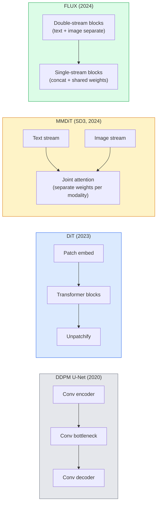

# Diffusion Transformers & Rectified Flow

> U-Net は diffusion の秘密ではない。これを transformer に置き換え、noise schedule を straight-line flow に替えると、SD3、FLUX、そして 2026 年のほぼすべての text-to-image model になる。

**種別:** 学習 + 構築
**言語:** Python
**前提条件:** Phase 4 Lesson 10 (Diffusion DDPM), Phase 4 Lesson 14 (ViT), Phase 7 Lesson 02 (Self-Attention)
**所要時間:** 約75分

## 学習目標

- U-Net DDPM (Lesson 10) から Diffusion Transformer (DiT)、MMDiT (SD3)、single+double-stream DiT (FLUX) への進化をたどる
- rectified flow を説明する。noise と data の間の straight-line trajectory により、model が 1000 steps ではなく 20 steps で sample できる理由を理解する
- tiny DiT block と rectified-flow training loop を、それぞれ 100 行未満で実装する
- model variants (SD3, FLUX.1-dev, FLUX.1-schnell, Z-Image, Qwen-Image) を architecture、parameter count、licensing で区別する

## 問題

Lesson 10 では U-Net denoiser を持つ DDPM を作った。その recipe は 2020-2023 年を支配した。U-Net + beta schedule + noise-prediction loss であり、Stable Diffusion 1.5 / 2.1 と DALL-E 2 を生んだ。

2026 年の state-of-the-art text-to-image model はすべてそれを越えている。Stable Diffusion 3、FLUX、SD4、Z-Image、Qwen-Image、Hunyuan-Image は、どれも U-Net を使わない。Diffusion Transformers (DiT) を使う。SD3 と FLUX はさらに DDPM noise schedule を rectified flow に置き換え、noise から data への path を直線化し、consistency や distilled variants で 1-4 step inference を可能にしている。

この shift が重要なのは、diffusion-based image generation が controllable、prompt-accurate (SD3/SD4 は text rendering を解いた)、production-fast になった理由だからである。DiT + rectified flow を理解することは、2026 年の generative-image stack を理解することである。

## コンセプト

### U-Net から transformer へ



- **DiT** (Peebles & Xie, 2023) — U-Net を latent patches 上の ViT-like transformer に置き換える。conditioning は adaptive layer norm (AdaLN) で行う。
- **MMDiT** (SD3, Esser et al., 2024) — text tokens と image tokens に separate weights を持つ 2 streams が joint attention を共有する。
- **FLUX** (Black Forest Labs, 2024) — 最初の N blocks は SD3 のような double-stream、後段は concat して shared weights を使う single-stream にし、高 depth で効率化する。
- **Z-Image** (2025) — 6B parameters の efficient single-stream DiT で、"scale at all costs" に挑む。

### rectified flow を 1 段落で

DDPM は forward process を noisy SDE として定義し、`x_t` はだんだん corrupt される。learned reverse は 2 つ目の SDE であり、1000 個の小さな steps で解く。

Rectified flow は clean data と pure noise の間の **straight-line** interpolation を定義する。

```
x_t = (1 - t) * x_0 + t * epsilon,     t in [0, 1]
```

network は velocity `v_theta(x_t, t) = epsilon - x_0`、つまり clean data から noise へ向かう straight-line path 上の forward direction (`dx_t/dt`) を予測するように学習する。sampling 中はこの velocity を backward に integrate し、noise から data へ進む。得られる ODE は直線にかなり近いため、sample に必要な integration steps が大幅に少なくなる。

SD3 はこれを **Rectified Flow Matching** と呼ぶ。FLUX、Z-Image、そして 2026 年の多くの model が同じ objective を使う。typical inference は 20-30 Euler steps (deterministic) で、旧 DDPM regime の 50+ DDIM steps より少ない。distilled / turbo / schnell / LCM variants は 1-4 steps まで下げる。

### AdaLN conditioning

DiT は timestep と class/text を **adaptive layer norm** で condition する。conditioning vector から `scale` と `shift` を予測し、LayerNorm の後に適用する。U-Net における FiLM-style modulation よりずっと clean で、現代の DiT では default である。

```
cond -> MLP -> (scale, shift, gate)
norm(x) * (1 + scale) + shift, then residual add * gate
```

### SD3 と FLUX の text encoders

- **SD3** は 3 つの text encoders を使う。2 つの CLIP models + T5-XXL。Embeddings は concat され、text conditioning として image stream に渡される。
- **FLUX** は CLIP-L + T5-XXL を 1 つずつ使う。
- **Qwen-Image / Z-Image** variants は base LLM に align した独自の in-house text encoders を使う。

text encoder は、SD3/FLUX が SD1.5 よりはるかにうまく prompt を reason できる大きな理由である。T5-XXL だけで 4.7B params ある。

### classifier-free guidance は引き続き有効

Rectified flow は sampler を変えるが、conditioning は変えない。Classifier-free guidance (training 中に 10% の確率で text を drop し、inference で conditional と unconditional predictions を mix する) は rectified flow でも同じように機能する。2026 年の多くの model は guidance scale 3.5-5 を使う。SD1.5 の 7.5 より低いのは、rectified-flow models が default で prompt により強く従うためである。

### Consistency, Turbo, Schnell, LCM

同じ idea に 4 つの名前がある。slow many-step model を fast few-step model に distil することだ。

- **LCM (Latent Consistency Model)** — 任意の intermediate `x_t` から final `x_0` を 1 step で予測する student を学習する。
- **SDXL Turbo / FLUX schnell** — adversarial diffusion distillation で学習された 1-4 step models。
- **SD Turbo** — OpenAI-style Consistency Models を latent diffusion に適用したもの。

新しい model の production serving では、"full quality" checkpoint と "turbo / schnell" variant の両方が提供される。Schnell (ドイツ語で "fast"、Black Forest Labs の慣例) は 1-4 steps で動き、real-time pipelines に収まる。

### 2026 年の model landscape

| Model | Size | Architecture | License |
|-------|------|--------------|---------|
| Stable Diffusion 3 Medium | 2B | MMDiT | SAI Community |
| Stable Diffusion 3.5 Large | 8B | MMDiT | SAI Community |
| FLUX.1-dev | 12B | Double + Single Stream DiT | non-commercial |
| FLUX.1-schnell | 12B | same, distilled | Apache 2.0 |
| FLUX.2 | — | iterated FLUX.1 | mixed |
| Z-Image | 6B | S3-DiT (Scalable Single-Stream) | permissive |
| Qwen-Image | ~20B | DiT + Qwen text tower | Apache 2.0 |
| Hunyuan-Image-3.0 | ~80B | DiT | research |
| SD4 Turbo | 3B | DiT + distillation | SAI Commercial |

FLUX.1-schnell は 2026 年の open-source default である。Z-Image は efficiency leader。FLUX.2 と SD4 は現在の quality tips である。

### この phase shift が重要な理由

DDPM + U-Net は機能した。DiT + rectified flow は **より良く、より速く、より clean に scale する**。この transition は NLP における RNN から transformers への移行に似ている。どちらの architecture も同じ問題を解いたが、transformers が scale し、現在は支配的である。2026 年の image、video、3D generation の paper はすべて DiT-shaped denoiser を使い、通常 rectified flow objective も使う。U-Net DDPM は今や主に教育用である (Lesson 10)。

## 実装

### Step 1: AdaLN を持つ DiT block

```python
import torch
import torch.nn as nn


class AdaLNZero(nn.Module):
    """
    Adaptive LayerNorm with a gate. Predicts (scale, shift, gate) from the conditioning.
    Init such that the whole block starts as identity ("zero init").
    """

    def __init__(self, dim, cond_dim):
        super().__init__()
        self.norm = nn.LayerNorm(dim, elementwise_affine=False)
        self.mlp = nn.Linear(cond_dim, dim * 3)
        nn.init.zeros_(self.mlp.weight)
        nn.init.zeros_(self.mlp.bias)

    def forward(self, x, cond):
        scale, shift, gate = self.mlp(cond).chunk(3, dim=-1)
        h = self.norm(x) * (1 + scale.unsqueeze(1)) + shift.unsqueeze(1)
        return h, gate.unsqueeze(1)


class DiTBlock(nn.Module):
    def __init__(self, dim=192, heads=3, mlp_ratio=4, cond_dim=192):
        super().__init__()
        self.adaln1 = AdaLNZero(dim, cond_dim)
        self.attn = nn.MultiheadAttention(dim, heads, batch_first=True)
        self.adaln2 = AdaLNZero(dim, cond_dim)
        self.mlp = nn.Sequential(
            nn.Linear(dim, dim * mlp_ratio),
            nn.GELU(),
            nn.Linear(dim * mlp_ratio, dim),
        )

    def forward(self, x, cond):
        h, gate1 = self.adaln1(x, cond)
        a, _ = self.attn(h, h, h, need_weights=False)
        x = x + gate1 * a
        h, gate2 = self.adaln2(x, cond)
        x = x + gate2 * self.mlp(h)
        return x
```

`AdaLNZero` は MLP weights が zero に initialised されるため identity mapping として始まる。Training が block を identity から少しずつ動かすため、deep transformer diffusion models が劇的に安定する。

### Step 2: tiny DiT

```python
def timestep_embedding(t, dim):
    import math
    half = dim // 2
    freqs = torch.exp(-math.log(10000) * torch.arange(half, device=t.device) / half)
    args = t[:, None].float() * freqs[None]
    return torch.cat([args.sin(), args.cos()], dim=-1)


class TinyDiT(nn.Module):
    def __init__(self, image_size=16, patch_size=2, in_channels=3, dim=96, depth=4, heads=3):
        super().__init__()
        self.patch_size = patch_size
        self.num_patches = (image_size // patch_size) ** 2
        self.patch = nn.Conv2d(in_channels, dim, kernel_size=patch_size, stride=patch_size)
        self.pos = nn.Parameter(torch.zeros(1, self.num_patches, dim))
        self.time_mlp = nn.Sequential(
            nn.Linear(dim, dim * 2),
            nn.SiLU(),
            nn.Linear(dim * 2, dim),
        )
        self.blocks = nn.ModuleList([DiTBlock(dim, heads, cond_dim=dim) for _ in range(depth)])
        self.norm_out = nn.LayerNorm(dim, elementwise_affine=False)
        self.head = nn.Linear(dim, patch_size * patch_size * in_channels)

    def forward(self, x, t):
        n = x.size(0)
        x = self.patch(x)
        x = x.flatten(2).transpose(1, 2) + self.pos
        t_emb = self.time_mlp(timestep_embedding(t, self.pos.size(-1)))
        for blk in self.blocks:
            x = blk(x, t_emb)
        x = self.norm_out(x)
        x = self.head(x)
        return self._unpatchify(x, n)

    def _unpatchify(self, x, n):
        p = self.patch_size
        h = w = int(self.num_patches ** 0.5)
        x = x.view(n, h, w, p, p, -1).permute(0, 5, 1, 3, 2, 4).reshape(n, -1, h * p, w * p)
        return x
```

### Step 3: rectified flow training

```python
import torch.nn.functional as F

def rectified_flow_train_step(model, x0, optimizer, device):
    model.train()
    x0 = x0.to(device)
    n = x0.size(0)
    t = torch.rand(n, device=device)
    epsilon = torch.randn_like(x0)
    x_t = (1 - t[:, None, None, None]) * x0 + t[:, None, None, None] * epsilon

    target_velocity = epsilon - x0
    pred_velocity = model(x_t, t)

    loss = F.mse_loss(pred_velocity, target_velocity)
    optimizer.zero_grad()
    loss.backward()
    optimizer.step()
    return loss.item()
```

DDPM の noise-prediction loss (Lesson 10) と比べると、構造は同じで target が異なる。noise `epsilon` を予測する代わりに、straight-line interpolation に沿って data から noise を指す **velocity** `epsilon - x_0` を予測する。

### Step 4: Euler sampler

Rectified flow は ODE である。Euler's method は最も単純で、よく学習された rectified-flow model では 20+ steps で higher-order solvers とほぼ同じ精度になる。

```python
@torch.no_grad()
def rectified_flow_sample(model, shape, steps=20, device="cpu"):
    model.eval()
    x = torch.randn(shape, device=device)
    dt = 1.0 / steps
    t = torch.ones(shape[0], device=device)
    for _ in range(steps):
        v = model(x, t)
        x = x - dt * v
        t = t - dt
    return x
```

20 steps。学習済み model では、1000-step DDPM に comparable な samples を生成する。

### Step 5: end-to-end smoke test

```python
import numpy as np

def synthetic_blobs(num=200, size=16, seed=0):
    rng = np.random.default_rng(seed)
    out = np.zeros((num, 3, size, size), dtype=np.float32)
    yy, xx = np.meshgrid(np.arange(size), np.arange(size), indexing="ij")
    for i in range(num):
        cx, cy = rng.uniform(4, size - 4, size=2)
        r = rng.uniform(2, 4)
        mask = (xx - cx) ** 2 + (yy - cy) ** 2 < r ** 2
        colour = rng.uniform(-1, 1, size=3)
        for c in range(3):
            out[i, c][mask] = colour[c]
    return torch.from_numpy(out)
```

これで `TinyDiT` を rectified flow で学習する。500 steps 後、sampled outputs は淡い色の blobs のように見えるはずである。

## 使い方

実際の image generation では、`diffusers` が FLUX / SD3 / Z-Image を統一 API で提供している。

```python
from diffusers import FluxPipeline, StableDiffusion3Pipeline
import torch

pipe = FluxPipeline.from_pretrained(
    "black-forest-labs/FLUX.1-schnell",
    torch_dtype=torch.bfloat16,
).to("cuda")

out = pipe(
    prompt="a golden retriever surfing a tsunami, hyperrealistic, studio lighting",
    guidance_scale=0.0,           # schnell was trained without CFG
    num_inference_steps=4,
    max_sequence_length=256,
).images[0]
out.save("surf.png")
```

3 行である。`FLUX.1-schnell` は 4 steps。より高い quality が必要なら model id を `black-forest-labs/FLUX.1-dev` に替え、CFG 付き 20-30 steps で実行する。

SD3 の場合:

```python
pipe = StableDiffusion3Pipeline.from_pretrained(
    "stabilityai/stable-diffusion-3.5-large",
    torch_dtype=torch.bfloat16,
).to("cuda")
out = pipe(prompt, guidance_scale=3.5, num_inference_steps=28).images[0]
```

## 成果物

この lesson は次を生成する:

- `outputs/prompt-dit-model-picker.md` — quality、latency、license constraints に応じて SD3、FLUX.1-dev、FLUX.1-schnell、Z-Image、SD4 Turbo を選ぶ。
- `outputs/skill-rectified-flow-trainer.md` — AdaLN DiT と Euler sampling を使う rectified flow の完全な training loop を書く。

## 演習

1. **(Easy)** 上の TinyDiT を synthetic blob dataset で 500 steps 学習する。10、20、50 Euler steps で生成した samples を比較する。
2. **(Medium)** time embedding に learned class embedding を concat して text conditioning を追加する (colour による 10 blob "classes")。class 0、5、9 で sample し、colours が一致することを確認する。
3. **(Hard)** 同じ size の network を同じ data で同じ steps 数だけ学習した rectified-flow 版と DDPM 版から生成した samples の Fréchet distance (FID proxy) を計算する。どちらが速く収束するかを報告する。

## 重要用語

| 用語 | よく言われる表現 | 実際の意味 |
|------|----------------|----------------------|
| DiT | "Diffusion transformer" | diffusion denoiser として U-Net を置き換える transformer。patchified latents 上で動作する |
| AdaLN | "Adaptive layer norm" | LayerNorm 後に適用される learned scale, shift, gate による timestep/text conditioning。現代のすべての DiT の標準 |
| MMDiT | "Multi-modal DiT (SD3)" | joint self-attention を共有する、text tokens と image tokens の separate weight streams |
| Single-stream / double-stream | "FLUX trick" | 最初の N blocks は double-stream (modality ごとの separate weights)、後段は efficiency のため single-stream (concat + shared weights) |
| Rectified flow | "Straight-line noise-to-data" | data と noise の線形 interpolation。network は velocity を予測し、inference で必要な ODE steps が少ない |
| Velocity target | "epsilon - x_0" | rectified flow の regression target。clean data から noise を指す |
| CFG guidance | "classifier-free guidance" | conditional と unconditional predictions を mix する。rectified-flow models でも使われる |
| Schnell / turbo / LCM | "1-4 step distillation" | full-quality models から distilled された少 step variants。本番 real-time 向け |

## 参考資料

- [Scalable Diffusion Models with Transformers (Peebles & Xie, 2023)](https://arxiv.org/abs/2212.09748) — DiT paper
- [Scaling Rectified Flow Transformers (Esser et al., SD3 paper)](https://arxiv.org/abs/2403.03206) — MMDiT と rectified-flow at scale
- [FLUX.1 model card and technical report (Black Forest Labs)](https://huggingface.co/black-forest-labs/FLUX.1-dev) — double + single-stream details
- [Z-Image: Efficient Image Generation Foundation Model (2025)](https://arxiv.org/html/2511.22699v1) — 6B の single-stream DiT
- [Elucidating the Design Space of Diffusion (Karras et al., 2022)](https://arxiv.org/abs/2206.00364) — diffusion design trade-off の reference
- [Latent Consistency Models (Luo et al., 2023)](https://arxiv.org/abs/2310.04378) — LCM-LoRA が 4-step inference を実現する方法
