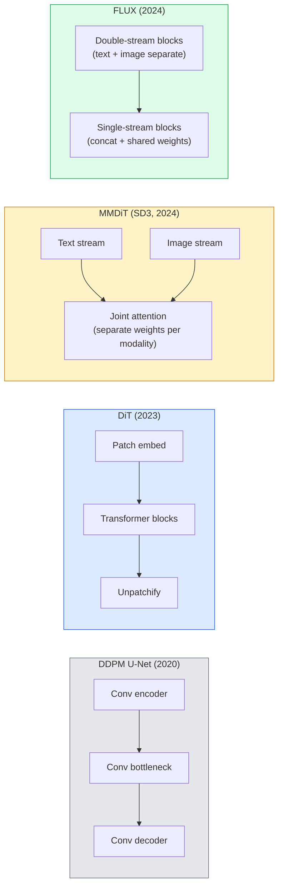

# Difüzyon Transformer'ler ve Düzeltilmiş Akış

> U-Net yayılmanın sırrı değildir. Bunu bir transformer ile değiştirin, gürültü programını düz çizgi akışıyla değiştirin ve aniden SD3, FLUX ve tüm 2026 metinden görüntüye modeline sahip olun.

**Tür:** Öğren + Oluştur
**Diller:** Python
**Önkoşullar:** Aşama 4 Ders 10 (Difüzyon DDPM), Aşama 4 Ders 14 (ViT), Aşama 7 Ders 02 (Kişisel Dikkat)
**Süre:** ~75 dakika

## Öğrenme Hedefleri

- U-Net DDPM'den (Ders 10) Difüzyon Transformer (DiT), MMDiT (SD3) ve tek+çift akışlı DiT'ye (FLUX) kadar evrimi takip edin
- Düzeltilmiş akışı açıklayın: Gürültü ve veri arasındaki düz çizgi, modellerin neden 1000 adım yerine 20 adımda örnekleme yapmasına olanak tanıyor?
- Her ikisi de 100 satırın altında küçük bir DiT bloğu ve düzeltilmiş akışlı eğitim döngüsü uygulayın
- Model çeşitlerini (SD3, FLUX.1-dev, FLUX.1-schnell, Z-Image, Qwen-Image) mimariye, parametre sayısına ve lisanslamaya göre ayırt edin

## Sorun

Ders 10, U-Net gürültü gidericiye sahip bir DDPM oluşturdu. Bu tarif 2020-2023'e hakim oldu: U-Net + beta programı + gürültü tahmin kaybı. Stabil Difüzyon 1.5 ve 2.1 ile DALL-E 2'yi üretti.

2026'nın son teknoloji ürünü metinden resme modelinin her biri bunu aştı. Stabil Difüzyon 3, FLUX, SD4, Z-Image, Qwen-Image, Hunyuan-Image — hiçbiri U-Net kullanmaz. Difüzyon Transformer'leri (DiT) kullanırlar. SD3 ve FLUX ayrıca, gürültüden veriye giden yolu düzelten ve tutarlı veya damıtılmış değişkenlerle 1-4 adımlı inference'yi mümkün kılan, düzeltilmiş akış için DDPM gürültü programını da değiştirir.

Geçiş önemlidir çünkü dağıtım tabanlı görüntü oluşturmanın kontrol edilebilir, prompt doğru (SD3/SD4 çözümlü metin oluşturma) ve üretim hızlı olmasının nedeni budur. DiT + düzeltilmiş akışı anlamak, 2026 üretken görüntü yığınını anlamaktır.

## Konsept

### U-Net'ten transformer'ye



- **DiT** (Peebles ve Xie, 2023) — gizli yamalarda U-Net'i ViT benzeri bir transformer ile değiştirin. Uyarlanabilir katman normu (AdaLN) aracılığıyla koşullandırma.
- **MMDiT** (SD3, Esser ve diğerleri, 2024) — ortak bir dikkati paylaşan metin ve resim token'ler için ayrı ağırlıklara sahip iki akış.
- **FLUX** (Black Forest Labs, 2024) — SD3 gibi ilk N blok çift akışlı, sonraki bloklar daha yüksek derinlikte verimlilik için birleştirilir ve ağırlıkları paylaşır (tek akış).
- **Z-Image** (2025) — "her ne pahasına olursa olsun ölçeklendirmeye" meydan okuyan, 6B parametrelerinde verimli bir tek akışlı DiT.

### Tek paragrafta düzeltilmiş akış

DDPM, ileri süreci `x_t`'nin giderek bozulduğu gürültülü bir SDE olarak tanımlar. Öğrenilen tersi, 1000 küçük adımla çözülen ikinci bir SDE'dir.

Düzeltilmiş akış, temiz veriler ile saf gürültü arasında **düz çizgi** enterpolasyonu tanımlar:

```
x_t = (1 - t) * x_0 + t * epsilon,     t in [0, 1]
```

`v_theta(x_t, t) = epsilon - x_0` hızını (temiz veriden gürültüye (`dx_t/dt`) giden düz çizgi boyunca ileri yön) tahmin etmek için bir ağı eğitin. Örnekleme sırasında, gürültüden veriye doğru adım atmak için bu hızı geriye doğru entegre edersiniz. Ortaya çıkan ODE düz bir çizgiye çok daha yakındır, dolayısıyla numune almak için daha az entegrasyon adımı gerekir.

SD3 buna **Düzeltilmiş Akış Eşleştirmesi** adını verir. FLUX, Z-Image ve çoğu 2026 modeli aynı amacı kullanır. Tipik inference: Eski DDPM rejiminde 20-30 Euler adımı (deterministik) ve 50'den fazla DDIM adımı. Damıtılmış / turbo / schnell / LCM çeşitleri bunu 1-4 adıma kadar indirir.

### AdaLN koşullandırma

**uyarlanabilir katman normu** aracılığıyla zaman adımı ve sınıf/metin üzerindeki DiT koşulu: koşullandırma vektöründen `scale` ve `shift`'yi tahmin edin ve bunları LayerNorm'dan sonra uygulayın. U-Net'lerdeki FiLM tarzı modülasyondan ve her modern DiT'deki varsayılandan çok daha temiz.

```
cond -> MLP -> (scale, shift, gate)
norm(x) * (1 + scale) + shift, then residual add * gate
```

### SD3 ve FLUX'taki metin kodlayıcılar

- **SD3** üç metin kodlayıcı kullanır: iki CLIP modeli + T5-XXL. Embedding'ler metin koşullandırma olarak birleştirildi ve görüntü akışına beslendi.
- **FLUX** bir CLIP-L + T5-XXL kullanır.
- **Qwen-Image / Z-Image** çeşitleri, temel LLM'leriyle uyumlu kendi şirket içi metin kodlayıcılarını kullanır.

Metin kodlayıcı, SD3/FLUX'un prompt'leri SD1.5'den çok daha iyi düşünmesinin büyük bir parçasıdır. Tek başına T5-XXL 4.7B parametresidir.

### Sınıflandırıcısız rehberlik hâlâ geçerli

Düzeltilmiş akış, koşullandırmayı değil örnekleyiciyi değiştirir. Sınıflandırıcı içermeyen rehberlik (eğitim sırasında %10 olasılıkla metin bırakma, inference'de koşullu ve koşulsuz tahminleri karıştırma) düzeltilmiş akışla aynı şekilde çalışır. Çoğu 2026 modeli, SD1.5'nin 7,5'inden daha düşük olan 3,5-5 kılavuz ölçeğini kullanır çünkü düzeltilmiş akış modelleri varsayılan olarak prompt'leri daha sıkı takip eder.

### Tutarlılık, Turbo, Schnell, LCM

Aynı fikir için dört isim: Yavaş, çok adımlı bir modeli hızlı, birkaç adımlı bir modele dönüştürmek.

- **LCM (Gizli Tutarlılık Modeli)** — herhangi bir ara `x_t`'den nihai `x_0`'yi tek adımda tahmin eden bir öğrenciyi eğitin.
- **SDXL Turbo / FLUX schnell** — Rekabetçi difüzyon damıtmayla eğitilmiş 1-4 adımlı modeller.
- **SD Turbo** — Gizli yayılmaya uyarlanmış OpenAI tarzı Tutarlılık Modelleri.

Herhangi bir yeni modelin üretim hizmeti, hem "tam kalite" kontrol noktası hem de "turbo / schnell" çeşidi sunar. Schnell (Almanca'da "hızlı", Kara Orman Laboratuarları sözleşmesi) 1-4 adımda çalışır ve gerçek zamanlı işlem hatlarına uyar.

### 2026'daki model manzarası

| Modeli | Boyut | Mimarlık | Lisans |
|-------|------|--------------|---------|
| Kararlı Difüzyon 3 Orta | 2B | MMDIT | SAI Topluluğu |
| Kararlı Difüzyon 3,5 Büyük | 8B | MMDIT | SAI Topluluğu |
| FLUX.1-dev | 12B | Çift + Tek Akış DiT | ticari olmayan |
| FLUX.1-schnell | 12B | aynı, damıtılmış | Apache 2.0 |
| FLUX.2 | — | yinelenen FLUX.1 | karışık |
| Z-Resim | 6B | S3-DiT (Ölçeklenebilir Tek Akış) | müsamahakâr |
| Qwen-Resim | ~20B | DiT + Qwen metin kulesi | Apache 2.0 |
| Hunyuan-Resim-3.0 | ~80B | DiT | araştırma |
| SD4 Turbo | 3B | DiT + damıtma | SAI Ticari |

FLUX.1-schnell, 2026 açık kaynak varsayılanıdır. Z-Image verimlilik lideridir. FLUX.2 ve SD4 mevcut kalite ipuçlarıdır.

### Bu faz değişimi neden önemli?

DDPM + U-Net işe yaradı. DiT + düzeltilmiş akış **daha iyi, daha hızlı çalışır ve daha temiz bir şekilde ölçeklenir**. Geçiş, NLP'de RNN'lerden transformer'lere geçişle paraleldir: her iki mimari de aynı sorunu çözdü, ancak transformer'ler ölçeklendi ve artık hakim durumda. Görüntü, video veya 3D nesil hakkındaki her 2026 makalesinde DiT şeklinde bir gürültü giderici ve genellikle düzeltilmiş bir akış hedefi kullanılır. U-Net DDPM artık öncelikli olarak pedagojiktir (Ders 10).

## İnşa Et

### Adım 1: AdaLN'li bir DiT bloğu

```python
import torch
import torch.nn as nn


class AdaLNZero(nn.Module):
    """
    Adaptive LayerNorm with a gate. Predicts (scale, shift, gate) from the conditioning.
    Init such that the whole block starts as identity ("zero init").
    """

    def __init__(self, dim, cond_dim):
        super().__init__()
        self.norm = nn.LayerNorm(dim, elementwise_affine=False)
        self.mlp = nn.Linear(cond_dim, dim * 3)
        nn.init.zeros_(self.mlp.weight)
        nn.init.zeros_(self.mlp.bias)

    def forward(self, x, cond):
        scale, shift, gate = self.mlp(cond).chunk(3, dim=-1)
        h = self.norm(x) * (1 + scale.unsqueeze(1)) + shift.unsqueeze(1)
        return h, gate.unsqueeze(1)


class DiTBlock(nn.Module):
    def __init__(self, dim=192, heads=3, mlp_ratio=4, cond_dim=192):
        super().__init__()
        self.adaln1 = AdaLNZero(dim, cond_dim)
        self.attn = nn.MultiheadAttention(dim, heads, batch_first=True)
        self.adaln2 = AdaLNZero(dim, cond_dim)
        self.mlp = nn.Sequential(
            nn.Linear(dim, dim * mlp_ratio),
            nn.GELU(),
            nn.Linear(dim * mlp_ratio, dim),
        )

    def forward(self, x, cond):
        h, gate1 = self.adaln1(x, cond)
        a, _ = self.attn(h, h, h, need_weights=False)
        x = x + gate1 * a
        h, gate2 = self.adaln2(x, cond)
        x = x + gate2 * self.mlp(h)
        return x
```

`AdaLNZero`, MLP ağırlıkları sıfıra ayarlandığından kimlik eşlemesi olarak başlar. Eğitim bloğu kimlikten uzaklaştırır; bu, derin transformer difüzyon modellerini önemli ölçüde stabilize eder.

### Adım 2: Küçük bir DiT

```python
def timestep_embedding(t, dim):
    import math
    half = dim // 2
    freqs = torch.exp(-math.log(10000) * torch.arange(half, device=t.device) / half)
    args = t[:, None].float() * freqs[None]
    return torch.cat([args.sin(), args.cos()], dim=-1)


class TinyDiT(nn.Module):
    def __init__(self, image_size=16, patch_size=2, in_channels=3, dim=96, depth=4, heads=3):
        super().__init__()
        self.patch_size = patch_size
        self.num_patches = (image_size // patch_size) ** 2
        self.patch = nn.Conv2d(in_channels, dim, kernel_size=patch_size, stride=patch_size)
        self.pos = nn.Parameter(torch.zeros(1, self.num_patches, dim))
        self.time_mlp = nn.Sequential(
            nn.Linear(dim, dim * 2),
            nn.SiLU(),
            nn.Linear(dim * 2, dim),
        )
        self.blocks = nn.ModuleList([DiTBlock(dim, heads, cond_dim=dim) for _ in range(depth)])
        self.norm_out = nn.LayerNorm(dim, elementwise_affine=False)
        self.head = nn.Linear(dim, patch_size * patch_size * in_channels)

    def forward(self, x, t):
        n = x.size(0)
        x = self.patch(x)
        x = x.flatten(2).transpose(1, 2) + self.pos
        t_emb = self.time_mlp(timestep_embedding(t, self.pos.size(-1)))
        for blk in self.blocks:
            x = blk(x, t_emb)
        x = self.norm_out(x)
        x = self.head(x)
        return self._unpatchify(x, n)

    def _unpatchify(self, x, n):
        p = self.patch_size
        h = w = int(self.num_patches ** 0.5)
        x = x.view(n, h, w, p, p, -1).permute(0, 5, 1, 3, 2, 4).reshape(n, -1, h * p, w * p)
        return x
```

### 3. Adım: Düzeltilmiş akış eğitimi

```python
import torch.nn.functional as F

def rectified_flow_train_step(model, x0, optimizer, device):
    model.train()
    x0 = x0.to(device)
    n = x0.size(0)
    t = torch.rand(n, device=device)
    epsilon = torch.randn_like(x0)
    x_t = (1 - t[:, None, None, None]) * x0 + t[:, None, None, None] * epsilon

    target_velocity = epsilon - x0
    pred_velocity = model(x_t, t)

    loss = F.mse_loss(pred_velocity, target_velocity)
    optimizer.zero_grad()
    loss.backward()
    optimizer.step()
    return loss.item()
```

DDPM'nin gürültü tahmin kaybıyla karşılaştırın (Ders 10): aynı yapı, farklı hedef. `epsilon` gürültüyü tahmin etmek yerine, düz çizgi enterpolasyonu boyunca veriden gürültüye işaret eden **hızı** `epsilon - x_0` tahmin ediyoruz.

### Adım 4: Euler örnekleyici

Düzeltilmiş akış bir ODE'dir. Euler'in yöntemi en basit olanıdır ve iyi eğitilmiş bir düzeltilmiş akış modeli için neredeyse 20'den fazla adımda yüksek dereceli çözücüler kadar doğrudur.

```python
@torch.no_grad()
def rectified_flow_sample(model, shape, steps=20, device="cpu"):
    model.eval()
    x = torch.randn(shape, device=device)
    dt = 1.0 / steps
    t = torch.ones(shape[0], device=device)
    for _ in range(steps):
        v = model(x, t)
        x = x - dt * v
        t = t - dt
    return x
```

20 adım. Eğitilmiş bir modelde bu, 1000 adımlı DDPM ile karşılaştırılabilir örnekler üretir.

### Adım 5: Uçtan uca duman testi

```python
import numpy as np

def synthetic_blobs(num=200, size=16, seed=0):
    rng = np.random.default_rng(seed)
    out = np.zeros((num, 3, size, size), dtype=np.float32)
    yy, xx = np.meshgrid(np.arange(size), np.arange(size), indexing="ij")
    for i in range(num):
        cx, cy = rng.uniform(4, size - 4, size=2)
        r = rng.uniform(2, 4)
        mask = (xx - cx) ** 2 + (yy - cy) ** 2 < r ** 2
        colour = rng.uniform(-1, 1, size=3)
        for c in range(3):
            out[i, c][mask] = colour[c]
    return torch.from_numpy(out)
```

Düzeltilmiş akışla bu konuda bir `TinyDiT` eğitin. 500 adımdan sonra örneklenen çıktılar soluk renkli lekeler gibi görünmelidir.

## Kullan onu

FLUX / SD3 / Z-Image ile gerçek görüntü üretimi için `diffusers`, her birini birleşik bir API ile birlikte gönderir:

```python
from diffusers import FluxPipeline, StableDiffusion3Pipeline
import torch

pipe = FluxPipeline.from_pretrained(
    "black-forest-labs/FLUX.1-schnell",
    torch_dtype=torch.bfloat16,
).to("cuda")

out = pipe(
    prompt="a golden retriever surfing a tsunami, hyperrealistic, studio lighting",
    guidance_scale=0.0,           # schnell was trained without CFG
    num_inference_steps=4,
    max_sequence_length=256,
).images[0]
out.save("surf.png")
```

Üç satır. Dört adımda `FLUX.1-schnell`. CFG ile 20-30 adımda daha yüksek kalite için model kimliğini `black-forest-labs/FLUX.1-dev` ile değiştirin.

SD3 için:

```python
pipe = StableDiffusion3Pipeline.from_pretrained(
    "stabilityai/stable-diffusion-3.5-large",
    torch_dtype=torch.bfloat16,
).to("cuda")
out = pipe(prompt, guidance_scale=3.5, num_inference_steps=28).images[0]
```

## Gönderin

Bu ders şunları üretir:

- `outputs/prompt-dit-model-picker.md` — kalite, gecikme ve lisans kısıtlamalarına göre SD3, FLUX.1-dev, FLUX.1-schnell, Z-Image, SD4 Turbo arasından seçim yapar.
- `outputs/skill-rectified-flow-trainer.md` — AdaLN DiT ve Euler örneklemesi ile düzeltilmiş akış için eksiksiz bir eğitim döngüsü yazar.

## Egzersizler

1. **(Kolay)** Yukarıdaki TinyDiT'i sentetik blob dataset üzerinde 500 adım boyunca eğitin. 10, 20 ve 50 Euler adımıyla üretilen numuneleri karşılaştırın.
2. **(Orta)** Öğrenilmiş bir embedding sınıfını embedding zamanına (renge göre 10 blob "sınıfı") birleştirerek metin koşullandırma ekleyin. Sınıf 0, 5 ve 9'dan örnek alın ve renklerin eşleştiğini doğrulayın.
3. **(Zor)** Düzeltilmiş akıştan oluşturulan örnekler ile aynı sayıda adım için aynı veriler üzerinde eğitilmiş aynı boyutlu ağın DDPM versiyonları arasındaki Fréchet mesafesini (FID proxy) hesaplayın. Daha hızlı yakınsayan rapor.

## Anahtar Terimler

| Dönem | İnsanlar ne diyor | Aslında ne anlama geliyor |
|------|----------------|----------------------|
| DiT | "Dağıtım transformer" | Difüzyon gürültü giderici olarak U-Net'in yerini alan Transformer; yamalı gizli öğeler üzerinde çalışır |
| AdaLN | "Uyarlanabilir katman normu" | LayerNorm'dan sonra uygulanan öğrenilmiş ölçek, kaydırma, geçit yoluyla zaman adımı/metin koşullandırma; her modern DiT'de standart |
| MMDIT | "Çok modlu DiT (SD3)" | Ortak bir kişisel dikkati paylaşan metin ve görüntü token'ler için ayrı ağırlık akışları |
| Tek akışlı / çift akışlı | "FLUX numarası" | İlk olarak N, çift akışı (modalite başına ayrı ağırlıklar) bloklar, daha sonra verimlilik için tek akışı (birleşik + paylaşılan ağırlıklar) bloke eder |
| Düzeltilmiş akış | "Veriye doğru düz çizgi gürültüsü" | Veri ve gürültü arasında doğrusal enterpolasyon; ağ hızı tahmin eder; inference'de daha az ODE adımı gerekiyor |
| Hız hedefi | "epsilon - x_0" | Düzeltilmiş akışta regresyon hedefi; temiz veriden gürültüye kadar önemli noktalar |
| CFG rehberliği | "sınıflandırıcıdan bağımsız rehberlik" | Koşullu ve koşulsuz tahminleri karıştırın; hala düzeltilmiş akışlı modellerde kullanılıyor |
| Schnell / turbo / LCM | "1-4 adımlı damıtma" | Tam kaliteli modellerden damıtılmış küçük adımlı çeşitler; gerçek zamanlı üretim |

## Daha Fazla Okuma

- [Transformer'lerle Ölçeklenebilir Yayılma Modelleri (Peebles ve Xie, 2023)](https://arxiv.org/abs/2212.09748) — DiT makalesi
- [Düzeltilmiş Akışı Ölçeklendirme Transformers (Esser ve diğerleri, SD3 kağıdı)](https://arxiv.org/abs/2403.03206) — MMDiT ve ölçekte düzeltilmiş akış
- [FLUX.1 model kartı ve teknik rapor (Black Forest Labs)](https://huggingface.co/black-forest-labs/FLUX.1-dev) — çift + tek akış ayrıntıları
- [Z-Image: Verimli Görüntü Oluşturma Temel Modeli (2025)](https://arxiv.org/html/2511.22699v1) — 6B'de tek akışlı DiT
- [Difüzyonun Tasarım Uzayını Aydınlatmak (Karras ve diğerleri, 2022)](https://arxiv.org/abs/2206.00364) — her difüzyon tasarımı değiş tokuşu için referans
- [Gizli Tutarlılık Modelleri (Luo ve diğerleri, 2023)](https://arxiv.org/abs/2310.04378) — LCM-LoRA'nın size 4 adımlı inference'yi nasıl sunduğu
