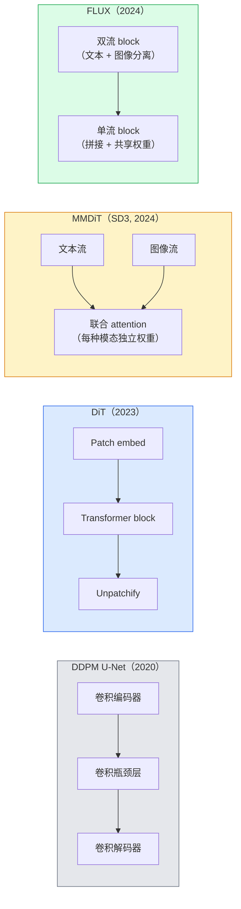

# Diffusion Transformer 与 Rectified Flow

> 译注：本文译自同目录 [`en.md`](./en.md)。术语遵循仓根 [TRANSLATION_GUIDE.md](../../../../TRANSLATION_GUIDE.md)。

> U-Net 并不是 diffusion 的秘诀。把它换成 transformer，再把噪声调度换成直线 flow，你就突然拥有了 SD3、FLUX，以及 2026 年的每一个文生图模型。

**Type:** Learn + Build
**Languages:** Python
**Prerequisites:** Phase 4 Lesson 10（Diffusion DDPM）、Phase 4 Lesson 14（ViT）、Phase 7 Lesson 02（Self-Attention）
**Time:** ~75 分钟

## 学习目标（Learning Objectives）

- 梳理从 U-Net DDPM（Lesson 10）到 Diffusion Transformer（DiT）、MMDiT（SD3），再到单+双流 DiT（FLUX）的演化轨迹
- 解释 rectified flow：为什么噪声到数据的直线轨迹能让模型用 20 步采样，而不是 1000 步
- 实现一个不到 100 行的迷你 DiT block 和一个 rectified-flow 训练循环
- 按架构、参数量、许可证区分各模型变体（SD3、FLUX.1-dev、FLUX.1-schnell、Z-Image、Qwen-Image）

## 问题（The Problem）

Lesson 10 用一个 U-Net 去噪器搭出了 DDPM。那套配方在 2020-2023 年统治整个领域：U-Net + beta 调度 + 噪声预测损失。它孕育出了 Stable Diffusion 1.5、2.1 和 DALL-E 2。

到 2026 年，每一个 SOTA 文生图模型都已经超越了它。Stable Diffusion 3、FLUX、SD4、Z-Image、Qwen-Image、Hunyuan-Image —— 没有一个还在用 U-Net。它们都用 Diffusion Transformer（DiT）。SD3 和 FLUX 还把 DDPM 的噪声调度换成了 rectified flow，把噪声到数据的路径拉直，配合 consistency 或蒸馏变体，就能做 1-4 步推理。

这次切换很关键，因为它正是 diffusion 图像生成变得可控、prompt 准确（SD3/SD4 解决了文字渲染）、并能在生产中跑得飞快的原因。理解 DiT + rectified flow，就是理解 2026 年的生成图像技术栈。

## 概念（The Concept）

### 从 U-Net 到 transformer（From U-Net to transformer）



- **DiT**（Peebles & Xie, 2023）—— 把 U-Net 换成在 latent patch 上跑的 ViT 风格 transformer。通过 adaptive layer norm（AdaLN）做条件注入。
- **MMDiT**（SD3，Esser 等, 2024）—— 文本和图像 token 各自一条流、各自一套权重，但共享一次 joint attention。
- **FLUX**（Black Forest Labs, 2024）—— 前 N 个 block 像 SD3 一样双流，后面的 block 把 token 拼接起来共享权重（单流），在更深的层数上更高效。
- **Z-Image**（2025）—— 6B 参数的高效单流 DiT，挑战了「不计代价堆规模」的范式。

### 一段话讲完 rectified flow（Rectified flow in one paragraph）

DDPM 把前向过程定义成一个带噪声的 SDE，`x_t` 被逐步腐蚀。学到的反向过程是另一个 SDE，要用 1000 个小步去解。

Rectified flow 把干净数据和纯噪声之间的插值定义成一条**直线**：

```
x_t = (1 - t) * x_0 + t * epsilon,     t in [0, 1]
```

训练一个网络去预测速度 `v_theta(x_t, t) = epsilon - x_0` —— 沿着干净数据到噪声的直线路径的前进方向（`dx_t/dt`）。采样时，你把这个速度反向积分，从噪声一步步走向数据。得到的 ODE 路径非常接近一条直线，所以采样所需的积分步数大幅减少。

SD3 把这套叫 **Rectified Flow Matching**。FLUX、Z-Image，以及 2026 年的大多数模型都用同样的目标。典型推理：20-30 个 Euler 步（确定性），相比之下旧的 DDPM 体系下要 50+ 个 DDIM 步。蒸馏 / turbo / schnell / LCM 这些变体能把它压到 1-4 步。

### AdaLN 条件注入（AdaLN conditioning）

DiT 通过 **adaptive layer norm** 注入时间步和类别 / 文本条件：从条件向量预测 `scale` 和 `shift`，在 LayerNorm 之后施加。比 U-Net 里的 FiLM 风格调制干净得多，是现代每个 DiT 的默认做法。

```
cond -> MLP -> (scale, shift, gate)
norm(x) * (1 + scale) + shift, then residual add * gate
```

### SD3 与 FLUX 的文本编码器（Text encoders in SD3 and FLUX）

- **SD3** 用三个文本编码器：两个 CLIP 模型 + T5-XXL。embedding 拼接后作为文本条件喂给图像流。
- **FLUX** 用一个 CLIP-L + T5-XXL。
- **Qwen-Image / Z-Image** 变体用各自配套基座 LLM 对齐的内部文本编码器。

文本编码器是 SD3/FLUX 比 SD1.5 在 prompt 理解上强这么多的关键之一。光 T5-XXL 自己就有 4.7B 参数。

### Classifier-free guidance 仍然成立（Classifier-free guidance still holds）

Rectified flow 改的是采样器，不是条件机制。Classifier-free guidance（训练时以 10% 概率丢掉文本，推理时混合条件和无条件预测）在 rectified flow 下完全照旧。2026 年大多数模型用 3.5-5 的 guidance scale —— 比 SD1.5 的 7.5 低，因为 rectified-flow 模型默认就更紧地跟随 prompt。

### Consistency、Turbo、Schnell、LCM（Consistency, Turbo, Schnell, LCM）

四个名字，同一个想法：把一个慢速、多步的模型蒸馏成一个快速、少步的模型。

- **LCM（Latent Consistency Model）** —— 训练一个学生模型，能从任意中间 `x_t` 一步直接预测最终的 `x_0`。
- **SDXL Turbo / FLUX schnell** —— 用对抗式 diffusion 蒸馏训练出来的 1-4 步模型。
- **SD Turbo** —— 把 OpenAI 风格的 Consistency Models 适配到 latent diffusion 上。

任何新模型上线时都会同时发一个「全质量」checkpoint 和一个「turbo / schnell」变体。Schnell（德语「快」，Black Forest Labs 的命名习惯）能在 1-4 步内跑完，能塞进实时管线。

### 2026 年的模型版图（Model landscape in 2026）

| 模型 | 规模 | 架构 | 许可证 |
|-------|------|--------------|---------|
| Stable Diffusion 3 Medium | 2B | MMDiT | SAI Community |
| Stable Diffusion 3.5 Large | 8B | MMDiT | SAI Community |
| FLUX.1-dev | 12B | Double + Single Stream DiT | non-commercial |
| FLUX.1-schnell | 12B | 同上，蒸馏版 | Apache 2.0 |
| FLUX.2 | — | FLUX.1 的迭代版 | mixed |
| Z-Image | 6B | S3-DiT（Scalable Single-Stream） | permissive |
| Qwen-Image | ~20B | DiT + Qwen 文本塔 | Apache 2.0 |
| Hunyuan-Image-3.0 | ~80B | DiT | research |
| SD4 Turbo | 3B | DiT + 蒸馏 | SAI Commercial |

FLUX.1-schnell 是 2026 年的开源默认选择。Z-Image 是效率领跑者。FLUX.2 和 SD4 是当下的质量天花板。

### 这次相变为何重要（Why this phase shift matters）

DDPM + U-Net 能用。DiT + rectified flow **更好、更快、且 scale 起来更干净**。这次过渡和 NLP 里 RNN 到 transformer 的过渡如出一辙：两种架构都解决了同一个问题，但 transformer 能 scale，最终接管了战场。2026 年关于图像、视频、3D 生成的每一篇论文，用的都是 DiT 形态的去噪器，多半还配上 rectified flow 的目标函数。U-Net DDPM 现在主要剩下教学价值（Lesson 10）。

## 动手实现（Build It）

### 第 1 步：带 AdaLN 的 DiT block（A DiT block with AdaLN）

```python
import torch
import torch.nn as nn


class AdaLNZero(nn.Module):
    """
    Adaptive LayerNorm with a gate. Predicts (scale, shift, gate) from the conditioning.
    Init such that the whole block starts as identity ("zero init").
    """

    def __init__(self, dim, cond_dim):
        super().__init__()
        self.norm = nn.LayerNorm(dim, elementwise_affine=False)
        self.mlp = nn.Linear(cond_dim, dim * 3)
        nn.init.zeros_(self.mlp.weight)
        nn.init.zeros_(self.mlp.bias)

    def forward(self, x, cond):
        scale, shift, gate = self.mlp(cond).chunk(3, dim=-1)
        h = self.norm(x) * (1 + scale.unsqueeze(1)) + shift.unsqueeze(1)
        return h, gate.unsqueeze(1)


class DiTBlock(nn.Module):
    def __init__(self, dim=192, heads=3, mlp_ratio=4, cond_dim=192):
        super().__init__()
        self.adaln1 = AdaLNZero(dim, cond_dim)
        self.attn = nn.MultiheadAttention(dim, heads, batch_first=True)
        self.adaln2 = AdaLNZero(dim, cond_dim)
        self.mlp = nn.Sequential(
            nn.Linear(dim, dim * mlp_ratio),
            nn.GELU(),
            nn.Linear(dim * mlp_ratio, dim),
        )

    def forward(self, x, cond):
        h, gate1 = self.adaln1(x, cond)
        a, _ = self.attn(h, h, h, need_weights=False)
        x = x + gate1 * a
        h, gate2 = self.adaln2(x, cond)
        x = x + gate2 * self.mlp(h)
        return x
```

`AdaLNZero` 一开始就是恒等映射，因为它的 MLP 权重被零初始化了。训练会一点点把 block 推离恒等映射；这个技巧能戏剧性地稳住深层 transformer diffusion 模型。

### 第 2 步：一个迷你 DiT（A tiny DiT）

```python
def timestep_embedding(t, dim):
    import math
    half = dim // 2
    freqs = torch.exp(-math.log(10000) * torch.arange(half, device=t.device) / half)
    args = t[:, None].float() * freqs[None]
    return torch.cat([args.sin(), args.cos()], dim=-1)


class TinyDiT(nn.Module):
    def __init__(self, image_size=16, patch_size=2, in_channels=3, dim=96, depth=4, heads=3):
        super().__init__()
        self.patch_size = patch_size
        self.num_patches = (image_size // patch_size) ** 2
        self.patch = nn.Conv2d(in_channels, dim, kernel_size=patch_size, stride=patch_size)
        self.pos = nn.Parameter(torch.zeros(1, self.num_patches, dim))
        self.time_mlp = nn.Sequential(
            nn.Linear(dim, dim * 2),
            nn.SiLU(),
            nn.Linear(dim * 2, dim),
        )
        self.blocks = nn.ModuleList([DiTBlock(dim, heads, cond_dim=dim) for _ in range(depth)])
        self.norm_out = nn.LayerNorm(dim, elementwise_affine=False)
        self.head = nn.Linear(dim, patch_size * patch_size * in_channels)

    def forward(self, x, t):
        n = x.size(0)
        x = self.patch(x)
        x = x.flatten(2).transpose(1, 2) + self.pos
        t_emb = self.time_mlp(timestep_embedding(t, self.pos.size(-1)))
        for blk in self.blocks:
            x = blk(x, t_emb)
        x = self.norm_out(x)
        x = self.head(x)
        return self._unpatchify(x, n)

    def _unpatchify(self, x, n):
        p = self.patch_size
        h = w = int(self.num_patches ** 0.5)
        x = x.view(n, h, w, p, p, -1).permute(0, 5, 1, 3, 2, 4).reshape(n, -1, h * p, w * p)
        return x
```

### 第 3 步：Rectified flow 训练（Rectified flow training）

```python
import torch.nn.functional as F

def rectified_flow_train_step(model, x0, optimizer, device):
    model.train()
    x0 = x0.to(device)
    n = x0.size(0)
    t = torch.rand(n, device=device)
    epsilon = torch.randn_like(x0)
    x_t = (1 - t[:, None, None, None]) * x0 + t[:, None, None, None] * epsilon

    target_velocity = epsilon - x0
    pred_velocity = model(x_t, t)

    loss = F.mse_loss(pred_velocity, target_velocity)
    optimizer.zero_grad()
    loss.backward()
    optimizer.step()
    return loss.item()
```

对比一下 DDPM 的噪声预测损失（Lesson 10）：结构一样，目标不同。我们不预测噪声 `epsilon`，而是预测**速度** `epsilon - x_0`，它沿着直线插值从数据指向噪声。

### 第 4 步：Euler 采样器（Euler sampler）

Rectified flow 是一个 ODE。Euler 法是最简单的解法，对于训练好的 rectified-flow 模型，在 20+ 步时它的精度几乎和高阶解法持平。

```python
@torch.no_grad()
def rectified_flow_sample(model, shape, steps=20, device="cpu"):
    model.eval()
    x = torch.randn(shape, device=device)
    dt = 1.0 / steps
    t = torch.ones(shape[0], device=device)
    for _ in range(steps):
        v = model(x, t)
        x = x - dt * v
        t = t - dt
    return x
```

20 步。在训练好的模型上，这能产出和 1000 步 DDPM 媲美的样本。

### 第 5 步：端到端冒烟测试（End-to-end smoke test）

```python
import numpy as np

def synthetic_blobs(num=200, size=16, seed=0):
    rng = np.random.default_rng(seed)
    out = np.zeros((num, 3, size, size), dtype=np.float32)
    yy, xx = np.meshgrid(np.arange(size), np.arange(size), indexing="ij")
    for i in range(num):
        cx, cy = rng.uniform(4, size - 4, size=2)
        r = rng.uniform(2, 4)
        mask = (xx - cx) ** 2 + (yy - cy) ** 2 < r ** 2
        colour = rng.uniform(-1, 1, size=3)
        for c in range(3):
            out[i, c][mask] = colour[c]
    return torch.from_numpy(out)
```

用 rectified flow 在这个数据集上训练一个 `TinyDiT`。500 步之后，采样输出应该看起来像几团淡淡的彩色斑点。

## 用起来（Use It）

要用 FLUX / SD3 / Z-Image 做真正的图像生成，`diffusers` 给每一个都提供了统一的 API：

```python
from diffusers import FluxPipeline, StableDiffusion3Pipeline
import torch

pipe = FluxPipeline.from_pretrained(
    "black-forest-labs/FLUX.1-schnell",
    torch_dtype=torch.bfloat16,
).to("cuda")

out = pipe(
    prompt="a golden retriever surfing a tsunami, hyperrealistic, studio lighting",
    guidance_scale=0.0,           # schnell was trained without CFG
    num_inference_steps=4,
    max_sequence_length=256,
).images[0]
out.save("surf.png")
```

三行。`FLUX.1-schnell` 四步出图。把 model id 换成 `black-forest-labs/FLUX.1-dev`，配 CFG 跑 20-30 步，就是更高质量的版本。

SD3 这边：

```python
pipe = StableDiffusion3Pipeline.from_pretrained(
    "stabilityai/stable-diffusion-3.5-large",
    torch_dtype=torch.bfloat16,
).to("cuda")
out = pipe(prompt, guidance_scale=3.5, num_inference_steps=28).images[0]
```

## 上线部署（Ship It）

这一课产出：

- `outputs/prompt-dit-model-picker.md` —— 给定质量、延迟、许可证约束，从 SD3、FLUX.1-dev、FLUX.1-schnell、Z-Image、SD4 Turbo 中挑模型。
- `outputs/skill-rectified-flow-trainer.md` —— 写一个完整的 rectified flow 训练循环，配 AdaLN DiT 和 Euler 采样。

## 练习（Exercises）

1. **（简单）** 在合成 blob 数据集上把上面的 TinyDiT 训 500 步。比较用 10、20、50 个 Euler 步采出的样本。
2. **（中等）** 把一个学习到的类别 embedding 拼到时间 embedding 上，作为文本条件（按颜色分 10 个 blob「类」）。用 class 0、5、9 各采一批，验证颜色对得上。
3. **（困难）** 计算 rectified-flow 版和 DDPM 版（同尺寸网络、同数据、同步数）生成样本之间的 Fréchet 距离（FID 代理）。报告哪一边收敛得更快。

## 关键术语（Key Terms）

| 术语 | 大家怎么说 | 它实际是什么 |
|------|----------------|----------------------|
| DiT | 「Diffusion transformer」 | 取代 U-Net 的 transformer 去噪器；在 patch 化的 latent 上工作 |
| AdaLN | 「Adaptive layer norm」 | 通过学到的 scale、shift、gate 在 LayerNorm 之后注入时间步 / 文本条件；现代每个 DiT 的标配 |
| MMDiT | 「Multi-modal DiT（SD3）」 | 文本和图像 token 各自一套权重流，共享一次 joint self-attention |
| Single-stream / double-stream | 「FLUX 的小把戏」 | 前 N 个 block 双流（每个模态独立权重），后面的 block 单流（拼接 + 共享权重）以提效 |
| Rectified flow | 「噪声到数据的直线」 | 数据和噪声间的线性插值；网络预测速度；推理时 ODE 步数大幅减少 |
| Velocity target | 「epsilon - x_0」 | rectified flow 的回归目标；从干净数据指向噪声 |
| CFG guidance | 「classifier-free guidance」 | 混合条件和无条件预测；在 rectified-flow 模型里仍在用 |
| Schnell / turbo / LCM | 「1-4 步蒸馏」 | 从全质量模型蒸出来的少步变体；面向生产实时场景 |

## 延伸阅读（Further Reading）

- [Scalable Diffusion Models with Transformers (Peebles & Xie, 2023)](https://arxiv.org/abs/2212.09748) —— DiT 论文
- [Scaling Rectified Flow Transformers (Esser et al., SD3 paper)](https://arxiv.org/abs/2403.03206) —— 大规模 MMDiT 与 rectified-flow
- [FLUX.1 model card and technical report (Black Forest Labs)](https://huggingface.co/black-forest-labs/FLUX.1-dev) —— 双流 + 单流细节
- [Z-Image: Efficient Image Generation Foundation Model (2025)](https://arxiv.org/html/2511.22699v1) —— 6B 的单流 DiT
- [Elucidating the Design Space of Diffusion (Karras et al., 2022)](https://arxiv.org/abs/2206.00364) —— 每一项 diffusion 设计权衡的参考标准
- [Latent Consistency Models (Luo et al., 2023)](https://arxiv.org/abs/2310.04378) —— LCM-LoRA 如何给你 4 步推理
