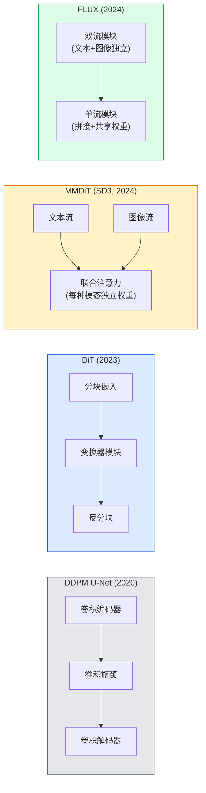

# 扩散变换器与校正流（Diffusion Transformers & Rectified Flow）

> U-Net 并非扩散的秘密。将其替换为变换器，将噪声调度（noise schedule）换成直线流（straight-line flow），你就突然得到了 SD3、FLUX 以及所有 2026 年的文生图模型。

**类型：** 学习 + 构建  
**语言：** Python  
**前置知识：** 第4阶段第10课（扩散 DDPM）、第4阶段第14课（ViT）、第7阶段第2课（自注意力）  
**时间：** 约 75 分钟  

## 学习目标

- 追溯从 U-Net DDPM（第10课）到扩散变换器（Diffusion Transformer, DiT）、MMDiT（SD3）以及单流+双流 DiT（FLUX）的演变过程  
- 解释校正流（rectified flow）：为何噪声与数据之间的直线轨迹能让模型用20步而非1000步采样  
- 实现一个微型 DiT 模块和一个校正流训练循环，两者均不超过100行代码  
- 根据架构、参数量和许可协议区分模型变体（SD3、FLUX.1-dev、FLUX.1-schnell、Z-Image、Qwen-Image）

## 问题

第10课构建了一个基于 U-Net 去噪器的 DDPM。这套方案在2020-2023年占主导地位：U-Net + 贝塔调度（beta schedule） + 噪声预测损失。它产生了 Stable Diffusion 1.5 和 2.1 以及 DALL-E 2。

而所有2026年最先进的文生图模型都已超越了它。Stable Diffusion 3、FLUX、SD4、Z-Image、Qwen-Image、Hunyuan-Image——没有一个使用 U-Net。它们都使用扩散变换器（DiT）。SD3 和 FLUX 还将 DDPM 的噪声调度替换为校正流（rectified flow），后者将噪声到数据的路径拉直，并通过一致性（consistency）或蒸馏（distilled）变体实现1-4步推理。

这一转变之所以重要，是因为它使得基于扩散的图像生成变得可控、提示准确（SD3/SD4 解决了文字渲染问题）且生产环境速度快。理解 DiT + 校正流就是理解2026年的生成式图像技术栈。

## 概念

### 从 U-Net 到变换器



- **DiT**（Peebles & Xie, 2023）—— 用类似 ViT 的变换器替换 U-Net，在潜在分块（latent patches）上操作。通过自适应层归一化（AdaLN）进行条件控制。
- **MMDiT**（SD3, Esser et al., 2024）—— 两条流，文本和图像令牌各自有独立权重，共享一个联合注意力。
- **FLUX**（Black Forest Labs, 2024）—— 前 N 个模块为双流（类似 SD3），后面的模块拼接并共享权重（单流），以实现更深层次的高效性。
- **Z-Image**（2025）—— 一个高效的6B参数量单流 DiT，挑战“不惜代价扩大规模”。

### 用一段话解释校正流

DDPM 将前向过程定义为带噪声的随机微分方程（SDE），其中 `x_t` 逐渐被破坏。学习到的反向过程是第二个 SDE，通过1000个小步求解。

校正流定义了干净数据与纯噪声之间的**直线**插值：

```
x_t = (1 - t) * x_0 + t * epsilon,     t in [0, 1]
```

训练网络预测速度 `v_theta(x_t, t) = epsilon - x_0` —— 即从干净数据到噪声的直线方向上的前向导数（`dx_t/dt`）。在采样时，你沿这个速度反向积分，以从噪声逐步走向数据。所得常微分方程（ODE）更接近于直线，因此采样所需的积分步数大大减少。

SD3 称之为**校正流匹配**。FLUX、Z-Image 以及大多数2026年的模型使用相同的目标函数。典型推理：20-30步欧拉方法（确定性） vs 旧 DDPM 方案中的50+步 DDIM。蒸馏/涡轮/快速（Schnell）/LCM 变体可降至1-4步。

### AdaLN 条件控制

DiT 通过**自适应层归一化**对时间步和类别/文本进行条件控制：从条件向量预测缩放（scale）和平移（shift），在 LayerNorm 之后应用。这比 U-Net 中的 FiLM 风格调制定理更干净，也是所有现代 DiT 的默认做法。

```
cond -> MLP -> (scale, shift, gate)
norm(x) * (1 + scale) + shift, then residual add * gate
```

### SD3 和 FLUX 中的文本编码器

- **SD3** 使用三个文本编码器：两个 CLIP 模型 + T5-XXL。嵌入拼接后作为文本条件输入图像流。
- **FLUX** 使用一个 CLIP-L + T5-XXL。
- **Qwen-Image / Z-Image** 变体使用各自内部开发的文本编码器，与其基础大语言模型对齐。

文本编码器是 SD3/FLUX 在提示理解上远优于 SD1.5 的重要原因。仅 T5-XXL 就有4.7B参数。

### 无分类器引导仍然有效

校正流改变的是采样器，不是条件控制。无分类器引导（训练时以10%概率丢弃文本，推理时混合有条件与无条件预测）在校正流中工作方式完全相同。大多数2026年的模型使用引导尺度3.5-5——低于 SD1.5 的7.5，因为校正流模型默认更紧密地遵循提示。

### 一致性（Consistency）、Turbo、Schnell、LCM

四个名字指的是同一件事：将慢速的多步模型蒸馏为快速的少步模型。

- **LCM（潜在一致性模型）** —— 训练一个学生模型，从任意中间步 `x_t` 一步预测最终 `x_0`。
- **SDXL Turbo / FLUX schnell** —— 通过对抗性扩散蒸馏训练的1-4步模型。
- **SD Turbo** —— 将 OpenAI 式的一致性模型适配到潜在扩散。

任何新模型的生产部署都会同时发布“全质量”检查点和“turbo / schnell”变体。Schnell（德语“快速”，Black Forest Labs 的命名惯例）可在1-4步内运行，适合实时流水线。

### 2026年模型格局

| 模型 | 参数量 | 架构 | 许可协议 |
|-------|------|--------------|---------|
| Stable Diffusion 3 Medium | 2B | MMDiT | SAI Community |
| Stable Diffusion 3.5 Large | 8B | MMDiT | SAI Community |
| FLUX.1-dev | 12B | 双流 + 单流 DiT | 非商业许可 |
| FLUX.1-schnell | 12B | 相同，蒸馏版 | Apache 2.0 |
| FLUX.2 | — | FLUX.1 迭代版 | 混合 |
| Z-Image | 6B | S3-DiT（可扩展单流 DiT） | 宽松许可 |
| Qwen-Image | ~20B | DiT + Qwen 文本塔 | Apache 2.0 |
| Hunyuan-Image-3.0 | ~80B | DiT | 研究许可 |
| SD4 Turbo | 3B | DiT + 蒸馏 | SAI Commercial |

FLUX.1-schnell 是2026年开源默认选择。Z-Image 是效率领先者。FLUX.2 和 SD4 是目前的质量标杆。

### 这次范式转变为何重要

DDPM + U-Net 有效。但 DiT + 校正流**更好、更快，且扩展更干净**。这一转变类似于 NLP 中从 RNN 到变换器的转变：两种架构解决了同一个问题，但变换器能够扩展并最终占据主导。2026年所有关于图像、视频或3D生成的论文都使用 DiT 形状的去噪器，并且通常使用校正流目标。U-Net DDPM 现在主要作为教学用途（第10课）。

## 动手构建

### 第1步：带 AdaLN 的 DiT 模块

```python
import torch
import torch.nn as nn


class AdaLNZero(nn.Module):
    """
    带有门控的自适应层归一化。从条件向量预测 (scale, shift, gate)。
    初始化使得整个模块从恒等映射开始（"零初始化"）。
    """

    def __init__(self, dim, cond_dim):
        super().__init__()
        self.norm = nn.LayerNorm(dim, elementwise_affine=False)
        self.mlp = nn.Linear(cond_dim, dim * 3)
        nn.init.zeros_(self.mlp.weight)
        nn.init.zeros_(self.mlp.bias)

    def forward(self, x, cond):
        scale, shift, gate = self.mlp(cond).chunk(3, dim=-1)
        h = self.norm(x) * (1 + scale.unsqueeze(1)) + shift.unsqueeze(1)
        return h, gate.unsqueeze(1)


class DiTBlock(nn.Module):
    def __init__(self, dim=192, heads=3, mlp_ratio=4, cond_dim=192):
        super().__init__()
        self.adaln1 = AdaLNZero(dim, cond_dim)
        self.attn = nn.MultiheadAttention(dim, heads, batch_first=True)
        self.adaln2 = AdaLNZero(dim, cond_dim)
        self.mlp = nn.Sequential(
            nn.Linear(dim, dim * mlp_ratio),
            nn.GELU(),
            nn.Linear(dim * mlp_ratio, dim),
        )

    def forward(self, x, cond):
        h, gate1 = self.adaln1(x, cond)
        a, _ = self.attn(h, h, h, need_weights=False)
        x = x + gate1 * a
        h, gate2 = self.adaln2(x, cond)
        x = x + gate2 * self.mlp(h)
        return x
```

`AdaLNZero` 从恒等映射开始，因为其 MLP 权重初始化为零。训练会将该模块从恒等推开；这极大地稳定了深层变换器扩散模型。

### 第2步：微型 DiT

```python
def timestep_embedding(t, dim):
    import math
    half = dim // 2
    freqs = torch.exp(-math.log(10000) * torch.arange(half, device=t.device) / half)
    args = t[:, None].float() * freqs[None]
    return torch.cat([args.sin(), args.cos()], dim=-1)


class TinyDiT(nn.Module):
    def __init__(self, image_size=16, patch_size=2, in_channels=3, dim=96, depth=4, heads=3):
        super().__init__()
        self.patch_size = patch_size
        self.num_patches = (image_size // patch_size) ** 2
        self.patch = nn.Conv2d(in_channels, dim, kernel_size=patch_size, stride=patch_size)
        self.pos = nn.Parameter(torch.zeros(1, self.num_patches, dim))
        self.time_mlp = nn.Sequential(
            nn.Linear(dim, dim * 2),
            nn.SiLU(),
            nn.Linear(dim * 2, dim),
        )
        self.blocks = nn.ModuleList([DiTBlock(dim, heads, cond_dim=dim) for _ in range(depth)])
        self.norm_out = nn.LayerNorm(dim, elementwise_affine=False)
        self.head = nn.Linear(dim, patch_size * patch_size * in_channels)

    def forward(self, x, t):
        n = x.size(0)
        x = self.patch(x)
        x = x.flatten(2).transpose(1, 2) + self.pos
        t_emb = self.time_mlp(timestep_embedding(t, self.pos.size(-1)))
        for blk in self.blocks:
            x = blk(x, t_emb)
        x = self.norm_out(x)
        x = self.head(x)
        return self._unpatchify(x, n)

    def _unpatchify(self, x, n):
        p = self.patch_size
        h = w = int(self.num_patches ** 0.5)
        x = x.view(n, h, w, p, p, -1).permute(0, 5, 1, 3, 2, 4).reshape(n, -1, h * p, w * p)
        return x
```

### 第3步：校正流训练

```python
import torch.nn.functional as F

def rectified_flow_train_step(model, x0, optimizer, device):
    model.train()
    x0 = x0.to(device)
    n = x0.size(0)
    t = torch.rand(n, device=device)
    epsilon = torch.randn_like(x0)
    x_t = (1 - t[:, None, None, None]) * x0 + t[:, None, None, None] * epsilon

    target_velocity = epsilon - x0
    pred_velocity = model(x_t, t)

    loss = F.mse_loss(pred_velocity, target_velocity)
    optimizer.zero_grad()
    loss.backward()
    optimizer.step()
    return loss.item()
```

与 DDPM 的噪声预测损失（第10课）相比：结构相同，目标不同。不再是预测噪声 `epsilon`，而是预测**速度** `epsilon - x_0`，该速度沿着直线插值从数据指向噪声。

### 第4步：欧拉采样器

校正流是一个 ODE。欧拉法是最简单的，对于一个训练良好的校正流模型，在20步以上时其精度几乎与高阶求解器相当。

```python
@torch.no_grad()
def rectified_flow_sample(model, shape, steps=20, device="cpu"):
    model.eval()
    x = torch.randn(shape, device=device)
    dt = 1.0 / steps
    t = torch.ones(shape[0], device=device)
    for _ in range(steps):
        v = model(x, t)
        x = x - dt * v
        t = t - dt
    return x
```

仅20步。在训练好的模型上，这能产生与1000步 DDPM 相当的样本。

### 第5步：端到端快速测试

```python
import numpy as np

def synthetic_blobs(num=200, size=16, seed=0):
    rng =