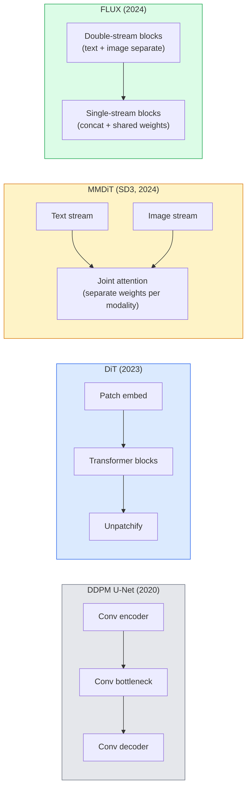

# 扩散变压器和整流流

> U-Net并不是传播的秘密。用Transformer替换它，将噪音表替换为直线流，突然间您就拥有了SD 3、FLOX和每个2026年文本到图像模型。

** 类型：** 学习+构建
** 语言：** Python
** 先决条件：** 第4阶段第10课（扩散DDPM）、第4阶段第14课（ViT）、第7阶段第02课（自我注意）
** 时间：** ~75分钟

## 学习目标

- 追踪从U-Net DDPM（第10课）到扩散Transformer（DiT）、MMDiT（SD 3）和单+双流DiT（FLOX）的演变
- 解释纠正的流程：为什么噪音和数据之间的直线轨迹让模型分20步而不是1000步进行抽样
- 实施一个微型DiT模块和一个整流流培训回路，两者均低于100条线路
- 通过架构、参数计数和许可区分模型变体（SD 3、FLOX.1-dev、FLOX.1-schnell、Z-Image、Qwen-Image）

## 问题

第10课使用U-Net降噪器构建DDPM。这个配方主导了2020-2023年：U-Net + Beta时间表+噪音预测损失。它产生了稳定扩散1.5和2.1以及DALL-E 2。

每一款2026年最先进的文本到图像模型都超越了它。Stable Distribution 3、FLOX、SD 4、Z-Image、Qwen-Image、Hunyuan-Image -都没有使用U-Net。他们使用扩散变形金刚（DiT）。SD 3和FLOX还将DDPM噪音调度替换为已纠正的流量，这理顺了从噪音到数据的路径，并实现具有一致性或提取变体的1-4步推断。

这种转变很重要，因为这是基于扩散的图像生成变得可控、预算准确（SD 3/SD 4解决文本渲染）和快速生产的原因。了解DiT +纠正流就是了解2026年生成图像堆栈。

## 概念

### 从U-Net到Transformer



- **DiT**（Peebles & Xie，2023）-在潜在补丁上用类似ViT的Transformer替换U-Net。通过自适应层规范（AdaLN）进行调节。
- **MMDiT**（SD 3，Esser等人，2024年）-两个流具有共同关注的文本和图像标记的单独权重。
- ** FLOX **（黑森林实验室，2024年）-前N个块像SD 3一样双流，后面的块级联并共享权重（单流）以提高更高深度的效率。
- **Z-Image**（2025）-6 B参数的高效单流DiT，挑战“不惜一切代价进行规模化”。

### 一段中的纠正流程

DDPM将转发过程定义为一个有噪音的收件箱，其中“x_t”日益损坏。学习到的反向是第二次迭代，通过1000个小步骤来解决。

整流流定义了干净数据和纯噪声之间的 ** 直线 ** 插值：

```
x_t = (1 - t) * x_0 + t * epsilon,     t in [0, 1]
```

训练网络以预测速度' v_theta（x_t，t）='-沿着从干净数据到噪音的直线路径的正向（' Dx_t/dt '）。在采样过程中，您将此速度向后积分，以从噪音转向数据。由此产生的ODE更接近直线，因此采样所需的集成步骤更少。

SD 3将其称为 ** 纠正流匹配 **。FLOX、Z-Image和大多数2026年型号使用相同的目标。典型推断：20-30个欧拉步骤（确定性）与旧DDPM机制中的50+ DDIM步骤。蒸馏/涡轮/ schnell /RCM变体将其减少到1-4个步骤。

### AdaLN条件反射

DiTs通过 **adaptive layer norm** 对时间步长和类/文本进行调节：从调节向量预测“scale”和“shift”，并在LayerNorm之后应用它们。比U-Nets中的FiLM风格调制更清晰，也是每个现代DiT的默认设置。

```
cond -> MLP -> (scale, shift, gate)
norm(x) * (1 + scale) + shift, then residual add * gate
```

### SD 3和FLOX中的文本编码器

- ** SD 3 ** 使用三种文本编码器：两个CLIP型号+ T5-XXL。嵌入作为文本条件连接并反馈到图像流。
- ** FLOX ** 使用一个CLIP-L + T5-XXL。
- **Qwen-Image / Z-Image** 变体使用与其基本LLM对齐的内部文本编码器。

文本编码器是SD 3/FLOX关于提示的原因比SD 1.5好得多的重要原因。仅T5-XXL就为4.7B参数。

### 无分类指导仍然有效

调整后的流量改变了采样器，而不是调节。无分类器指导（在训练期间以10%的概率删除文本，在推理时混合有条件和无条件预测）与纠正流程相同。大多数2026年模型使用指导量表3.5-5 -低于SD 1.5的7.5，因为整流流模型默认情况下更严格地遵循提示。

### 一致性、涡轮、Schnell、RCM

同一想法的四个名字：将缓慢的多步模型简化为快速的几步模型。

- ** RCM（潜在一致性模型）** -训练学生一步从任何中间“x_t”预测最终的“x_0”。
- **SDXL Turbo /FLOX schnell** -使用对抗扩散蒸馏训练的1-4步模型。
- **SD Turbo** — OpenAI-style Consistency Models adapted to latent diffusion.

生产服务的任何新型号的船舶都是一个“全质量”的检查站和一个“涡轮/施内尔”的变种。Schnell（德语中的“快速”，黑森林实验室的惯例）运行在1-4个步骤中，适合实时管道。

### 2026年模型格局

| Model | 大小 | 架构 | 许可证 |
|-------|------|--------------|---------|
| 稳定扩散3中等 | 2B | MMDiT | SAI社区 |
| 稳定扩散3.5大 | 8B | MMDiT | SAI Community |
| FLUX.1-dev | 12B | 双+单流DiT | 非商业 |
| FLUX.1-schnell | 12B | 相同，蒸馏 | Apache 2.0 |
| FLOX.2 | - | 迭代的FLOX.1 | 混合 |
| Z图像 | 6B | S3-DiT（可扩展单流） | 许可 |
| Qwen-Image | ~ 20 B | DiT + Qwen文本塔 | Apache 2.0 |
| 浑源-图像-3.0 | ~ 80 B | DiT | research |
| SD 4涡轮增压 | 3B | DiT +蒸馏 | SAI商业 |

FLOX.1-schnell是2026年开源默认版本。Z-Image是效率领导者。FLOX.2和SD 4是当前的质量提示。

### 为什么这种移很重要

DDPM + U-Net有效。DiT +已纠正的流程工作 ** 更好、更快，扩展得更干净 **。这种转变与NLP中从RNN到变压器的转变相似：两种架构都解决了相同的问题，但变压器进行了扩展并现在占据主导地位。每一篇关于图像、视频或3D生成的2026年论文都使用DiT形降噪器，通常是矫正流目标。U-Net DDPM现在主要用于教学（第10课）。

## 建设党

### 第1步：使用AdaLN进行DiT阻滞

```python
import torch
import torch.nn as nn


class AdaLNZero(nn.Module):
    """
    Adaptive LayerNorm with a gate. Predicts (scale, shift, gate) from the conditioning.
    Init such that the whole block starts as identity ("zero init").
    """

    def __init__(self, dim, cond_dim):
        super().__init__()
        self.norm = nn.LayerNorm(dim, elementwise_affine=False)
        self.mlp = nn.Linear(cond_dim, dim * 3)
        nn.init.zeros_(self.mlp.weight)
        nn.init.zeros_(self.mlp.bias)

    def forward(self, x, cond):
        scale, shift, gate = self.mlp(cond).chunk(3, dim=-1)
        h = self.norm(x) * (1 + scale.unsqueeze(1)) + shift.unsqueeze(1)
        return h, gate.unsqueeze(1)


class DiTBlock(nn.Module):
    def __init__(self, dim=192, heads=3, mlp_ratio=4, cond_dim=192):
        super().__init__()
        self.adaln1 = AdaLNZero(dim, cond_dim)
        self.attn = nn.MultiheadAttention(dim, heads, batch_first=True)
        self.adaln2 = AdaLNZero(dim, cond_dim)
        self.mlp = nn.Sequential(
            nn.Linear(dim, dim * mlp_ratio),
            nn.GELU(),
            nn.Linear(dim * mlp_ratio, dim),
        )

    def forward(self, x, cond):
        h, gate1 = self.adaln1(x, cond)
        a, _ = self.attn(h, h, h, need_weights=False)
        x = x + gate1 * a
        h, gate2 = self.adaln2(x, cond)
        x = x + gate2 * self.mlp(h)
        return x
```

“AdaLNZero”最初是身份映射，因为其MLP权重被初始化为零。培训将区块从身份上推离;这极大地稳定了深度Transformer扩散模型。

### 第2步：微小的DIT

```python
def timestep_embedding(t, dim):
    import math
    half = dim // 2
    freqs = torch.exp(-math.log(10000) * torch.arange(half, device=t.device) / half)
    args = t[:, None].float() * freqs[None]
    return torch.cat([args.sin(), args.cos()], dim=-1)


class TinyDiT(nn.Module):
    def __init__(self, image_size=16, patch_size=2, in_channels=3, dim=96, depth=4, heads=3):
        super().__init__()
        self.patch_size = patch_size
        self.num_patches = (image_size // patch_size) ** 2
        self.patch = nn.Conv2d(in_channels, dim, kernel_size=patch_size, stride=patch_size)
        self.pos = nn.Parameter(torch.zeros(1, self.num_patches, dim))
        self.time_mlp = nn.Sequential(
            nn.Linear(dim, dim * 2),
            nn.SiLU(),
            nn.Linear(dim * 2, dim),
        )
        self.blocks = nn.ModuleList([DiTBlock(dim, heads, cond_dim=dim) for _ in range(depth)])
        self.norm_out = nn.LayerNorm(dim, elementwise_affine=False)
        self.head = nn.Linear(dim, patch_size * patch_size * in_channels)

    def forward(self, x, t):
        n = x.size(0)
        x = self.patch(x)
        x = x.flatten(2).transpose(1, 2) + self.pos
        t_emb = self.time_mlp(timestep_embedding(t, self.pos.size(-1)))
        for blk in self.blocks:
            x = blk(x, t_emb)
        x = self.norm_out(x)
        x = self.head(x)
        return self._unpatchify(x, n)

    def _unpatchify(self, x, n):
        p = self.patch_size
        h = w = int(self.num_patches ** 0.5)
        x = x.view(n, h, w, p, p, -1).permute(0, 5, 1, 3, 2, 4).reshape(n, -1, h * p, w * p)
        return x
```

### 第3步：纠正流程培训

```python
import torch.nn.functional as F

def rectified_flow_train_step(model, x0, optimizer, device):
    model.train()
    x0 = x0.to(device)
    n = x0.size(0)
    t = torch.rand(n, device=device)
    epsilon = torch.randn_like(x0)
    x_t = (1 - t[:, None, None, None]) * x0 + t[:, None, None, None] * epsilon

    target_velocity = epsilon - x0
    pred_velocity = model(x_t, t)

    loss = F.mse_loss(pred_velocity, target_velocity)
    optimizer.zero_grad()
    loss.backward()
    optimizer.step()
    return loss.item()
```

与DDPM的噪音预测损失（第10课）相比：相同的结构，不同的目标。我们不是预测噪音“”，而是预测 ** 速度 **'- x_0 '，它沿着直线插值从数据指向噪音。

### 第4步：欧拉采样器

纠正的流程是一个ODE。欧拉方法是最简单的，并且对于训练有素的整流流模型来说，在20多个步骤中几乎与更高级的求解器一样准确。

```python
@torch.no_grad()
def rectified_flow_sample(model, shape, steps=20, device="cpu"):
    model.eval()
    x = torch.randn(shape, device=device)
    dt = 1.0 / steps
    t = torch.ones(shape[0], device=device)
    for _ in range(steps):
        v = model(x, t)
        x = x - dt * v
        t = t - dt
    return x
```

20 步在经过训练的模型上，这会产生与1000步DDPM相当的样本。

### 步骤5：端到端烟雾测试

```python
import numpy as np

def synthetic_blobs(num=200, size=16, seed=0):
    rng = np.random.default_rng(seed)
    out = np.zeros((num, 3, size, size), dtype=np.float32)
    yy, xx = np.meshgrid(np.arange(size), np.arange(size), indexing="ij")
    for i in range(num):
        cx, cy = rng.uniform(4, size - 4, size=2)
        r = rng.uniform(2, 4)
        mask = (xx - cx) ** 2 + (yy - cy) ** 2 < r ** 2
        colour = rng.uniform(-1, 1, size=3)
        for c in range(3):
            out[i, c][mask] = colour[c]
    return torch.from_numpy(out)
```

通过纠正的流程培训“TinyDiT”。500步后，采样输出应该看起来像微弱的彩色斑点。

## 使用它

对于使用FLOX/SD 3/ Z-Image生成真实图像，“扩散器”为每个扩散器提供了统一的API：

```python
from diffusers import FluxPipeline, StableDiffusion3Pipeline
import torch

pipe = FluxPipeline.from_pretrained(
    "black-forest-labs/FLUX.1-schnell",
    torch_dtype=torch.bfloat16,
).to("cuda")

out = pipe(
    prompt="a golden retriever surfing a tsunami, hyperrealistic, studio lighting",
    guidance_scale=0.0,           # schnell was trained without CFG
    num_inference_steps=4,
    max_sequence_length=256,
).images[0]
out.save("surf.png")
```

三行。“FLOX.1-schnell”分为四个步骤。将模型ID替换为“black-forest-labs/FLOX.1-dev”，以获得使用CGM的20-30步更高的质量。

对于SD 3：

```python
pipe = StableDiffusion3Pipeline.from_pretrained(
    "stabilityai/stable-diffusion-3.5-large",
    torch_dtype=torch.bfloat16,
).to("cuda")
out = pipe(prompt, guidance_scale=3.5, num_inference_steps=28).images[0]
```

## 把它运

本课产生：

- '输出/prompt-dit-model-picker.md '-在给定质量、延迟和许可证限制的情况下，在SD 3、FLOX.1-dev、Z-Image、SD 4 Turbo之间进行选择。
- '输出/skill-rectified-flow-trainer.md '-使用AdaLN DiT和欧拉采样为纠正流编写完整的训练循环。

## 演习

1. **（简单）** 在合成斑点数据集上训练上面的TinyDiT 500个步骤。比较采用10、20和50个欧拉步骤产生的样本。
2. **（中等）** 通过将学习的类嵌入连接到时间嵌入（按颜色划分的10个斑点“类”）来添加文本条件处理。使用0级、5级和9级进行采样并验证颜色匹配。
3. **（硬）** 计算从相同规模网络的整流流和DDPM版本生成的样本之间的Fréchet距离（DID代理），这些网络在相同数据上训练相同步骤数。收敛得更快的报告。

## 关键术语

| Term | 别人怎么说 | 它实际上意味着什么 |
|------|----------------|----------------------|
| DiT | “扩散Transformer” | 取代U-Net作为扩散降噪器的Transformer;对补丁潜伏物进行操作 |
| 阿达林 | “自适应层规范” | 在LayerNorm之后应用，通过学习的音阶、位移、门进行时步/文本条件反射;每个现代DiT的标准 |
| MMDiT | “多模式DiT（SD 3）” | 共享共同自我关注的文本和图像代币的单独权重流 |
| 单流/双流 | “通量技巧” | 前N个块是双流（每个模式单独的权重），后来块是单流（集中+共享权重）以提高效率 |
| 整顿流程 | “直线噪音对数据” | 数据和噪音之间的线性插值;网络预测速度;推理时所需的ODE步骤更少 |
| 速度目标 | “- x_0” | 纠正流中的回归目标;从干净数据到噪音的点 |
| CFG guidance | “无分类指南” | 混合有条件和无条件预测;仍然用于整流流模型 |
| 施内尔/涡轮/RCM | “1-4步蒸馏” | 从全质量模型中提取的小步骤变体;实时生产 |

## 进一步阅读

- [带有变形金刚的可扩展扩散模型（Peebles & Xie，2023）]（https：//arxiv.org/ab/2212.09748）-DiT论文
- [缩放整流流变压器（Esser等人，SD 3论文）]（https：//arxiv.org/ab/2403.03206）- MMDiT和大规模整流
- [FLOX.1模型卡和技术报告（黑森林实验室）]（https：//huggingface.co/black-forest-lass/FLOX.1-dev）- double + single-stream详情
- [Z-Image：高效图像生成基础模型（2025）]（https：//arxiv.org/html/2511.22699v1）-6 B的单流DiT
- [阐明扩散的设计空间（卡拉斯等人，2022）]（https：//arxiv.org/abs/2206.00364）-每个扩散设计权衡的参考
- [潜在一致性模型（Luo等人，2023）]（https：//arxiv.org/ab/2310.04378）-LCM-LoRA如何为您提供4步推断
