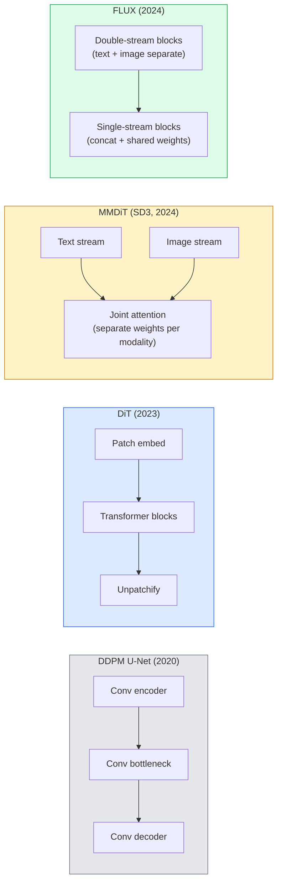

# 扩散 Transformer 与 Rectified Flow

> U-Net 并非扩散的秘密。用 transformer 替换它，将噪声调度交换为直线流，你突然就得到了 SD3、FLUX 以及每一个 2026 年的文生图模型。

**类型：** 学习 + 构建
**语言：** Python
**前置条件：** 阶段 4 第 10 课（扩散 DDPM），阶段 4 第 14 课（ViT），阶段 7 第 02 课（自注意力）
**时间：** ~75 分钟

## 学习目标

- 追踪从 U-Net DDPM（第 10 课）到 Diffusion Transformer（DiT）、MMDiT（SD3）以及单+双流 DiT（FLUX）的演进
- 解释 rectified flow：为什么噪声和数据之间的直线轨迹能让模型在 20 步而不是 1000 步内采样
- 实现一个微型 DiT 块和一个 rectified-flow 训练循环，两者都在 100 行以内
- 通过架构、参数量和许可区分模型变体（SD3、FLUX.1-dev、FLUX.1-schnell、Z-Image、Qwen-Image）

## 问题

第 10 课构建了一个带有 U-Net 降噪器的 DDPM。这个配方主导了 2020-2023 年：U-Net + beta 调度 + 噪声预测损失。它产生了 Stable Diffusion 1.5 和 2.1 以及 DALL-E 2。

每一个 2026 年的 SOTA 文生图模型都已超越它。Stable Diffusion 3、FLUX、SD4、Z-Image、Qwen-Image、Hunyuan-Image——没有一个使用 U-Net。它们使用 Diffusion Transformer（DiT）。SD3 和 FLUX 还将 DDPM 噪声调度替换为 rectified flow，这拉直了从噪声到数据的路径，并通过一致性或蒸馏变体实现了 1-4 步推理。

这一转变之所以重要，是因为它是扩散图像生成变得可控、提示准确（SD3/SD4 解决了文本渲染）且生成快速的原因。理解 DiT + rectified flow 就是理解 2026 年的生成图像堆栈。

## 概念

### 从 U-Net 到 transformer


```mermaid
flowchart LR
    subgraph UNET["DDPM U-Net (2020)"]
        U1["Conv encoder"] --> U2["Conv bottleneck"] --> U3["Conv decoder"]
    end
    subgraph DIT["DiT (2023)"]
        D1["Patch embed"] --> D2["Transformer blocks"] --> D3["Unpatchify"]
    end
    subgraph MMDIT["MMDiT (SD3, 2024)"]
        M1["Text stream"] --> M3["Joint attention<br/>(separate weights per modality)"]
        M2["Image stream"] --> M3
    end
    subgraph FLUX["FLUX (2024)"]
        F1["Double-stream blocks<br/>(text + image separate)"] --> F2["Single-stream blocks<br/>(concat + shared weights)"]
    end

    style UNET fill:#e5e7eb,stroke:#6b7280
    style DIT fill:#dbeafe,stroke:#2563eb
    style MMDIT fill:#fef3c7,stroke:#d97706
    style FLUX fill:#dcfce7,stroke:#16a34a
```

- **DiT**（Peebles & Xie, 2023）——用类似 ViT 的 transformer 替换 U-Net，在潜在 patch 上操作。通过自适应层归一化（AdaLN）进行条件化。
- **MMDiT**（SD3, Esser 等人, 2024）——两个流，文本和图像 token 使用独立的权重，共享联合注意力。
- **FLUX**（Black Forest Labs, 2024）——前 N 块为双流（类似 SD3），后块拼接并共享权重（单流），在更大深度下提高效率。
- **Z-Image**（2025）——一个高效的 6B 参数单流 DiT，挑战"不惜一切代价扩展"的理念。

### Rectified flow（一句话概括）

DDPM 将前向过程定义为噪声 SDE，其中 `x_t` 逐渐被破坏。学习的反向过程是第二个 SDE，通过 1000 个小步求解。

Rectified flow 定义了干净数据和纯噪声之间的**直线**插值：

```
x_t = (1 - t) * x_0 + t * epsilon,     t in [0, 1]
```

训练一个网络预测速度 `v_theta(x_t, t) = epsilon - x_0`——沿着从干净数据到噪声的直线路径的前向方向（`dx_t/dt`）。在采样过程中，你向后积分这个速度，从噪声向数据步进。得到的 ODE 更接近直线，因此需要少得多的积分步数来采样。

SD3 称之为 **Rectified Flow Matching**。FLUX、Z-Image 和大多数 2026 年模型使用相同的目标。典型推理：20-30 欧拉步（确定性的）对比旧 DDPM 方案中的 50+ DDIM 步。蒸馏 / turbo / schnell / LCM 变体将其降至 1-4 步。

### AdaLN 条件化

DiT 通过 **adaptive layer norm** 对时间步和类别/文本进行条件化：从条件化向量预测 `scale` 和 `shift`，并在 LayerNorm 后应用它们。比 U-Net 中的 FiLM 风格调制更干净，是每个现代 DiT 的默认选择。

```
cond -> MLP -> (scale, shift, gate)
norm(x) * (1 + scale) + shift, then residual add * gate
```

### SD3 和 FLUX 中的文本编码器

- **SD3** 使用三个文本编码器：两个 CLIP 模型 + T5-XXL。嵌入被拼接并作为文本条件馈送到图像流。
- **FLUX** 使用一个 CLIP-L + T5-XXL。
- **Qwen-Image / Z-Image** 变体使用它们自己的内部文本编码器，与其基础 LLM 对齐。

文本编码器是 SD3/FLUX 比 SD1.5 好得多的一个重要原因。仅 T5-XXL 就有 4.7B 参数。

### Classifier-free guidance 仍然有效

Rectified flow 改变了采样器，而不是条件化。Classifier-free guidance（训练时以 10% 的概率丢弃文本，推理时混合条件和非条件预测）与 rectified flow 相同。大多数 2026 年模型使用 guidance scale 3.5-5——低于 SD1.5 的 7.5，因为 rectified-flow 模型默认更紧密地遵循提示。

### Consistency、Turbo、Schnell、LCM

同一个想法的四个名称：将缓慢的多步模型蒸馏为快速的少步模型。

- **LCM（Latent Consistency Model）**——训练一个学生模型，从任何中间 `x_t` 一步预测最终的 `x_0`。
- **SDXL Turbo / FLUX schnell**——使用对抗性扩散蒸馏训练的 1-4 步模型。
- **SD Turbo**——适用于潜在扩散的 OpenAI 风格一致性模型。

任何新模型的生产部署都会同时提供"全质量"检查点和"turbo / schnell"变体。Schnell（德语"快"，Black Forest Labs 的惯例）在 1-4 步内运行，适用于实时流水线。

### 2026 年模型格局

| 模型 | 大小 | 架构 | 许可 |
|-------|------|--------------|---------|
| Stable Diffusion 3 Medium | 2B | MMDiT | SAI Community |
| Stable Diffusion 3.5 Large | 8B | MMDiT | SAI Community |
| FLUX.1-dev | 12B | 双 + 单流 DiT | 非商业 |
| FLUX.1-schnell | 12B | 相同，蒸馏 | Apache 2.0 |
| FLUX.2 | — | 迭代 FLUX.1 | 混合 |
| Z-Image | 6B | S3-DiT（可扩展单流） | 宽松 |
| Qwen-Image | ~20B | DiT + Qwen 文本塔 | Apache 2.0 |
| Hunyuan-Image-3.0 | ~80B | DiT | 研究 |
| SD4 Turbo | 3B | DiT + 蒸馏 | SAI Commercial |

FLUX.1-schnell 是 2026 年的开源默认选择。Z-Image 是效率领先者。FLUX.2 和 SD4 是当前的质量巅峰。

### 为什么这一阶段转变很重要

DDPM + U-Net 是有效的。DiT + rectified flow 效果**更好、更快、扩展更干净**。这一转变与 NLP 中从 RNN 到 transformer 的转变类似：两种架构解决了相同的问题，但 transformer 可扩展且现在占主导地位。2026 年关于图像、视频或 3D 生成的每篇论文都使用 DiT 形状的降噪器，通常使用 rectified flow 目标。U-Net DDPM 现在主要是教学性的（第 10 课）。

## 构建

### 步骤 1：带 AdaLN 的 DiT 块

```python
import torch
import torch.nn as nn


class AdaLNZero(nn.Module):
    """
    带门控的自适应 LayerNorm。从条件化中预测 (scale, shift, gate)。
    初始化使得整个块从恒等映射开始（"零初始化"）。
    """

    def __init__(self, dim, cond_dim):
        super().__init__()
        self.norm = nn.LayerNorm(dim, elementwise_affine=False)
        self.mlp = nn.Linear(cond_dim, dim * 3)
        nn.init.zeros_(self.mlp.weight)
        nn.init.zeros_(self.mlp.bias)

    def forward(self, x, cond):
        scale, shift, gate = self.mlp(cond).chunk(3, dim=-1)
        h = self.norm(x) * (1 + scale.unsqueeze(1)) + shift.unsqueeze(1)
        return h, gate.unsqueeze(1)


class DiTBlock(nn.Module):
    def __init__(self, dim=192, heads=3, mlp_ratio=4, cond_dim=192):
        super().__init__()
        self.adaln1 = AdaLNZero(dim, cond_dim)
        self.attn = nn.MultiheadAttention(dim, heads, batch_first=True)
        self.adaln2 = AdaLNZero(dim, cond_dim)
        self.mlp = nn.Sequential(
            nn.Linear(dim, dim * mlp_ratio),
            nn.GELU(),
            nn.Linear(dim * mlp_ratio, dim),
        )

    def forward(self, x, cond):
        h, gate1 = self.adaln1(x, cond)
        a, _ = self.attn(h, h, h, need_weights=False)
        x = x + gate1 * a
        h, gate2 = self.adaln2(x, cond)
        x = x + gate2 * self.mlp(h)
        return x
```

`AdaLNZero` 从恒等映射开始，因为其 MLP 权重被初始化为零。训练将块从恒等推离；这大大稳定了深层 transformer 扩散模型。

### 步骤 2：微型 DiT

```python
def timestep_embedding(t, dim):
    import math
    half = dim // 2
    freqs = torch.exp(-math.log(10000) * torch.arange(half, device=t.device) / half)
    args = t[:, None].float() * freqs[None]
    return torch.cat([args.sin(), args.cos()], dim=-1)


class TinyDiT(nn.Module):
    def __init__(self, image_size=16, patch_size=2, in_channels=3, dim=96, depth=4, heads=3):
        super().__init__()
        self.patch_size = patch_size
        self.num_patches = (image_size // patch_size) ** 2
        self.patch = nn.Conv2d(in_channels, dim, kernel_size=patch_size, stride=patch_size)
        self.pos = nn.Parameter(torch.zeros(1, self.num_patches, dim))
        self.time_mlp = nn.Sequential(
            nn.Linear(dim, dim * 2),
            nn.SiLU(),
            nn.Linear(dim * 2, dim),
        )
        self.blocks = nn.ModuleList([DiTBlock(dim, heads, cond_dim=dim) for _ in range(depth)])
        self.norm_out = nn.LayerNorm(dim, elementwise_affine=False)
        self.head = nn.Linear(dim, patch_size * patch_size * in_channels)

    def forward(self, x, t):
        n = x.size(0)
        x = self.patch(x)
        x = x.flatten(2).transpose(1, 2) + self.pos
        t_emb = self.time_mlp(timestep_embedding(t, self.pos.size(-1)))
        for blk in self.blocks:
            x = blk(x, t_emb)
        x = self.norm_out(x)
        x = self.head(x)
        return self._unpatchify(x, n)

    def _unpatchify(self, x, n):
        p = self.patch_size
        h = w = int(self.num_patches ** 0.5)
        x = x.view(n, h, w, p, p, -1).permute(0, 5, 1, 3, 2, 4).reshape(n, -1, h * p, w * p)
        return x
```

### 步骤 3：Rectified flow 训练

```python
import torch.nn.functional as F

def rectified_flow_train_step(model, x0, optimizer, device):
    model.train()
    x0 = x0.to(device)
    n = x0.size(0)
    t = torch.rand(n, device=device)
    epsilon = torch.randn_like(x0)
    x_t = (1 - t[:, None, None, None]) * x0 + t[:, None, None, None] * epsilon

    target_velocity = epsilon - x0
    pred_velocity = model(x_t, t)

    loss = F.mse_loss(pred_velocity, target_velocity)
    optimizer.zero_grad()
    loss.backward()
    optimizer.step()
    return loss.item()
```

与 DDPM 的噪声预测损失（第 10 课）相比：相同的结构，不同的目标。不是预测噪声 `epsilon`，而是预测**速度** `epsilon - x_0`，它沿着直线插值从数据指向噪声。

### 步骤 4：欧拉采样器

Rectified flow 是一个 ODE。欧拉方法是最简单的，对于一个训练良好的 rectified-flow 模型，在 20 步以上几乎与高阶求解器一样精确。

```python
@torch.no_grad()
def rectified_flow_sample(model, shape, steps=20, device="cpu"):
    model.eval()
    x = torch.randn(shape, device=device)
    dt = 1.0 / steps
    t = torch.ones(shape[0], device=device)
    for _ in range(steps):
        v = model(x, t)
        x = x - dt * v
        t = t - dt
    return x
```

20 步。在训练好的模型上，这产生可与 1000 步 DDPM 媲美的样本。

### 步骤 5：端到端冒烟测试

```python
import numpy as np

def synthetic_blobs(num=200, size=16, seed=0):
    rng = np.random.default_rng(seed)
    out = np.zeros((num, 3, size, size), dtype=np.float32)
    yy, xx = np.meshgrid(np.arange(size), np.arange(size), indexing="ij")
    for i in range(num):
        cx, cy = rng.uniform(4, size - 4, size=2)
        r = rng.uniform(2, 4)
        mask = (xx - cx) ** 2 + (yy - cy) ** 2 < r ** 2
        colour = rng.uniform(-1, 1, size=3)
        for c in range(3):
            out[i, c][mask] = colour[c]
    return torch.from_numpy(out)
```

用 rectified flow 在此数据上训练 `TinyDiT`。500 步后，采样输出看起来像模糊的颜色斑点。

## 使用

对于使用 FLUX / SD3 / Z-Image 的真实图像生成，`diffusers` 以统一 API 提供每一个：

```python
from diffusers import FluxPipeline, StableDiffusion3Pipeline
import torch

pipe = FluxPipeline.from_pretrained(
    "black-forest-labs/FLUX.1-schnell",
    torch_dtype=torch.bfloat16,
).to("cuda")

out = pipe(
    prompt="a golden retriever surfing a tsunami, hyperrealistic, studio lighting",
    guidance_scale=0.0,           # schnell 是在没有 CFG 的情况下训练的
    num_inference_steps=4,
    max_sequence_length=256,
).images[0]
out.save("surf.png")
```

三行代码。`FLUX.1-schnell` 四步完成。将模型 ID 替换为 `black-forest-labs/FLUX.1-dev` 可在大约 20-30 步内获得更高质量（使用 CFG）。

对于 SD3：

```python
pipe = StableDiffusion3Pipeline.from_pretrained(
    "stabilityai/stable-diffusion-3.5-large",
    torch_dtype=torch.bfloat16,
).to("cuda")
out = pipe(prompt, guidance_scale=3.5, num_inference_steps=28).images[0]
```

## 交付

本课产出：

- `outputs/prompt-dit-model-picker.md`——根据质量、延迟和许可约束选择 SD3、FLUX.1-dev、FLUX.1-schnell、Z-Image、SD4 Turbo。
- `outputs/skill-rectified-flow-trainer.md`——编写一个带有 AdaLN DiT 和欧拉采样的完整 rectified flow 训练循环。

## 练习

1. **（简单）** 在上述合成 blob 数据集上训练 TinyDiT 500 步。比较使用 10、20 和 50 欧拉步产生的样本。
2. **（中等）** 通过将学习到的类别嵌入与时间嵌入拼接来添加文本条件化（10 个按颜色的 blob "类别"）。使用类别 0、5 和 9 采样并验证颜色匹配。
3. **（困难）** 计算在相同数据上训练相同步数的 rectified-flow 和 DDPM 版本的相同大小网络所生成样本之间的 Fréchet 距离（FID 代理）。报告哪个收敛更快。

## 关键术语

| 术语 | 人们说的 | 实际含义 |
|------|----------------|----------------------|
| DiT | "扩散 transformer" | 取代 U-Net 作为扩散降噪器的 transformer；在 patchified 潜在表示上操作 |
| AdaLN | "自适应层归一化" | 通过学习的 scale、shift、gate 在 LayerNorm 后应用的时间步/文本条件化；每个现代 DiT 的标准 |
| MMDiT | "多模态 DiT（SD3）" | 文本和图像 token 的独立权重流，共享联合自注意力 |
| 单流 / 双流 | "FLUX 技巧" | 前 N 块双流（每模态独立权重），后块单流（拼接 + 共享权重）以提高效率 |
| Rectified flow | "从噪声到数据的直线" | 数据和噪声之间的线性插值；网络预测速度；推理时需要的 ODE 步数更少 |
| 速度目标 | "epsilon - x_0" | rectified flow 中的回归目标；从干净数据指向噪声 |
| CFG guidance | "classifier-free guidance" | 混合条件和非条件预测；仍在 rectified-flow 模型中使用 |
| Schnell / turbo / LCM | "1-4 步蒸馏" | 从全质量模型蒸馏的少步变体；生产实时 |

## 延伸阅读

- [可扩展扩散模型与 Transformer（Peebles & Xie, 2023）](https://arxiv.org/abs/2212.09748)——DiT 论文
- [扩展 Rectified Flow Transformer（Esser 等人, SD3 论文）](https://arxiv.org/abs/2403.03206)——大规模 MMDiT 和 rectified flow
- [FLUX.1 模型卡和技术报告（Black Forest Labs）](https://huggingface.co/black-forest-labs/FLUX.1-dev)——双 + 单流细节
- [Z-Image：高效图像生成基础模型（2025）](https://arxiv.org/html/2511.22699v1)——6B 单流 DiT
- [阐明扩散的设计空间（Karras 等人, 2022）](https://arxiv.org/abs/2206.00364)——每个扩散设计权衡的参考
- [潜在一致性模型（Luo 等人, 2023）](https://arxiv.org/abs/2310.04378)——LCM-LoRA 如何实现 4 步推理
