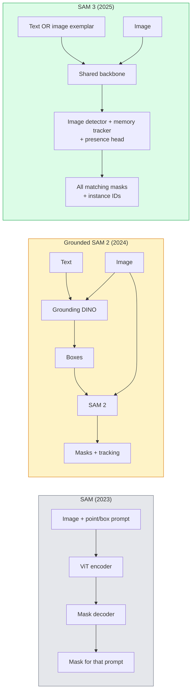

# SAM 3 & Open-Vocabulary Segmentation

> model に text prompt と image を渡すと、matching object すべての masks が得られる。SAM 3 はそれを single forward pass にした。

**種別:** Use + Build
**言語:** Python
**前提条件:** Phase 4 Lesson 07 (U-Net), Phase 4 Lesson 08 (Mask R-CNN), Phase 4 Lesson 18 (CLIP)
**所要時間:** 約60分

## 学習目標

- SAM (visual prompts only)、Grounded SAM / SAM 2 (detector + SAM)、SAM 3 (Promptable Concept Segmentation による native text prompts) を区別する
- SAM 3 architecture を説明する。shared backbone + image detector + memory-based video tracker + presence head + decoupled detector-tracker design
- Hugging Face `transformers` の SAM 3 integration を使い、text-prompted detection、segmentation、video tracking を行う
- latency、concept complexity、deployment target に基づいて SAM 3、Grounded SAM 2、YOLO-World、SAM-MI を選ぶ

## 問題

2023 年の SAM は visual-prompt-only model だった。point を click するか box を描くと mask を返す。"この写真の oranges を全部出して" には、box を生成する detector (Grounding DINO) と、それぞれを segment する SAM が必要だった。Grounded SAM はこれを pipeline にしたが、2 つの frozen models の cascade であり、error accumulation は避けられなかった。

SAM 3 (Meta, Nov 2025, ICLR 2026) は cascade を潰した。短い noun phrase または image exemplar を prompt として受け取り、matching masks と instance IDs を single forward pass で返す。これが **Promptable Concept Segmentation (PCS)** である。2026 年 3 月の Object Multiplex update (SAM 3.1) と組み合わせると、同じ concept の multiple instances を video 内で効率よく tracking できる。

この lesson は、この構造変化について扱う。2D seg、detection、text-image grounding は 1 つの model に統合された。本番での問いはもはや「どの pipeline を chain するか」ではなく、「どの promptable model が use case を end-to-end で扱うか」である。

## コンセプト

### 3 つの世代



### Promptable Concept Segmentation

"concept prompt" は短い noun phrase (`"yellow school bus"`, `"striped red umbrella"`, `"hand holding a mug"`) または image exemplar である。model は、concept に一致する image 内のすべての instance に対する segmentation masks と、match ごとの unique instance ID を返す。

これは classic visual-prompt SAM と 3 つの点で異なる。

1. instance ごとの prompting が不要。1 つの text prompt がすべての matches を返す。
2. Open-vocabulary。concept は natural language で記述できるものなら何でもよい。
3. prompt ごとに 1 mask ではなく、multiple instances を一度に返す。

### architecture の主要要素

- **Shared backbone** — single ViT が image を処理する。detector head と memory-based tracker の両方がそこから読む。
- **Presence head** — concept が image 内に存在するかを予測する。"is this here?" と "where is it?" を分離し、存在しない concepts の false positives を減らす。
- **Decoupled detector-tracker** — image-level detection と video-level tracking が separate heads を持ち、互いに干渉しない。
- **Memory bank** — video tracking のために frame 間で instance ごとの features を保存する (SAM 2 と同じ mechanism)。

### scale した training

SAM 3 は、AI + human review で iterative に annotate / correct する data engine により生成された **4 million unique concepts** で学習された。新しい **SA-CO benchmark** は 270K unique concepts を含み、従来の open-vocab benchmarks の 50x である。SAM 3 は SA-CO 上で human performance の 75-80% に達し、image + video PCS で既存 systems を 2 倍にする。

### SAM 3.1 Object Multiplex

2026 年 3 月 update: **Object Multiplex** は、同じ concept の多数の instances を同時に joint tracking する shared-memory mechanism を導入した。以前は N instances を tracking するには N 個の separate memory banks が必要だった。Multiplex はそれを per-instance queries 付きの 1 つの shared memory にまとめる。その結果、accuracy を犠牲にせず multi-object tracking が大幅に速くなる。

### 2026 年でも Grounded SAM が重要な場面

- 特定の open-vocabulary detector (DINO-X, Florence-2) を差し替える必要があるとき。
- SAM 3 license (HF 上の gated access) が blocker になるとき。
- SAM 3 が expose する以上に detector threshold を制御したいとき。
- detector component の research / ablation work。

Modular pipelines にもまだ場所はある。大半の本番作業では、SAM 3 がより単純な答えである。

### YOLO-World vs SAM 3

- **YOLO-World** — open-vocabulary detector only (masks なし)。Real-time。high fps で boxes が必要なときに最適。
- **SAM 3** — full segmentation + tracking。遅いが output が豊か。

Production split: robotics navigation や fast dashboards のような fast detection-only pipelines には YOLO-World、masks や tracking が必要なものには SAM 3。

### SAM-MI の効率

SAM-MI (2025-2026) は SAM の decoder bottleneck に対処する。主な idea:

- **Sparse point prompting** — dense prompts ではなく、少数のよく選ばれた points を使う。decoder calls を 96% 削減する。
- **Shallow mask aggregation** — rough mask predictions を 1 つの sharper mask に merge する。
- **Decoupled mask injection** — decoder が再実行ではなく pre-computed mask features を受け取る。

結果として、open-vocabulary benchmarks で Grounded-SAM より約 1.6x speedup する。

### 出力形式 for the three models

どれも同じ一般構造 (boxes + labels + scores + masks + IDs) を返すため便利である。downstream pipeline はどの model が走ったかで分岐する必要がない。

## 実装

### Step 1: prompt construction

user sentence を SAM 3 concept prompts の list に変換する helper を作る。これは「user が typed したもの」と「model が consume するもの」の境界である。

```python
def split_concepts(sentence):
    """
    Heuristic splitter for multi-concept prompts.
    Returns list of short noun phrases.
    """
    for sep in [",", ";", "and", "or", "&"]:
        if sep in sentence:
            parts = [p.strip() for p in sentence.replace("and ", ",").split(",")]
            return [p for p in parts if p]
    return [sentence.strip()]

print(split_concepts("cats, dogs and balloons"))
```

SAM 3 は forward pass ごとに 1 concept を受け付ける。multi-concept queries では loop または batch 化する。

### Step 2: post-processing helpers

SAM 3 の raw outputs を、Phase 4 Lesson 16 pipeline contract に一致する clean な detections list に変換する。

```python
from dataclasses import dataclass
from typing import List

@dataclass
class ConceptDetection:
    concept: str
    instance_id: int
    box: tuple          # (x1, y1, x2, y2)
    score: float
    mask_rle: str       # run-length encoded


def rle_encode(binary_mask):
    flat = binary_mask.flatten().astype("uint8")
    runs = []
    prev, count = flat[0], 0
    for v in flat:
        if v == prev:
            count += 1
        else:
            runs.append((int(prev), count))
            prev, count = v, 1
    runs.append((int(prev), count))
    return ";".join(f"{v}x{c}" for v, c in runs)
```

RLE は many high-resolution masks でも response payload を小さく保つ。同じ format は SAM 2、SAM 3、Grounded SAM 2 で使える。

### Step 3: 統一 open-vocab segmentation interface

利用可能な backend (SAM 3, Grounded SAM 2, YOLO-World + SAM 2) を単一 method の背後に wrap する。backend が変わっても downstream code は変わらない。

```python
from abc import ABC, abstractmethod
import numpy as np

class OpenVocabSeg(ABC):
    @abstractmethod
    def detect(self, image: np.ndarray, concept: str) -> List[ConceptDetection]:
        ...


class StubOpenVocabSeg(OpenVocabSeg):
    """
    Deterministic stub used for pipeline testing when real models are not loaded.
    """
    def detect(self, image, concept):
        h, w = image.shape[:2]
        return [
            ConceptDetection(
                concept=concept,
                instance_id=0,
                box=(w * 0.2, h * 0.3, w * 0.5, h * 0.8),
                score=0.89,
                mask_rle="0x100;1x50;0x200",
            ),
            ConceptDetection(
                concept=concept,
                instance_id=1,
                box=(w * 0.55, h * 0.25, w * 0.85, h * 0.75),
                score=0.74,
                mask_rle="0x80;1x40;0x220",
            ),
        ]
```

実際の `SAM3OpenVocabSeg` subclass は `transformers.Sam3Model` と `Sam3Processor` を wrap する。

### Step 4: Hugging Face SAM 3 の使い方 (reference)

実際の model では、`transformers` integration を使う。

```python
from transformers import Sam3Processor, Sam3Model
import torch

processor = Sam3Processor.from_pretrained("facebook/sam3")
model = Sam3Model.from_pretrained("facebook/sam3").eval()

inputs = processor(images=pil_image, return_tensors="pt")
inputs = processor.set_text_prompt(inputs, "yellow school bus")

with torch.no_grad():
    outputs = model(**inputs)

masks = processor.post_process_masks(
    outputs.masks, inputs.original_sizes, inputs.reshaped_input_sizes
)
boxes = outputs.boxes
scores = outputs.scores
```

1 prompt で、すべての matches が 1 call で返る。

### Step 5: Grounded SAM 2 が提供していたものを測る

正直な benchmark: real pipeline で Grounded SAM 2 を SAM 3 に置き換えると何が起きるか。

- Latency: SAM 3 は separate detector がないため 1 forward pass を節約するが、model 自体は重い。通常は net-neutral またはわずかな speedup。
- Accuracy: SAM 3 は rare または compositional concepts ("striped red umbrella") で大幅に良い。common single-word concepts では同程度。
- Flexibility: Grounded SAM 2 は detectors (DINO-X, Florence-2, Grounding DINO 1.5) を差し替えられる。SAM 3 は monolithic。

Conclusion: SAM 3 は 2026 年の open-vocab seg default である。detector flexibility や異なる license terms が必要な場合、Grounded SAM 2 がまだ正解である。

## 使い方

Production deployment patterns:

- **Real-time annotation** — SAM 3 + CVAT の label-as-text-prompt feature。Annotators が label name を選ぶと、SAM 3 が matching instances すべてを pre-label する。review して correct する。
- **Video analytics** — multi-object tracking には SAM 3.1 Object Multiplex。frames を memory-based tracker に渡す。
- **Robotics** — open-vocab manipulation ("pick up the red cup") に SAM 3 を使う。planning primitive として走る。
- **Medical imaging** — medical concepts で fine-tuned した SAM 3。HF 上で access request が必要。

Ultralytics は Python package 内で SAM 3 を wrap している。

```python
from ultralytics import SAM

model = SAM("sam3.pt")
results = model(image_path, prompts="yellow school bus")
```

YOLO と SAM 2 と同じ interface である。

## 成果物

この lesson は次を生成する:

- `outputs/prompt-open-vocab-stack-picker.md` — latency、concept complexity、licensing に基づいて SAM 3 / Grounded SAM 2 / YOLO-World / SAM-MI を選ぶ prompt。
- `outputs/skill-concept-prompt-designer.md` — user utterances を well-formed SAM 3 concept prompts に変換する skill (splitting, disambiguation, fallbacks)。

## 演習

1. **(Easy)** 任意に選んだ concept prompts で 10 images に SAM 3 を実行する。同じ images 上の SAM 2 + Grounding DINO 1.5 と比較し、各 model が見逃した concepts を報告する。
2. **(Medium)** SAM 3 の上に "click-to-include / click-to-exclude" UI を作る。text prompt が candidate instances を返し、user がどれを positive として count するかを click で選ぶ。最終 concept set を JSON として出力する。
3. **(Hard)** custom concept set (例: 5 types of electronic components) で、各 20 labelled images を使って SAM 3 を fine-tune する。同じ test set 上で zero-shot SAM 3 と比較し、mask IoU improvement を測る。

## 重要用語

| 用語 | よく言われる表現 | 実際の意味 |
|------|----------------|----------------------|
| Open-vocabulary segmentation | "Segment by text" | 固定 label set ではなく natural language で記述された objects の masks を生成する |
| PCS | "Promptable Concept Segmentation" | SAM 3 の core task。noun-phrase または image exemplar が与えられたら、matching instances すべてを segment する |
| Concept prompt | "The text input" | 短い noun phrase または image exemplar。full sentence ではない |
| Presence head | "Is it here?" | localisation の前に concept が image 内に存在するかを決める SAM 3 module |
| SA-CO | "SAM 3 benchmark" | 270K-concept open-vocabulary segmentation benchmark。従来の open-vocab benchmarks の 50x |
| Object Multiplex | "SAM 3.1 update" | Shared-memory multi-object tracking。多くの instances を高速に joint tracking する |
| Grounded SAM 2 | "Modular pipeline" | Detector + SAM 2 cascade。detector swap が重要なときはまだ relevant |
| SAM-MI | "Efficient SAM variant" | Grounded-SAM より 1.6x speedup する Mask Injection |

## 参考資料

- [SAM 3: Segment Anything with Concepts (arXiv 2511.16719)](https://arxiv.org/abs/2511.16719)
- [SAM 3.1 Object Multiplex (Meta AI, March 2026)](https://ai.meta.com/blog/segment-anything-model-3/)
- [SAM 3 model page on Hugging Face](https://huggingface.co/facebook/sam3)
- [Grounded SAM 2 tutorial (PyImageSearch)](https://pyimagesearch.com/2026/01/19/grounded-sam-2-from-open-set-detection-to-segmentation-and-tracking/)
- [Ultralytics SAM 3 docs](https://docs.ultralytics.com/models/sam-3/)
- [SAM3-I: Instruction-aware SAM (arXiv 2512.04585)](https://arxiv.org/abs/2512.04585)
