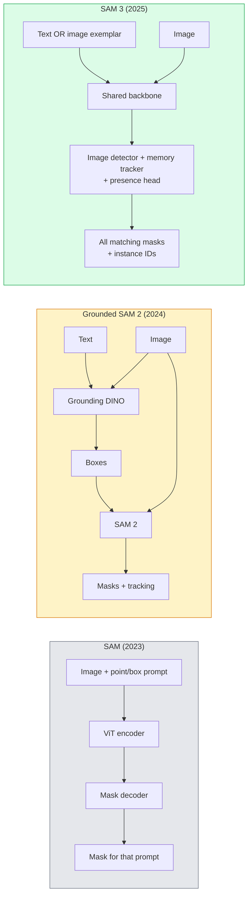

# SAM 3 ve Açık Kelime Segmentasyonu

> Bir modele bir prompt metni ve bir resim verin ve eşleşen her nesne için maskeler alın. SAM 3 bunu tek bir ileri geçiş yaptı.

**Tür:** Kullan + Oluştur
**Diller:** Python
**Önkoşullar:** Aşama 4 Ders 07 (U-Net), Aşama 4 Ders 08 (Maske R-CNN), Aşama 4 Ders 18 (CLIP)
**Süre:** ~60 dakika

## Öğrenme Hedefleri

- SAM'i (yalnızca görsel prompt'ler), Topraklanmış SAM / SAM 2'yi (dedektör + SAM) ve SAM 3'ü (Promptable Konsept Segmentasyonu aracılığıyla yerel metin prompt'ler) ayırt edin
- SAM 3 mimarisini açıklayın: paylaşılan omurga + görüntü algılayıcı + bellek tabanlı video izleyici + varlık kafası + ayrıştırılmış dedektör-izleyici tasarımı
- Metin-prompted algılama, segmentasyon ve video izleme için Hugging Face `transformers` SAM 3 entegrasyonunu kullanın
- Gecikme, konsept karmaşıklığı ve deployment hedefine göre SAM 3, Topraklanmış SAM 2, YOLO-World ve SAM-MI arasından seçim yapın

## Sorun

2023 SAM yalnızca görsel prompt modeliydi: bir noktayı tıklarsınız veya bir kutu çizersiniz ve bir maske döndürür. "Bu fotoğraftaki tüm portakalları bana ver" için kutuları üretmek için bir dedektöre (Topraklama DINO) ve ardından her birini segmentlere ayırmak için SAM'e ihtiyacınız vardı. Topraklanmış SAM bunu bir boru hattına dönüştürdü, ancak bu, kaçınılmaz hata birikimine sahip iki donmuş modelin bir dizisiydi.

SAM 3 (Meta, Kasım 2025, ICLR 2026) kademeyi çökertti. Kısa bir isim ifadesini veya bir görüntü örneğini prompt olarak kabul eder ve eşleşen tüm maskeleri ve örnek kimliklerini tek bir ileri geçişte döndürür. Yani **Promptable Konsept Segmentasyonu (PCS)**. Mart 2026 Object Multiplex güncellemesiyle (SAM 3.1) birleştirildiğinde, aynı konseptin birden fazla örneğini video aracılığıyla verimli bir şekilde izler.

Bu ders bunun temsil ettiği yapısal değişimle ilgilidir. 2D segment, algılama ve metin-görüntü topraklama tek bir modelde birleştirildi. Üretim sorusu artık "hangi boru hattını birbirine zincirleyeceğim" değil, "kullanım durumumu uçtan uca hangi promptable modelinin ele alacağı"dır.

## Konsept

### Üç kuşak



### Promptable Konsept Segmentasyonu

Bir "kavram prompt" kısa bir isim ifadesidir (`"yellow school bus"`, `"striped red umbrella"`, `"hand holding a mug"`) veya bir görüntü örneğidir. Model, görüntüdeki konseptle eşleşen her örnek için segmentasyon maskelerinin yanı sıra eşleşme başına benzersiz bir örnek kimliği döndürür.

Bu, klasik görsel-prompt SAM'den üç açıdan farklılık gösterir:

1. Örnek başına prompting gerekli değildir — tek bir metin prompt tüm eşleşmeleri döndürür.
2. Açık kelime dağarcığı — kavram, doğal dilde tanımlanabilen herhangi bir şey olabilir.
3. prompt başına bir maske yerine aynı anda birden fazla örneği döndürür.

### Önemli mimari parçalar

- **Paylaşılan omurga** — tek bir ViT görüntüyü işler. Hem dedektör kafası hem de hafıza tabanlı izleyici bundan okuyor.
- **Varlık kafası** — kavramın görüntüde mevcut olup olmadığını tahmin eder. Ayırıcılar "burası mı?" "nerede?" Eksik kavramlardaki yanlış pozitifleri azaltır.
- **Ayrılmış dedektör-izleyici** — görüntü düzeyinde algılama ve video düzeyinde izlemenin ayrı kafaları olduğundan müdahale etmezler.
- **Bellek bankası** — video izleme için kareler arasında örnek başına özellikleri depolar (kullanılan SAM 2 mekanizmasının aynısı).

### Geniş ölçekte eğitim

SAM 3, yapay zeka + insan incelemesini kullanarak tekrar tekrar açıklama ekleyen ve düzelten bir veri motoru tarafından oluşturulan **4 milyon benzersiz kavram** üzerinde eğitildi. Yeni **SA-CO benchmark**, önceki benchmark'lerden 50 kat daha büyük olan 270.000 benzersiz konsept içerir. SAM 3, SA-CO'da insan performansının %75-80'ine ulaşır ve görüntü + video PCS'de mevcut sistemleri iki katına çıkarır.

### SAM 3.1 Nesne Çoğullaması

Mart 2026 güncellemesi: **Object Multiplex**, aynı konseptin birçok örneğinin aynı anda ortak takibi için bir paylaşılan bellek mekanizması sunar. Önceden N örneğini izlemek, N ayrı bellek bankası anlamına geliyordu. Multiplex, örnek başına sorgularla bunu tek bir paylaşılan belleğe daraltır. Sonuç: doğruluktan ödün vermeden, çok daha hızlı çoklu nesne takibi.

### Topraklanmış SAM'in 2026'da hâlâ önemli olduğu yer

- Belirli bir açık kelime dedektörünün (DINO-X, Florence-2) değiştirilmesine ihtiyaç duyduğunuzda.
- SAM 3 lisansı (HF'ye geçişli) bir engelleyici olduğunda.
- Dedektör eşiği üzerinde SAM 3'ün ortaya çıkardığından daha fazla kontrole ihtiyaç duyduğunuzda.
- Dedektör bileşeni üzerinde araştırma/ablasyon çalışmaları için.

Modüler boru hatlarının hala bir yeri var. Çoğu üretim işi için SAM 3 daha basit bir cevaptır.

### YOLO-World vs SAM 3

- **YOLO-World** — yalnızca açık kelime dedektörü (maske yok). Gerçek zamanlı. Yüksek fps'de kutulara ihtiyacınız olduğunda en iyisi.
- **SAM 3** — tam segmentasyon + izleme. Daha yavaş ama daha zengin çıktı.

Üretim bölümü: Yalnızca hızlı algılamaya yönelik işlem hatları (robotik navigasyon, hızlı kontrol panelleri) için YOLO-World, maske veya izleme gerektiren her şey için SAM 3.

### SAM-MI verimliliği

SAM-MI (2025-2026), SAM'in kod çözücü darboğazını giderir. Anahtar fikirler:

- **Seyrek nokta prompting** — yoğun prompt'ler yerine iyi seçilmiş birkaç noktayı kullanır; Kod çözücü çağrılarını %96 oranında azaltır.
- **Sığ maske toplama** — kaba maske tahminlerini daha keskin bir maskede birleştirir.
- **Dekuplajlı maske enjeksiyonu** — Kod çözücü, yeniden çalıştırmak yerine önceden hesaplanmış maske özelliklerini alır.

Sonuç: Açık kelime hazinesi benchmark'lerde Grounded-SAM'e göre ~1,6 kat hızlanma.

### Üç model için çıktı formatı

Hepsi aynı genel yapıyı (kutular + etiketler + puanlar + maskeler + kimlikler) döndürür; bu da faydalıdır; satış hattınızın hangi modelin çalıştığı dallara ayrılması gerekmez.

## İnşa Et

### Adım 1: Prompt yapımı

Bir kullanıcı cümlesini SAM 3 konsepti prompt listesine dönüştüren bir yardımcı oluşturun. Bu, "kullanıcının yazdığı" ile "modelin tükettiği" arasındaki sınırdır.

```python
def split_concepts(sentence):
    """
    Heuristic splitter for multi-concept prompts.
    Returns list of short noun phrases.
    """
    for sep in [",", ";", "and", "or", "&"]:
        if sep in sentence:
            parts = [p.strip() for p in sentence.replace("and ", ",").split(",")]
            return [p for p in parts if p]
    return [sentence.strip()]

print(split_concepts("cats, dogs and balloons"))
```

SAM 3, ileri geçiş başına bir konsepti kabul eder; çok kavramlı sorgular için bunları döngüye alın veya toplu olarak kullanın.

### Adım 2: İşlem sonrası yardımcılar

SAM 3'ün ham çıktılarını, Aşama 4 Ders 16 satış hattı sözleşmemizle eşleşen temiz bir algılama listesine dönüştürün.

```python
from dataclasses import dataclass
from typing import List

@dataclass
class ConceptDetection:
    concept: str
    instance_id: int
    box: tuple          # (x1, y1, x2, y2)
    score: float
    mask_rle: str       # run-length encoded


def rle_encode(binary_mask):
    flat = binary_mask.flatten().astype("uint8")
    runs = []
    prev, count = flat[0], 0
    for v in flat:
        if v == prev:
            count += 1
        else:
            runs.append((int(prev), count))
            prev, count = v, 1
    runs.append((int(prev), count))
    return ";".join(f"{v}x{c}" for v, c in runs)
```

RLE, birçok yüksek çözünürlüklü maske için bile yanıt yükünü küçük tutar. Aynı format SAM 2, SAM 3 ve Topraklanmış SAM 2'de çalışır.

### Adım 3: Birleşik bir açık sözcük bölümleme arayüzü

Sahip olduğunuz arka uç (SAM 3, Grounded SAM 2, YOLO-World + SAM 2) tek bir yöntemin arkasına sarın. Arka uç değiştiğinde aşağı akış kodunuz değişmez.

```python
from abc import ABC, abstractmethod
import numpy as np

class OpenVocabSeg(ABC):
    @abstractmethod
    def detect(self, image: np.ndarray, concept: str) -> List[ConceptDetection]:
        ...


class StubOpenVocabSeg(OpenVocabSeg):
    """
    Deterministic stub used for pipeline testing when real models are not loaded.
    """
    def detect(self, image, concept):
        h, w = image.shape[:2]
        return [
            ConceptDetection(
                concept=concept,
                instance_id=0,
                box=(w * 0.2, h * 0.3, w * 0.5, h * 0.8),
                score=0.89,
                mask_rle="0x100;1x50;0x200",
            ),
            ConceptDetection(
                concept=concept,
                instance_id=1,
                box=(w * 0.55, h * 0.25, w * 0.85, h * 0.75),
                score=0.74,
                mask_rle="0x80;1x40;0x220",
            ),
        ]
```

Gerçek `SAM3OpenVocabSeg` alt sınıfı, `transformers.Sam3Model` ve `Sam3Processor`'yi saracaktır.

### Adım 4: Hugging Face SAM 3 kullanımı (referans)

Gerçek model için `transformers` entegrasyonu:

```python
from transformers import Sam3Processor, Sam3Model
import torch

processor = Sam3Processor.from_pretrained("facebook/sam3")
model = Sam3Model.from_pretrained("facebook/sam3").eval()

inputs = processor(images=pil_image, return_tensors="pt")
inputs = processor.set_text_prompt(inputs, "yellow school bus")

with torch.no_grad():
    outputs = model(**inputs)

masks = processor.post_process_masks(
    outputs.masks, inputs.original_sizes, inputs.reshaped_input_sizes
)
boxes = outputs.boxes
scores = outputs.scores
```

Bir prompt, tüm eşleşmeler tek bir aramada geri döndü.

### Adım 5: Grounded SAM 2'nin size ücretsiz olarak neler sağladığını ölçün

Dürüst bir benchmark: Gerçek bir üretim hattında Topraklanmış SAM 2'yi SAM 3 ile değiştirdiğinizde ne olur?

- Gecikme: SAM 3 bir ileri geçişten tasarruf sağlar (ayrı bir dedektör yoktur) ancak modelin kendisi daha ağırdır; genellikle net nötr veya hafif bir hızlanma.
- Doğruluk: SAM 3, nadir veya kompozisyon konseptlerinde ("çizgili kırmızı şemsiye") önemli ölçüde daha iyidir. Yaygın tek kelimeli kavramlara benzer.
- Esneklik: Topraklanmış SAM 2, dedektörleri değiştirmenizi sağlar (DINO-X, Florence-2, Topraklama DINO 1.5); SAM 3 yekparedir.

Sonuç: SAM 3, 2026 açık sözcük segmenti için varsayılandır. Topraklanmış SAM 2, dedektör esnekliğine veya farklı lisans koşullarına ihtiyaç duyduğunuzda hâlâ doğru yanıttır.

## Kullan onu

Üretim deployment modelleri:

- **Gerçek zamanlı açıklama** — SAM 3 + CVAT'ın metin olarak etiketleme prompt özelliği. Ek açıklamalar yapanlar bir etiket adı seçer; SAM 3, eşleşen her örneği önceden etiketler. İnceleyin ve düzeltin.
- **Video analitiği** — Çoklu nesne takibi için SAM 3.1 Object Multiplex; çerçeveleri bellek tabanlı izleyiciye besler.
- **Robotik** — Açık kelime manipülasyonu için SAM 3 ("kırmızı bardağı al"); planlama ilkesi olarak çalışır.
- **Tıbbi görüntüleme** — SAM 3, tıbbi konseptlere göre hassas şekilde ayarlanmıştır; HF'de erişim isteği gerektirir.

Ultralytics, SAM 3'ü Python paketinde paketliyor:

```python
from ultralytics import SAM

model = SAM("sam3.pt")
results = model(image_path, prompts="yellow school bus")
```

YOLO ve SAM 2 ile aynı arayüz.

## Gönderin

Bu ders şunları üretir:

- `outputs/prompt-open-vocab-stack-picker.md` — Gecikme, konsept karmaşıklığı ve lisanslamaya dayalı olarak SAM 3 / Grounded SAM 2 / YOLO-World / SAM-MI'yi seçen bir prompt.
- `outputs/skill-concept-prompt-designer.md` — kullanıcı ifadelerini iyi biçimlendirilmiş SAM 3 konsepti prompt'lere (bölme, belirsizliği giderme, geri dönüşler) dönüştüren bir beceri.

## Egzersizler

1. **(Kolay)** Seçtiğiniz prompt konseptiyle 10 görüntü üzerinde SAM 3'ü çalıştırın. Aynı görselleri SAM 2 + Topraklama DINO 1.5 ile karşılaştırın. Her modelin hangi kavramları kaçırdığını bildirin.
2. **(Orta)** SAM 3'ün üzerine bir "dahil etmek için tıklayın / hariç tutmak için tıklayın" kullanıcı arayüzü oluşturun: prompt metni aday örnekleri döndürür; Kullanıcı tıklamaları hangilerinin olumlu sayıldığını korur. Son konsept kümesinin çıktısını JSON olarak alın.
3. **(Sert)** Her biri 20 etiketli görüntü içeren özel bir konsept setinde (e.g. 5 tür elektronik bileşen) SAM 3'e ince ayar yapın. Aynı test setindeki sıfır atışlı SAM 3 ile karşılaştırın; maske IoU iyileştirmesini ölçün.

## Anahtar Terimler

| Dönem | İnsanlar ne diyor | Aslında ne anlama geliyor |
|------|----------------|----------------------|
| Açık kelime segmentasyonu | "Metne göre bölümlere ayır" | Sabit etiket seti değil, doğal dilde tanımlanan nesneler için maskeler üretin |
| adet | "Promptable Konsept Segmentasyonu" | SAM 3'ün temel görevi; bir isim cümlesi veya resim örneği verildiğinde eşleşen tüm örnekleri bölümlere ayırmak |
| Konsept prompt | "Metin girişi" | Kısa isim tamlaması veya resim örneği; tam bir cümle değil |
| Varlık başkanı | "Burada mı?" | Lokalizasyon öncesinde görselde konseptin var olup olmadığına karar veren SAM 3 modülü |
| SA-CO | "SAM 3 benchmark" | 270K konseptli açık kelime segmentasyonu benchmark; Önceki açık sözlü benchmark'lerden 50 kat daha büyük |
| Nesne Çoklu | "SAM 3.1 güncellemesi" | Paylaşılan bellekli çoklu nesne takibi; birçok örneğin hızlı ortak takibi |
| Topraklanmış SAM 2 | "Modüler boru hattı" | Dedektör + SAM 2 kademeli; Dedektör değişimi önemli olduğunda hâlâ geçerli |
| SAM-MI | "Verimli SAM çeşidi" | Grounded-SAM'e göre 1,6 kat hızlanma için Maske Enjeksiyonu |

## Daha Fazla Okuma

- [SAM 3: Her Şeyi Kavramlarla Bölümlere Ayırın (arXiv 2511.16719)](https://arxiv.org/abs/2511.16719)
- [SAM 3.1 Object Multiplex (Meta AI, Mart 2026)](https://ai.meta.com/blog/segment-anything-model-3/)
- [Sarılma Yüzündeki SAM 3 model sayfası](https://huggingface.co/facebook/sam3)
- [Topraklanmış SAM 2 öğreticisi (PyImageSearch)](https://pyimagesearch.com/2026/01/19/grounded-sam-2-from-open-set-detection-to-segmentation-and-tracking/)
- [Ultralytics SAM 3 belgeleri](https://docs.ultralytics.com/models/sam-3/)
- [SAM3-I: Talimatlara duyarlı SAM (arXiv 2512.04585)](https://arxiv.org/abs/2512.04585)
