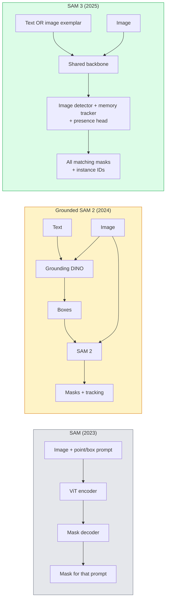

# Sam 3和开放词汇细分

> 为模型提供文本提示和图像，并获取每个匹配对象的面具。Sam 3使其成为单次向前传球。

** 类型：** 使用+构建
** 语言：** Python
** 先决条件：** 第4阶段第07课（U-Net）、第4阶段第08课（MaskR-CNN）、第4阶段第18课（CLIP）
** 时间：** ~60分钟

## 学习目标

- 区分Sam（仅限视觉提示）、固定Sam / Sam 2（检测器+ Sam）和Sam 3（通过可识别概念分割的本地文本提示）
- 解释SAM 3架构：共享主干+图像检测器+基于存储器的视频跟踪器+存在头+解耦检测器-跟踪器设计
- 使用Hugging Face“Transformers”Sam 3集成进行文本提示检测、分割和视频跟踪
- 根据延迟、概念复杂性和部署目标在Sam 3、Grounded Sam 2、YOLO-World和SAM-MI之间进行选择

## 问题

2023年的Sam是一个纯视觉提示模型：您单击一个点或绘制一个框，它会返回一个面具。为了“把这张照片中的所有橙子给我”，您需要一个探测器（接地DINO）来生产盒子，然后用Sam来分割每个盒子。接地的Sam将其变成了一个管道，但它是两个冻结模型的级联，不可避免地会积累错误。

Sam 3（Meta，2025年11月，ICLR 2026年）瓦解了这一级联反应。它接受简短的名词短语或图像样本作为提示，并在一次向前传递中返回所有匹配的面具和实例ID。即 ** 可预测的概念分割（PCS）**。结合2026年3月的对象多路更新（Sam 3.1），它可以通过视频高效地跟踪同一概念的多个实例。

This lesson is about the structural shift this represents. 2D seg, detection, and text-image grounding have merged into one model. The production question is no longer "which pipeline do I chain together" but "which promptable model handles my use case end-to-end."

## 概念

### 三代



### 可预见的概念细分

A "concept prompt" is a short noun phrase (`"yellow school bus"`, `"striped red umbrella"`, `"hand holding a mug"`) or an image exemplar. The model returns segmentation masks for every instance in the image that matches the concept, plus a unique instance ID per match.

这与经典的视觉提示式Sam有三个不同：

1. 无需按实例提示-一个文本提示返回所有匹配项。
2. 开放词汇-概念可以是自然语言中可以描述的任何东西。
3. 一次返回多个实例，而不是每个提示返回一个屏蔽。

### 关键建筑作品

- ** 共享主干 ** -单个ViT处理图像。探测器头和基于存储的跟踪器都从中读取。
- **Presence head** — predicts whether the concept is present in the image at all. Decouples "is this here?" from "where is it?". Reduces false positives on absent concepts.
- ** 脱钩的检测器-跟踪器 ** -图像级检测和视频级跟踪具有独立的头部，因此它们不会干扰。
- ** 内存库 ** -跨帧存储每个实例的特征以进行视频跟踪（使用与Sam 2相同的机制）。

### 大规模培训

SAM 3是在由数据引擎生成的 ** 400万个独特概念 ** 上训练的，该数据引擎使用人工智能+人工审查进行迭代注释和纠正。新的 **SA-CO基准 ** 包含27万个独特的概念，比以前的基准大50倍。SAM 3在SA-CO上达到了75-80%的人类性能，并在图像+视频PCS上使现有系统翻了一番。

### Sam 3.1对象多工

2026年3月更新：** 对象多重 ** 引入了共享内存机制，用于同时联合跟踪同一概念的许多实例。以前，跟踪N个实例意味着N个独立的存储库。Multiple通过每个实例查询将其折叠到一个共享内存中。结果：在不牺牲准确性的情况下大幅提高多对象跟踪速度。

### 2026年，接地的Sam仍然重要

- 当您需要换入特定的开放词汇检测器时（DINO-X，Florence-2）。
- 当Sam 3许可证（在HF上门控）是阻塞者时。
- 当您需要对检测器阈值的控制比Sam 3所暴露的更多时。
- 用于探测器组件的研究/消融工作。

模块化管道仍然有一席之地。对于大多数生产工作来说，Sam 3是更简单的答案。

### YOLO世界VS SAM 3

- **YOLO-World** -仅开放词汇检测器（无口罩）。实时的。当您需要高画幅的盒子时，最佳选择。
- **SAM 3** -完全分段+跟踪。更慢但更丰富的输出。

生产分成：YOLO-World用于快速检测的管道（机器人导航、快速仪表板），Sam 3用于任何需要口罩或跟踪的东西。

### SAM-MI效率

SAM-MI（2025-2026）解决了Sam的解码器瓶颈。关键思想：

- ** 稀疏点提示 ** -使用一些精心选择的点而不是密集提示;将解码器调用减少96%。
- ** 浅面具聚合 ** -将粗略的面具预测合并为一个更清晰的面具。
- ** 去耦合的屏蔽注入 ** -解码器接收预先计算的屏蔽特征，而不是重新运行。

结果：在开放词汇基准上，比Grounded-Sam加速约1.6倍。

### 三种模型的输出格式

所有返回相同的一般结构（框+标签+分数+面具+ID），这很有帮助-下游的管道不必在运行的模型上分支。

## 建设党

### 第1步：及时施工

构建一个帮助器，将用户句子转化为Sam 3概念提示列表。这是“用户输入的内容”与“模型消费的内容”的边界。

```python
def split_concepts(sentence):
    """
    Heuristic splitter for multi-concept prompts.
    Returns list of short noun phrases.
    """
    for sep in [",", ";", "and", "or", "&"]:
        if sep in sentence:
            parts = [p.strip() for p in sentence.replace("and ", ",").split(",")]
            return [p for p in parts if p]
    return [sentence.strip()]

print(split_concepts("cats, dogs and balloons"))
```

Sam 3每次向前传递接受一个概念;对于多概念查询，请循环或批处理它们。

### 第2步：后处理助手

将Sam 3的原始输出转化为与我们的第4阶段第16课管道合同相匹配的干净检测列表。

```python
from dataclasses import dataclass
from typing import List

@dataclass
class ConceptDetection:
    concept: str
    instance_id: int
    box: tuple          # (x1, y1, x2, y2)
    score: float
    mask_rle: str       # run-length encoded


def rle_encode(binary_mask):
    flat = binary_mask.flatten().astype("uint8")
    runs = []
    prev, count = flat[0], 0
    for v in flat:
        if v == prev:
            count += 1
        else:
            runs.append((int(prev), count))
            prev, count = v, 1
    runs.append((int(prev), count))
    return ";".join(f"{v}x{c}" for v, c in runs)
```

RLE即使对于许多高分辨率掩模也保持小的响应有效载荷。相同的格式适用于SAM 2、SAM 3和接地SAM 2。

### 第3步：统一的开放式语音分段界面

将您拥有的任何后台（Sam 3、Grounded Sam 2、YOLO-World + Sam 2）包装在一个方法后面。当后台发生变化时，您的下游代码不会发生变化。

```python
from abc import ABC, abstractmethod
import numpy as np

class OpenVocabSeg(ABC):
    @abstractmethod
    def detect(self, image: np.ndarray, concept: str) -> List[ConceptDetection]:
        ...


class StubOpenVocabSeg(OpenVocabSeg):
    """
    Deterministic stub used for pipeline testing when real models are not loaded.
    """
    def detect(self, image, concept):
        h, w = image.shape[:2]
        return [
            ConceptDetection(
                concept=concept,
                instance_id=0,
                box=(w * 0.2, h * 0.3, w * 0.5, h * 0.8),
                score=0.89,
                mask_rle="0x100;1x50;0x200",
            ),
            ConceptDetection(
                concept=concept,
                instance_id=1,
                box=(w * 0.55, h * 0.25, w * 0.85, h * 0.75),
                score=0.74,
                mask_rle="0x80;1x40;0x220",
            ),
        ]
```

真正的“SAM3OpenVocabSeg”子集将包装“transformers.Sam3Model”和“Sam3Process”。

### 第4步：拥抱脸Sam 3的使用（参考）

对于实际模型，“Transformers”集成：

```python
from transformers import Sam3Processor, Sam3Model
import torch

processor = Sam3Processor.from_pretrained("facebook/sam3")
model = Sam3Model.from_pretrained("facebook/sam3").eval()

inputs = processor(images=pil_image, return_tensors="pt")
inputs = processor.set_text_prompt(inputs, "yellow school bus")

with torch.no_grad():
    outputs = model(**inputs)

masks = processor.post_process_masks(
    outputs.masks, inputs.original_sizes, inputs.reshaped_input_sizes
)
boxes = outputs.boxes
scores = outputs.scores
```

一次提示，所有匹配都在一次调用中返回。

### Step 5: Measure what Grounded SAM 2 gave you for free

诚实的基准：当您在真正的管道中用Sam 3替换Grounded Sam 2时，会发生什么？

- 延迟：Sam 3节省了一次前向传递（没有单独的检测器），但模型本身更重;通常是网络中立或略有加速。
- 准确性：Sam 3在稀有或合成概念上表现得更好（“条纹红伞”）。常见的单字概念类似。
- 灵活性：接地SAM 2允许您交换探测器（DINO-X，Florence-2，Grounding DINO 1.5）; SAM 3是单片的。

结论：Sam 3是2026年开放式语音段的默认版本。当您需要检测器灵活性或不同的许可条款时，接地Sam 2仍然是正确的答案。

## 使用它

Production deployment patterns:

- ** 实时注释 ** - Sam 3 + CVAT的标签即文本提示功能。注释者选择标签名称; Sam 3预标记每个匹配的实例。审查并更正。
- ** 视频分析 ** - Sam 3.1对象多路传输，用于多对象跟踪;将帧反馈到基于内存的跟踪器。
- **Robotics** -用于开放式语音操作的Sam 3（“拿起红杯子”）;作为规划基元运行。
- ** 医疗成像 ** - Sam 3对医疗概念进行了微调;需要对高频进行访问请求。

Ultralytics将Sam 3包装在其Python包中：

```python
from ultralytics import SAM

model = SAM("sam3.pt")
results = model(image_path, prompts="yellow school bus")
```

与YOLO和Sam 2的界面相同。

## 把它运

本课产生：

- '输出/prompt-open-vocab-stack-picker.md '-根据延迟、概念复杂性和许可选择Sam 3 / Grounded Sam 2 / YOLO-World / SAM-MI的提示。
- '输出/skill-concept-prompt-designer.md '-一种将用户话语转化为格式良好的Sam 3概念提示（拆分、消除歧义、回退）的技能。

## 演习

1. **（简单）** 在10张图像上运行Sam 3，并带有您选择的概念提示。与相同图像上的Sam 2 + Grounding DINO 1.5进行比较。报告每个模型错过了哪些概念。
2. **（中等）** 在Sam 3顶部构建“点击包含/点击排除”UI：文本提示返回候选实例;用户单击将保留哪些实例算作正值。将最终的概念集输出为杨森。
3. **（硬）** 对自定义概念集（例如5种电子元件）进行微调，每个概念集有20个标记图像。与同一测试集上的零曝光Sam 3进行比较;测量面罩IoU改进。

## 关键术语

| Term | 别人怎么说 | 它实际上意味着什么 |
|------|----------------|----------------------|
| 开放词汇分段 | “按文本分段” | 为用自然语言描述的对象（而不是固定标签集）制作面具 |
| PCs | “可预见的概念细分” | Sam 3的核心任务-给定名词短语或图像样本，分割所有匹配实例 |
| 概念提示 | “文本输入” | 简短的名词短语或图像示例;不是完整的句子 |
| 在场负责人 | “在这里吗？" | Sam 3模块，在本地化之前决定该概念是否存在于图像中 |
| SA-CO | “Sam 3基准” | 270 K概念开放词汇细分基准;比之前的开放词汇基准大50倍 |
| 对象复用 | “Sam 3.1更新” | 共享记忆多目标跟踪;多实例快速联合跟踪 |
| 接地的Sam 2 | “模块化管道” | 检测器+ Sam 2级联;当检测器交换很重要时仍然重要 |
| SAM-MI | “高效的Sam变体” | 与Grounded-Sam相比，面具注入可加速1.6倍 |

## Further Reading

- [SAM 3：用概念细分任何内容（arXiv 2511.16719）]（https：//arxiv.org/ab/2511.16719）
- [SAM 3.1对象复用（Meta AI，2026年3月）]（https：//ai.meta.com/blog/segment-anything-model-3/）
- [SAM拥抱脸上的3个模型页面]（https：//huggingface.co/facebook/sam3）
- [Grounded Sam 2教程（PyImage Search）]（https：//pyimagesetts.com/2026/01/19/luded-sam-2-from-open-set-Detection-to-segmentation-and-Tracking/）
- [Ultralytics SAM 3 docs](https://docs.ultralytics.com/models/sam-3/)
- [ASM 3-I：指令感知型Sam（arXiv 2512.04585）]（https：//arxiv.org/ab/2512.04585）
