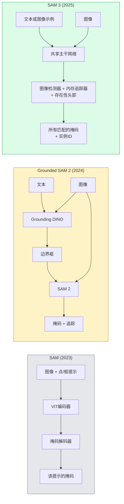

# SAM 3 & 开放词汇分割

> 给模型一个文本提示和一张图像，即可获得每个匹配对象的掩码。SAM 3 通过单次前向传播即可实现。

**类型：** 使用 + 构建
**语言：** Python
**前置条件：** 第4阶段第7课（U-Net）、第4阶段第8课（Mask R-CNN）、第4阶段第18课（CLIP）
**时长：** 约60分钟

## 学习目标

- 区分 SAM（仅视觉提示）、Grounded SAM / SAM 2（检测器 + SAM）和 SAM 3（通过提示性概念分割（Promptable Concept Segmentation）实现原生文本提示）
- 解释 SAM 3 架构：共享主干网络 + 图像检测器 + 基于内存的视频追踪器 + 存在性头部 + 解耦的检测器-追踪器设计
- 使用 Hugging Face `transformers` 的 SAM 3 集成实现文本提示的检测、分割和视频追踪
- 根据延迟、概念复杂度和部署目标，在 SAM 3、Grounded SAM 2、YOLO-World 和 SAM-MI 之间进行选择

## 问题

2023 年的 SAM 是一个仅支持视觉提示的模型：你点击一个点或绘制一个框，它返回一个掩码。对于“给我这张照片中所有橙子”的需求，你需要一个检测器（Grounding DINO）来生成框，然后 SAM 对每个框进行分割。Grounded SAM 将其变成了一个流程，但它是两个冻结模型的级联，不可避免地存在误差累积。

SAM 3（Meta，2025年11月，ICLR 2026）打破了级联结构。它接受一个短名词短语或一个图像示例作为提示，并在单次前向传播中返回所有匹配的掩码和实例 ID。这就是**提示性概念分割（Promptable Concept Segmentation，PCS）**。结合 2026 年 3 月的 Object Multiplex 更新（SAM 3.1），它可以高效地追踪视频中同一概念的多个实例。

本节课关注的是这一结构性转变。二维分割、检测和文本-图像定位已融合为一个模型。生产中的问题不再是“我要串联哪个流程”，而是“哪个可提示模型能端到端地处理我的用例”。

## 概念

### 三代模型



### 提示性概念分割（Promptable Concept Segmentation）

一个“概念提示”可以是一个短名词短语（如`"黄色校车"`、`"条纹红伞"`、`"握着杯子的手"`）或一个图像示例。模型会返回图像中所有匹配该概念的实例的分割掩码，并为每个匹配结果分配一个唯一的实例 ID。

这与经典的视觉提示 SAM 在三个方面不同：

1. 无需逐个实例提示——一个文本提示即可返回所有匹配结果。
2. 开放词汇——概念可以是自然语言描述的任何事物。
3. 一次性返回多个实例，而不是每个提示一个掩码。

### 关键架构组件

- **共享主干网络** —— 单个 ViT 处理图像。检测器头部和基于内存的追踪器都从中读取信息。
- **存在性头部** —— 预测概念是否存在于图像中。将“是否存在”与“在哪里”解耦。减少了对于不存在概念的误报。
- **解耦的检测器-追踪器** —— 图像级检测和视频级追踪有独立的头部，互不干扰。
- **内存库** —— 跨帧存储每个实例的特征，用于视频追踪（与 SAM 2 相同的机制）。

### 大规模训练

SAM 3 在**400万个独特概念**上训练而成，这些概念由一个数据引擎生成，该引擎结合 AI 和人工审核迭代地进行标注和修正。新的**SA-CO基准**包含 27 万个独特概念，比之前的基准大 50 倍。SAM 3 在 SA-CO 上达到了人类性能的 75-80%，并在图像和视频的 PCS 上使现有系统性能翻倍。

### SAM 3.1 Object Multiplex

2026 年 3 月更新：**Object Multiplex** 引入了一种共享内存机制，用于同时联合追踪同一概念的多个实例。此前，追踪 N 个实例需要 N 个独立的内存库。Multiplex 将其合并为一个共享内存，并通过每个实例的查询来实现。结果：在不牺牲准确性的前提下，大幅加快了多目标追踪速度。

### 2026 年 Grounded SAM 仍有用武之地

- 当你需要替换特定的开放词汇检测器（如 DINO-X、Florence-2）时。
- 当 SAM 3 的许可证（在 Hugging Face 上有门控）成为障碍时。
- 当你需要比 SAM 3 提供的检测器阈值更精细的控制时。
- 用于对检测器组件进行研究或消融实验时。

模块化流程仍有其位置。对于大多数生产工作，SAM 3 是更简单的答案。

### YOLO-World 与 SAM 3 对比

- **YOLO-World** —— 仅开放词汇检测器（无掩码）。实时。最适合高帧率下只需边界框的场景。
- **SAM 3** —— 完整的分割 + 追踪。速度较慢但输出更丰富。

生产分工：YOLO-World 用于快速检测流程（机器人导航、快速仪表盘），SAM 3 用于任何需要掩码或追踪的场景。

### SAM-MI 效率

SAM-MI（2025-2026）解决了 SAM 解码器的瓶颈。关键思路：

- **稀疏点提示** —— 使用几个精心选择的点代替密集提示；降低 96% 的解码器调用。
- **浅层掩码聚合** —— 将粗略的掩码预测合并成一个更清晰的掩码。
- **解耦掩码注入** —— 解码器接收预先计算的掩码特征，而不是重新运行。

结果：在开放词汇基准上比 Grounded-SAM 提速约 1.6 倍。

### 三种模型的输出格式

这三种模型都返回相同的一般结构（边界框 + 标签 + 分数 + 掩码 + ID），这很有帮助——下游流程无需根据运行的模型进行分支。

## 构建

### 步骤 1：提示构建

构建一个辅助函数，将用户输入的句子转换为 SAM 3 概念提示列表。这是“用户输入”与“模型消费”之间的边界。

```python
def split_concepts(sentence):
    """
    多概念提示的启发式分割器。
    返回短名词短语列表。
    """
    for sep in [",", ";", "and", "or", "&"]:
        if sep in sentence:
            parts = [p.strip() for p in sentence.replace("and ", ",").split(",")]
            return [p for p in parts if p]
    return [sentence.strip()]

print(split_concepts("cats, dogs and balloons"))
```

SAM 3 每次前向传播接受一个概念；对于多概念查询，循环或批量处理。

### 步骤 2：后处理辅助函数

将 SAM 3 的原始输出转换为干净的检测列表，以匹配第4阶段第16课的流程约定。

```python
from dataclasses import dataclass
from typing import List

@dataclass
class ConceptDetection:
    concept: str
    instance_id: int
    box: tuple          # (x1, y1, x2, y2)
    score: float
    mask_rle: str       # 游程编码


def rle_encode(binary_mask):
    flat = binary_mask.flatten().astype("uint8")
    runs = []
    prev, count = flat[0], 0
    for v in flat:
        if v == prev:
            count += 1
        else:
            runs.append((int(prev), count))
            prev, count = v, 1
    runs.append((int(prev), count))
    return ";".join(f"{v}x{c}" for v, c in runs)
```

RLE 即使对于许多高分辨率掩码也能保持响应负载小巧。同样的格式适用于 SAM 2、SAM 3、Grounded SAM 2。

### 步骤 3：统一的开放词汇分割接口

将所有后端（SAM 3、Grounded SAM 2、YOLO-World + SAM 2）包装在单个方法之后。后端改变时，下游代码无需更改。

```python
from abc import ABC, abstractmethod
import numpy as np

class OpenVocabSeg(ABC):
    @abstractmethod
    def detect(self, image: np.ndarray, concept: str) -> List[ConceptDetection]:
        ...


class StubOpenVocabSeg(OpenVocabSeg):
    """
    确定性桩，用于在真实模型未加载时进行流程测试。
    """
    def detect(self, image, concept):
        h, w = image.shape[:2]
        return [
            ConceptDetection(
                concept=concept,
                instance_id=0,
                box=(w * 0.2, h * 0.3, w * 0.5, h * 0.8),
                score=0.89,
                mask_rle="0x100;1x50;0x200",
            ),
            ConceptDetection(
                concept=concept,
                instance_id=1,
                box=(w * 0.55, h * 0.25, w * 0.85, h * 0.75),
                score=0.74,
                mask_rle="0x80;1x40;0x220",
            ),
        ]
```

真正的 `SAM3OpenVocabSeg` 子类将包装 `transformers.Sam3Model` 和 `Sam3Processor`。

### 步骤 4：Hugging Face SAM 3 使用（参考）

实际模型的 `transformers` 集成：

```python
from transformers import Sam3Processor, Sam3Model
import torch

processor = Sam3Processor.from_pretrained("facebook/sam3")
model = Sam3Model.from_pretrained("facebook/sam3").eval()

inputs = processor(images=pil_image, return_tensors="pt")
inputs = processor.set_text_prompt(inputs, "yellow school bus")

with torch.no_grad():
    outputs = model(**inputs)

masks = processor.post_process_masks(
    outputs.masks, inputs.original_sizes, inputs.reshaped_input_sizes
)
boxes = outputs.boxes
scores = outputs.scores
```

一个提示，所有匹配结果在一次调用中返回。

### 步骤 5：衡量 Grounded SAM 2 免费提供的优势

一个诚实的基准：在真实流程中用 SAM 3 替换 Grounded SAM 2 会发生什么？

- 延迟：SAM 3 节省了一次前向传播（无需单独的检测器），但模型本身更重；通常延迟持平或略有提升。
- 准确性：SAM 3 在处理罕见或组合概念（如“条纹红伞”）时明显更好。对于常见的单词语概念，两者相似。
- 灵活性：Grounded SAM 2 允许更换检测器（DINO-X、Florence-2、Grounding DINO 1.5）；SAM 3 是单一的。

结论：SAM 3 是 2026 年开放词汇分割的默认选择。当需要检测器灵活性或不同的许可条款时，Grounded SAM 2 仍然是正确答案。

## 使用

生产部署模式：

- **实时标注** —— SAM 3 + CVAT 的“文本标签即提示”功能。标注员选择一个标签名称；SAM 3 预标注每个匹配实例。然后审核和修正。
- **视频分析** —— SAM 3.1 Object Multiplex 用于多目标追踪；将帧送入基于内存的追踪器。
- **机器人技术** —— SAM 3 用于开放词汇操作（如“拿起红色杯子”）；作为规划原语运行。
- **医学影像** —— SAM 3 在医学概念上微调；需要在 Hugging Face 上提出访问请求。

Ultralytics 在其 Python 包中封装了 SAM 3：

```python
from ultralytics import SAM

model = SAM("sam3.pt")
results = model(image_path, prompts="yellow school bus")
```

与 YOLO 和 SAM 2 的接口相同。

## 交付

本课程产出：

- `outputs/prompt-open-vocab-stack-picker.md` —— 一个根据延迟、概念复杂度和许可协议，选择 SAM 3 / Grounded SAM 2 / YOLO-World / SAM-MI 的提示。
- `outputs/skill-concept-prompt-designer.md` —— 一个将用户话语转化为良好格式的 SAM 3 概念提示（分割、消歧、后备方案）的技能。

## 练习

1. **（简单）** 在你选择的 10 张图像上运行 SAM 3，使用你选择的概念提示。与同一图像上的 SAM 2 + Grounding DINO 1.5 进行比较。报告每个模型遗漏了哪些概念。
2. **（中等）** 在 SAM 3 之上构建一个“点击包含 / 点击排除”的界面：文本提示返回候选实例；用户点击保留哪些实例作为正例。将最终的概念集输出为 JSON。
3. **（困难）** 在自定义概念集（例如 5 种电子元件）上微调 SAM 3，每种元件 20 张标注图像。与零样本的 SAM 3 在同一测试集上进行比较；测量掩码 IoU 的提升。

## 关键术语

| 术语 | 人们常说的 | 实际含义 |
|------|-----------|----------|
| 开放词汇分割 | "通过文本分割" | 为自然语言描述的对象生成掩码，而不是固定的标签集 |
| PCS | "提示性概念分割" | SAM 3 的核心任务——给定名词短语或图像示例，分割所有匹配实例 |
| 概念提示 | "文本输入" | 短名词短语或图像示例；不是完整的句子 |
| 存在性头部 | "是否存在？" | SAM 3 的模块，在定位前决定概念是否存在于图像中 |
| SA-CO | "SAM 3 基准" | 包含 27 万个概念的开放词汇分割基准；比之前的开放词汇基准大 50 倍 |
| Object Multiplex | "SAM 3.1 更新" | 共享内存的多目标追踪；快速联合追踪多个实例 |
| Grounded SAM 2 | "模块化流程" | 检测器 + SAM 2 级联；在需要更换检测器时仍然有用 |
| SAM-MI | "高效 SAM 变体" | 掩码注入，比 Grounded-SAM 提速 1.6 倍 |

## 延伸阅读

- [SAM 3: Segment Anything with Concepts (arXiv 2511.16719)](https://arxiv.org/abs/2511.16719)
- [SAM 3.1 Object Multiplex (Meta AI, March 2026)](https://ai.meta.com/blog/segment-anything-model-3/)
- [Hugging Face 上的 SAM 3 模型页面](https://huggingface.co/facebook/sam3)
- [Grounded SAM 2 教程 (PyImageSearch)](https://pyimagesearch.com/2026/01/19/grounded-sam-2-from-open-set-detection-to-segmentation-and-tracking/)
- [Ultralytics SAM 3 文档](https://docs.ultralytics.com/models/sam-3/)
- [SAM3-I: Instruction-aware SAM (arXiv 2512.04585)](https://arxiv.org/abs/2512.04585)