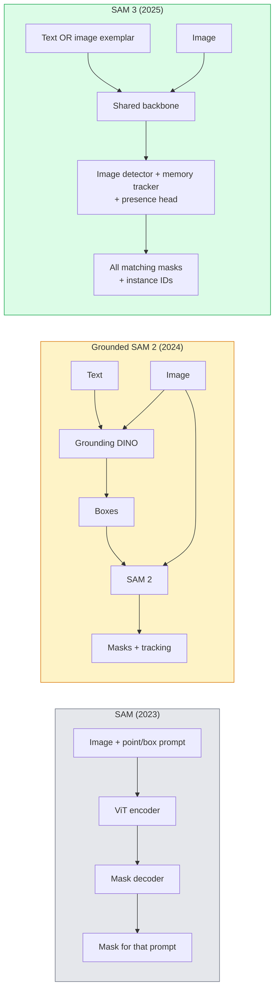

# 24 · SAM 3 与开放词汇分割

> 给模型一个文本提示和一张图像，就能得到每个匹配对象的掩码。SAM 3 把这件事压缩成了单次前向传播。

**类型：** 使用 + 构建
**语言：** Python
**前置：** 第 4 阶段第 07 课（U-Net）、第 4 阶段第 08 课（Mask R-CNN）、第 4 阶段第 18 课（CLIP）
**时长：** 约 60 分钟

## 学习目标

- 区分 SAM（仅视觉提示）、Grounded SAM / SAM 2（检测器 + SAM）与 SAM 3（通过「可提示概念分割（Promptable Concept Segmentation）」实现的原生文本提示）
- 阐释 SAM 3 架构：共享主干（shared backbone）+ 图像检测器 + 基于记忆的视频追踪器 + 存在性头（presence head）+ 解耦的「检测器-追踪器」设计
- 使用 Hugging Face `transformers` 的 SAM 3 集成进行文本提示检测、分割和视频追踪
- 根据延迟、概念复杂度和部署目标，在 SAM 3、Grounded SAM 2、YOLO-World 和 SAM-MI 之间做出选择

## 问题所在

2023 年的 SAM 是一个仅支持视觉提示的模型：你点一个点或画一个框，它返回一个掩码。对于「给我这张照片里所有的橙子」这类需求，你需要一个检测器（Grounding DINO）来产生边界框，然后用 SAM 逐个分割。Grounded SAM 把这个过程变成了一条流水线，但它本质上是两个冻结模型的级联，难免会累积误差。

SAM 3（Meta，2025 年 11 月，ICLR 2026）瓦解了这种级联。它接受一个简短的名词短语或一个图像示例（image exemplar）作为提示，并在单次前向传播中返回所有匹配的掩码和实例 ID。这就是「**可提示概念分割（Promptable Concept Segmentation，PCS）**」。结合 2026 年 3 月的 Object Multiplex 更新（SAM 3.1），它能高效地在视频中追踪同一概念的多个实例。

本课关注的是这一转变所代表的结构性变化。2D 分割、检测以及文本-图像对齐已经合并进了一个模型。生产环节要问的不再是「我该把哪些流水线串联起来」，而是「哪个可提示模型能端到端地处理我的用例」。

## 核心概念

### 三代模型



### 可提示概念分割

「概念提示（concept prompt）」是一个简短的名词短语（`"yellow school bus"`、`"striped red umbrella"`、`"hand holding a mug"`）或一个图像示例。模型会为图像中每一个匹配该概念的实例返回分割掩码，并为每个匹配项附上唯一的实例 ID。

这与经典的视觉提示版 SAM 在三个方面有所不同：

1. 无需逐实例提示——一个文本提示就能返回所有匹配项。
2. 开放词汇——概念可以是任何能用自然语言描述的东西。
3. 一次返回多个实例，而不是每个提示返回一个掩码。

### 关键架构组件

- **共享主干（shared backbone）**——单个 ViT 处理图像。检测器头和基于记忆的追踪器都从中读取。
- **存在性头（presence head）**——预测图像中是否存在该概念。把「东西在不在这里？」与「它在哪里？」解耦，从而减少对不存在概念的误报。
- **解耦的检测器-追踪器（decoupled detector-tracker）**——图像级检测和视频级追踪拥有各自独立的头部，互不干扰。
- **记忆库（memory bank）**——为视频追踪跨帧存储每个实例的特征（与 SAM 2 使用的机制相同）。

### 大规模训练

SAM 3 在 **400 万个唯一概念**上进行训练，这些概念由一套数据引擎生成——该引擎结合 AI + 人工审核进行迭代式标注与纠错。全新的 **SA-CO 基准**包含 27 万个唯一概念，规模是以往基准的 50 倍。SAM 3 在 SA-CO 上达到人类表现的 75%-80%，在图像 + 视频 PCS 上的成绩是现有系统的两倍。

### SAM 3.1 Object Multiplex

2026 年 3 月更新：**Object Multiplex** 引入了一种共享记忆机制，用于一次性联合追踪同一概念的众多实例。此前，追踪 N 个实例意味着 N 个独立的记忆库。Multiplex 将其折叠为一个共享记忆，配合每个实例独立的查询。结果是：在不牺牲精度的前提下，多对象追踪的速度大幅提升。

### 2026 年 Grounded SAM 仍有价值的场景

- 当你需要换入某个特定的开放词汇检测器（DINO-X、Florence-2）时。
- 当 SAM 3 的许可证（在 HF 上受限）成为阻碍时。
- 当你需要比 SAM 3 所暴露的检测器阈值更精细的控制时。
- 用于针对检测器组件的研究 / 消融实验。

模块化流水线仍有用武之地。但对大多数生产工作而言，SAM 3 是更简单的答案。

### YOLO-World 与 SAM 3

- **YOLO-World**——仅做开放词汇检测（无掩码）。实时性强。当你需要高帧率的边界框时最合适。
- **SAM 3**——完整的分割 + 追踪。更慢，但输出更丰富。

生产侧的分工：YOLO-World 用于快速的仅检测流水线（机器人导航、快速看板），SAM 3 用于任何需要掩码或追踪的场景。

### SAM-MI 的效率

SAM-MI（2025-2026）针对 SAM 的解码器瓶颈。核心思路：

- **稀疏点提示（sparse point prompting）**——使用少数几个精心挑选的点，而非密集提示；将解码器调用次数减少 96%。
- **浅层掩码聚合（shallow mask aggregation）**——将多个粗略的掩码预测合并为一个更清晰的掩码。
- **解耦掩码注入（decoupled mask injection）**——解码器接收预先计算好的掩码特征，而不必重新运行。

结果：在开放词汇基准上比 Grounded-SAM 提速约 1.6 倍。

### 三个模型的输出格式

它们都返回相同的通用结构（边界框 + 标签 + 分数 + 掩码 + ID），这很有帮助——你的下游流水线无需根据运行的是哪个模型而分支处理。

## 动手构建

### 第 1 步：构造提示

构建一个辅助函数，把用户的句子转换成一组 SAM 3 概念提示。这里是「用户输入了什么」与「模型消费什么」之间的边界。

```python
def split_concepts(sentence):
    """
    用于多概念提示的启发式切分器。
    返回简短名词短语的列表。
    """
    for sep in [",", ";", "and", "or", "&"]:
        if sep in sentence:
            parts = [p.strip() for p in sentence.replace("and ", ",").split(",")]
            return [p for p in parts if p]
    return [sentence.strip()]

print(split_concepts("cats, dogs and balloons"))
```

SAM 3 每次前向传播只接受一个概念；对于多概念查询，可循环或批量处理。

### 第 2 步：后处理辅助函数

把 SAM 3 的原始输出转换成一份干净的检测列表，使其符合我们在第 4 阶段第 16 课中确立的流水线契约。

```python
from dataclasses import dataclass
from typing import List

@dataclass
class ConceptDetection:
    concept: str
    instance_id: int
    box: tuple          # (x1, y1, x2, y2)
    score: float
    mask_rle: str       # 游程编码（run-length encoded）


def rle_encode(binary_mask):
    flat = binary_mask.flatten().astype("uint8")
    runs = []
    prev, count = flat[0], 0
    for v in flat:
        if v == prev:
            count += 1
        else:
            runs.append((int(prev), count))
            prev, count = v, 1
    runs.append((int(prev), count))
    return ";".join(f"{v}x{c}" for v, c in runs)
```

RLE 让响应负载即使在面对大量高分辨率掩码时也保持小巧。同一格式在 SAM 2、SAM 3、Grounded SAM 2 之间通用。

### 第 3 步：统一的开放词汇分割接口

把你手头的任何后端（SAM 3、Grounded SAM 2、YOLO-World + SAM 2）封装在单一方法之后。当后端发生变化时，你的下游代码不必改动。

```python
from abc import ABC, abstractmethod
import numpy as np

class OpenVocabSeg(ABC):
    @abstractmethod
    def detect(self, image: np.ndarray, concept: str) -> List[ConceptDetection]:
        ...


class StubOpenVocabSeg(OpenVocabSeg):
    """
    当真实模型未加载时，用于流水线测试的确定性桩（stub）。
    """
    def detect(self, image, concept):
        h, w = image.shape[:2]
        return [
            ConceptDetection(
                concept=concept,
                instance_id=0,
                box=(w * 0.2, h * 0.3, w * 0.5, h * 0.8),
                score=0.89,
                mask_rle="0x100;1x50;0x200",
            ),
            ConceptDetection(
                concept=concept,
                instance_id=1,
                box=(w * 0.55, h * 0.25, w * 0.85, h * 0.75),
                score=0.74,
                mask_rle="0x80;1x40;0x220",
            ),
        ]
```

真正的 `SAM3OpenVocabSeg` 子类会封装 `transformers.Sam3Model` 和 `Sam3Processor`。

### 第 4 步：Hugging Face SAM 3 用法（参考）

对于实际的模型，`transformers` 的集成如下：

```python
from transformers import Sam3Processor, Sam3Model
import torch

processor = Sam3Processor.from_pretrained("facebook/sam3")
model = Sam3Model.from_pretrained("facebook/sam3").eval()

inputs = processor(images=pil_image, return_tensors="pt")
inputs = processor.set_text_prompt(inputs, "yellow school bus")

with torch.no_grad():
    outputs = model(**inputs)

masks = processor.post_process_masks(
    outputs.masks, inputs.original_sizes, inputs.reshaped_input_sizes
)
boxes = outputs.boxes
scores = outputs.scores
```

一个提示，单次调用即返回所有匹配项。

### 第 5 步：衡量 Grounded SAM 2 曾经免费提供给你的东西

一次诚实的基准测试：当你在真实流水线中用 SAM 3 替换 Grounded SAM 2 时会发生什么？

- 延迟：SAM 3 省去了一次前向传播（无需独立的检测器），但模型本身更重；通常净效果持平或略有提速。
- 精度：在罕见或组合性概念（「striped red umbrella」）上，SAM 3 明显更好。在常见的单词概念上则相近。
- 灵活性：Grounded SAM 2 允许你替换检测器（DINO-X、Florence-2、Grounding DINO 1.5）；SAM 3 是单体式的。

结论：SAM 3 是 2026 年开放词汇分割的默认选择。当你需要检测器灵活性或不同的许可条款时，Grounded SAM 2 仍是正确答案。

## 实际运用

生产部署模式：

- **实时标注**——SAM 3 + CVAT 的「标签即文本提示」功能。标注员选择一个标签名；SAM 3 预先标注每一个匹配实例。随后审核与纠正。
- **视频分析**——使用 SAM 3.1 Object Multiplex 进行多对象追踪；把帧馈入基于记忆的追踪器。
- **机器人**——用 SAM 3 实现开放词汇操控（「pick up the red cup」）；作为规划原语（planning primitive）运行。
- **医学影像**——在医学概念上微调的 SAM 3；需要在 HF 上提交访问申请。

Ultralytics 在其 Python 包中封装了 SAM 3：

```python
from ultralytics import SAM

model = SAM("sam3.pt")
results = model(image_path, prompts="yellow school bus")
```

接口与 YOLO 和 SAM 2 相同。

## 交付成果

本课产出：

- `outputs/prompt-open-vocab-stack-picker.md`——一个根据延迟、概念复杂度和许可情况，在 SAM 3 / Grounded SAM 2 / YOLO-World / SAM-MI 之间做选择的提示词。
- `outputs/skill-concept-prompt-designer.md`——一个把用户话语转换成格式良好的 SAM 3 概念提示的技能（切分、消歧、回退）。

## 练习

1. **（简单）** 用你自己选定的概念提示在 10 张图像上运行 SAM 3。在相同图像上与 SAM 2 + Grounding DINO 1.5 进行对比。报告每个模型各自漏掉了哪些概念。
2. **（中等）** 在 SAM 3 之上构建一个「点击纳入 / 点击排除」的 UI：一个文本提示返回候选实例；用户点击决定哪些算作正例。将最终的概念集以 JSON 形式输出。
3. **（困难）** 在一个自定义概念集（例如 5 类电子元件，每类 20 张标注图像）上微调 SAM 3。在相同测试集上与零样本 SAM 3 进行对比；测量掩码 IoU 的提升幅度。

## 关键术语

| 术语 | 人们怎么说 | 实际含义 |
|------|----------------|----------------------|
| 开放词汇分割（Open-vocabulary segmentation） | 「按文本分割」 | 为用自然语言描述的对象生成掩码，而非固定标签集 |
| PCS | 「可提示概念分割」 | SAM 3 的核心任务——给定一个名词短语或图像示例，分割所有匹配实例 |
| 概念提示（Concept prompt） | 「文本输入」 | 简短的名词短语或图像示例；不是一个完整句子 |
| 存在性头（Presence head） | 「它在不在这里？」 | SAM 3 的模块，在定位之前先判定该概念是否存在于图像中 |
| SA-CO | 「SAM 3 基准」 | 含 27 万个概念的开放词汇分割基准；规模是以往开放词汇基准的 50 倍 |
| Object Multiplex | 「SAM 3.1 更新」 | 共享记忆的多对象追踪；快速联合追踪众多实例 |
| Grounded SAM 2 | 「模块化流水线」 | 检测器 + SAM 2 级联；当检测器可替换很重要时仍然相关 |
| SAM-MI | 「高效 SAM 变体」 | 掩码注入（Mask Injection），相比 Grounded-SAM 提速 1.6 倍 |

## 延伸阅读

- [SAM 3: Segment Anything with Concepts (arXiv 2511.16719)](https://arxiv.org/abs/2511.16719)
- [SAM 3.1 Object Multiplex (Meta AI, March 2026)](https://ai.meta.com/blog/segment-anything-model-3/)
- [SAM 3 model page on Hugging Face](https://huggingface.co/facebook/sam3)
- [Grounded SAM 2 tutorial (PyImageSearch)](https://pyimagesearch.com/2026/01/19/grounded-sam-2-from-open-set-detection-to-segmentation-and-tracking/)
- [Ultralytics SAM 3 docs](https://docs.ultralytics.com/models/sam-3/)
- [SAM3-I: Instruction-aware SAM (arXiv 2512.04585)](https://arxiv.org/abs/2512.04585)
