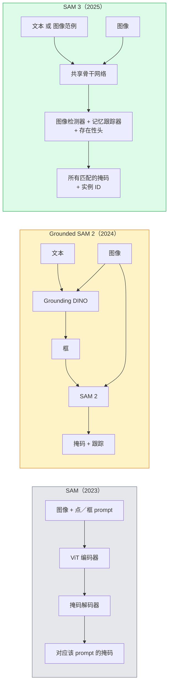

# SAM 3 与开放词汇分割（SAM 3 & Open-Vocabulary Segmentation）

> 译注：本文译自同目录 [`en.md`](./en.md)。术语遵循仓根 [TRANSLATION_GUIDE.md](../../../../TRANSLATION_GUIDE.md)。

> 给模型一个文本 prompt 和一张图，就能拿到所有匹配物体的 mask。SAM 3 把这件事压成了一次前向传播。

**Type:** Use + Build
**Languages:** Python
**Prerequisites:** Phase 4 Lesson 07 (U-Net), Phase 4 Lesson 08 (Mask R-CNN), Phase 4 Lesson 18 (CLIP)
**Time:** ~60 minutes

## 学习目标（Learning Objectives）

- 区分 SAM（仅视觉 prompt）、Grounded SAM / SAM 2（检测器 + SAM）以及 SAM 3（通过 Promptable Concept Segmentation 原生支持文本 prompt）
- 解释 SAM 3 的架构：共享 backbone + 图像检测器 + 基于 memory 的视频跟踪器 + presence head + 检测器与跟踪器解耦设计
- 使用 Hugging Face `transformers` 的 SAM 3 集成实现文本 prompt 检测、分割和视频跟踪
- 根据延迟、概念复杂度和部署目标，在 SAM 3、Grounded SAM 2、YOLO-World 与 SAM-MI 之间做选型

## 问题（The Problem）

2023 年的 SAM 是一个仅支持视觉 prompt 的模型：你点一个点或画一个框，它返回一个 mask。要做「把这张照片里所有橙子都给我」，你得先用一个检测器（Grounding DINO）出框，再让 SAM 把每一个分割出来。Grounded SAM 把这件事变成了一条流水线，但本质是两个冻结模型的级联，误差会不可避免地累积。

SAM 3（Meta，2025 年 11 月，ICLR 2026）把这个级联打掉了。它接受一个简短的名词短语或一张图像示例作为 prompt，在一次前向传播里返回所有匹配的 mask 和实例 ID。这就是 **Promptable Concept Segmentation (PCS)**。配合 2026 年 3 月的 Object Multiplex 更新（SAM 3.1），它能高效地在视频里跟踪同一概念的多个实例。

这节课讲的是这种结构性的转变。2D 分割、检测和文本-图像 grounding 已经合并进了一个模型。生产环境里要问的问题不再是「我应该把哪几条流水线串起来」，而是「哪个 promptable 模型可以端到端地搞定我的用例」。

## 概念（The Concept）

### 三代模型（The three generations）



### Promptable Concept Segmentation

「概念 prompt」是一个简短的名词短语（`"yellow school bus"`、`"striped red umbrella"`、`"hand holding a mug"`），或者一张图像示例。模型会为图像中所有匹配该概念的实例返回分割 mask，再加上每个匹配的唯一实例 ID。

这与经典的视觉 prompt 版 SAM 在三点上不同：

1. 不需要逐实例 prompt——一个文本 prompt 返回所有匹配。
2. 开放词汇——概念可以是任何能用自然语言描述的东西。
3. 一次返回多个实例，而不是一个 prompt 对应一个 mask。

### 关键架构组件（Key architectural pieces）

- **共享 backbone（Shared backbone）**——单个 ViT 处理图像，检测头和基于 memory 的跟踪器都从它读取特征。
- **Presence head**——预测概念在图像中是否存在。把「这玩意在不在？」和「它在哪？」解耦，降低对不存在概念的误检。
- **检测器与跟踪器解耦（Decoupled detector-tracker）**——图像级检测和视频级跟踪有独立的头，互不干扰。
- **Memory bank**——为视频跟踪存储跨帧的逐实例特征（与 SAM 2 用的同一套机制）。

### 大规模训练（Training at scale）

SAM 3 在 **400 万个独特概念** 上训练，这些概念由一个 data engine 生成，通过 AI + 人工审核迭代标注和纠正。新的 **SA-CO 基准（benchmark）** 包含 27 万个独特概念，比此前的基准大 50 倍。SAM 3 在 SA-CO 上达到人类表现的 75-80%，并在图像 + 视频 PCS 上把现有系统的指标翻了一倍。

### SAM 3.1 Object Multiplex

2026 年 3 月更新：**Object Multiplex** 引入了一种共享 memory 机制，用于同时跟踪同一概念的多个实例。在此之前，跟踪 N 个实例意味着 N 套独立的 memory bank。Multiplex 把这折叠成一份共享 memory 加上逐实例的查询。结果就是多目标跟踪显著加速，但精度不损失。

### 2026 年 Grounded SAM 还有什么用（Where Grounded SAM still matters in 2026）

- 当你需要换上某个特定的开放词汇检测器时（DINO-X、Florence-2）。
- 当 SAM 3 的 license（HF 上需要申请）成了阻碍时。
- 当你需要比 SAM 3 暴露的更细粒度的检测器阈值控制时。
- 用于检测器组件的研究 / 消融实验（ablation，消融）工作。

模块化流水线仍有它的位置。但对大多数生产工作来说，SAM 3 是更简单的答案。

### YOLO-World 对比 SAM 3（YOLO-World vs SAM 3）

- **YOLO-World**——只做开放词汇检测（不出 mask）。实时。需要高 fps 出框时是首选。
- **SAM 3**——完整的分割 + 跟踪。慢一点，但输出更丰富。

生产中的分工：YOLO-World 负责只需检测的快速流水线（机器人导航、快速 dashboard），SAM 3 负责任何需要 mask 或跟踪的场景。

### SAM-MI 的效率优化（SAM-MI efficiency）

SAM-MI（2025-2026）针对 SAM 的 decoder 瓶颈。核心思路：

- **稀疏点 prompt（Sparse point prompting）**——用少量精选的点代替密集 prompt；把 decoder 调用减少 96%。
- **浅层 mask 聚合（Shallow mask aggregation）**——把粗糙的 mask 预测合并成一个更锐利的 mask。
- **解耦 mask 注入（Decoupled mask injection）**——decoder 接收预先计算好的 mask 特征，而不是重跑一遍。

效果：在开放词汇基准上比 Grounded-SAM 快约 1.6 倍。

### 三个模型的输出格式（Output format for the three models）

三者都返回相同的整体结构（boxes + labels + scores + masks + IDs），这是好事——你下游的流水线不必根据是哪个模型在跑而做分支。

## 动手实现（Build It）

### Step 1: 构造 prompt（Prompt construction）

写一个把用户句子转成 SAM 3 概念 prompt 列表的辅助函数。这是「用户输入了什么」和「模型消费什么」之间的边界。

```python
def split_concepts(sentence):
    """
    Heuristic splitter for multi-concept prompts.
    Returns list of short noun phrases.
    """
    for sep in [",", ";", "and", "or", "&"]:
        if sep in sentence:
            parts = [p.strip() for p in sentence.replace("and ", ",").split(",")]
            return [p for p in parts if p]
    return [sentence.strip()]

print(split_concepts("cats, dogs and balloons"))
```

SAM 3 一次前向传播只接受一个概念；多概念查询要循环或者批处理。

### Step 2: 后处理辅助函数（Post-processing helpers）

把 SAM 3 的原始输出整理成一个干净的检测列表，对齐我们 Phase 4 Lesson 16 的流水线契约。

```python
from dataclasses import dataclass
from typing import List

@dataclass
class ConceptDetection:
    concept: str
    instance_id: int
    box: tuple          # (x1, y1, x2, y2)
    score: float
    mask_rle: str       # run-length encoded


def rle_encode(binary_mask):
    flat = binary_mask.flatten().astype("uint8")
    runs = []
    prev, count = flat[0], 0
    for v in flat:
        if v == prev:
            count += 1
        else:
            runs.append((int(prev), count))
            prev, count = v, 1
    runs.append((int(prev), count))
    return ";".join(f"{v}x{c}" for v, c in runs)
```

RLE 即便面对大量高分辨率 mask 也能让响应 payload 保持小巧。SAM 2、SAM 3、Grounded SAM 2 都能用同一种格式。

### Step 3: 统一的开放词汇分割接口（A unified open-vocab segmentation interface）

把你手头的后端（SAM 3、Grounded SAM 2、YOLO-World + SAM 2）统一封装到一个方法后面。换后端时下游代码不变。

```python
from abc import ABC, abstractmethod
import numpy as np

class OpenVocabSeg(ABC):
    @abstractmethod
    def detect(self, image: np.ndarray, concept: str) -> List[ConceptDetection]:
        ...


class StubOpenVocabSeg(OpenVocabSeg):
    """
    Deterministic stub used for pipeline testing when real models are not loaded.
    """
    def detect(self, image, concept):
        h, w = image.shape[:2]
        return [
            ConceptDetection(
                concept=concept,
                instance_id=0,
                box=(w * 0.2, h * 0.3, w * 0.5, h * 0.8),
                score=0.89,
                mask_rle="0x100;1x50;0x200",
            ),
            ConceptDetection(
                concept=concept,
                instance_id=1,
                box=(w * 0.55, h * 0.25, w * 0.85, h * 0.75),
                score=0.74,
                mask_rle="0x80;1x40;0x220",
            ),
        ]
```

真正的 `SAM3OpenVocabSeg` 子类会包装 `transformers.Sam3Model` 和 `Sam3Processor`。

### Step 4: Hugging Face SAM 3 用法参考（Hugging Face SAM 3 usage (reference)）

真正用模型时，`transformers` 的集成是这样：

```python
from transformers import Sam3Processor, Sam3Model
import torch

processor = Sam3Processor.from_pretrained("facebook/sam3")
model = Sam3Model.from_pretrained("facebook/sam3").eval()

inputs = processor(images=pil_image, return_tensors="pt")
inputs = processor.set_text_prompt(inputs, "yellow school bus")

with torch.no_grad():
    outputs = model(**inputs)

masks = processor.post_process_masks(
    outputs.masks, inputs.original_sizes, inputs.reshaped_input_sizes
)
boxes = outputs.boxes
scores = outputs.scores
```

一个 prompt，一次调用返回所有匹配。

### Step 5: 衡量 Grounded SAM 2 白送你的那些（Measure what Grounded SAM 2 gave you for free）

一个诚实的对比：在真实流水线里把 Grounded SAM 2 换成 SAM 3 会发生什么？

- 延迟：SAM 3 省掉了一次前向传播（不再需要独立检测器），但模型本身更重；通常持平或略快一点。
- 精度：SAM 3 在罕见或组合性概念（"striped red umbrella"）上明显更好；常见单词概念上接近。
- 灵活性：Grounded SAM 2 允许你换检测器（DINO-X、Florence-2、Grounding DINO 1.5）；SAM 3 是一体化的。

结论：SAM 3 是 2026 年开放词汇分割的默认选择。当你需要检测器灵活性或不同的 license 条款时，Grounded SAM 2 仍是正确答案。

## 用起来（Use It）

生产部署模式：

- **实时标注（Real-time annotation）**——SAM 3 + CVAT 的 label-as-text-prompt 功能。标注员选一个标签名；SAM 3 预先标好每一个匹配实例。再人工审核和修正。
- **视频分析（Video analytics）**——用 SAM 3.1 Object Multiplex 做多目标跟踪；把帧喂给基于 memory 的跟踪器。
- **机器人（Robotics）**——SAM 3 做开放词汇操作（"pick up the red cup"）；作为规划原语来运行。
- **医学影像（Medical imaging）**——在医学概念上微调过的 SAM 3；需要在 HF 上申请访问。

Ultralytics 在它的 Python 包里封装了 SAM 3：

```python
from ultralytics import SAM

model = SAM("sam3.pt")
results = model(image_path, prompts="yellow school bus")
```

接口与 YOLO 和 SAM 2 一致。

## 上线部署（Ship It）

本课产出：

- `outputs/prompt-open-vocab-stack-picker.md`——一个根据延迟、概念复杂度和 license 在 SAM 3 / Grounded SAM 2 / YOLO-World / SAM-MI 之间做选型的 prompt。
- `outputs/skill-concept-prompt-designer.md`——一个把用户话术转成规范 SAM 3 概念 prompt 的 skill（拆分、消歧、回退）。

## 练习（Exercises）

1. **(Easy)** 用你自选的概念 prompt 在 10 张图上跑 SAM 3。在同样的图上和 SAM 2 + Grounding DINO 1.5 做对比。报告每个模型漏掉了哪些概念。
2. **(Medium)** 在 SAM 3 之上做一个「点击包含 / 点击排除」的 UI：文本 prompt 返回候选实例，用户点击选择哪些算正样本。把最终概念集合输出为 JSON。
3. **(Hard)** 在自定义概念集合上微调 SAM 3（例如 5 类电子元件，每类 20 张标注图）。在同一测试集上与 zero-shot 的 SAM 3 做对比；测量 mask IoU 的提升。

## 关键术语（Key Terms）

| Term | What people say | What it actually means |
|------|----------------|----------------------|
| Open-vocabulary segmentation | "Segment by text" | 为用自然语言描述的物体生成 mask，不依赖固定标签集 |
| PCS | "Promptable Concept Segmentation" | SAM 3 的核心任务——给定名词短语或图像示例，分割所有匹配实例 |
| Concept prompt | "The text input" | 简短名词短语或图像示例；不是完整句子 |
| Presence head | "Is it here?" | SAM 3 模块，先判断概念是否存在于图像中，再做定位 |
| SA-CO | "SAM 3 benchmark" | 27 万概念的开放词汇分割基准；比此前开放词汇基准大 50 倍 |
| Object Multiplex | "SAM 3.1 update" | 共享 memory 的多目标跟踪；高效地联合跟踪大量实例 |
| Grounded SAM 2 | "Modular pipeline" | 检测器 + SAM 2 级联；当需要换检测器时仍然有用 |
| SAM-MI | "Efficient SAM variant" | Mask Injection，比 Grounded-SAM 快 1.6 倍 |

## 延伸阅读（Further Reading）

- [SAM 3: Segment Anything with Concepts (arXiv 2511.16719)](https://arxiv.org/abs/2511.16719)
- [SAM 3.1 Object Multiplex (Meta AI, March 2026)](https://ai.meta.com/blog/segment-anything-model-3/)
- [SAM 3 model page on Hugging Face](https://huggingface.co/facebook/sam3)
- [Grounded SAM 2 tutorial (PyImageSearch)](https://pyimagesearch.com/2026/01/19/grounded-sam-2-from-open-set-detection-to-segmentation-and-tracking/)
- [Ultralytics SAM 3 docs](https://docs.ultralytics.com/models/sam-3/)
- [SAM3-I: Instruction-aware SAM (arXiv 2512.04585)](https://arxiv.org/abs/2512.04585)
