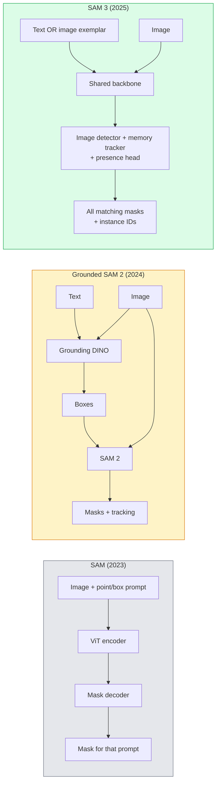

# SAM 3 与开放词汇分割

> 给模型一个文本提示和一张图像，它就能返回每个匹配对象的掩码。SAM 3 让这变成了单次前向传播。

**类型：** 使用 + 构建
**语言：** Python
**前置条件：** 阶段 4 第 07 课（U-Net），阶段 4 第 08 课（Mask R-CNN），阶段 4 第 18 课（CLIP）
**时间：** ~60 分钟

## 学习目标

- 区分 SAM（仅视觉提示）、Grounded SAM / SAM 2（检测器 + SAM）和 SAM 3（通过 Promptable Concept Segmentation 实现原生文本提示）
- 解释 SAM 3 架构：共享骨干 + 图像检测器 + 基于记忆的视频追踪器 + presence head + 解耦的检测器-追踪器设计
- 使用 Hugging Face `transformers` 的 SAM 3 集成进行文本提示的检测、分割和视频追踪
- 根据延迟、概念复杂度和部署目标在 SAM 3、Grounded SAM 2、YOLO-World 和 SAM-MI 之间做出选择

## 问题

2023 年的 SAM 是一个仅视觉提示的模型：你点击一个点或画一个框，它返回一个掩码。对于"给我这张照片里的所有橙子"，你需要一个检测器（Grounding DINO）来生成框，然后 SAM 对每个框进行分割。Grounded SAM 将其变成了一个流水线，但它是两个冻结模型的级联，不可避免地存在误差累积。

SAM 3（Meta, 2025 年 11 月, ICLR 2026）将级联合并了。它接受一个简短的名词短语或图像样本作为 prompt，并在单次前向传播中返回所有匹配的掩码和实例 ID。这就是 **Promptable Concept Segmentation（PCS）**。结合 2026 年 3 月的 Object Multiplex 更新（SAM 3.1），它能够高效地追踪视频中同一概念的多个实例。

本课关于这所代表的结构性转变。2D 分割、检测和文本-图像定位已合并为一个模型。生产问题不再是"我该把哪些流水线串在一起"，而是"哪个可提示的模型能端到端地处理我的用例"。

## 概念

### 三代模型


```mermaid
flowchart LR
    subgraph SAM1["SAM (2023)"]
        A1["Image + point/box prompt"] --> A2["ViT encoder"] --> A3["Mask decoder"]
        A3 --> A4["Mask for that prompt"]
    end
    subgraph GSAM2["Grounded SAM 2 (2024)"]
        B1["Text"] --> B2["Grounding DINO"] --> B3["Boxes"] --> B4["SAM 2"] --> B5["Masks + tracking"]
        B6["Image"] --> B2
        B6 --> B4
    end
    subgraph SAM3["SAM 3 (2025)"]
        C1["Text OR image exemplar"] --> C2["Shared backbone"]
        C3["Image"] --> C2
        C2 --> C4["Image detector + memory tracker<br/>+ presence head"]
        C4 --> C5["All matching masks<br/>+ instance IDs"]
    end

    style SAM1 fill:#e5e7eb,stroke:#6b7280
    style GSAM2 fill:#fef3c7,stroke:#d97706
    style SAM3 fill:#dcfce7,stroke:#16a34a
```

### Promptable Concept Segmentation

一个"概念 prompt"是一个简短的名词短语（`"yellow school bus"`、`"striped red umbrella"`、`"hand holding a mug"`）或一个图像样本。模型返回图像中匹配该概念的每个实例的分割掩码，以及每个匹配的唯一实例 ID。

这与经典的视觉提示 SAM 有三个不同之处：

1. 无需逐个实例提示——一个文本 prompt 返回所有匹配。
2. 开放词汇——概念可以是任何可用自然语言描述的事物。
3. 一次返回多个实例，而不是每个 prompt 一个掩码。

### 关键架构组件

- **共享骨干**——单个 ViT 处理图像。检测器头和基于记忆的追踪器都从中读取。
- **Presence head**——预测概念是否存在于图像中。将"这东西在吗？"与"它在哪？"解耦。减少不存在的概念上的误报。
- **解耦的检测器-追踪器**——图像级检测和视频级追踪有独立的头，因此它们不会相互干扰。
- **记忆库**——跨帧存储每个实例的特征用于视频追踪（与 SAM 2 使用的机制相同）。

### 大规模训练

SAM 3 在 **400 万个唯一概念**上训练，这些概念由一个数据引擎生成，该引擎使用 AI + 人工审核迭代标注和修正。新的 **SA-CO 基准**包含 27 万个唯一概念，比之前的基准大 50 倍。SAM 3 在 SA-CO 上达到人类表现的 75-80%，并在图像 + 视频 PCS 上使现有系统翻倍。

### SAM 3.1 Object Multiplex

2026 年 3 月更新：**Object Multiplex** 引入了一个共享记忆机制，用于一次性联合追踪同一概念的多个实例。以前，追踪 N 个实例意味着 N 个独立的记忆库。Multiplex 将其合并为一个共享记忆，带有每个实例的查询。结果：在不牺牲精度的情况下，多对象追踪速度大幅提升。

### 2026 年 Grounded SAM 仍在发挥作用的场景

- 当你需要换入特定的开放词汇检测器时（DINO-X、Florence-2）。
- 当 SAM 3 的许可（HF 上受限）成为障碍时。
- 当你需要对检测阈值有比 SAM 3 提供的更多控制时。
- 用于检测器组件的研究 / 消融工作。

模块化流水线仍有其位置。对于大多数生产工作，SAM 3 是更简单的答案。

### YOLO-World vs SAM 3

- **YOLO-World**——仅开放词汇检测器（无掩码）。实时。最适合需要高 fps 框的场景。
- **SAM 3**——完整的分割 + 追踪。较慢但输出更丰富。

生产分工：YOLO-World 用于快速仅检测流水线（机器人导航、快速仪表盘），SAM 3 用于任何需要掩码或追踪的场景。

### SAM-MI 效率

SAM-MI（2025-2026）解决了 SAM 的解码器瓶颈。关键思路：

- **稀疏点提示**——使用少量精心选择的点而不是密集提示；将解码器调用减少 96%。
- **浅层掩码聚合**——将粗糙的掩码预测合并为一个更锐利的掩码。
- **解耦的掩码注入**——解码器接收预计算的掩码特征而不是重新运行。

结果：在开放词汇基准上比 Grounded-SAM 加速约 1.6 倍。

### 三个模型的输出格式

所有模型返回相同的一般结构（boxes + labels + scores + masks + IDs），这很有帮助——你的下游流水线不必根据运行了哪个模型来分支。

## 构建

### 步骤 1：Prompt 构建

构建一个辅助函数，将用户句子转换为 SAM 3 概念 prompt 列表。这是"用户输入的内容"与"模型消费的内容"之间的边界。

```python
def split_concepts(sentence):
    """
    多概念 prompt 的启发式分割器。
    返回简短名词短语列表。
    """
    for sep in [",", ";", "and", "or", "&"]:
        if sep in sentence:
            parts = [p.strip() for p in sentence.replace("and ", ",").split(",")]
            return [p for p in parts if p]
    return [sentence.strip()]

print(split_concepts("cats, dogs and balloons"))
```

SAM 3 每次前向传播接受一个概念；对于多概念查询，循环或批量处理。

### 步骤 2：后处理辅助函数

将 SAM 3 的原始输出转换为与我们阶段 4 第 16 课流水线契约匹配的干净检测列表。

```python
from dataclasses import dataclass
from typing import List

@dataclass
class ConceptDetection:
    concept: str
    instance_id: int
    box: tuple          # (x1, y1, x2, y2)
    score: float
    mask_rle: str       # run-length encoded


def rle_encode(binary_mask):
    flat = binary_mask.flatten().astype("uint8")
    runs = []
    prev, count = flat[0], 0
    for v in flat:
        if v == prev:
            count += 1
        else:
            runs.append((int(prev), count))
            prev, count = v, 1
    runs.append((int(prev), count))
    return ";".join(f"{v}x{c}" for v, c in runs)
```

RLE 即使在有许多高分辨率掩码的情况下也能保持响应负载小。相同的格式在 SAM 2、SAM 3、Grounded SAM 2 中通用。

### 步骤 3：统一的开放词汇分割接口

将你拥有的任何后端（SAM 3、Grounded SAM 2、YOLO-World + SAM 2）包装在单个方法后面。你的下游代码在后端变化时无需更改。

```python
from abc import ABC, abstractmethod
import numpy as np

class OpenVocabSeg(ABC):
    @abstractmethod
    def detect(self, image: np.ndarray, concept: str) -> List[ConceptDetection]:
        ...


class StubOpenVocabSeg(OpenVocabSeg):
    """
    确定性桩，用于在未加载真实模型时进行流水线测试。
    """
    def detect(self, image, concept):
        h, w = image.shape[:2]
        return [
            ConceptDetection(
                concept=concept,
                instance_id=0,
                box=(w * 0.2, h * 0.3, w * 0.5, h * 0.8),
                score=0.89,
                mask_rle="0x100;1x50;0x200",
            ),
            ConceptDetection(
                concept=concept,
                instance_id=1,
                box=(w * 0.55, h * 0.25, w * 0.85, h * 0.75),
                score=0.74,
                mask_rle="0x80;1x40;0x220",
            ),
        ]
```

真正的 `SAM3OpenVocabSeg` 子类将包装 `transformers.Sam3Model` 和 `Sam3Processor`。

### 步骤 4：Hugging Face SAM 3 使用（参考）

对于实际模型，`transformers` 集成：

```python
from transformers import Sam3Processor, Sam3Model
import torch

processor = Sam3Processor.from_pretrained("facebook/sam3")
model = Sam3Model.from_pretrained("facebook/sam3").eval()

inputs = processor(images=pil_image, return_tensors="pt")
inputs = processor.set_text_prompt(inputs, "yellow school bus")

with torch.no_grad():
    outputs = model(**inputs)

masks = processor.post_process_masks(
    outputs.masks, inputs.original_sizes, inputs.reshaped_input_sizes
)
boxes = outputs.boxes
scores = outputs.scores
```

一个 prompt，所有匹配在单次调用中返回。

### 步骤 5：衡量 Grounded SAM 2 免费给了你什么

一个诚实的基准：在真实流水线中用 SAM 3 替换 Grounded SAM 2 会发生什么？

- 延迟：SAM 3 节省一次前向传播（没有独立的检测器），但模型本身更重；通常中性或略微加速。
- 精度：SAM 3 在罕见或组合概念（"striped red umbrella"）上明显更好。在常见的单词语概念上类似。
- 灵活性：Grounded SAM 2 允许你交换检测器（DINO-X、Florence-2、Grounding DINO 1.5）；SAM 3 是单一的。

结论：SAM 3 是 2026 年开放词汇分割的默认选择。当你需要检测器灵活性或不同的许可条款时，Grounded SAM 2 仍然是正确的答案。

## 使用

生产部署模式：

- **实时标注**——SAM 3 + CVAT 的文本即标签功能。标注员选择一个标签名称；SAM 3 预标注每个匹配实例。审阅和修正。
- **视频分析**——SAM 3.1 Object Multiplex 用于多对象追踪；将帧馈送给基于记忆的追踪器。
- **机器人技术**——SAM 3 用于开放词汇操作（"pick up the red cup"）；作为规划原语运行。
- **医学影像**——SAM 3 在医学概念上微调；需要在 HF 上申请访问。

Ultralytics 在其 Python 包中包装了 SAM 3：

```python
from ultralytics import SAM

model = SAM("sam3.pt")
results = model(image_path, prompts="yellow school bus")
```

与 YOLO 和 SAM 2 相同的接口。

## 交付

本课产出：

- `outputs/prompt-open-vocab-stack-picker.md`——一个 prompt，根据延迟、概念复杂度和许可选择 SAM 3 / Grounded SAM 2 / YOLO-World / SAM-MI。
- `outputs/skill-concept-prompt-designer.md`——一个技能，将用户话语转换为格式良好的 SAM 3 概念 prompt（分割、消歧、降级）。

## 练习

1. **（简单）** 在你选择的 10 张图像上使用概念 prompt 运行 SAM 3。与同一图像上的 SAM 2 + Grounding DINO 1.5 进行比较。报告每个模型遗漏了哪些概念。
2. **（中等）** 在 SAM 3 之上构建一个"点击包含 / 点击排除"用户界面：文本 prompt 返回候选实例；用户点击保留哪些算作正样本。将最终的概念集输出为 JSON。
3. **（困难）** 在自定义概念集上微调 SAM 3（例如 5 种电子元件），每种使用 20 张标注图像。在相同测试集上比较零样本 SAM 3；度量掩码 IoU 的提升。

## 关键术语

| 术语 | 人们说的 | 实际含义 |
|------|----------------|----------------------|
| 开放词汇分割 | "按文本分割" | 为自然语言描述的对象生成掩码，而非固定标签集 |
| PCS | "Promptable Concept Segmentation" | SAM 3 的核心任务——给定名词短语或图像样本，分割所有匹配实例 |
| 概念 prompt | "文本输入" | 简短名词短语或图像样本；不是完整句子 |
| Presence head | "它在这里吗？" | SAM 3 模块，在定位前决定概念是否存在于图像中 |
| SA-CO | "SAM 3 基准" | 27 万概念的开放词汇分割基准；比之前的开放词汇基准大 50 倍 |
| Object Multiplex | "SAM 3.1 更新" | 共享记忆多对象追踪；快速联合追踪多个实例 |
| Grounded SAM 2 | "模块化流水线" | 检测器 + SAM 2 级联；当检测器交换重要时仍相关 |
| SAM-MI | "高效 SAM 变体" | Mask Injection，相比 Grounded-SAM 加速 1.6 倍 |

## 延伸阅读

- [SAM 3：用概念分割一切（arXiv 2511.16719）](https://arxiv.org/abs/2511.16719)
- [SAM 3.1 Object Multiplex（Meta AI, 2026 年 3 月）](https://ai.meta.com/blog/segment-anything-model-3/)
- [Hugging Face 上的 SAM 3 模型页面](https://huggingface.co/facebook/sam3)
- [Grounded SAM 2 教程（PyImageSearch）](https://pyimagesearch.com/2026/01/19/grounded-sam-2-from-open-set-detection-to-segmentation-and-tracking/)
- [Ultralytics SAM 3 文档](https://docs.ultralytics.com/models/sam-3/)
- [SAM3-I：指令感知 SAM（arXiv 2512.04585）](https://arxiv.org/abs/2512.04585)
