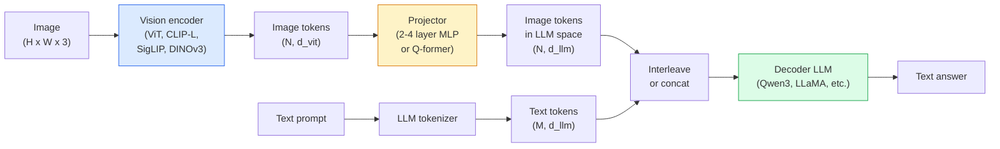

# Vision-Language Models — ViT-MLP-LLM パターン

> Vision encoder が画像を token に変換する。MLP projector がそれらの token を LLM の embedding 空間へ写像する。残りは language model が担う。この ViT-MLP-LLM というパターンが、2026 年の本番 VLM の標準形である。

**種別:** 学習 + 活用
**言語:** Python
**前提条件:** Phase 4 Lesson 14 (ViT), Phase 4 Lesson 18 (CLIP), Phase 7 Lesson 02 (Self-Attention)
**所要時間:** 約75分

## 学習目標

- ViT-MLP-LLM アーキテクチャを説明し、3 つの構成要素がそれぞれ何を担うかを述べる
- Qwen3-VL、InternVL3.5、LLaVA-Next、GLM-4.6V を、パラメータ数、context length、ベンチマーク性能で比較する
- DeepStack を説明する: 複数階層の ViT features が、単一の最終層 feature より vision-language alignment を強める理由を理解する
- Cross-Modal Error Rate (CMER) で本番 VLM の hallucination を測定し、そのシグナルに基づいて対応する

## 問題

CLIP (Phase 4 Lesson 18) は画像とテキストに共有 embedding 空間を与えるため、zero-shot classification や retrieval には十分である。しかし CLIP はテキストを生成せず、類似度を採点するだけなので、「この画像に赤い車は何台ありますか？」には答えられない。

Vision-Language Models (VLMs) — Qwen3-VL、InternVL3.5、LLaVA-Next、GLM-4.6V — は、CLIP 系の image encoder を完全な language model に接続する。モデルは画像と質問を受け取り、答えを生成する。2026 年の open-source VLM は、multimodal benchmark (MMMU, MMBench, DocVQA, ChartQA, MathVista, OSWorld) で GPT-5 や Gemini-2.5-Pro に匹敵、または上回る。

3 つの部品 (ViT、projector、LLM) が標準である。モデル間の違いは、どの ViT、どの projector、どの LLM、どの training data、どの alignment recipe を使うかにある。このパターンを理解すれば、任意の構成要素の差し替えは機械的にできる。

## 概念

### ViT-MLP-LLM architecture



1. **Vision encoder** — 事前学習済み ViT (CLIP-L/14、SigLIP、DINOv3、または fine-tuned variant)。patch token を生成する。
2. **Projector** — vision token を LLM の embedding 次元へ写像する小さな module (2-4 layer MLP、または Q-former)。fine-tuning の多くはここで起きる。
3. **LLM** — decoder-only language model (Qwen3、Llama、Mistral、GLM、InternLM)。vision + text token を列として読み、テキストを生成する。

原理的には 3 つすべてを train できる。実務では、vision encoder と LLM はほぼ frozen のまま、projector を train する。数十億パラメータ規模の信号を安価に活用できる。

### DeepStack

通常の projection は ViT の最終層だけを使う。DeepStack (Qwen3-VL) は複数の ViT 深度から features をサンプリングして積み重ねる。深い層は高レベル semantic を持ち、浅い層は細かな空間情報や texture 情報を持つ。両方を LLM に渡すことで、「画像に何があるか」(semantics) と「正確にどこにあるか」(spatial grounding) のギャップを縮める。

### 3 つの training stages

現代の VLM は段階的に train される。

1. **Alignment** — ViT と LLM を freeze する。image-caption pairs で projector だけを train する。vision 空間を language 空間へ写像する方法を projector に学ばせる。
2. **Pre-training** — すべてを unfreeze する。大規模な interleaved image-text data (500M+ pairs) で train する。モデルの視覚知識を作る。
3. **Instruction tuning** — curated な (image, question, answer) triples で fine-tune する。会話的な挙動と task format を教える。「vision-aware LM」を使える assistant に変える段階である。

ほとんどの LoRA fine-tune は、小さな labelled dataset を使って stage 3 を狙う。

### Model family comparison (2026 年初頭)

| Model | Params | Vision encoder | LLM | Context | Strengths |
|-------|--------|----------------|-----|---------|-----------|
| Qwen3-VL-235B-A22B (MoE) | 235B (22B active) | custom ViT + DeepStack | Qwen3 | 256K | General SOTA, GUI agent |
| Qwen3-VL-30B-A3B (MoE) | 30B (3B active) | custom ViT + DeepStack | Qwen3 | 256K | Smaller MoE alternative |
| Qwen3-VL-8B (dense) | 8B | custom ViT | Qwen3 | 128K | Production dense default |
| InternVL3.5-38B | 38B | InternViT-6B | Qwen3 + GPT-OSS | 128K | Strong MMBench / MMVet |
| InternVL3.5-241B-A28B | 241B (28B active) | InternViT-6B | Qwen3 | 128K | Competitive with GPT-4o |
| LLaVA-Next 72B | 72B | SigLIP | Llama-3 | 32K | Open, easy to fine-tune |
| GLM-4.6V | ~70B | custom | GLM | 64K | Open-source, strong OCR |
| MiniCPM-V-2.6 | 8B | SigLIP | MiniCPM | 32K | Edge-friendly |

### Visual agents

Qwen3-VL-235B は **visual agents** 向け benchmark である OSWorld で世界最高水準の性能に到達している。visual agent は GUI (desktop、mobile、web) を操作する agent である。モデルは screenshot を見て UI を理解し、action (click、type、scroll) を出力する。tool と組み合わせることで、一般的な desktop task の loop を閉じられる。2026 年の多くの「AI PC」デモは、内部でこの仕組みを動かしている。

### Agentic capabilities + RoPE variants

VLM は video の中で frame が **いつ** のものかを知る必要がある。Qwen3-VL は T-RoPE (temporal rotary position embeddings) から **text-based time alignment** へ進化した。これは video frame と明示的な timestamp text token を interleave する方式である。モデルは「`<timestamp 00:32>` frame, prompt」を見て、時間的関係を推論できる。

### alignment の問題

crawled dataset の image-text pairs の 12% には、画像に完全には grounded していない説明が含まれる。このデータで train された VLM は、物体を捏造し、数字を読み違え、関係を作り出す hallucination を静かに学ぶ。本番ではこれが支配的な failure mode である。

Skywork.ai はそれを追跡するために **Cross-Modal Error Rate (CMER)** を導入した。

```
CMER = fraction of outputs where the text confidence is high but the image-text similarity (via a CLIP-family checker) is low
```

CMER が高いとは、モデルが画像に grounded していない内容を自信を持って述べているという意味である。CMER を monitor し、本番 KPI として扱うことで、彼らの deployment では hallucination rate が約 35% 下がった。コツは「モデルを直す」ことではなく、「high-CMER output を human review に route する」ことである。

### LoRA / QLoRA による fine-tuning

70B VLM の full fine-tuning は、多くの team には手が届かない。attention + projector layers への LoRA (rank 16-64)、または 4-bit base weights を使う QLoRA なら、単一の A100 / H100 に収まる。コストは 5,000-50,000 examples、$100-$5,000 の compute、2-10 hours の training 程度である。

### Spatial reasoning はまだ弱い

現在の VLM は spatial reasoning benchmark (above-below、left-right、counting、distance) で 50-60% 程度である。「どの object がどの上にあるか」に依存する use case では、厳しく検証すること。汎用 VLM の性能は human 未満である。純粋な spatial task では、specialised keypoint / pose estimator、depth model、または detection model と box geometry の post-processing の方が VLM より良いことが多い。

## 実装

### Step 1: projector

最も頻繁に train する部分。GELU 付きの 2-4 layer MLP。

```python
import torch
import torch.nn as nn


class Projector(nn.Module):
    def __init__(self, vit_dim=768, llm_dim=4096, hidden=4096):
        super().__init__()
        self.net = nn.Sequential(
            nn.Linear(vit_dim, hidden),
            nn.GELU(),
            nn.Linear(hidden, llm_dim),
        )

    def forward(self, x):
        return self.net(x)
```

入力は `(N_patches, d_vit)` token tensor。出力は `(N_patches, d_llm)`。LLM は出力の各 row を単なる別の token として扱う。

### Step 2: ViT-MLP-LLM を end-to-end で組み立てる

最小 VLM の forward pass skeleton。実際の code は `transformers` を使うが、ここでは概念的な layout を示す。

```python
class MinimalVLM(nn.Module):
    def __init__(self, vit, projector, llm, image_token_id):
        super().__init__()
        self.vit = vit
        self.projector = projector
        self.llm = llm
        self.image_token_id = image_token_id  # placeholder token in text prompt

    def forward(self, image, input_ids, attention_mask):
        # 1. vision features
        vision_tokens = self.vit(image)                     # (B, N_patches, d_vit)
        vision_embeds = self.projector(vision_tokens)       # (B, N_patches, d_llm)

        # 2. text embeddings
        text_embeds = self.llm.get_input_embeddings()(input_ids)  # (B, M, d_llm)

        # 3. replace image placeholder tokens with vision embeds
        merged = self._merge(text_embeds, vision_embeds, input_ids)

        # 4. run LLM
        return self.llm(inputs_embeds=merged, attention_mask=attention_mask)

    def _merge(self, text_embeds, vision_embeds, input_ids):
        out = text_embeds.clone()
        expected = vision_embeds.size(1)
        for b in range(input_ids.size(0)):
            positions = (input_ids[b] == self.image_token_id).nonzero(as_tuple=True)[0]
            if len(positions) != expected:
                raise ValueError(
                    f"batch item {b} has {len(positions)} image tokens but vision_embeds has {expected} patches."
                    " Every sample in the batch must be pre-padded to the same number of image placeholder tokens.")
            out[b, positions] = vision_embeds[b]
        return out
```

text 内の `<image>` placeholder token が実際の image embeddings に置き換えられる。LLaVA、Qwen-VL、InternVL が使うのと同じパターンである。

### Step 3: CMER computation

軽量な runtime check。

```python
import torch.nn.functional as F


def cross_modal_error_rate(image_emb, text_emb, text_confidence, sim_threshold=0.25, conf_threshold=0.8):
    """
    image_emb, text_emb: embeddings of image and generated text (normalised internally)
    text_confidence:     mean per-token probability in [0, 1]
    Returns:             fraction of high-confidence outputs with low image-text alignment
    """
    image_emb = F.normalize(image_emb, dim=-1)
    text_emb = F.normalize(text_emb, dim=-1)
    sim = (image_emb * text_emb).sum(dim=-1)        # cosine similarity
    high_conf_low_sim = (text_confidence > conf_threshold) & (sim < sim_threshold)
    return high_conf_low_sim.float().mean().item()
```

CMER を production KPI として扱う。endpoint ごと、prompt type ごと、customer ごとに monitor する。CMER の上昇は、ある input distribution でモデルが hallucinate し始めていることを示す。

### Step 4: Toy VLM classifier (実行可能)

projector が train できることを示す。偽の「ViT features」を入力し、小さな LLM 風 token が class を予測する。

```python
class ToyVLM(nn.Module):
    def __init__(self, vit_dim=32, llm_dim=64, num_classes=5):
        super().__init__()
        self.projector = Projector(vit_dim, llm_dim, hidden=64)
        self.head = nn.Linear(llm_dim, num_classes)

    def forward(self, vision_tokens):
        projected = self.projector(vision_tokens)
        pooled = projected.mean(dim=1)
        return self.head(pooled)
```

synthetic な (feature, class) pairs なら 200 steps 未満で fit できる。projector pattern が機能することを示すには十分である。

## 使う

2026 年の production team が VLM を使う代表的な方法は 3 つある。

- **Hosted API** — OpenAI Vision、Anthropic Claude Vision、Google Gemini Vision。infra 不要だが vendor risk がある。
- **Open-source self-host** — `transformers` と `vllm` で Qwen3-VL または InternVL3.5 を動かす。制御性は高いが、初期作業は重い。
- **Fine-tune on domain** — Qwen2.5-VL-7B または LLaVA-1.6-7B を load し、5k-50k custom examples で LoRA、`vllm` または `TGI` で serve する。

```python
from transformers import AutoProcessor, AutoModelForVision2Seq
import torch
from PIL import Image

model_id = "Qwen/Qwen3-VL-8B-Instruct"
processor = AutoProcessor.from_pretrained(model_id)
model = AutoModelForVision2Seq.from_pretrained(model_id, torch_dtype=torch.bfloat16, device_map="auto")

messages = [{
    "role": "user",
    "content": [
        {"type": "image", "image": Image.open("plot.png")},
        {"type": "text", "text": "What does this chart show?"},
    ],
}]
inputs = processor.apply_chat_template(messages, add_generation_prompt=True, tokenize=True, return_dict=True, return_tensors="pt").to("cuda")
generated = model.generate(**inputs, max_new_tokens=256)
answer = processor.decode(generated[0][inputs["input_ids"].shape[1]:], skip_special_tokens=True)
```

`apply_chat_template` は `<image>` placeholder tokenisation を隠蔽する。merge はモデル内部で処理される。

## 成果物

この lesson が生成するもの:

- `outputs/prompt-vlm-selector.md` — accuracy、latency、context length、budget に基づいて Qwen3-VL / InternVL3.5 / LLaVA-Next / API を選ぶ。
- `outputs/skill-cmer-monitor.md` — production VLM endpoint に cross-modal error rate、endpoint ごとの dashboard、alerting threshold を instrument する code を出力する。

## 演習

1. **(Easy)** 任意の open VLM で、5 枚の画像に対して 3 つの prompt ("what is this?", "count the objects", "describe the scene") を実行する。各回答を correct / partially correct / hallucinated として手で採点する。first-pass の CMER-like rate を計算する。
2. **(Medium)** Qwen2.5-VL-3B または LLaVA-1.6-7B を、target domain の caption 付き 500 images で LoRA (rank 16) fine-tune する。zero-shot と fine-tuned の MMBench-style accuracy を比較する。
3. **(Hard)** VLM の image encoder を default の SigLIP/CLIP ではなく DINOv3 に置き換える。projector だけを再 train する (frozen LLM + frozen DINOv3)。dense-prediction tasks (counting、spatial reasoning) が改善するか測定する。

## 重要用語

| Term | よく言われる表現 | 実際の意味 |
|------|----------------|----------------------|
| ViT-MLP-LLM | "The VLM pattern" | Vision encoder + projector + language model; 2026 年のすべての VLM |
| Projector | "The bridge" | vision token を LLM embedding space に写像する 2-4 layer MLP (または Q-former) |
| DeepStack | "Qwen3-VL feature trick" | 最終層だけでなく multi-level ViT features を積み重ねる方法 |
| Image token | "<image> placeholder" | projected vision embeddings に置き換えられる text stream 内の special token |
| CMER | "Hallucination KPI" | Cross-Modal Error Rate; text confidence が高いのに image-text similarity が低いと高くなる |
| Visual agent | "VLM that clicks" | tool calls で GUI (OSWorld、mobile、web) を操作する VLM |
| Q-former | "Fixed-count token bridge" | 固定数の visual query tokens を生成する BLIP-2 style projector |
| Alignment / pre-training / instruction tuning | "Three stages" | 標準的な VLM training pipeline |

## 参考資料

- [Qwen3-VL Technical Report (arXiv 2511.21631)](https://arxiv.org/abs/2511.21631)
- [InternVL3.5 Advancing Open-Source Multimodal Models (arXiv 2508.18265)](https://arxiv.org/html/2508.18265v1)
- [LLaVA-Next series](https://llava-vl.github.io/blog/2024-05-10-llava-next-stronger-llms/)
- [BentoML: Best Open-Source VLMs 2026](https://www.bentoml.com/blog/multimodal-ai-a-guide-to-open-source-vision-language-models)
- [MMMU: Multi-discipline Multimodal Understanding benchmark](https://mmmu-benchmark.github.io/)
- [VLMs in manufacturing (Robotics Tomorrow, March 2026)](https://www.roboticstomorrow.com/story/2026/03/when-machines-learn-to-see-like-experts-the-rise-of-vision-language-models-in-manufacturing/26335/)
