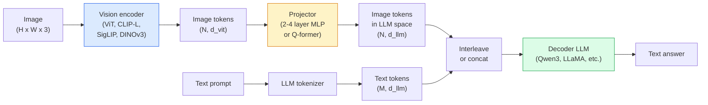

# Vizyon-Dil Modelleri — ViT-MLP-LLM Modeli

> Görüntü kodlayıcı, görüntüyü token'lere dönüştürür. Bir MLP projektörü bu token'leri LLM'nin embedding alanına eşler. Gerisini bir dil modeli halleder. Bu model - ViT-MLP-LLM - 2026'daki her üretim VLM'sidir.

**Tür:** Öğren + Kullan
**Diller:** Python
**Önkoşullar:** Aşama 4 Ders 14 (ViT), Aşama 4 Ders 18 (CLIP), Aşama 7 Ders 02 (Kişisel Dikkat)
**Süre:** ~75 dakika

## Öğrenme Hedefleri

- ViT-MLP-LLM mimarisini belirtin ve üç bileşenin her birinin neye katkıda bulunduğunu açıklayın
- Qwen3-VL, InternVL3.5, LLaVA-Next ve GLM-4.6V'yi parametre sayısı, bağlam uzunluğu ve benchmark performansı açısından karşılaştırın
- DeepStack'i açıklayın: neden çok seviyeli ViT özellikleri, görüş dili hizalamasını tek bir son katman özelliğine göre daha iyi sıkılaştırıyor?
- Üretimde VLM halüsinasyonunu Çapraz Mod Hata Oranı (CMER) ile ölçün ve sinyale göre hareket edin

## Sorun

CLIP (Aşama 4 Ders 18), görüntüler ve metinler için size sıfır atışlı sınıflandırma ve geri alma için yeterli olan paylaşılan bir embedding alanı sağlar. "Bu resimde kaç tane kırmızı araba var?" sorusunun cevabını veremez. çünkü CLIP metin üretmez; yalnızca benzerlikleri puanlar.

Görüntü Dili Modelleri (VLM'ler) — Qwen3-VL, InternVL3.5, LLaVA-Next, GLM-4.6V — CLIP ailesi görüntü kodlayıcıyı tam dil modeline cıvatalayın. Model bir görseli ve bir soruyu görür ve bir cevap üretir. 2026'da açık kaynaklı VLM'ler, multimodal benchmark'lerde (MMMU, MMBench, DocVQA, ChartQA, MathVista, OSWorld) GPT-5 ve Gemini-2.5-Pro'ya rakip olacak veya onları yenecek.

Parça üçlüsü (ViT, projektör, LLM) standarttır. Modeller arasındaki farklar hangi ViT'de, hangi projektörde, hangi LLM'de, eğitim verileri ve hizalama tarifindedir. Deseni anladıktan sonra herhangi bir bileşeni değiştirmek mekanik bir işlemdir.

## Konsept

### ViT-MLP-LLM mimarisi



1. **Vision kodlayıcı** — önceden eğitilmiş bir ViT (CLIP-L/14, SigLIP, DINOv3 veya ince ayarlı bir değişken). token yamalarını üretir.
2. **Projektör** — vizyon token'leri LLM'nin embedding boyutuna eşleyen küçük bir modül (2-4 katmanlı MLP veya Q-former). fine-tuning'nin çoğunun gerçekleştiği yer burasıdır.
3. **LLM** — yalnızca kod çözücüye yönelik bir dil modeli (Qwen3, Llama, Mistral, GLM, InternLM). Vision + text token'leri sırayla okur, metin üretir.

Prensip olarak her üç parça da eğitilebilir. Uygulamada, görüntü kodlayıcı ve LLM, projektör eğitilirken çoğunlukla donmuş halde kalır; ucuza birkaç milyar sinyal parametresi.

### DeepStack

Vanilya projeksiyonu yalnızca son ViT katmanını kullanır. DeepStack (Qwen3-VL), birden fazla ViT derinliğinden özellikleri örnekler ve bunları istifler. Daha derin katmanlar üst düzey anlambilimi taşır; sığ katmanlar ince taneli mekansal ve dokusal bilgi taşır. Her ikisinin de LLM'ye beslenmesi, "görüntü ne içeriyor" (anlambilim) ile "tam olarak nerede" (uzaysal topraklama) arasındaki boşluğu kapatır.

### Üç eğitim aşaması

Modern VLM'ler aşamalı olarak eğitilir:

1. **Hizalama** — ViT ve LLM'yi dondurun. Projektörü yalnızca resim yazısı çiftleri konusunda eğitin. Projektöre görüş alanını dil alanına eşlemeyi öğretir.
2. **Egzersiz öncesi** — her şeyi çözün. Büyük ölçekli aralıklı görüntü-metin verileri (500 milyondan fazla çift) üzerinde eğitim alın. Modelin görsel bilgisini oluşturur.
3. **Talimat ayarlama** — seçilmiş (resim, soru, cevap) üçlülerde ince ayar yapın. Konuşma davranışını ve görev formatlarını öğretir. "Görme duyarlı LM"yi kullanışlı bir asistana dönüştüren şey budur.

Çoğu LoRA, küçük etiketli dataset ile hedef aşama 3'e ince ayar yapar.

### Model ailesi karşılaştırması (2026 başı)

| Modeli | Parametreler | Görüş kodlayıcı | Yüksek Lisans | Bağlam | Güçlü Yönler |
|-------|--------|----------------|-----|---------|-----------|
| Qwen3-VL-235B-A22B (MEB) | 235B (22B aktif) | özel ViT + DeepStack | Qwen3 | 256K | Genel SOTA, GUI agent |
| Qwen3-VL-30B-A3B (MEB) | 30B (3B aktif) | özel ViT + DeepStack | Qwen3 | 256K | Daha küçük MEB alternatifi |
| Qwen3-VL-8B (yoğun) | 8B | özel ViT | Qwen3 | 128K | Üretim yoğun temerrüt |
| InternVL3.5-38B | 38B | InternViT-6B | Qwen3 + GPT-OSS | 128K | Güçlü MBench / MMVet |
| InternVL3.5-241B-A28B | 241B (28B aktif) | InternViT-6B | Qwen3 | 128K | GPT-4o ile rekabetçi |
| LLaVA-Sonraki 72B | 72B | SigLIP | Lama-3 | 32K | Açık, ince ayarı kolay |
| GLM-4.6V | ~70B | özel | GLM | 64K | Açık kaynaklı, güçlü OCR |
| MiniCPM-V-2.6 | 8B | SigLIP | MiniBGBM | 32K | Kenar dostu |

### Görsel agent'ler

Qwen3-VL-235B, GUI'leri (masaüstü, mobil, web) çalıştıran **görsel agent'ler** için bir benchmark olan OSWorld'de en yüksek küresel performansa ulaşıyor. Model bir ekran görüntüsünü görür, kullanıcı arayüzünü anlar ve eylemler (tıklama, yazma, kaydırma) gerçekleştirir. Araçlarla birleştirildiğinde ortak masaüstü görevlerindeki döngüyü kapatır. Çoğu 2026 "AI PC" demosunun altında yatan şey budur.

### Agentic yetenekleri + RoPE çeşitleri

VLM'lerin videoda bir karenin **ne zaman** olduğunu bilmesi gerekir. Qwen3-VL, T-RoPE'den (geçici döner konum embedding'ler) **metin tabanlı zaman hizalamaya** - video çerçeveleriyle serpiştirilmiş açık zaman damgası metni token'lere doğru gelişti. Model "`<timestamp 00:32>` çerçevesini, prompt"yi görür ve zamansal ilişkiler hakkında mantık yürütebilir.

### Hizalama sorunu

Taranan bir dataset'deki resim-metin çiftlerinin %12'si, resimde tam olarak temellenmeyen açıklamalar içeriyor. Bu konuda eğitilmiş bir VLM sessizce halüsinasyon görmeyi öğrenir; nesneler üretmeyi, sayıları yanlış okumayı, ilişkiler icat etmeyi. Üretimde bu baskın arıza modudur.

Skywork.ai, bunu izlemek için **Modlar Arası Hata Oranını (CMER)** tanıttı:

```
CMER = fraction of outputs where the text confidence is high but the image-text similarity (via a CLIP-family checker) is low
```

Yüksek CMER, modelin görüntüye dayanmayan şeyleri kendinden emin bir şekilde söylediği anlamına gelir. CMER'yi izlemek ve bunu bir üretim KPI'si olarak ele almak, deployment'de halüsinasyon oranını ~%35 oranında azalttı. İşin püf noktası "modeli düzeltmek" değil, "yüksek CMER çıktılarını insan incelemesine yönlendirmektir."

### LoRA / QLoRA ile Fine-tuning

70B VLM'nin tam fine-tuning'si çoğu takımın erişemeyeceği bir yerdedir. Dikkat + projektör katmanlarındaki LoRA (sıralama 16-64) veya 4 bit temel ağırlığa sahip QLoRA, tek bir A100 / H100'e sığar. Maliyet: 5.000-50.000 örnek, hesaplamada $100-$5.000, 2-10 saatlik eğitim.

### Uzamsal akıl yürütme hâlâ zayıf

Mevcut VLM'ler, uzamsal akıl yürütme benchmark'lerde (yukarı-aşağı, sol-sağ, sayma, mesafe) %50-60 puan alıyor. Kullanım durumunuz "hangi nesnenin hangisinin üzerinde olduğuna" bağlıysa, kapsamlı bir şekilde doğrulayın; genel VLM performansı insan performansının altındadır. Saf uzamsal görevler için VLM'den daha iyi alternatifler: özel bir anahtar nokta / poz tahmincisi, bir derinlik modeli veya sonradan işlenmiş kutu geometrisine sahip bir algılama modeli.

## İnşa Et

### Adım 1: Projektör

En sık antrenman yapacağınız kısım. GELU ile 2-4 katmanlı MLP.

```python
import torch
import torch.nn as nn


class Projector(nn.Module):
    def __init__(self, vit_dim=768, llm_dim=4096, hidden=4096):
        super().__init__()
        self.net = nn.Sequential(
            nn.Linear(vit_dim, hidden),
            nn.GELU(),
            nn.Linear(hidden, llm_dim),
        )

    def forward(self, x):
        return self.net(x)
```

Giriş bir `(N_patches, d_vit)` token tensörüdür. Çıkış `(N_patches, d_llm)`'dir. LLM her çıktı satırına başka bir token muamelesi yapar.

### Adım 2: ViT-MLP-LLM'yi uçtan uca birleştirin

Minimum VLM için ileri pasın iskeleti. Gerçek kod `transformers`'yi kullanır; bu kavramsal düzendir.

```python
class MinimalVLM(nn.Module):
    def __init__(self, vit, projector, llm, image_token_id):
        super().__init__()
        self.vit = vit
        self.projector = projector
        self.llm = llm
        self.image_token_id = image_token_id  # placeholder token in text prompt

    def forward(self, image, input_ids, attention_mask):
        # 1. vision features
        vision_tokens = self.vit(image)                     # (B, N_patches, d_vit)
        vision_embeds = self.projector(vision_tokens)       # (B, N_patches, d_llm)

        # 2. text embeddings
        text_embeds = self.llm.get_input_embeddings()(input_ids)  # (B, M, d_llm)

        # 3. replace image placeholder tokens with vision embeds
        merged = self._merge(text_embeds, vision_embeds, input_ids)

        # 4. run LLM
        return self.llm(inputs_embeds=merged, attention_mask=attention_mask)

    def _merge(self, text_embeds, vision_embeds, input_ids):
        out = text_embeds.clone()
        expected = vision_embeds.size(1)
        for b in range(input_ids.size(0)):
            positions = (input_ids[b] == self.image_token_id).nonzero(as_tuple=True)[0]
            if len(positions) != expected:
                raise ValueError(
                    f"batch item {b} has {len(positions)} image tokens but vision_embeds has {expected} patches."
                    " Every sample in the batch must be pre-padded to the same number of image placeholder tokens.")
            out[b, positions] = vision_embeds[b]
        return out
```

Metindeki `<image>` yer tutucusu token, gerçek görüntü embedding'lerle değiştirilir; LLaVA, Qwen-VL ve InternVL kullanımıyla aynı model.

### Adım 3: CMER hesaplaması

Hafif bir çalışma zamanı kontrolü.

```python
import torch.nn.functional as F


def cross_modal_error_rate(image_emb, text_emb, text_confidence, sim_threshold=0.25, conf_threshold=0.8):
    """
    image_emb, text_emb: embeddings of image and generated text (normalised internally)
    text_confidence:     mean per-token probability in [0, 1]
    Returns:             fraction of high-confidence outputs with low image-text alignment
    """
    image_emb = F.normalize(image_emb, dim=-1)
    text_emb = F.normalize(text_emb, dim=-1)
    sim = (image_emb * text_emb).sum(dim=-1)        # cosine similarity
    high_conf_low_sim = (text_confidence > conf_threshold) & (sim < sim_threshold)
    return high_conf_low_sim.float().mean().item()
```

CMER'i bir üretim KPI'sı olarak ele alın. Müşteri başına prompt tipine göre uç nokta başına izleyin. Yükselen CMER, modelin bazı girdi dağıtımlarında halüsinasyon görmeye başladığını gösteriyor.

### Adım 4: Oyuncak VLM sınıflandırıcısı (çalıştırılabilir)

Projektör trenlerini gösterin. Sahte "ViT özellikleri" devreye giriyor; küçük bir LLM tarzı token bir sınıfı tahmin eder.

```python
class ToyVLM(nn.Module):
    def __init__(self, vit_dim=32, llm_dim=64, num_classes=5):
        super().__init__()
        self.projector = Projector(vit_dim, llm_dim, hidden=64)
        self.head = nn.Linear(llm_dim, num_classes)

    def forward(self, vision_tokens):
        projected = self.projector(vision_tokens)
        pooled = projected.mean(dim=1)
        return self.head(pooled)
```

Bunu sentetik (özellik, sınıf) çiftlere 200 adımın altında sığdırmak mümkündür; bu, projektör modelinin işe yaradığını göstermeye yeterlidir.

## Kullan onu

Prodüksiyon ekiplerinin 2026'da VLM'leri kullanmasının üç yolu:

- **Barındırılan API** — OpenAI Vision, Antropik Claude Vision, Google Gemini Vision. Sıfır altyapı, satıcı riski.
- **Açık kaynaklı kendi kendine ana bilgisayar** — `transformers` ve `vllm` aracılığıyla Qwen3-VL veya InternVL3.5. Tam kontrol, daha yüksek ön çaba.
- **Alan üzerinde ince ayar yapın** — 5k-50k özel örneklere Qwen2.5-VL-7B veya LLaVA-1.6-7B, LoRA'yı yükleyin, `vllm` veya `TGI` ile sunun.

```python
from transformers import AutoProcessor, AutoModelForVision2Seq
import torch
from PIL import Image

model_id = "Qwen/Qwen3-VL-8B-Instruct"
processor = AutoProcessor.from_pretrained(model_id)
model = AutoModelForVision2Seq.from_pretrained(model_id, torch_dtype=torch.bfloat16, device_map="auto")

messages = [{
    "role": "user",
    "content": [
        {"type": "image", "image": Image.open("plot.png")},
        {"type": "text", "text": "What does this chart show?"},
    ],
}]
inputs = processor.apply_chat_template(messages, add_generation_prompt=True, tokenize=True, return_dict=True, return_tensors="pt").to("cuda")
generated = model.generate(**inputs, max_new_tokens=256)
answer = processor.decode(generated[0][inputs["input_ids"].shape[1]:], skip_special_tokens=True)
```

`apply_chat_template`, `<image>` yer tutucusu tokenizasyon'u gizler; model birleştirme işlemini dahili olarak gerçekleştirir.

## Gönderin

Bu ders şunları üretir:

- `outputs/prompt-vlm-selector.md` — doğruluk, gecikme, bağlam uzunluğu ve bütçe göz önüne alındığında Qwen3-VL / InternVL3.5 / LLaVA-Next / API'yi seçer.
- `outputs/skill-cmer-monitor.md` — çapraz mod hata oranı, uç nokta başına kontrol panelleri ve uyarı eşikleri ile bir üretim VLM uç noktasını denetlemek için kodu yayar.

## Egzersizler

1. **(Kolay)** Beş görüntü üzerinde herhangi bir açık VLM üzerinden üç prompt ("bu nedir?", "nesneleri say", "sahneyi tanımla") çalıştırın. Her cevabı elle doğru / kısmen doğru / halüsinasyon olarak puanlayın. İlk geçiş CMER benzeri oranı hesaplayın.
2. **(Orta)** Altyazılı bir hedef alanın 500 görüntüsü üzerinde LoRA (derece 16) ile Qwen2.5-VL-3B veya LLaVA-1.6-7B'ye ince ayar yapın. Sıfır atış ile ince ayarlı MBench tarzı doğruluğu karşılaştırın.
3. **(Sert)** VLM'nin görüntü kodlayıcısını varsayılan SigLIP/CLIP yerine DINOv3 ile değiştirin. Yalnızca projektörü yeniden eğitin (dondurulmuş LLM + dondurulmuş DINOv3). Yoğun tahmin görevlerinin (sayma, mekansal akıl yürütme) gelişip gelişmediğini ölçün.

## Anahtar Terimler

| Dönem | İnsanlar ne diyor | Aslında ne anlama geliyor |
|------|----------------|----------------------|
| ViT-MLP-LLM | "VLM modeli" | Görüntü kodlayıcı + projektör + dil modeli; her 2026 VLM |
| Projektör | "Köprü" | Görüş token'leri LLM embedding alanına eşleyen 2-4 katmanlı MLP (veya Q-former) |
| DeepStack | "Qwen3-VL özellik numarası" | Yalnızca son katman yerine yığılmış çok düzeyli ViT özellikleri |
| Resim token | "<image> yer tutucu" | Metin akışındaki özel token'nin yerini yansıtılan görüntü embedding'ler aldı |
| CMER | "Halüsinasyon KPI'sı" | Modallar Arası Hata Oranı; metin güveni yüksek ancak resim-metin benzerliği düşük olduğunda yüksek |
| Görsel agent | "Tıklayan VLM" | Araç çağrılarıyla VLM işletim GUI'leri (OSWorld, mobil, web) |
| Q-eski | "Sabit sayımlı token köprüsü" | Sabit sayıda görsel sorgu üreten BLIP-2 tarzı projektör token |
| Hizalama / ön eğitim / talimat ayarı | "Üç aşama" | Standart VLM eğitim hattı |

## Daha Fazla Okuma

- [Qwen3-VL Teknik Raporu (arXiv 2511.21631)](https://arxiv.org/abs/2511.21631)
- [InternVL3.5 Açık Kaynaklı Çok Modlu Modellerin Geliştirilmesi (arXiv 2508.18265)](https://arxiv.org/html/2508.18265v1)
- [LLaVA-Sonraki seri](https://llava-vl.github.io/blog/2024-05-10-llava-next-stronger-llms/)
- [BentoML: 2026'nın En İyi Açık Kaynak VLM'leri](https://www.bentoml.com/blog/multimodal-ai-a-guide-to-open-source-vision-language-models)
- [MMMU: Çok Disiplinli Çok Modlu Anlayış benchmark](https://mmmu-benchmark.github.io/)
- [İmalattaki VLM'ler (Robotics Tomorrow, Mart 2026)](https://www.roboticstomorrow.com/story/2026/03/when-machines-learn-to-see-like-experts-the-rise-of-vision-language-models-in-manufacturing/26335/)
