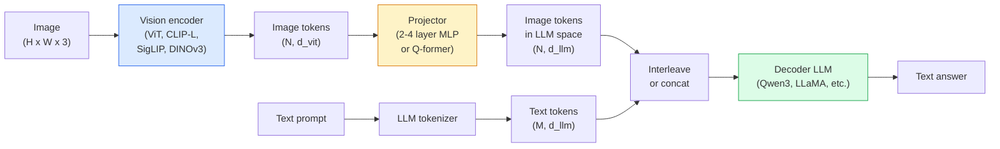

# 视觉语言模型-ViT-MLP-LLM模式

> 视觉编码器将图像转换为代币。MLP投影仪将这些令牌映射到LLM的嵌入空间中。语言模型完成其余的工作。该模式- ViT-MLP-LLM -是2026年的所有生产VLM。

** 类型：** 学习+使用
** 语言：** Python
** 先决条件：** 第4阶段第14课（ViT）、第4阶段第18课（CLIP）、第7阶段第02课（自我注意）
** 时间：** ~75分钟

## 学习目标

- 陈述ViT-MLP-LLM架构并解释三个组件各自的贡献
- 在参数计数、上下文长度和基准性能方面比较Qwen 3-BL、InternVL3.5、LLaBA-Next和GLM-4.6V
- 解释DeepStack：为什么多层ViT功能比单个最后一层功能更好地收紧视觉语言对齐
- 使用跨模式错误率（CMER）测量生产中的VLM幻觉并根据信号采取行动

## 问题

CLIP（第4阶段第18课）为您提供了图像和文本的共享嵌入空间，这足以进行零镜头分类和检索。它无法回答“这张图像中有多少辆红色汽车？”“因为CLIP不生成文本--它只对相似性进行评分。

视觉语言模型（VLMS）-Qwen 3-BL、InternVL3.5、LLaVA-Next、GLM-4.6V -将CLIP系列图像编码器固定到完整的语言模型。该模型看到图像加上问题并生成答案。2026年，开源VLM在多模式基准测试（MMMU、MMBench、DocVQA、ChartQA、MathVista、OSWorld）上与GPT-5和Gemini-2.5-Pro竞争或击败。

三重件（ViT、投影仪、LLM）是标准。模型之间的差异在于哪个ViT、哪个投影仪、哪个LLM、训练数据和对齐配方。一旦您了解了模式，交换任何组件都是机械的。

## 概念

### ViT-MLP-LLM架构



1. ** 视觉编码器 ** -预训练的ViT（CLIP-L/14、SigLIP、DINOv 3或微调变体）。生成补丁令牌。
2. ** 投影仪 ** -一个小型模块（2-4层MLP或Q形成器），将视觉令牌映射到LLM的嵌入维度。这是大部分微调发生的地方。
3. **LLM** -纯解码器语言模型（Qwen 3、Llama、Mistral、GLM、InternLM）。按顺序读取视觉+文本标记，生成文本。

原则上，这三个部分都是可训练的。实际上，投影仪训练时，视觉编码器和LLM大部分保持冻结状态--成本低廉的数十亿个信号参数。

### Deepstack

Vanilla projection uses only the last ViT layer. DeepStack (Qwen3-VL) samples features from multiple ViT depths and stacks them. Deeper layers carry high-level semantics; shallower layers carry fine-grained spatial and textural information. Feeding both into the LLM closes the gap between "what does the image contain" (semantics) and "where exactly" (spatial grounding).

### 三个训练阶段

现代VLM分阶段训练：

1. ** 对齐 ** -冻结ViT和LLM。仅训练投影仪图像字幕对。教投影仪将视觉空间映射到语言空间。
2. ** 预训练 ** -解冻一切。在大规模交错图像-文本数据上训练（500 M+对）。建立模型的视觉知识。
3. ** 指令调整 ** -对策划的（图像、问题、答案）三重组进行微调。教授对话行为和任务格式。这就是将“视觉感知LM”变成可用助手的原因。

大多数LoRA都会使用较小的标签数据集对目标阶段3进行微调。

### 模型家族比较（2026年初）

| 模型 | Params | 视觉编码器 | LLM | 上下文 | 优势 |
|-------|--------|----------------|-----|---------|-----------|
| Qwen 3-DL-235 B-A22 B（MoE） | 235 B（22 B活跃） | 自定义ViT + DeepStack | Qwen 3 | 256K | 通用SOTA、图形用户界面代理 |
| Qwen 3-DL-30 B-A3 B（MoE） | 30 B（3B活跃） | 自定义ViT + DeepStack | Qwen 3 | 256K | 较小的MoE替代方案 |
| Qwen 3-DL-8B（密集） | 8B | 定制ViT | Qwen 3 | 128K | 生产密集型违约 |
| InternVL3.5-38B | 38B | InternViT-6 B | Qwen 3 + GPT-OSS | 128K | 强大的MMBBench/ MMVet |
| InternVL3.5-241B-A28B | 241 B（28 B活跃） | InternViT-6 B | Qwen3 | 128K | 与GPT-4 o竞争 |
| LLaVA-Next 72 B | 72B | SigLIP | Lama-3 | 32K | 开放、易于微调 |
| GLM-4.6V | ~ 70 B | 自定义 | GLM | 64K | 开源、强大的OCR |
| MiniCPM-V-2.6 | 8B | SigLIP | MiniCPM | 32K | 边缘友好 |

### 视觉代理

Qwen 3-BL-235 B在操作图形用户界面（桌面、移动、网络）的 ** 视觉代理 ** 的基准）上达到全球顶级性能。该模型会看到屏幕截图、理解UI并发出操作（单击、输入、滚动）。与工具相结合，它结束了常见桌面任务的循环。这就是大多数2026年“AI PC”演示背后的运行内容。

### 强大的能力+ RoPE变体

VLM需要知道 ** 何时 * 一帧出现在视频中。Qwen 3-BL从T-RoPE（时间旋转位置嵌入）发展到 ** 基于文本的时间对齐 ** -与视频帧交织的显式时间戳文本令牌。该模型看到“<timestamp 00:32>框架，提示”，并可以推理时间关系。

### 对准问题

12% 已爬取数据集中的图像-文本对包含未完全基于图像的描述。接受过这一训练的VLM默默地学会产生幻觉--捏造物体、误读数字、编造关系。在生产中，这是主要的故障模式。

Skywork.ai引入了 ** 跨模式错误率（CMER）** 来跟踪它：

```
CMER = fraction of outputs where the text confidence is high but the image-text similarity (via a CLIP-family checker) is low
```

高CMER意味着模特自信地说出并非基于图像的事情。监控CMER并将其视为生产KPI，可以在部署过程中将幻觉率降低约35%。技巧不在于“修复模型”，而在于“将高CMER输出发送给人类审查”。"

### 利用LoRA / QLoRA进行微调

对于大多数团队来说，对70 B VLM进行全面微调是遥不可及的。注意力+投影仪层上的LoRA（排名16-64），或具有4位基本权重的QLoRA，适合单个A100 / H100。成本：5，000 - 50，000个示例，100 - 5，000美元计算，2-10小时培训。

### 空间推理仍然薄弱

目前的VLM在空间推理基准（上下，左右，计数，距离）上得分为50-60%。如果您的用例依赖于“哪个对象在哪个对象之上”，那么需要进行大量验证--通用VLM的性能低于人类。对于纯空间任务，比VLM更好的替代方案：专门的关键点/姿态估计器，深度模型，或具有后处理框几何的检测模型。

## 建设党

### 第1步：投影仪

The part you will train most often. 2-4 layer MLP with GELU.

```python
import torch
import torch.nn as nn


class Projector(nn.Module):
    def __init__(self, vit_dim=768, llm_dim=4096, hidden=4096):
        super().__init__()
        self.net = nn.Sequential(
            nn.Linear(vit_dim, hidden),
            nn.GELU(),
            nn.Linear(hidden, llm_dim),
        )

    def forward(self, x):
        return self.net(x)
```

输入是“（N_patches，d_vit）”令牌张量。输出是“（N_patches，d_llm）”。LLM将每个输出行视为另一个令牌。

### 第2步：端到端组装ViT-MLP-LLM

最小VLM的向前传球的骨架。实际代码使用“转换器”;这是概念布局。

```python
class MinimalVLM(nn.Module):
    def __init__(self, vit, projector, llm, image_token_id):
        super().__init__()
        self.vit = vit
        self.projector = projector
        self.llm = llm
        self.image_token_id = image_token_id  # placeholder token in text prompt

    def forward(self, image, input_ids, attention_mask):
        # 1. vision features
        vision_tokens = self.vit(image)                     # (B, N_patches, d_vit)
        vision_embeds = self.projector(vision_tokens)       # (B, N_patches, d_llm)

        # 2. text embeddings
        text_embeds = self.llm.get_input_embeddings()(input_ids)  # (B, M, d_llm)

        # 3. replace image placeholder tokens with vision embeds
        merged = self._merge(text_embeds, vision_embeds, input_ids)

        # 4. run LLM
        return self.llm(inputs_embeds=merged, attention_mask=attention_mask)

    def _merge(self, text_embeds, vision_embeds, input_ids):
        out = text_embeds.clone()
        expected = vision_embeds.size(1)
        for b in range(input_ids.size(0)):
            positions = (input_ids[b] == self.image_token_id).nonzero(as_tuple=True)[0]
            if len(positions) != expected:
                raise ValueError(
                    f"batch item {b} has {len(positions)} image tokens but vision_embeds has {expected} patches."
                    " Every sample in the batch must be pre-padded to the same number of image placeholder tokens.")
            out[b, positions] = vision_embeds[b]
        return out
```

文本中的“<image>占位符标记被真实图像嵌入替换-LLaVA、Qwen-VL和InternVL使用的模式相同。

### 第3步：CMER计算

A lightweight runtime check.

```python
import torch.nn.functional as F


def cross_modal_error_rate(image_emb, text_emb, text_confidence, sim_threshold=0.25, conf_threshold=0.8):
    """
    image_emb, text_emb: embeddings of image and generated text (normalised internally)
    text_confidence:     mean per-token probability in [0, 1]
    Returns:             fraction of high-confidence outputs with low image-text alignment
    """
    image_emb = F.normalize(image_emb, dim=-1)
    text_emb = F.normalize(text_emb, dim=-1)
    sim = (image_emb * text_emb).sum(dim=-1)        # cosine similarity
    high_conf_low_sim = (text_confidence > conf_threshold) & (sim < sim_threshold)
    return high_conf_low_sim.float().mean().item()
```

将CMER视为生产KPI。每个端点、每个提示类型、每个客户监控它。CMER上升表明模型开始对某些输入分布产生幻觉。

### 第4步：玩具VLM分类器（可运行）

演示投影仪列车。假的“ViT功能”进入;一个小小的LLM风格代币预测一个班级。

```python
class ToyVLM(nn.Module):
    def __init__(self, vit_dim=32, llm_dim=64, num_classes=5):
        super().__init__()
        self.projector = Projector(vit_dim, llm_dim, hidden=64)
        self.head = nn.Linear(llm_dim, num_classes)

    def forward(self, vision_tokens):
        projected = self.projector(vision_tokens)
        pooled = projected.mean(dim=1)
        return self.head(pooled)
```

只需不到200个步骤就可以将其安装到合成（特征、类）对上-足以表明投影仪模式有效。

## 使用它

2026年生产团队使用VLM的三种方式：

- ** 托管API** - OpenAI Vision、Anthropic Claude Vision、Google Gemini Vision。零基础设施，供应商风险。
- ** 开源自主机 ** -通过“transformers”和“vllm”的Qwen 3-BL或InternVL3.5。完全控制，更高的前期努力。
- ** 对域进行微调 ** -加载Qwen 2.5-BL-7 B或LLaVA-1.6- 7 B，5 k-50 k自定义示例上的LoRA，使用“vllm”或“TGI”。

```python
from transformers import AutoProcessor, AutoModelForVision2Seq
import torch
from PIL import Image

model_id = "Qwen/Qwen3-VL-8B-Instruct"
processor = AutoProcessor.from_pretrained(model_id)
model = AutoModelForVision2Seq.from_pretrained(model_id, torch_dtype=torch.bfloat16, device_map="auto")

messages = [{
    "role": "user",
    "content": [
        {"type": "image", "image": Image.open("plot.png")},
        {"type": "text", "text": "What does this chart show?"},
    ],
}]
inputs = processor.apply_chat_template(messages, add_generation_prompt=True, tokenize=True, return_dict=True, return_tensors="pt").to("cuda")
generated = model.generate(**inputs, max_new_tokens=256)
answer = processor.decode(generated[0][inputs["input_ids"].shape[1]:], skip_special_tokens=True)
```

&#39; apply_chat_temple &#39;隐藏了<image>&#39;占位符标记化;模型在内部处理合并。

## 把它运

本课产生：

- '输出/prompt-vlm-selector.md '-根据准确性、延迟、上下文长度和预算，挑选Qwen 3-VL / InternVL3.5 / LLaVa-Next / API。
- ' outputes/skill-cmer-monitor.md '-发出代码，以通过跨模式错误率、每个端点仪表板和警报阈值来检测生产VLM端点。

## 演习

1. **（简单）** 运行三个提示（“这是什么？”、“计数对象”、“描述场景”）通过五个图像上的任何打开VLM。将每个答案评分为正确/部分正确/手动幻觉。计算首过类似CMER的速率。
2. **（中等）** 在带有字幕的目标域的500张图像上微调Qwen 2.5-BL-3B或LLaVA-1.6- 7 B。比较零拍摄与微调MMBBench风格的准确性。
3. **（硬）** 将VLM的图像编码器替换为DINOv 3，而不是其默认的SigLIP/CLIP。仅重新训练投影仪（冻结的LLM +冻结的DINOv 3）。衡量密度预测任务（计数、空间推理）是否有所改善。

## 关键术语

| Term | 别人怎么说 | 它实际上意味着什么 |
|------|----------------|----------------------|
| ViT-MLP-LLM | “VLM模式” | 视觉编码器+投影仪+语言模型;每年2026年VLM |
| 投影仪 | “桥” | 2-4层MLP（或Q形成器），将视觉令牌映射到LLM嵌入空间 |
| DeepStack | “Qwen 3-BL功能技巧” | 多层ViT功能堆叠而不是仅最后一层 |
| 图像代币 | “<image>占位符” | 文本流中的特殊标记被投影视觉嵌入取代 |
| CMER | “幻觉KPI” | 跨模式错误率;当文本置信度高但图像与文本相似度低时，较高 |
| 视觉代理 | “点击的VLM” | VLM通过工具调用操作图形用户界面（操作系统世界、移动、网络） |
| Q型形成者 | “固定计数代币桥” | BLIP-2风格投影仪产生固定数量的视觉查询令牌 |
| 校准/预培训/指令调整 | "Three stages" | 标准VLM培训管道 |

## 进一步阅读

- [Qwen 3-DL技术报告（arXiv 2511.21631）]（https：//arxiv.org/ab/2511.21631）
- [InternVL3.5推进开源多模式模型（arXiv 2508.18265）]（https：//arxiv.org/html/2508.18265v1）
- [LLaVA-下一个系列]（https：//llava-vl.github.io/blog/2024-05-10-llava-next-stronger-llms/）
- [BentoML：2026年最佳开源VLMS]（https：//www.Thomoml.com/blog/multimodal-ai-a-guide-to-open-source-vision-language-models）
- [MMMU: Multi-discipline Multimodal Understanding benchmark](https://mmmu-benchmark.github.io/)
- [VLMs制造业（机器人明天，2026年3月）]（https：//www.roboticstomorrow.com/story/2026/03/when-machiners-learn-to-see-liber-liber-elike-experts-the-rise-of-vision-languages-models-in-manager/26335/）
