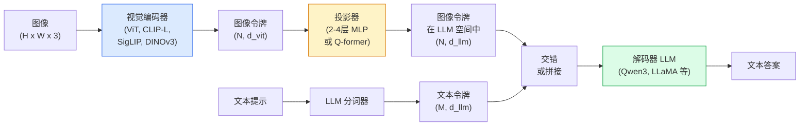

# 视觉语言模型 — ViT-MLP-LLM 架构模式

> 视觉编码器将图像转换为令牌（tokens）。MLP 投影器将这些令牌映射到 LLM 的嵌入空间。语言模型完成其余工作。这一模式——ViT-MLP-LLM——是 2026 年所有生产级 VLM 的基础。

**类型：** 学习 + 应用  
**语言：** Python  
**前置知识：** 第 4 阶段第 14 课（ViT），第 4 阶段第 18 课（CLIP），第 7 阶段第 2 课（自注意力 Self-Attention）  
**时间：** 约 75 分钟  

## 学习目标

- 阐述 ViT-MLP-LLM 架构，并解释三个组件各自的作用
- 比较 Qwen3-VL、InternVL3.5、LLaVA-Next 和 GLM-4.6V 在参数量、上下文长度和基准测试性能上的差异
- 解释 DeepStack：为何多层级 ViT 特征比单一末层特征能更紧密地实现视觉-语言对齐
- 使用跨模态错误率（Cross-Modal Error Rate, CMER）在生产环境中测量 VLM 幻觉，并依据该信号采取行动

## 问题描述

CLIP（第 4 阶段第 18 课）为图像和文本提供了共享嵌入空间，足以支持零样本分类和检索。但它无法回答“这张图里有几辆红色汽车？”，因为 CLIP 不生成文本——它只计算相似度。

视觉语言模型（Vision-Language Models, VLMs）——如 Qwen3-VL、InternVL3.5、LLaVA-Next、GLM-4.6V——将 CLIP 家族的图像编码器与完整的大语言模型结合。模型接收图像加问题，并生成答案。到 2026 年，开源 VLM 在多模态基准（MMMU、MMBench、DocVQA、ChartQA、MathVista、OSWorld）上已经能够匹敌或超越 GPT-5 和 Gemini-2.5-Pro。

这三个组件（ViT、投影器、LLM）是标准配置。模型之间的差异在于：采用哪个 ViT、哪个投影器、哪个 LLM、训练数据以及对齐策略。一旦理解了这一模式，更换任何组件都只是机械性操作。

## 核心概念

### ViT-MLP-LLM 架构



1. **视觉编码器（Vision encoder）**——一个预训练的 ViT（CLIP-L/14、SigLIP、DINOv3 或其微调变体）。生成图像块令牌（patch tokens）。
2. **投影器（Projector）**——一个小型模块（2-4 层 MLP 或 Q-former），将视觉令牌映射到 LLM 的嵌入维度。大部分微调工作发生在此处。
3. **LLM（大语言模型）**——一个仅解码器的大语言模型（Qwen3、Llama、Mistral、GLM、InternLM）。顺序读取视觉+文本令牌，生成文本。

原则上三个组件均可训练。实践中，视觉编码器和 LLM 大部分保持冻结，只训练投影器——以较低成本传递数十亿参数的信号。

### DeepStack

普通投影仅使用最后一层 ViT 特征。DeepStack（Qwen3-VL）从多个 ViT 深度采样特征并堆叠。更深层携带高层语义；较浅层携带细粒度空间和纹理信息。将两者同时输入 LLM，缩小了“图像包含什么”（语义）与“具体在哪里”（空间定位）之间的差距。

### 三个训练阶段

现代 VLM 分阶段训练：

1. **对齐（Alignment）** ——冻结 ViT 和 LLM。仅训练图像-描述对上的投影器。教会投影器将视觉空间映射到语言空间。
2. **预训练（Pre-training）** ——解冻所有参数。在大规模交错图文数据（5 亿+对）上训练。构建模型的视觉知识。
3. **指令微调（Instruction tuning）** ——在精心整理的（图像、问题、答案）三元组上微调。训练对话行为和任务格式。这一步将“有视觉感知的语言模型”变为可用的助手。

大多数 LoRA 微调针对第 3 阶段，使用小规模标注数据集。

### 模型家族对比（2026 年初）

| 模型 | 参数量 | 视觉编码器 | LLM | 上下文长度 | 优势 |
|-------|--------|----------------|-----|---------|-----------|
| Qwen3-VL-235B-A22B (MoE) | 235B（22B 活跃） | 自定义 ViT + DeepStack | Qwen3 | 256K | 通用 SOTA，GUI 智能体 |
| Qwen3-VL-30B-A3B (MoE) | 30B（3B 活跃） | 自定义 ViT + DeepStack | Qwen3 | 256K | 更小的 MoE 替代方案 |
| Qwen3-VL-8B (密集) | 8B | 自定义 ViT | Qwen3 | 128K | 生产级密集模型默认选择 |
| InternVL3.5-38B | 38B | InternViT-6B | Qwen3 + GPT-OSS | 128K | 在 MMBench / MMVet 上表现强劲 |
| InternVL3.5-241B-A28B | 241B（28B 活跃） | InternViT-6B | Qwen3 | 128K | 与 GPT-4o 竞争力相当 |
| LLaVA-Next 72B | 72B | SigLIP | Llama-3 | 32K | 开源，易于微调 |
| GLM-4.6V | ~70B | 自定义 | GLM | 64K | 开源，OCR 能力强 |
| MiniCPM-V-2.6 | 8B | SigLIP | MiniCPM | 32K | 适合边缘设备 |

### 视觉智能体（Visual agents）

Qwen3-VL-235B 在 OSWorld 上达到了全球顶级性能——OSWorld 是衡量**视觉智能体**（操作 GUI：桌面、移动端、网页）的基准。模型看到截图，理解 UI，并发出操作（点击、输入、滚动）。结合工具后，它能闭环完成常见的桌面任务。2026 年大多数“AI PC”演示底层运行的就是这个。

### 智能体能力 + RoPE 变体

VLM 需要知道视频中**何时**有一帧。Qwen3-VL 从 T-RoPE（时间旋转位置编码）演进到**基于文本的时间对齐**——在视频帧之间交错插入显式的时间戳文本令牌。模型看到“`<timestamp 00:32>` 帧，提示”，并能够推理时间关系。

### 对齐问题

在爬取的图文对数据集中，12% 的图像描述并未完全基于图像内容。基于此训练的 VLM 会悄无声息地学会幻觉——编造物体、误读数字、虚构关系。在生产环境中，这是最主要的失效模式。

Skywork.ai 引入了**跨模态错误率（Cross-Modal Error Rate, CMER）** 来跟踪该问题：

```
CMER = 输出中文本置信度高但图像-文本相似度（通过 CLIP 家族检查器）低的样本比例
```

高 CMER 意味着模型自信地说出与图像无关的内容。监控 CMER 并将其视为生产关键指标（KPI），在其部署中将幻觉率降低了约 35%。诀窍不是“修复模型”，而是“将高 CMER 输出路由至人工审核”。

### 使用 LoRA / QLoRA 微调

对于大多数团队来说，对 70B VLM 进行全量微调是遥不可及的。LoRA（秩 16-64）应用于注意力层和投影器，或使用 4 位基础权重的 QLoRA，可以在单张 A100 / H100 上运行。成本：5,000-50,000 个样本，$100-$5,000 的计算费用，2-10 小时的训练时间。

### 空间推理能力仍然薄弱

当前 VLM 在空间推理基准（上下、左右、计数、距离）上的得分为 50-60%。如果您的用例依赖于“哪个物体在另一个上面”，请务必进行充分验证——通用 VLM 的性能低于人类。对于纯空间任务，更好的替代方案包括：专门的关节点/姿态估计器、深度模型，或带有边界框几何后处理的检测模型。

## 构建实践

### 第 1 步：投影器

您最常训练的部分。2-4 层 MLP，使用 GELU 激活函数。

```python
import torch
import torch.nn as nn


class Projector(nn.Module):
    def __init__(self, vit_dim=768, llm_dim=4096, hidden=4096):
        super().__init__()
        self.net = nn.Sequential(
            nn.Linear(vit_dim, hidden),
            nn.GELU(),
            nn.Linear(hidden, llm_dim),
        )

    def forward(self, x):
        return self.net(x)
```

输入是一个 `(N_patches, d_vit)` 令牌张量。输出是 `(N_patches, d_llm)`。LLM 将输出的每一行视为另一个普通令牌。

### 第 2 步：端到端组装 ViT-MLP-LLM

最小化 VLM 的前向传播骨架。实际代码使用 `transformers`，此处展示概念布局。

```python
class MinimalVLM(nn.Module):
    def __init__(self, vit, projector, llm, image_token_id):
        super().__init__()
        self.vit = vit
        self.projector = projector
        self.llm = llm
        self.image_token_id = image_token_id  # 文本提示中的占位符令牌

    def forward(self, image, input_ids, attention_mask):
        # 1. 视觉特征
        vision_tokens = self.vit(image)                     # (B, N_patches, d_vit)
        vision_embeds = self.projector(vision_tokens)       # (B, N_patches, d_llm)

        # 2. 文本嵌入
        text_embeds = self.llm.get_input_embeddings()(input_ids)  # (B, M, d_llm)

        # 3. 用视觉嵌入替换图像占位符令牌
        merged = self._merge(text_embeds, vision_embeds, input_ids)

        # 4. 运行 LLM
        return self.llm(inputs_embeds=merged, attention_mask=attention_mask)

    def _merge(self, text_embeds, vision_embeds, input_ids):
        out = text_embeds.clone()
        expected = vision_embeds.size(1)
        for b in range(input_ids.size(0)):
            positions = (input_ids[b] == self.image_token_id).nonzero(as_tuple=True)[0]
            if len(positions) != expected:
                raise ValueError(
                    f"batch item {b} has {len(positions)} image tokens but vision_embeds has {expected} patches."
                    " Every sample in the batch must be pre-padded to the same number of image placeholder tokens.")
            out[b, positions] = vision_embeds[b]
        return out
```

文本中的 `<image>` 占位符令牌被替换为真实的图像嵌入——与 LLaVA、Qwen-VL 和 InternVL 使用的模式相同。

### 第 3 步：CMER 计算

一个轻量级的运行时检查。

```python
import torch.nn.functional as F


def cross_modal_error_rate(image_emb, text_emb, text_confidence, sim_threshold=0.25, conf_threshold=0.8):
    """
    image_emb, text_emb: 图像和生成文本的嵌入（内部会做归一化）
    text_confidence:     每个令牌平均概率，范围 [0, 1]
    返回:                高置信度输出中图像-文本对齐度低的比例
    """
    image_emb = F.normalize(image_emb, dim=-1)
    text_emb = F.normalize(text_emb, dim=-1)
    sim = (image_emb * text_emb).sum(dim=-1)        # 余弦相似度
    high_conf_low_sim = (text_confidence > conf_threshold) & (sim < sim_threshold)
    return high_conf_low_sim.float().mean().item()
```

将 CMER 视为生产 KPI。按端点、提示类型、客户进行监控。CMER 上升表明模型在某些输入分布上开始产生幻觉。

### 第 4 步：玩具 VLM 分类器（可运行）

演示投影器可以训练。输入伪造的“ViT 特征”，一个迷你 LLM 风格令牌预测类别。

```python
class ToyVLM(nn.Module):
    def __init__(self, vit_dim=32, llm_dim=64, num_classes=5):
        super().__init__()
        self.projector = Projector(vit_dim, llm_dim, hidden=64)
        self.head = nn.Linear(llm_dim, num_classes)

    def forward(self, vision_tokens):
        projected = self.projector(vision_tokens)
        pooled = projected.mean(dim=1)
        return self.head(pooled)
```

可以在合成（特征，类别）对上不到 200 步内完成拟合——足以证明投影器模式有效。

## 实际应用

2026 年生产团队使用 VLM 的三种方式：

- **托管 API**——OpenAI Vision、Anthropic Claude Vision、Google Gemini Vision。零基础设施，有供应商风险。
- **开源自托管**——通过 `transformers` 和 `vllm` 使用 Qwen3-VL 或 InternVL3.5。完全控制，前期投入较高。
- **领域微调**——加载 Qwen2.5-VL-7B 或 LLaVA-1.6-7B，在 5k-50k 自定义样本上使用 LoRA，通过 `vllm` 或 `TGI` 提供服务。

```python
from transformers import AutoProcessor, AutoModelForVision2Seq
import torch
from PIL import Image

model_id = "Qwen/Qwen3-VL-8B-Instruct"
processor = AutoProcessor.from_pretrained(model_id)
model = AutoModelForVision2Seq.from_pretrained(model_id, torch_dtype=torch.bfloat16, device_map="auto")

messages = [{
    "role": "user",
    "content": [
        {"type": "image", "image": Image.open("plot.png")},
        {"type": "text", "text": "这个图表展示了什么？"},
    ],
}]
inputs = processor.apply_chat_template(messages, add_generation_prompt=True, tokenize=True, return_dict=True, return_tensors="pt").to("cuda")
generated = model.generate(**inputs, max_new_tokens=256)
answer = processor.decode(generated[0][inputs["input_ids"].shape[1]:], skip_special_tokens=True)
```

`apply_chat_template` 隐藏了 `<image>` 占位符的分词过程；模型内部处理合并。

## 交付成果

本课程产出以下内容：

- `outputs/prompt-vlm-selector.md`——根据准确率、延迟、上下文长度和预算，选择 Qwen3-VL / InternVL3.5 / LLaVA-Next / API。
- `outputs/skill-cmer-monitor.md`——提供代码，用于对生产级 VLM 端点进行跨模态错误率检测、端点级仪表盘和告警阈值设置。

## 练习

1. **（简单）** 使用任意开源 VLM，对五张图像运行三个提示（“这是什么？”、“数一数物体”、“描述场景”）。手动将每个答案评为正确 / 部分正确 / 幻觉。计算一个初级的类 CMER 比率。
2. **（中等）** 使用 LoRA（秩 16）在 500 张目标领域图像及其描述上微调 Qwen2.5-VL-3B 或 LLaVA-1.6-7B。比较零样本与微调后的 MMBench 风格准确率。
3. **（困难）** 将 VLM 的图像编码器