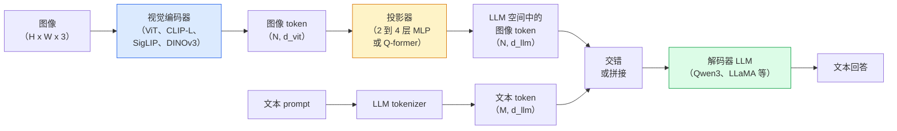

# 视觉-语言模型 —— ViT-MLP-LLM 范式

> 译注：本文译自同目录 [`en.md`](./en.md)。术语遵循仓根 [TRANSLATION_GUIDE.md](../../../../TRANSLATION_GUIDE.md)。

> 一个视觉 encoder 把图像转成 token。一个 MLP projector（投影器）把这些 token 映射到 LLM 的 embedding 空间。一个语言模型负责剩下的事情。这个范式 —— ViT-MLP-LLM —— 就是 2026 年所有生产级 VLM 的样子。

**Type:** Learn + Use
**Languages:** Python
**Prerequisites:** Phase 4 Lesson 14 (ViT), Phase 4 Lesson 18 (CLIP), Phase 7 Lesson 02 (Self-Attention)
**Time:** ~75 minutes

## 学习目标（Learning Objectives）

- 说清 ViT-MLP-LLM 架构，并解释这三个组件各自贡献了什么
- 在参数量、context window 和 benchmark 表现上对比 Qwen3-VL、InternVL3.5、LLaVA-Next 和 GLM-4.6V
- 解释 DeepStack：为什么多层 ViT 特征比单一最后一层特征能更好地收紧视觉-语言对齐
- 用 Cross-Modal Error Rate（CMER，跨模态错误率）在生产中度量 VLM 的 hallucination（幻觉），并据此采取行动

## 问题（The Problem）

CLIP（Phase 4 Lesson 18）给了你一个图像和文本共享的 embedding 空间，这对 zero-shot 分类和检索来说够用。但它回答不了「这张图里有几辆红色的车？」—— 因为 CLIP 不生成文本，它只算相似度。

视觉-语言模型（Vision-Language Models, VLMs）—— Qwen3-VL、InternVL3.5、LLaVA-Next、GLM-4.6V —— 把一个 CLIP 系列的图像 encoder 拼到一个完整的语言模型上。模型看到一张图加一个问题，然后生成答案。2026 年开源 VLM 在多模态 benchmark（MMMU、MMBench、DocVQA、ChartQA、MathVista、OSWorld）上已经追平甚至超过 GPT-5 和 Gemini-2.5-Pro。

这三件套（ViT、projector、LLM）就是标准范式。模型之间的差异在于：用哪个 ViT、哪个 projector、哪个 LLM、训练数据是什么、对齐 recipe（配方）怎么搞。一旦你理解了这个范式，换任何一个组件都只是机械操作。

## 概念（The Concept）

### ViT-MLP-LLM 架构



1. **视觉 encoder** —— 一个预训练的 ViT（CLIP-L/14、SigLIP、DINOv3，或者它们的微调变体）。产出 patch token。
2. **Projector** —— 一个小模块（2-4 层 MLP，或者 Q-former），把视觉 token 映射到 LLM 的 embedding 维度。这里是大多数微调动作发生的地方。
3. **LLM** —— 一个 decoder-only 的语言模型（Qwen3、Llama、Mistral、GLM、InternLM）。按顺序读取视觉+文本 token，生成文本。

原则上三个组件都可训。但实际操作里，视觉 encoder 和 LLM 大多保持冻结，只训 projector —— 用很少的算力就能拿到几十亿参数级别的信号。

### DeepStack

朴素 projection 只用 ViT 最后一层。DeepStack（Qwen3-VL）从 ViT 多个深度采样特征再堆起来。深层携带高层语义；浅层携带细粒度的空间和纹理信息。把两者一起喂给 LLM，弥合了「图里有什么」（语义）和「在哪里」（空间定位）之间的 gap。

### 三阶段训练

现代 VLM 是分阶段训练的：

1. **对齐（Alignment）** —— 冻结 ViT 和 LLM。只在图像-caption 对上训 projector。教 projector 把视觉空间映射到语言空间。
2. **预训练（Pre-training）** —— 全部解冻。在大规模交错图文数据（500M+ 对）上训。建立模型的视觉知识。
3. **指令微调（Instruction tuning）** —— 在精选的（图像、问题、答案）三元组上 fine-tune。教会对话行为和任务格式。这一步把「视觉感知的 LM」变成可用的助手。

大多数 LoRA 微调瞄准的是阶段 3，用一个小型有标签数据集就行。

### 模型家族对比（2026 年初）

| 模型 | 参数量 | 视觉 encoder | LLM | Context | 优势 |
|-------|--------|----------------|-----|---------|-----------|
| Qwen3-VL-235B-A22B (MoE) | 235B（22B 激活） | 自研 ViT + DeepStack | Qwen3 | 256K | 综合 SOTA、GUI agent |
| Qwen3-VL-30B-A3B (MoE) | 30B（3B 激活） | 自研 ViT + DeepStack | Qwen3 | 256K | 更小的 MoE 备选 |
| Qwen3-VL-8B (dense) | 8B | 自研 ViT | Qwen3 | 128K | 生产级 dense 默认选择 |
| InternVL3.5-38B | 38B | InternViT-6B | Qwen3 + GPT-OSS | 128K | MMBench / MMVet 上很强 |
| InternVL3.5-241B-A28B | 241B（28B 激活） | InternViT-6B | Qwen3 | 128K | 与 GPT-4o 相当 |
| LLaVA-Next 72B | 72B | SigLIP | Llama-3 | 32K | 开源、易微调 |
| GLM-4.6V | ~70B | 自研 | GLM | 64K | 开源、OCR 强 |
| MiniCPM-V-2.6 | 8B | SigLIP | MiniCPM | 32K | 适合端侧 |

### 视觉 agent

Qwen3-VL-235B 在 OSWorld 上拿到全球顶级表现 —— 这是一个针对 **视觉 agent** 的 benchmark，考察 agent 在 GUI（桌面、移动、网页）上的操作能力。模型看到一张截图，理解 UI，再发出动作（点击、输入、滚动）。配合工具，就能闭环很多常见的桌面任务。这就是 2026 年大多数「AI PC」演示底层在跑的东西。

### Agentic 能力 + RoPE 变体

VLM 需要知道一帧画面**在视频里的什么时刻**。Qwen3-VL 从 T-RoPE（temporal rotary position embeddings）演化到了 **基于文本的时间对齐** —— 用显式的时间戳文本 token 与视频帧交错。模型会看到「`<timestamp 00:32>` frame, prompt」，从而能对时间关系做推理。

### 对齐问题

爬取的数据集里 12% 的图文对，文本描述并没有完全对应到图像里。在这种数据上训出来的 VLM 会悄悄学会 hallucinate —— 编造物体、读错数字、虚构关系。在生产里这是头号 failure mode。

Skywork.ai 提出了 **Cross-Modal Error Rate（CMER）** 来追踪它：

```
CMER = fraction of outputs where the text confidence is high but the image-text similarity (via a CLIP-family checker) is low
```

CMER 高，意味着模型很自信地说出了图里没有的内容。把 CMER 当作生产 KPI 来监控，他们的部署里 hallucination 率降低了约 35%。诀窍不在「修模型」，而在「把高 CMER 的输出路由到人工审核」。

### 用 LoRA / QLoRA 做微调

70B VLM 全量微调对大多数团队来说是不可及的。在 attention + projector 层上做 LoRA（rank 16-64），或者 4-bit 基础权重的 QLoRA，单卡 A100 / H100 就能跑。代价：5,000-50,000 个样本，$100-$5,000 的算力，2-10 小时训练时间。

### 空间推理仍然偏弱

当前 VLM 在空间推理 benchmark（上下、左右、计数、距离）上只能到 50-60%。如果你的用例依赖「哪个物体在哪个物体上面」，要做大量验证 —— 通用 VLM 表现是低于人类的。纯空间任务里比 VLM 更靠谱的替代方案：专门的关键点 / 姿态估计器、深度模型、或者带 box 几何后处理的检测模型。

## 动手实现（Build It）

### Step 1：Projector

你最常会训的部分。2-4 层 MLP 配 GELU。

```python
import torch
import torch.nn as nn


class Projector(nn.Module):
    def __init__(self, vit_dim=768, llm_dim=4096, hidden=4096):
        super().__init__()
        self.net = nn.Sequential(
            nn.Linear(vit_dim, hidden),
            nn.GELU(),
            nn.Linear(hidden, llm_dim),
        )

    def forward(self, x):
        return self.net(x)
```

输入是 `(N_patches, d_vit)` 的 token 张量。输出是 `(N_patches, d_llm)`。LLM 把每一行输出当成又一个 token。

### Step 2：把 ViT-MLP-LLM 端到端拼起来

最小 VLM 前向过程的骨架。真实代码用 `transformers`；这里只是概念布局。

```python
class MinimalVLM(nn.Module):
    def __init__(self, vit, projector, llm, image_token_id):
        super().__init__()
        self.vit = vit
        self.projector = projector
        self.llm = llm
        self.image_token_id = image_token_id  # placeholder token in text prompt

    def forward(self, image, input_ids, attention_mask):
        # 1. vision features
        vision_tokens = self.vit(image)                     # (B, N_patches, d_vit)
        vision_embeds = self.projector(vision_tokens)       # (B, N_patches, d_llm)

        # 2. text embeddings
        text_embeds = self.llm.get_input_embeddings()(input_ids)  # (B, M, d_llm)

        # 3. replace image placeholder tokens with vision embeds
        merged = self._merge(text_embeds, vision_embeds, input_ids)

        # 4. run LLM
        return self.llm(inputs_embeds=merged, attention_mask=attention_mask)

    def _merge(self, text_embeds, vision_embeds, input_ids):
        out = text_embeds.clone()
        expected = vision_embeds.size(1)
        for b in range(input_ids.size(0)):
            positions = (input_ids[b] == self.image_token_id).nonzero(as_tuple=True)[0]
            if len(positions) != expected:
                raise ValueError(
                    f"batch item {b} has {len(positions)} image tokens but vision_embeds has {expected} patches."
                    " Every sample in the batch must be pre-padded to the same number of image placeholder tokens.")
            out[b, positions] = vision_embeds[b]
        return out
```

文本里的 `<image>` 占位 token 被真实的图像 embedding 替换 —— LLaVA、Qwen-VL、InternVL 用的都是同一种范式。

### Step 3：CMER 计算

一个轻量的运行时检查。

```python
import torch.nn.functional as F


def cross_modal_error_rate(image_emb, text_emb, text_confidence, sim_threshold=0.25, conf_threshold=0.8):
    """
    image_emb, text_emb: embeddings of image and generated text (normalised internally)
    text_confidence:     mean per-token probability in [0, 1]
    Returns:             fraction of high-confidence outputs with low image-text alignment
    """
    image_emb = F.normalize(image_emb, dim=-1)
    text_emb = F.normalize(text_emb, dim=-1)
    sim = (image_emb * text_emb).sum(dim=-1)        # cosine similarity
    high_conf_low_sim = (text_confidence > conf_threshold) & (sim < sim_threshold)
    return high_conf_low_sim.float().mean().item()
```

把 CMER 当成生产 KPI 来用。按 endpoint、按 prompt 类型、按客户分别监控。CMER 上升说明模型在某种输入分布下开始 hallucinate 了。

### Step 4：玩具版 VLM 分类器（可运行）

证明 projector 训得动。喂入伪造的「ViT 特征」；一个 LLM 风格的小 token 预测一个类别。

```python
class ToyVLM(nn.Module):
    def __init__(self, vit_dim=32, llm_dim=64, num_classes=5):
        super().__init__()
        self.projector = Projector(vit_dim, llm_dim, hidden=64)
        self.head = nn.Linear(llm_dim, num_classes)

    def forward(self, vision_tokens):
        projected = self.projector(vision_tokens)
        pooled = projected.mean(dim=1)
        return self.head(pooled)
```

在合成的 (feature, class) 对上 200 步以内就能拟合 —— 足够展示 projector 范式确实管用。

## 用起来（Use It）

2026 年生产团队用 VLM 的三条路：

- **托管 API** —— OpenAI Vision、Anthropic Claude Vision、Google Gemini Vision。零基础设施，但有厂商风险。
- **开源自托管** —— 通过 `transformers` 和 `vllm` 跑 Qwen3-VL 或 InternVL3.5。完全可控，但前期投入更高。
- **领域微调** —— 加载 Qwen2.5-VL-7B 或 LLaVA-1.6-7B，在 5k-50k 自定义样本上做 LoRA，用 `vllm` 或 `TGI` 提供服务。

```python
from transformers import AutoProcessor, AutoModelForVision2Seq
import torch
from PIL import Image

model_id = "Qwen/Qwen3-VL-8B-Instruct"
processor = AutoProcessor.from_pretrained(model_id)
model = AutoModelForVision2Seq.from_pretrained(model_id, torch_dtype=torch.bfloat16, device_map="auto")

messages = [{
    "role": "user",
    "content": [
        {"type": "image", "image": Image.open("plot.png")},
        {"type": "text", "text": "What does this chart show?"},
    ],
}]
inputs = processor.apply_chat_template(messages, add_generation_prompt=True, tokenize=True, return_dict=True, return_tensors="pt").to("cuda")
generated = model.generate(**inputs, max_new_tokens=256)
answer = processor.decode(generated[0][inputs["input_ids"].shape[1]:], skip_special_tokens=True)
```

`apply_chat_template` 帮你把 `<image>` 占位 token 化的细节藏起来；模型内部完成 merge。

## 上线部署（Ship It）

本课会产出：

- `outputs/prompt-vlm-selector.md` —— 给定准确度、延迟、context window、预算后，挑选 Qwen3-VL / InternVL3.5 / LLaVA-Next / API。
- `outputs/skill-cmer-monitor.md` —— 给生产级 VLM endpoint 加 cross-modal error rate 检测、按 endpoint 的 dashboard 和告警阈值的代码。

## 练习（Exercises）

1. **（简单）** 在五张图上对任意开源 VLM 跑三种 prompt（"what is this?"、"count the objects"、"describe the scene"）。手工把每个回答打分为正确 / 部分正确 / hallucinate。算出一个一阶 CMER 类似的比率。
2. **（中等）** 用 LoRA（rank 16）在 500 张目标领域带 caption 的图上微调 Qwen2.5-VL-3B 或 LLaVA-1.6-7B。对比 zero-shot 与微调后在 MMBench 风格上的准确率。
3. **（困难）** 把 VLM 的图像 encoder 从默认的 SigLIP/CLIP 换成 DINOv3。只重训 projector（LLM 和 DINOv3 都冻结）。看密集预测任务（计数、空间推理）有没有提升。

## 关键术语（Key Terms）

| 术语 | 大家口头怎么说 | 实际指什么 |
|------|----------------|----------------------|
| ViT-MLP-LLM | 「VLM 范式」 | 视觉 encoder + projector + 语言模型；2026 年所有 VLM |
| Projector | 「桥」 | 2-4 层 MLP（或 Q-former），把视觉 token 映射到 LLM embedding 空间 |
| DeepStack | 「Qwen3-VL 的特征技巧」 | 多层 ViT 特征堆叠，而不是只用最后一层 |
| Image token | 「<image> 占位符」 | 文本流里的特殊 token，会被投影后的视觉 embedding 替换 |
| CMER | 「Hallucination KPI」 | Cross-Modal Error Rate；当文本 confidence 高但图文相似度低时升高 |
| 视觉 agent | 「会点击的 VLM」 | 操作 GUI（OSWorld、移动端、网页）并带 tool call 的 VLM |
| Q-former | 「定数 token 桥」 | BLIP-2 风格的 projector，产出固定数量的视觉 query token |
| 对齐 / 预训练 / 指令微调 | 「三阶段」 | 标准的 VLM 训练流水线 |

## 延伸阅读（Further Reading）

- [Qwen3-VL Technical Report (arXiv 2511.21631)](https://arxiv.org/abs/2511.21631)
- [InternVL3.5 Advancing Open-Source Multimodal Models (arXiv 2508.18265)](https://arxiv.org/html/2508.18265v1)
- [LLaVA-Next series](https://llava-vl.github.io/blog/2024-05-10-llava-next-stronger-llms/)
- [BentoML: Best Open-Source VLMs 2026](https://www.bentoml.com/blog/multimodal-ai-a-guide-to-open-source-vision-language-models)
- [MMMU: Multi-discipline Multimodal Understanding benchmark](https://mmmu-benchmark.github.io/)
- [VLMs in manufacturing (Robotics Tomorrow, March 2026)](https://www.roboticstomorrow.com/story/2026/03/when-machines-learn-to-see-like-experts-the-rise-of-vision-language-models-in-manufacturing/26335/)
