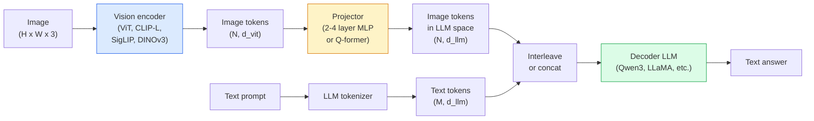

# 25 · 视觉-语言模型 —— ViT-MLP-LLM 范式

> 视觉编码器把图像转换成 token；MLP 投影器把这些 token 映射到大语言模型（LLM）的嵌入空间；语言模型完成余下的工作。这一范式——ViT-MLP-LLM——就是 2026 年所有生产级 VLM 的共同骨架。

**类型：** 学习 + 实战
**语言：** Python
**前置：** 第 4 阶段第 14 课（ViT）、第 4 阶段第 18 课（CLIP）、第 7 阶段第 02 课（自注意力）
**时长：** 约 75 分钟

## 学习目标

- 阐述 ViT-MLP-LLM 架构，并解释三个组件各自的贡献
- 从参数量、上下文长度与基准表现上对比 Qwen3-VL、InternVL3.5、LLaVA-Next 与 GLM-4.6V
- 解释 DeepStack：为什么多层级 ViT 特征比单一末层特征能更紧密地对齐视觉与语言
- 在生产环境中用「跨模态错误率（Cross-Modal Error Rate，CMER）」度量 VLM 幻觉，并据此采取行动

## 问题所在

CLIP（第 4 阶段第 18 课）为图像和文本提供了一个共享嵌入空间，这足以支撑零样本分类与检索。但它无法回答「这张图里有几辆红色的车？」，因为 CLIP 并不生成文本——它只计算相似度得分。

视觉-语言模型（Vision-Language Models，VLM）——Qwen3-VL、InternVL3.5、LLaVA-Next、GLM-4.6V——把一个 CLIP 系列的图像编码器嫁接到一个完整的语言模型上。模型同时看到图像和问题，并生成答案。2026 年，开源 VLM 在多模态基准（MMMU、MMBench、DocVQA、ChartQA、MathVista、OSWorld）上已能与 GPT-5、Gemini-2.5-Pro 比肩甚至胜出。

ViT、投影器、LLM 这三件套是行业标准。各模型之间的差异在于：用哪个 ViT、哪个投影器、哪个 LLM，以及训练数据和对齐配方。一旦你理解了这一范式，替换其中任意组件都只是机械操作。

## 核心概念

### ViT-MLP-LLM 架构



1. **视觉编码器** —— 一个预训练的 ViT（CLIP-L/14、SigLIP、DINOv3，或其微调变体），产出图块（patch）token。
2. **投影器** —— 一个小模块（2–4 层 MLP，或一个 Q-former），把视觉 token 映射到 LLM 的嵌入维度。绝大部分微调都发生在这里。
3. **LLM** —— 一个仅解码器（decoder-only）语言模型（Qwen3、Llama、Mistral、GLM、InternLM）。它按序列读取视觉 + 文本 token，并生成文本。

原则上三个组件都可训练。但在实践中，视觉编码器和 LLM 大多保持冻结，只训练投影器——用很低的成本就能获得数十亿参数规模的信号。

### DeepStack

朴素的投影只用 ViT 的最后一层。DeepStack（Qwen3-VL）从 ViT 的多个深度采样特征并将其堆叠。更深的层携带高层语义；更浅的层携带细粒度的空间与纹理信息。把两者都喂给 LLM，弥合了「图里有什么」（语义）与「具体在哪里」（空间定位）之间的鸿沟。

### 三个训练阶段

现代 VLM 分阶段训练：

1. **对齐（Alignment）** —— 冻结 ViT 和 LLM，只在图像-字幕（caption）对上训练投影器。教会投影器把视觉空间映射到语言空间。
2. **预训练（Pre-training）** —— 解冻所有组件，在大规模图文交错数据（5 亿对以上）上训练。构建模型的视觉知识。
3. **指令微调（Instruction tuning）** —— 在精选的（图像，问题，答案）三元组上微调。教会对话行为和任务格式。这一步把一个「具备视觉感知能力的语言模型」变成一个可用的助手。

大多数 LoRA 微调都瞄准第 3 阶段，使用一个小型标注数据集即可。

### 模型家族对比（2026 年初）

| 模型 | 参数量 | 视觉编码器 | LLM | 上下文 | 优势 |
|-------|--------|----------------|-----|---------|-----------|
| Qwen3-VL-235B-A22B (MoE) | 235B（22B 激活） | 自研 ViT + DeepStack | Qwen3 | 256K | 通用 SOTA，GUI 智能体 |
| Qwen3-VL-30B-A3B (MoE) | 30B（3B 激活） | 自研 ViT + DeepStack | Qwen3 | 256K | 更小的 MoE 备选 |
| Qwen3-VL-8B (dense) | 8B | 自研 ViT | Qwen3 | 128K | 生产级稠密默认选择 |
| InternVL3.5-38B | 38B | InternViT-6B | Qwen3 + GPT-OSS | 128K | MMBench / MMVet 表现强 |
| InternVL3.5-241B-A28B | 241B（28B 激活） | InternViT-6B | Qwen3 | 128K | 可与 GPT-4o 竞争 |
| LLaVA-Next 72B | 72B | SigLIP | Llama-3 | 32K | 开源，易于微调 |
| GLM-4.6V | 约 70B | 自研 | GLM | 64K | 开源，OCR 能力强 |
| MiniCPM-V-2.6 | 8B | SigLIP | MiniCPM | 32K | 适合边缘端 |

### 视觉智能体

Qwen3-VL-235B 在 OSWorld 上达到全球顶尖水平——OSWorld 是一个面向操作 GUI（桌面、移动端、网页）的**视觉智能体（visual agent）**的基准。模型看到一张截图，理解界面，并发出动作（点击、输入、滚动）。配合工具调用，它能在常见桌面任务上形成闭环。2026 年大多数「AI PC」演示背后跑的正是这套东西。

### 智能体能力 + RoPE 变体

VLM 需要知道某一帧**何时**出现在视频中。Qwen3-VL 从 T-RoPE（时序旋转位置编码，temporal rotary position embeddings）演进到了**基于文本的时间对齐**——把显式的时间戳文本 token 与视频帧交错排列。模型看到「`<timestamp 00:32>` 帧，提示词」，便能对时序关系进行推理。

### 对齐问题

在爬取的数据集中，有 12% 的图文对所含描述并非完全基于图像内容。在这种数据上训练的 VLM 会悄悄学会幻觉——凭空捏造物体、读错数字、虚构关系。在生产环境中，这是占主导地位的失败模式。

Skywork.ai 提出了**跨模态错误率（Cross-Modal Error Rate，CMER）**来追踪它：

```
CMER = 文本置信度高但图文相似度（通过 CLIP 系列校验器计算）低的输出所占比例
```

CMER 高意味着模型在自信地说出图像中并不存在的内容。在他们的部署中，监控 CMER 并将其当作生产 KPI，把幻觉率削减了约 35%。窍门不是「修复模型」，而是「把高 CMER 的输出路由给人工审核」。

### 用 LoRA / QLoRA 微调

对大多数团队而言，对一个 70B 的 VLM 做全量微调遥不可及。在注意力层 + 投影器层上做 LoRA（秩 16–64），或在 4-bit 基础权重上做 QLoRA，都能塞进单张 A100 / H100。成本：5,000–50,000 条样本、100–5,000 美元的算力、2–10 小时的训练时间。

### 空间推理仍然薄弱

当前 VLM 在空间推理基准（上下、左右、计数、距离）上得分只有 50–60%。如果你的用例依赖「哪个物体在哪个物体之上」，请大量验证——通用 VLM 在此类任务上的表现低于人类。在纯空间任务上比 VLM 更优的替代方案有：专用的关键点 / 姿态估计器、深度模型，或一个带框几何后处理的检测模型。

## 动手构建

### 第 1 步：投影器

这是你最常训练的部分。2–4 层 MLP，激活用 GELU。

```python
import torch
import torch.nn as nn


class Projector(nn.Module):
    def __init__(self, vit_dim=768, llm_dim=4096, hidden=4096):
        super().__init__()
        self.net = nn.Sequential(
            nn.Linear(vit_dim, hidden),
            nn.GELU(),
            nn.Linear(hidden, llm_dim),
        )

    def forward(self, x):
        return self.net(x)
```

输入是一个 `(N_patches, d_vit)` 的 token 张量，输出是 `(N_patches, d_llm)`。LLM 把每一行输出都当作普普通通的另一个 token 来处理。

### 第 2 步：端到端组装 ViT-MLP-LLM

一个最小 VLM 前向传播的骨架。真实代码会用 `transformers`；这里只是概念性布局。

```python
class MinimalVLM(nn.Module):
    def __init__(self, vit, projector, llm, image_token_id):
        super().__init__()
        self.vit = vit
        self.projector = projector
        self.llm = llm
        self.image_token_id = image_token_id  # 文本提示词中的占位 token

    def forward(self, image, input_ids, attention_mask):
        # 1. 视觉特征
        vision_tokens = self.vit(image)                     # (B, N_patches, d_vit)
        vision_embeds = self.projector(vision_tokens)       # (B, N_patches, d_llm)

        # 2. 文本嵌入
        text_embeds = self.llm.get_input_embeddings()(input_ids)  # (B, M, d_llm)

        # 3. 用视觉嵌入替换图像占位 token
        merged = self._merge(text_embeds, vision_embeds, input_ids)

        # 4. 运行 LLM
        return self.llm(inputs_embeds=merged, attention_mask=attention_mask)

    def _merge(self, text_embeds, vision_embeds, input_ids):
        out = text_embeds.clone()
        expected = vision_embeds.size(1)
        for b in range(input_ids.size(0)):
            positions = (input_ids[b] == self.image_token_id).nonzero(as_tuple=True)[0]
            if len(positions) != expected:
                raise ValueError(
                    f"batch item {b} has {len(positions)} image tokens but vision_embeds has {expected} patches."
                    " Every sample in the batch must be pre-padded to the same number of image placeholder tokens.")
            out[b, positions] = vision_embeds[b]
        return out
```

文本中的 `<image>` 占位 token 会被替换为真正的图像嵌入——这正是 LLaVA、Qwen-VL 和 InternVL 所用的相同范式。

### 第 3 步：CMER 计算

一个轻量级的运行时检查。

```python
import torch.nn.functional as F


def cross_modal_error_rate(image_emb, text_emb, text_confidence, sim_threshold=0.25, conf_threshold=0.8):
    """
    image_emb, text_emb: 图像与生成文本的嵌入（内部会归一化）
    text_confidence:     每 token 平均概率，取值范围 [0, 1]
    Returns:             高置信度但图文对齐度低的输出所占比例
    """
    image_emb = F.normalize(image_emb, dim=-1)
    text_emb = F.normalize(text_emb, dim=-1)
    sim = (image_emb * text_emb).sum(dim=-1)        # 余弦相似度
    high_conf_low_sim = (text_confidence > conf_threshold) & (sim < sim_threshold)
    return high_conf_low_sim.float().mean().item()
```

把 CMER 当作生产 KPI。按端点、按提示词类型、按客户分别监控。CMER 上升表明模型开始在某个输入分布上产生幻觉。

### 第 4 步：玩具级 VLM 分类器（可运行）

演示投影器是可以被训练的。输入是伪造的「ViT 特征」；一个微型的类 LLM token 预测出一个类别。

```python
class ToyVLM(nn.Module):
    def __init__(self, vit_dim=32, llm_dim=64, num_classes=5):
        super().__init__()
        self.projector = Projector(vit_dim, llm_dim, hidden=64)
        self.head = nn.Linear(llm_dim, num_classes)

    def forward(self, vision_tokens):
        projected = self.projector(vision_tokens)
        pooled = projected.mean(dim=1)
        return self.head(pooled)
```

在合成的（特征，类别）对上，不到 200 步就能拟合它——足以表明这套投影器范式是有效的。

## 实际应用

2026 年生产团队使用 VLM 的三种方式：

- **托管 API** —— OpenAI Vision、Anthropic Claude Vision、Google Gemini Vision。零基础设施，但有供应商风险。
- **开源自托管** —— 通过 `transformers` 和 `vllm` 部署 Qwen3-VL 或 InternVL3.5。完全可控，但前期投入更高。
- **领域微调** —— 加载 Qwen2.5-VL-7B 或 LLaVA-1.6-7B，在 5k–50k 条自定义样本上做 LoRA，再用 `vllm` 或 `TGI` 提供服务。

```python
from transformers import AutoProcessor, AutoModelForVision2Seq
import torch
from PIL import Image

model_id = "Qwen/Qwen3-VL-8B-Instruct"
processor = AutoProcessor.from_pretrained(model_id)
model = AutoModelForVision2Seq.from_pretrained(model_id, torch_dtype=torch.bfloat16, device_map="auto")

messages = [{
    "role": "user",
    "content": [
        {"type": "image", "image": Image.open("plot.png")},
        {"type": "text", "text": "What does this chart show?"},
    ],
}]
inputs = processor.apply_chat_template(messages, add_generation_prompt=True, tokenize=True, return_dict=True, return_tensors="pt").to("cuda")
generated = model.generate(**inputs, max_new_tokens=256)
answer = processor.decode(generated[0][inputs["input_ids"].shape[1]:], skip_special_tokens=True)
```

`apply_chat_template` 把 `<image>` 占位 token 的处理隐藏了起来；模型内部完成合并。

## 交付落地

本课产出：

- `outputs/prompt-vlm-selector.md` —— 根据准确率、延迟、上下文长度和预算，在 Qwen3-VL / InternVL3.5 / LLaVA-Next / API 之间做选型。
- `outputs/skill-cmer-monitor.md` —— 输出用于给生产级 VLM 端点埋点的代码，包含跨模态错误率、按端点的看板，以及告警阈值。

## 练习

1. **（简单）** 在五张图像上，对任意一个开源 VLM 跑三个提示词（「这是什么？」「数一数物体的数量」「描述这个场景」）。手工把每个答案打分为：正确 / 部分正确 / 幻觉。计算一个初步的、类似 CMER 的比率。
2. **（中等）** 用 LoRA（秩 16）在某目标领域的 500 张带字幕图像上微调 Qwen2.5-VL-3B 或 LLaVA-1.6-7B。对比零样本与微调后类 MMBench 的准确率。
3. **（困难）** 把 VLM 的图像编码器从默认的 SigLIP/CLIP 替换为 DINOv3。只重新训练投影器（冻结 LLM + 冻结 DINOv3）。度量密集预测任务（计数、空间推理）是否有所提升。

## 关键术语

| 术语 | 人们怎么说 | 实际含义 |
|------|----------------|----------------------|
| ViT-MLP-LLM | 「VLM 范式」 | 视觉编码器 + 投影器 + 语言模型；2026 年所有 VLM 都是这个结构 |
| Projector（投影器） | 「桥梁」 | 2–4 层 MLP（或 Q-former），把视觉 token 映射到 LLM 嵌入空间 |
| DeepStack | 「Qwen3-VL 的特征技巧」 | 把多层级 ViT 特征堆叠起来，而非只用末层 |
| Image token（图像 token） | 「`<image>` 占位符」 | 文本流中的特殊 token，被投影后的视觉嵌入所替换 |
| CMER | 「幻觉 KPI」 | 跨模态错误率；当文本置信度高但图文相似度低时其值偏高 |
| Visual agent（视觉智能体） | 「会点击的 VLM」 | 借助工具调用操作 GUI（OSWorld、移动端、网页）的 VLM |
| Q-former | 「定长 token 桥梁」 | BLIP-2 风格的投影器，产出固定数量的视觉查询 token |
| 对齐 / 预训练 / 指令微调 | 「三个阶段」 | 标准的 VLM 训练流水线 |

## 延伸阅读

- [Qwen3-VL 技术报告（arXiv 2511.21631）](https://arxiv.org/abs/2511.21631)
- [InternVL3.5：推进开源多模态模型（arXiv 2508.18265）](https://arxiv.org/html/2508.18265v1)
- [LLaVA-Next 系列](https://llava-vl.github.io/blog/2024-05-10-llava-next-stronger-llms/)
- [BentoML：2026 年最佳开源 VLM](https://www.bentoml.com/blog/multimodal-ai-a-guide-to-open-source-vision-language-models)
- [MMMU：多学科多模态理解基准](https://mmmu-benchmark.github.io/)
- [制造业中的 VLM（Robotics Tomorrow，2026 年 3 月）](https://www.roboticstomorrow.com/story/2026/03/when-machines-learn-to-see-like-experts-the-rise-of-vision-language-models-in-manufacturing/26335/)
