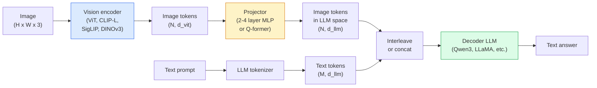

# 视觉语言模型 — ViT-MLP-LLM 模式

> 视觉编码器将图像转换为 token。MLP 投影器将这些 token 映射到 LLM 的嵌入空间。语言模型完成其余工作。这个模式——ViT-MLP-LLM——就是 2026 年每个生产级 VLM 的基础。

**类型：** 学习 + 使用
**语言：** Python
**前置条件：** 阶段 4 第 14 课（ViT），阶段 4 第 18 课（CLIP），阶段 7 第 02 课（自注意力）
**时间：** ~75 分钟

## 学习目标

- 阐述 ViT-MLP-LLM 架构并解释三个组件各自贡献什么
- 比较 Qwen3-VL、InternVL3.5、LLaVA-Next 和 GLM-4.6V 在参数量、上下文长度和基准性能上的差异
- 解释 DeepStack：为什么多级 ViT 特征比单一的最后一层特征能更好地收紧视觉-语言对齐
- 在生产中用 Cross-Modal Error Rate（CMER）度量 VLM 幻觉并基于该信号采取行动

## 问题

CLIP（阶段 4 第 18 课）为你提供了图像和文本的共享嵌入空间，这足以用于零样本分类和检索。但它无法回答"这张图片中有多少辆红色汽车？"，因为 CLIP 不会生成文本——它只计算相似度。

视觉语言模型（VLM）——Qwen3-VL、InternVL3.5、LLaVA-Next、GLM-4.6V——将 CLIP 系列的图像编码器与完整的语言模型结合起来。模型看到图像加问题，然后生成答案。2026 年，开源 VLM 在多模态基准（MMMU、MMBench、DocVQA、ChartQA、MathVista、OSWorld）上匹敌或击败 GPT-5 和 Gemini-2.5-Pro。

三个部分（ViT、投影器、LLM）的组合是标准。模型之间的差异在于使用哪个 ViT、哪个投影器、哪个 LLM、训练数据以及对齐配方。一旦你理解了模式，替换任何组件都是机械性的。

## 概念

### ViT-MLP-LLM 架构


```mermaid
flowchart LR
    IMG["Image<br/>(H x W x 3)"] --> ViT["Vision encoder<br/>(ViT, CLIP-L,<br/>SigLIP, DINOv3)"]
    ViT --> FEATS["Image tokens<br/>(N, d_vit)"]
    FEATS --> PROJ["Projector<br/>(2-4 layer MLP<br/>or Q-former)"]
    PROJ --> VTOK["Image tokens<br/>in LLM space<br/>(N, d_llm)"]
    TXT["Text prompt"] --> TOK["LLM tokenizer"]
    TOK --> TTOK["Text tokens<br/>(M, d_llm)"]
    VTOK --> CONCAT["Interleave<br/>or concat"]
    TTOK --> CONCAT
    CONCAT --> LLM["Decoder LLM<br/>(Qwen3, LLaMA, etc.)"]
    LLM --> OUT["Text answer"]

    style ViT fill:#dbeafe,stroke:#2563eb
    style PROJ fill:#fef3c7,stroke:#d97706
    style LLM fill:#dcfce7,stroke:#16a34a
```

1. **视觉编码器**——一个预训练的 ViT（CLIP-L/14、SigLIP、DINOv3 或微调变体）。产生 patch token。
2. **投影器**——一个小型模块（2-4 层 MLP 或 Q-former），将视觉 token 映射到 LLM 的嵌入维度。这是大多数微调发生的地方。
3. **LLM**——一个仅解码器的语言模型（Qwen3、Llama、Mistral、GLM、InternLM）。顺序读取视觉 + 文本 token，生成文本。

原则上三个部分都是可训练的。实践中，视觉编码器和 LLM 大部分保持冻结，而投影器进行训练——只需几十亿参数信号，成本低廉。

### DeepStack

普通投影只使用最后一个 ViT 层。DeepStack（Qwen3-VL）从多个 ViT 深度采样特征并将它们堆叠。深层携带高层语义；浅层携带细粒度的空间和纹理信息。将两者馈送给 LLM 缩小了"图像包含什么"（语义）和"具体在哪里"（空间定位）之间的差距。

### 三个训练阶段

现代 VLM 分阶段训练：

1. **对齐**——冻结 ViT 和 LLM。仅在图像-标题对上训练投影器。教会投影器将视觉空间映射到语言空间。
2. **预训练**——解冻所有内容。在大规模交错图像-文本数据（5 亿+ 对）上训练。构建模型的视觉知识。
3. **指令微调**——在精选的（图像、问题、答案）三元组上微调。教会对话行为和任务格式。这就是将"视觉感知的 LM"变成可用助手的关键。

大多数 LoRA 微调针对阶段 3，使用小型标注数据集。

### 模型家族比较（2026 年初）

| 模型 | 参数 | 视觉编码器 | LLM | 上下文 | 优势 |
|-------|--------|----------------|-----|---------|-----------|
| Qwen3-VL-235B-A22B（MoE） | 235B（22B 激活） | 自定义 ViT + DeepStack | Qwen3 | 256K | 通用 SOTA，GUI 代理 |
| Qwen3-VL-30B-A3B（MoE） | 30B（3B 激活） | 自定义 ViT + DeepStack | Qwen3 | 256K | 更小的 MoE 替代 |
| Qwen3-VL-8B（密集） | 8B | 自定义 ViT | Qwen3 | 128K | 生产密集默认 |
| InternVL3.5-38B | 38B | InternViT-6B | Qwen3 + GPT-OSS | 128K | 强 MMBench / MMVet |
| InternVL3.5-241B-A28B | 241B（28B 激活） | InternViT-6B | Qwen3 | 128K | 与 GPT-4o 竞争 |
| LLaVA-Next 72B | 72B | SigLIP | Llama-3 | 32K | 开源，易于微调 |
| GLM-4.6V | ~70B | 自定义 | GLM | 64K | 开源，强 OCR |
| MiniCPM-V-2.6 | 8B | SigLIP | MiniCPM | 32K | 边缘友好 |

### 视觉代理

Qwen3-VL-235B 在 OSWorld 上达到了全球顶级性能——这是一个针对操作 GUI（桌面、移动、网页）的**视觉代理**的基准。模型看到截图，理解 UI，并发出动作（点击、输入、滚动）。结合工具，它能闭环完成常见的桌面任务。这就是大多数 2026 年"AI PC"演示在幕后运行的内容。

### 代理能力 + RoPE 变体

VLM 需要知道视频中某帧的**时间**。Qwen3-VL 从 T-RoPE（时间旋转位置嵌入）演进为**基于文本的时间对齐**——显式的时间戳文本 token 与视频帧交错。模型看到 "`<timestamp 00:32>` frame, prompt" 并能够推理时间关系。

### 对齐问题

抓取数据集中 12% 的图像-文本对包含未完全定位于图像的描述。在此数据上训练的 VLM 会默默地学会幻觉——捏造物体、误读数字、发明关系。在生产中这是主要的失败模式。

Skywork.ai 引入了 **Cross-Modal Error Rate（CMER）** 来跟踪它：

```
CMER = 文本置信度高但图像-文本相似度（通过 CLIP 系列检查器）低的输出占比
```

高 CMER 意味着模型在自信地说出没有定位于图像的内容。监控 CMER 并将其视为生产 KPI 可在其部署中将幻觉率降低约 35%。技巧不是"修复模型"，而是"将高 CMER 的输出路由到人工审核"。

### 使用 LoRA / QLoRA 微调

对 70B VLM 进行全面微调超出大多数团队的能力范围。在注意力 + 投影器层上的 LoRA（rank 16-64），或使用 4 位基础权重的 QLoRA，可以放入单张 A100 / H100。成本：5,000-50,000 个样本，100-5,000 美元的计算资源，2-10 小时的训练。

### 空间推理仍然薄弱

当前 VLM 在空间推理基准（上下、左右、计数、距离）上得分 50-60%。如果你的用例依赖于"哪个物体在哪个上面"，请大力验证——通用 VLM 性能低于人类。对于纯空间任务，更好的替代方案是专门的姿态估计器、深度模型或带有框几何后处理的检测模型。

## 构建

### 步骤 1：投影器

你将最常训练的部分。2-4 层 MLP 带 GELU。

```python
import torch
import torch.nn as nn


class Projector(nn.Module):
    def __init__(self, vit_dim=768, llm_dim=4096, hidden=4096):
        super().__init__()
        self.net = nn.Sequential(
            nn.Linear(vit_dim, hidden),
            nn.GELU(),
            nn.Linear(hidden, llm_dim),
        )

    def forward(self, x):
        return self.net(x)
```

输入是 `(N_patches, d_vit)` token 张量。输出是 `(N_patches, d_llm)`。LLM 将每行输出视为另一个 token。

### 步骤 2：组装 ViT-MLP-LLM 端到端

最小 VLM 的前向传播骨架。真实代码使用 `transformers`；这是概念布局。

```python
class MinimalVLM(nn.Module):
    def __init__(self, vit, projector, llm, image_token_id):
        super().__init__()
        self.vit = vit
        self.projector = projector
        self.llm = llm
        self.image_token_id = image_token_id  # 文本 prompt 中的占位 token

    def forward(self, image, input_ids, attention_mask):
        # 1. 视觉特征
        vision_tokens = self.vit(image)                     # (B, N_patches, d_vit)
        vision_embeds = self.projector(vision_tokens)       # (B, N_patches, d_llm)

        # 2. 文本嵌入
        text_embeds = self.llm.get_input_embeddings()(input_ids)  # (B, M, d_llm)

        # 3. 用视觉嵌入替换图像占位 token
        merged = self._merge(text_embeds, vision_embeds, input_ids)

        # 4. 运行 LLM
        return self.llm(inputs_embeds=merged, attention_mask=attention_mask)

    def _merge(self, text_embeds, vision_embeds, input_ids):
        out = text_embeds.clone()
        expected = vision_embeds.size(1)
        for b in range(input_ids.size(0)):
            positions = (input_ids[b] == self.image_token_id).nonzero(as_tuple=True)[0]
            if len(positions) != expected:
                raise ValueError(
                    f"batch item {b} has {len(positions)} image tokens but vision_embeds has {expected} patches."
                    " Every sample in the batch must be pre-padded to the same number of image placeholder tokens.")
            out[b, positions] = vision_embeds[b]
        return out
```

文本中的 `<image>` 占位 token 被替换为真实的图像嵌入——LLaVA、Qwen-VL 和 InternVL 使用相同的模式。

### 步骤 3：CMER 计算

一个轻量级的运行时检查。

```python
import torch.nn.functional as F


def cross_modal_error_rate(image_emb, text_emb, text_confidence, sim_threshold=0.25, conf_threshold=0.8):
    """
    image_emb, text_emb: 图像和生成文本的嵌入（内部归一化）
    text_confidence:     平均每个 token 的概率 [0, 1]
    返回：             高置信度但图像-文本对齐度低的输出比例
    """
    image_emb = F.normalize(image_emb, dim=-1)
    text_emb = F.normalize(text_emb, dim=-1)
    sim = (image_emb * text_emb).sum(dim=-1)        # 余弦相似度
    high_conf_low_sim = (text_confidence > conf_threshold) & (sim < sim_threshold)
    return high_conf_low_sim.float().mean().item()
```

将 CMER 视为生产 KPI。按端点、按 prompt 类型、按客户进行监控。CMER 上升表明模型在某些输入分布上开始产生幻觉。

### 步骤 4：玩具 VLM 分类器（可运行）

演示投影器可以训练。伪造的"ViT 特征"输入，小型的 LLM 风格 token 预测类别。

```python
class ToyVLM(nn.Module):
    def __init__(self, vit_dim=32, llm_dim=64, num_classes=5):
        super().__init__()
        self.projector = Projector(vit_dim, llm_dim, hidden=64)
        self.head = nn.Linear(llm_dim, num_classes)

    def forward(self, vision_tokens):
        projected = self.projector(vision_tokens)
        pooled = projected.mean(dim=1)
        return self.head(pooled)
```

可以在 200 步内拟合合成（特征，类别）对——足以展示投影器模式有效。

## 使用

2026 年生产团队使用 VLM 的三种方式：

- **托管 API**——OpenAI Vision、Anthropic Claude Vision、Google Gemini Vision。零基础设施，有供应商风险。
- **开源自托管**——通过 `transformers` 和 `vllm` 使用 Qwen3-VL 或 InternVL3.5。完全控制，前期工作更多。
- **领域微调**——加载 Qwen2.5-VL-7B 或 LLaVA-1.6-7B，在 5k-50k 自定义样本上使用 LoRA，用 `vllm` 或 `TGI` 提供服务。

```python
from transformers import AutoProcessor, AutoModelForVision2Seq
import torch
from PIL import Image

model_id = "Qwen/Qwen3-VL-8B-Instruct"
processor = AutoProcessor.from_pretrained(model_id)
model = AutoModelForVision2Seq.from_pretrained(model_id, torch_dtype=torch.bfloat16, device_map="auto")

messages = [{
    "role": "user",
    "content": [
        {"type": "image", "image": Image.open("plot.png")},
        {"type": "text", "text": "What does this chart show?"},
    ],
}]
inputs = processor.apply_chat_template(messages, add_generation_prompt=True, tokenize=True, return_dict=True, return_tensors="pt").to("cuda")
generated = model.generate(**inputs, max_new_tokens=256)
answer = processor.decode(generated[0][inputs["input_ids"].shape[1]:], skip_special_tokens=True)
```

`apply_chat_template` 隐藏了 `<image>` 占位 token 的 tokenization；模型内部处理合并。

## 交付

本课产出：

- `outputs/prompt-vlm-selector.md`——根据精度、延迟、上下文长度和预算选择 Qwen3-VL / InternVL3.5 / LLaVA-Next / API。
- `outputs/skill-cmer-monitor.md`——输出用于检测生产 VLM 端点的代码，包含跨模态错误率、每个端点的仪表板和告警阈值。

## 练习

1. **（简单）** 在五张图像上通过任意开源 VLM 运行三个提示（"这是什么？"、"数一下物体"、"描述场景"）。手动评分每个答案为正确 / 部分正确 / 幻觉。计算初步的 CMER 类比率。
2. **（中等）** 使用 LoRA（rank 16）在 500 张目标域图像及其标题上微调 Qwen2.5-VL-3B 或 LLaVA-1.6-7B。比较零样本与微调后的 MMBench 风格精度。
3. **（困难）** 将 VLM 的图像编码器替换为 DINOv3 而不是其默认的 SigLIP/CLIP。仅重新训练投影器（冻结 LLM + 冻结 DINOv3）。衡量密集预测任务（计数、空间推理）是否有所改善。

## 关键术语

| 术语 | 人们说的 | 实际含义 |
|------|----------------|----------------------|
| ViT-MLP-LLM | "VLM 模式" | 视觉编码器 + 投影器 + 语言模型；每个 2026 年 VLM |
| 投影器 | "桥梁" | 2-4 层 MLP（或 Q-former），将视觉 token 映射到 LLM 嵌入空间 |
| DeepStack | "Qwen3-VL 特征技巧" | 多层 ViT 特征堆叠，而非仅最后一层 |
| 图像 token | "<image> 占位符" | 文本流中由投影后的视觉嵌入替换的特殊 token |
| CMER | "幻觉 KPI" | 跨模态错误率；文本置信度高但图像-文本相似度低时值高 |
| 视觉代理 | "会点击的 VLM" | 操作 GUI（OSWorld、移动、网页）并带有工具调用的 VLM |
| Q-former | "固定数量 token 桥" | BLIP-2 风格的投影器，产生固定数量的视觉查询 token |
| 对齐 / 预训练 / 指令微调 | "三个阶段" | 标准 VLM 训练流水线 |

## 延伸阅读

- [Qwen3-VL 技术报告（arXiv 2511.21631）](https://arxiv.org/abs/2511.21631)
- [InternVL3.5 推进开源多模态模型（arXiv 2508.18265）](https://arxiv.org/html/2508.18265v1)
- [LLaVA-Next 系列](https://llava-vl.github.io/blog/2024-05-10-llava-next-stronger-llms/)
- [BentoML：2026 年最佳开源 VLM](https://www.bentoml.com/blog/multimodal-ai-a-guide-to-open-source-vision-language-models)
- [MMMU：多学科多模态理解基准](https://mmmu-benchmark.github.io/)
- [制造业中的 VLM（Robotics Tomorrow, 2026 年 3 月）](https://www.roboticstomorrow.com/story/2026/03/when-machines-learn-to-see-like-experts-the-rise-of-vision-language-models-in-manufacturing/26335/)
