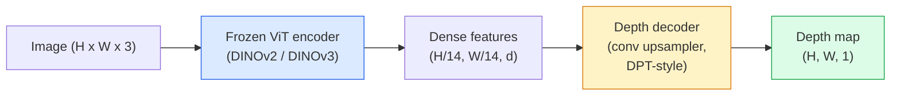

# Monocular Depth & Geometry Estimation

> depth map は、各 pixel が camera からの距離を表す single-channel image である。かつては 1 枚の RGB frame からこれを予測するには stereo や LiDAR が不可欠だった。2026 年には、frozen ViT encoder と lightweight head だけで ground truth から数 percent 以内に届く。

**種別:** 構築 + Use
**言語:** Python
**前提条件:** Phase 4 Lesson 14 (ViT), Phase 4 Lesson 17 (Self-Supervised Vision), Phase 4 Lesson 07 (U-Net)
**所要時間:** 約60分

## 学習目標

- relative depth と metric depth を区別し、各 production model (MiDaS、Marigold、Depth Anything V3、ZoeDepth) がどちらを解くかを述べる
- Depth Anything V3 (DINOv2 backbone) を使い、calibration なしで任意の single image の depth を予測する
- 1 枚の画像から monocular depth がなぜ成立するのか (perspective cues、texture gradients、learned priors) と、何を復元できないのか (absolute scale、occluded geometry) を説明する
- depth map と pinhole camera intrinsics を使って 2D detections を 3D points に lift する

## 問題

depth は 2D computer vision に欠けている軸である。RGB があれば object が image plane のどこに見えるかは分かるが、どれだけ遠いかは分からない。depth sensors (stereo rigs、LiDAR、time-of-flight) はこれを直接解くが、高価で壊れやすく、range に制限がある。

Monocular depth estimation、つまり single RGB frame から depth を予測する手法は、以前はぼやけた信頼できない出力しか出せなかった。2026 年までに、大規模 pretrained encoders が状況を変えた。Depth Anything V3 は frozen DINOv2 backbone を使い、indoor、outdoor、medical、satellite domains にまたがって generalise する depth maps を生成する。Marigold は depth を conditional diffusion problem として再定式化する。ZoeDepth は真の metric distances を回帰する。

depth は 2D detection と 3D understanding の橋でもある。検出 box の pixels に depth を掛けると、2D object を 3D point cloud に lift できる。これは AR occlusion system、obstacle-avoidance pipeline、「cup をつかむ」robot の中核である。

## 概念

### Relative depth と metric depth

- **Relative depth** — 実世界単位を持たない ordered `z` values。「Pixel A は pixel B より近いが、距離比は metres に anchored されていない」。
- **Metric depth** — camera からの absolute distance を metres で表す。model が image cues と real distance の統計的関係を学んでいる必要がある。

MiDaS と Depth Anything V3 は relative depth を生成する。Marigold も relative depth を生成する。ZoeDepth、UniDepth、Metric3D は metric depth を生成する。metric models は camera intrinsics に敏感で、relative models はそうではない。

### encoder-decoder pattern



Depth Anything V3 は encoder を freeze し、DPT-style decoder だけを train する。encoder は豊かな features を提供し、decoder はそれらを image resolution へ補間して depth を回帰する。

### 1 枚の画像から depth が得られる理由

2D image には depth と相関する monocular cues が多く含まれる。

- **Perspective** — 3D の平行線は 2D では収束する。
- **Texture gradient** — 遠い surface ほど texture が小さく密になる。
- **Occlusion order** — 近い object は遠い object を隠す。
- **Size constancy** — 既知の object (cars、humans) はおおよその scale を与える。
- **Atmospheric perspective** — outdoor scene では遠い object が霞み、青みがかって見える。

数十億枚の画像で train された ViT はこれらの cues を internalise する。十分な data と強い backbone があれば、明示的な 3D supervision がなくても monocular depth は妥当な accuracy に達する。

### monocular depth ができないこと

- **intrinsics や scene 内の既知 object がない absolute metric scale**。network は「cup は spoon の 2 倍遠い」と予測できても、cup が 1 m 先か 10 m 先かは分からない。
- **Occluded geometry** — chair の背面は見えておらず、信頼して推論できない。
- **Truly untextured / reflective surfaces** — mirrors、glass、uniform walls。network はもっともらしいが誤った depth を返す。

### Depth Anything V3 in 2026

- Vanilla DINOv2 ViT-L/14 を encoder として使用 (frozen)。
- DPT decoder。
- 多様な source からの posed image pairs で train (photometric consistency を超える明示的な depth supervision は不要)。
- **known camera poses の有無にかかわらず、任意個数の visual inputs** から spatially consistent geometry を予測する。
- monocular depth、any-view geometry、visual rendering、camera pose estimation 全体で SOTA。

2026 年に depth が必要なときに呼ぶ drop-in model である。

### Marigold — diffusion for depth

Marigold (Ke et al., CVPR 2024) は depth estimation を conditional image-to-image diffusion として再定式化する。conditioning は RGB、target は depth map。pretrained Stable Diffusion 2 U-Net を backbone に使う。出力 depth map は object boundary で非常に sharp である。trade-off は feed-forward models より inference が遅いこと (10-50 denoising steps)。

### intrinsics と pinhole camera

depth `d` を持つ pixel `(u, v)` を camera coordinates の 3D point `(X, Y, Z)` に lift するには:

```
fx, fy, cx, cy = camera intrinsics
X = (u - cx) * d / fx
Y = (v - cy) * d / fy
Z = d
```

intrinsics は EXIF metadata、calibration pattern、または monocular intrinsics estimator (Perspective Fields、UniDepth) から得る。intrinsics がなくても、60-70° FOV と中程度解像度の principal point を仮定して point cloud を render できるが、measurement ではなく visualisation 用である。

### Evaluation

標準 metric は 2 つある。

- **AbsRel** (absolute relative error): `mean(|d_pred - d_gt| / d_gt)`。低いほど良い。production models では 0.05-0.1 程度。
- **delta < 1.25** (threshold accuracy): `max(d_pred/d_gt, d_gt/d_pred) < 1.25` を満たす pixels の割合。高いほど良い。SOTA では 0.9+。

relative depth (Depth Anything V3、MiDaS) では、両 metric の scale-and-shift invariant 版を使って評価する。

## 実装

### Step 1: depth metrics

```python
import torch

def abs_rel_error(pred, target, mask=None):
    if mask is not None:
        pred = pred[mask]
        target = target[mask]
    return (torch.abs(pred - target) / target.clamp(min=1e-6)).mean().item()


def delta_accuracy(pred, target, threshold=1.25, mask=None):
    if mask is not None:
        pred = pred[mask]
        target = target[mask]
    ratio = torch.maximum(pred / target.clamp(min=1e-6), target / pred.clamp(min=1e-6))
    return (ratio < threshold).float().mean().item()
```

evaluation 前には invalid depth pixels (zero、NaN、saturated) を必ず mask する。

### Step 2: scale-and-shift alignment

relative-depth models では、metrics を計算する前に prediction を ground truth に align する。`a * pred + b = target` の least-squares fit:

```python
def align_scale_shift(pred, target, mask=None):
    if mask is not None:
        p = pred[mask]
        t = target[mask]
    else:
        p = pred.flatten()
        t = target.flatten()
    A = torch.stack([p, torch.ones_like(p)], dim=1)
    coeffs, *_ = torch.linalg.lstsq(A, t.unsqueeze(-1))
    a, b = coeffs[:2, 0]
    return a * pred + b
```

MiDaS / Depth Anything を評価するときは、`abs_rel_error` の前に `align_scale_shift` を実行する。

### Step 3: depth を point cloud に lift する

```python
import numpy as np

def depth_to_point_cloud(depth, intrinsics):
    H, W = depth.shape
    fx, fy, cx, cy = intrinsics
    v, u = np.meshgrid(np.arange(H), np.arange(W), indexing="ij")
    z = depth
    x = (u - cx) * z / fx
    y = (v - cy) * z / fy
    return np.stack([x, y, z], axis=-1)


depth = np.random.uniform(0.5, 4.0, (240, 320))
intr = (320.0, 320.0, 160.0, 120.0)
pc = depth_to_point_cloud(depth, intr)
print(f"point cloud shape: {pc.shape}  (H, W, 3)")
```

1 つの関数で、すべての 3D-lifted application に使える。point cloud を `.ply` に export し、MeshLab や CloudCompare で開く。

### Step 4: synthetic depth scene で smoke test

```python
def synthetic_depth(size=96):
    yy, xx = np.meshgrid(np.arange(size), np.arange(size), indexing="ij")
    # Floor: linear gradient from near (top) to far (bottom)
    depth = 1.0 + (yy / size) * 4.0
    # Box in the middle: closer
    mask = (np.abs(xx - size / 2) < size / 6) & (np.abs(yy - size * 0.6) < size / 6)
    depth[mask] = 2.0
    return depth.astype(np.float32)


gt = torch.from_numpy(synthetic_depth(96))
pred = gt + 0.3 * torch.randn_like(gt)  # simulated prediction
aligned = align_scale_shift(pred, gt)
print(f"before align  absRel = {abs_rel_error(pred, gt):.3f}")
print(f"after align   absRel = {abs_rel_error(aligned, gt):.3f}")
```

### Step 5: Depth Anything V3 usage (reference)

```python
import torch
from transformers import pipeline
from PIL import Image

pipe = pipeline(task="depth-estimation", model="LiheYoung/depth-anything-v2-large")

image = Image.open("street.jpg").convert("RGB")
out = pipe(image)
depth_np = np.array(out["depth"])
```

3 行で使える。`out["depth"]` は PIL grayscale なので、数値計算には numpy に変換する。Depth Anything V3 専用には、release 後に model id を差し替えるだけでよい。API は変わらない。

## 使う

- **Depth Anything V3** (Meta AI / ByteDance, 2024-2026) — relative depth の default。production で最速級の ViT-large-backbone model。
- **Marigold** (ETH, 2024) — 最高の visual quality、inference は遅い。
- **UniDepth** (ETH, 2024) — camera intrinsics estimation 付き metric depth。
- **ZoeDepth** (Intel, 2023) — metric depth。古いが今も信頼できる。
- **MiDaS v3.1** — legacy だが stable。comparison 用 baseline として良い。

典型的な integration pattern:

1. RGB frame が到着する。
2. Depth model が depth map を生成する。
3. Detector が boxes を生成する。
4. box centroids を depth で 3D に lift する。可能なら point cloud と merge する。
5. downstream: AR occlusion、path planning、object-size estimation、stereo replacement。

real-time use では、Depth Anything V2 Small (INT8 quantised) が consumer GPU で 518x518 において約 30 fps に達する。

## 成果物

この lesson が生成するもの:

- `outputs/prompt-depth-model-picker.md` — latency、metric-vs-relative need、scene type に基づき Depth Anything V3、Marigold、UniDepth、MiDaS から選ぶ。
- `outputs/skill-depth-to-pointcloud.md` — depth maps から正しい intrinsics handling と `.ply` export を備えた point clouds を作る skill。

## 演習

1. **(Easy)** 自分の desk の任意の 10 images に Depth Anything V2 を実行する。depth を grayscale PNG として保存して確認する。predicted depth が誤って見える object を 1 つ特定し、monocular cues がなぜ失敗したかを説明する。
2. **(Medium)** Depth Anything V2 から得た RGB + depth を point cloud に lift し、`open3d` で render する。2 つの scenes (indoor / outdoor) を比較し、どちらがより believable か記録する。
3. **(Hard)** 既知 object の位置だけが異なる 5 pairs の images (例: bottle を 30 cm 近づける) を用意する。UniDepth で両方の metric depth を予測し、predicted distance delta と true 30 cm を report する。

## 重要用語

| Term | よく言われる表現 | 実際の意味 |
|------|----------------|----------------------|
| Monocular depth | "Single-image depth" | stereo や LiDAR なしで、1 枚の RGB frame から depth を推定する |
| Relative depth | "Ordered depth" | 実世界単位を持たない ordered z-values |
| Metric depth | "Absolute distance" | metres 単位の depth。calibration または metric supervision で train された model が必要 |
| AbsRel | "Absolute relative error" | `|d_pred - d_gt| / d_gt` の平均。標準的な depth metric |
| Delta accuracy | "delta < 1.25" | prediction が ground truth の 25% 以内にある pixels の割合 |
| Pinhole camera | "fx, fy, cx, cy" | (u, v, d) を (X, Y, Z) に lift する camera model |
| DPT | "Dense Prediction Transformer" | frozen ViT encoders の上で depth に使われる conv-based decoder |
| DINOv2 backbone | "The reason it works" | depth labels なしで domain をまたいで generalise する self-supervised features |

## 参考資料

- [Depth Anything V3 paper page](https://depth-anything.github.io/) — DINOv2 encoder を使う SOTA monocular depth
- [Marigold (Ke et al., CVPR 2024)](https://marigoldmonodepth.github.io/) — diffusion-based depth estimation
- [UniDepth (Piccinelli et al., 2024)](https://arxiv.org/abs/2403.18913) — intrinsics 付き metric depth
- [MiDaS v3.1 (Intel ISL)](https://github.com/isl-org/MiDaS) — canonical relative-depth baseline
- [DINOv3 blog post (Meta)](https://ai.meta.com/blog/dinov3-self-supervised-vision-model/) — depth accuracy を押し上げる encoder family
