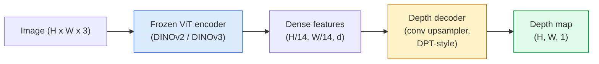

# Monoküler Derinlik ve Geometri Tahmini

> Derinlik haritası, her pikselin kameradan uzakta olduğu tek kanallı bir görüntüdür. Stereo veya LiDAR olmadan bunu tek bir RGB çerçevesinden tahmin etmek imkansızdı. 2026'da donmuş bir ViT kodlayıcı artı hafif bir kafa, temel gerçeğin yüzde birkaçına giriyor.

**Tür:** Oluştur + Kullan
**Diller:** Python
**Önkoşullar:** Aşama 4 Ders 14 (ViT), Aşama 4 Ders 17 (Kendi Kendini Denetleyen Vizyon), Aşama 4 Ders 07 (U-Net)
**Süre:** ~60 dakika

## Öğrenme Hedefleri

- Göreceli ve metrik derinliği ayırt edin ve her üretim modelinin (MiDaS, Marigold, Depth Everything V3, ZoeDepth) hangisini çözdüğünü belirtin
- Kalibrasyon olmadan rastgele tek görüntüler için derinliği tahmin etmek amacıyla Derinlik Her Şey V3'ü (DINOv2 omurgası) kullanın
- Monoküler derinliğin neden tek bir görüntüden (perspektif ipuçları, doku gradient'ler, öğrenilen öncelikler) işe yaradığını ve neleri kurtaramayacağını (mutlak ölçek, kapalı geometri) açıklayın
- Derinlik haritası ve iğne deliği kamera özelliklerini kullanarak 2 boyutlu tespitleri 3 boyutlu noktalara yükseltin

## Sorun

Derinlik, 2 boyutlu bilgisayar görüşünde eksik olan eksendir. RGB göz önüne alındığında, nesnelerin görüntü düzleminde nerede göründüğünü bilirsiniz; ne kadar uzakta olduklarını bilmiyorsun. Derinlik sensörleri (stereo donanımlar, LiDAR, uçuş süresi) bunu doğrudan çözer ancak pahalıdır, kırılgandır ve menzili sınırlıdır.

Bulanık, güvenilmez çıktı üretmek için kullanılan monoküler derinlik tahmini (tek bir RGB çerçevesinden derinliğin tahmin edilmesi). 2026'ya gelindiğinde, önceden eğitilmiş büyük kodlayıcılar şunları değiştirdi: Derinlik Her Şey V3, donmuş bir DINOv2 omurgası kullanıyor ve iç mekan, dış mekan, tıbbi ve uydu alanlarında genelleştirilmiş derinlik haritaları üretiyor. Marigold, derinliği koşullu bir yayılma sorunu olarak yeniden çerçeveliyor. ZoeDepth gerçek metrik mesafeleri geriler.

Derinlik aynı zamanda 2B algılama ile 3B anlama arasındaki köprüdür: algılanan kutunun piksellerini derinlikle çarptığınızda 2B nesneyi 3B nokta bulutuna kaldırırsınız. Bu, her AR engelleme sisteminin, her engelden kaçınma hattının ve her "bardağı kaldıran" robotun özüdür.

## Konsept

### Göreceli ve metrik derinlik

- **Göreceli derinlik** — gerçek dünya birimi olmadan sıralı `z` değerleri. "Piksel A, piksel B'den daha yakındır, ancak mesafelerin oranı metreye sabitlenmemiştir."
- **Metrik derinlik** — kameradan metre cinsinden mutlak mesafe. Modelin, görüntü ipuçları ile gerçek mesafe arasındaki istatistiksel ilişkiyi öğrenmiş olmasını gerektirir.

MiDaS ve Derinlik V3'teki her şey göreceli derinlik üretir. Kadife çiçeği göreceli derinlik üretir. ZoeDepth, UniDepth ve Metric3D metrik derinlik üretir. Metrik modeller kameranın esaslarına duyarlıdır; göreceli modeller değildir.

### Kodlayıcı-kod çözücü modeli



Derinlik Her şey V3, kodlayıcıyı dondurur ve yalnızca DPT stili kod çözücüyü eğitir. Kodlayıcı zengin özellikler sağlar; kod çözücü bunları görüntü çözünürlüğüne geri döndürür ve derinliği geriler.

### Neden tek bir görüntü derinlik yaratır?

2 boyutlu bir görüntü, derinlikle ilişkili birçok monoküler ipucu içerir:

- **Perspektif** — 3B'deki paralel çizgiler 2B'de birleşir.
- **Doku gradient** — uzaktaki yüzeyler daha küçük, daha yoğun dokuya sahiptir.
- **Kapalılık sırası** — daha yakın nesneler uzaktaki nesneleri kapatır.
- **Boyut değişmezliği** — bilinen nesneler (arabalar, insanlar) yaklaşık ölçeği verir.
- **Atmosferik perspektif** — Dış mekan sahnelerinde uzaktaki nesneler daha bulanık ve daha mavi görünür.

Milyarlarca görüntüyle eğitilmiş bir ViT bu ipuçlarını içselleştirir. Yeterli veri ve güçlü bir omurga ile monoküler derinlik, herhangi bir açık 3D denetimi olmadan makul bir doğruluğa ulaşır.

### Monoküler derinliğin yapamayacağı şey

- **Mutlak metrik ölçek**, sahnede içsel unsurlar veya bilinen bir nesne olmadan. Ağ, bardağın 1 m mi yoksa 10 m mi uzakta olduğunu bilmeden "bardak kaşığın iki katı kadar uzaktadır" tahmininde bulunabilir.
- **Tıkalı geometri** — sandalyenin arkası görünmüyor ve güvenilir bir şekilde çıkarım yapılamıyor.
- **Gerçekten dokusuz/yansıtıcı yüzeyler** — aynalar, cam, tekdüze duvarlar. Ağ makul ancak yanlış derinlik bildiriyor.

### Derinlik 2026'da Her Şey V3

- Kodlayıcı olarak Vanilya DINOv2 ViT-L/14 (dondurulmuş).
- DPT kod çözücü.
- Çeşitli kaynaklardan alınan pozlanmış görüntü çiftleri üzerine eğitim verilmiştir (fotometrik tutarlılığın ötesinde açık bir derinlik denetimi gerekmez).
- **Bilinen kamera pozları olsun veya olmasın rastgele sayıda görsel girdiden** mekansal olarak tutarlı geometriyi tahmin eder.
- Monoküler derinlik, herhangi bir görünüm geometrisi, görsel oluşturma, kamera poz tahmini genelinde SOTA.

Bu, 2026'da derinliğe ihtiyaç duyduğunuzda arayacağınız kolay modeldir.

### Kadife çiçeği — derinlik için yayılma

Marigold (Ke ve diğerleri, CVPR 2024) derinlik tahminini koşullu görüntüden görüntüye yayılma olarak yeniden çerçevelendirmektedir. Koşullandırma: RGB. Hedef: derinlik haritası. Omurga olarak önceden eğitilmiş bir Stabil Difüzyon 2 U-Net kullanır. Çıkış derinliği haritaları nesne sınırlarında son derece keskindir. Takas: ileri beslemeli modellere göre daha yavaş inference (10-50 gürültü giderme adımı).

### İçsel bilgiler ve iğne deliği kamerası

`d` derinliğine sahip bir `(u, v)` pikselini kamera koordinatlarındaki bir `(X, Y, Z)` 3B noktasına kaldırmak için:

```
fx, fy, cx, cy = camera intrinsics
X = (u - cx) * d / fx
Y = (v - cy) * d / fy
Z = d
```

İçsel bilgiler EXIF meta verilerinden, bir kalibrasyon modelinden veya monoküler içsel tahmin aracından (Perspective Fields, UniDepth) gelir. İçsel veriler olmadan, ölçüm için değil görselleştirme için kullanılabilen 60-70° FOV ve orta çözünürlüklü prensipler varsayarak yine de bir nokta bulutu oluşturabilirsiniz.

### Değerlendirme

İki standart metrik:

- **AbsRel** (mutlak bağıl hata): `mean(|d_pred - d_gt| / d_gt)`. Daha düşük olması daha iyidir. Üretim modelleri için 0,05-0,1.
- **delta < 1,25** (eşik doğruluğu): `max(d_pred/d_gt, d_gt/d_pred) < 1.25` olan piksel kesri. Daha yüksek daha iyidir. SOTA için 0,9+.

Göreceli derinlik için (Derinlik Her Şey V3, MiDaS), değerlendirme her iki ölçümün ölçek ve kaydırma ile değişmez versiyonlarını kullanır.

## İnşa Et

### 1. Adım: Derinlik ölçümleri

```python
import torch

def abs_rel_error(pred, target, mask=None):
    if mask is not None:
        pred = pred[mask]
        target = target[mask]
    return (torch.abs(pred - target) / target.clamp(min=1e-6)).mean().item()


def delta_accuracy(pred, target, threshold=1.25, mask=None):
    if mask is not None:
        pred = pred[mask]
        target = target[mask]
    ratio = torch.maximum(pred / target.clamp(min=1e-6), target / pred.clamp(min=1e-6))
    return (ratio < threshold).float().mean().item()
```

Değerlendirmeden önce daima geçersiz derinlik piksellerini (sıfır, NaN, doymuş) maskeleyin.

### 2. Adım: Ölçekleme ve kaydırma hizalaması

Göreceli derinlik modelleri için, ölçümleri hesaplamadan önce tahminleri temel gerçeğe göre hizalayın. `a * pred + b = target`'nin en küçük kareler uyumu:

```python
def align_scale_shift(pred, target, mask=None):
    if mask is not None:
        p = pred[mask]
        t = target[mask]
    else:
        p = pred.flatten()
        t = target.flatten()
    A = torch.stack([p, torch.ones_like(p)], dim=1)
    coeffs, *_ = torch.linalg.lstsq(A, t.unsqueeze(-1))
    a, b = coeffs[:2, 0]
    return a * pred + b
```

MiDaS / Depth Everything'i değerlendirirken `abs_rel_error`'den önce `align_scale_shift`'yi çalıştırın.

### 3. Adım: Derinliği bir nokta bulutuna yükseltin

```python
import numpy as np

def depth_to_point_cloud(depth, intrinsics):
    H, W = depth.shape
    fx, fy, cx, cy = intrinsics
    v, u = np.meshgrid(np.arange(H), np.arange(W), indexing="ij")
    z = depth
    x = (u - cx) * z / fx
    y = (v - cy) * z / fy
    return np.stack([x, y, z], axis=-1)


depth = np.random.uniform(0.5, 4.0, (240, 320))
intr = (320.0, 320.0, 160.0, 120.0)
pc = depth_to_point_cloud(depth, intr)
print(f"point cloud shape: {pc.shape}  (H, W, 3)")
```

Tek işlev, her 3D destekli uygulama. Nokta bulutunu `.ply`'ye aktarın ve MeshLab veya CloudCompare'de açın.

### Adım 4: Sentetik derinlik sahnesiyle duman testi

```python
def synthetic_depth(size=96):
    yy, xx = np.meshgrid(np.arange(size), np.arange(size), indexing="ij")
    # Floor: linear gradient from near (top) to far (bottom)
    depth = 1.0 + (yy / size) * 4.0
    # Box in the middle: closer
    mask = (np.abs(xx - size / 2) < size / 6) & (np.abs(yy - size * 0.6) < size / 6)
    depth[mask] = 2.0
    return depth.astype(np.float32)


gt = torch.from_numpy(synthetic_depth(96))
pred = gt + 0.3 * torch.randn_like(gt)  # simulated prediction
aligned = align_scale_shift(pred, gt)
print(f"before align  absRel = {abs_rel_error(pred, gt):.3f}")
print(f"after align   absRel = {abs_rel_error(aligned, gt):.3f}")
```

### Adım 5: Derinlik Her Şey V3 kullanımı (referans)

```python
import torch
from transformers import pipeline
from PIL import Image

pipe = pipeline(task="depth-estimation", model="LiheYoung/depth-anything-v2-large")

image = Image.open("street.jpg").convert("RGB")
out = pipe(image)
depth_np = np.array(out["depth"])
```

Üç satır. `out["depth"]` bir PIL gri tonlamalıdır; matematik için numpy'ye dönüştürün. Özellikle Depth Everything V3 için, piyasaya sürüldükten sonra model kimliğini değiştirin; API değişmedi.

## Kullan onu

- **Derinlik Her Şey V3** (Meta AI / ByteDance, 2024-2026) — göreceli derinlik için varsayılan. Üretimdeki en hızlı ViT-büyük omurga modeli.
- **Kadife çiçeği** (ETH, 2024) — en yüksek görsel kalite, yavaş inference.
- **UniDepth** (ETH, 2024) — kameranın içsel tahminiyle metrik derinlik.
- **ZoeDepth** (Intel, 2023) — metrik derinlik; daha eski, hâlâ güvenilir.
- **MiDaS v3.1** — eski ama kararlı; karşılaştırma için iyi bir temel.

Tipik entegrasyon modeli:

1. RGB çerçeve gelir.
2. Derinlik modeli derinlik haritası üretir.
3. Dedektör kutular üretir.
4. Kutu merkezlerini derinlikten 3D'ye kaldırın; varsa nokta bulutu ile birleştirin.
5. Aşağı akış: AR tıkanması, yol planlama, nesne boyutu tahmini, stereo değiştirme.

Gerçek zamanlı kullanım için Depth Everything V2 Small (INT8 nicemlenmiş), 518x518 çözünürlükte tüketici GPU'sunda ~30 fps'ye ulaşır.

## Gönderin

Bu ders şunları üretir:

- `outputs/prompt-depth-model-picker.md` — Derinlik Her Şey V3, Marigold, UniDepth, gecikme süresine göre MiDaS, metrik ve göreceli ihtiyaç ve sahne türü arasında seçim yapar.
- `outputs/skill-depth-to-pointcloud.md` — derinlik haritalarından nokta bulutlarını doğru içsel işlemeyle oluşturan ve `.ply`'ye aktaran bir beceri.

## Egzersizler

1. **(Kolay)** Masanızdaki herhangi bir 10 görüntü üzerinde Depth Everything V2'yi çalıştırın. Derinliği gri tonlamalı PNG'ler olarak kaydedin ve inceleyin. Tahmini derinliği yanlış görünen bir nesne belirleyin ve monoküler ipuçlarının neden başarısız olduğunu açıklayın.
2. **(Orta)** Depth Everything V2'den RGB + derinlik verildiğinde, bir nokta bulutuna kaldırın ve `open3d` ile oluşturun. İki sahneyi (iç mekan / dış mekan) karşılaştırın ve hangisinin daha inandırıcı göründüğüne dikkat edin.
3. **(Sert)** Yalnızca bilinen bir nesnenin konumuna göre farklılık gösteren beş çift görüntü çekin (e.g. şişe 30 cm daha yakına taşınmıştır). Her ikisinde de metrik derinliği tahmin etmek için UniDepth'i kullanın. Tahmin edilen mesafe deltasını gerçek 30 cm'ye karşı rapor edin.

## Anahtar Terimler

| Dönem | İnsanlar ne diyor | Aslında ne anlama geliyor |
|------|----------------|----------------------|
| Monoküler derinlik | "Tek görüntü derinliği" | Tek bir RGB çerçevesinden derinlik tahmini, stereo veya LiDAR olmadan |
| Göreceli derinlik | "Sıralı derinlik" | Gerçek dünya birimleri olmadan sıralı z değerleri |
| Metrik derinlik | "Mutlak mesafe" | Metre cinsinden derinlik; kalibrasyon veya metrik denetimle eğitilmiş bir model gerektirir |
| Karın Kasları | "Mutlak bağıl hata" | |d_pred - d_gt|'nin ortalaması / d_gt; standart derinlik metriği |
| Delta doğruluğu | "delta < 1,25" | Temel gerçeğin %25'i dahilinde tahmine sahip piksel kesri |
| İğne deliği kamerası | "fx, fy, cx, cy" | (u, v, d)'yi (X, Y, Z)'ye kaldırmak için kullanılan kamera modeli |
| DPT | "Yoğun Tahmin Transformer" | Derinlik için dondurulmuş ViT kodlayıcıların üzerinde kullanılan dönüşüm tabanlı kod çözücü |
| DINOv2 omurgası | "Çalışmasının nedeni" | Derinlik etiketleri olmadan etki alanları arasında genelleme yapan, kendi kendini denetleyen özellikler |

## Daha Fazla Okuma

- [Derinlik Her Şey V3 kağıt sayfası](https://depth-anything.github.io/) — DINOv2 kodlayıcıyla SOTA monoküler derinlik
- [Marigold (Ke ve diğerleri, CVPR 2024)](https://marigoldmonodepth.github.io/) — difüzyona dayalı derinlik tahmini
- [UniDepth (Piccinelli ve diğerleri, 2024)](https://arxiv.org/abs/2403.18913) — içsel unsurlarla metrik derinlik
- [MiDaS v3.1 (Intel ISL)](https://github.com/isl-org/MiDaS) — kanonik göreceli derinlik taban çizgisi
- [DINOv3 blog yazısı (Meta)](https://ai.meta.com/blog/dinov3-self-supervised-vision-model/) — derinlik doğruluğunu artıran kodlayıcı ailesi
