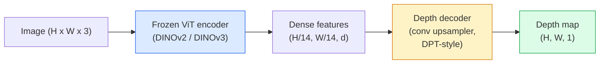

# 26 · 单目深度与几何估计

> 深度图（depth map）是一张单通道图像，其中每个像素的值就是该点到相机的距离。过去，要从单张 RGB 帧预测深度图，没有立体相机或激光雷达（LiDAR）几乎不可能做到。而在 2026 年，一个冻结的 ViT 编码器加上一个轻量解码头，就能将预测结果做到与真值（ground truth）相差不过几个百分点。

**类型：** 构建 + 使用
**语言：** Python
**前置：** 第 4 阶段第 14 课（ViT）、第 4 阶段第 17 课（自监督视觉）、第 4 阶段第 07 课（U-Net）
**时长：** 约 60 分钟

## 学习目标

- 区分相对深度（relative depth）与度量深度（metric depth），并说明各个生产级模型（MiDaS、Marigold、Depth Anything V3、ZoeDepth）分别解决其中哪一个问题
- 使用 Depth Anything V3（DINOv2 骨干网络）对任意单张图像预测深度，无需任何标定
- 解释为什么单张图像本身就能产生深度信息（透视线索、纹理梯度、习得的先验），以及它无法恢复哪些信息（绝对尺度、被遮挡的几何结构）
- 借助深度图与针孔相机内参（pinhole camera intrinsics），将 2D 检测结果提升（lift）为 3D 点

## 问题所在

深度是 2D 计算机视觉中缺失的那一个维度。给定 RGB 图像，你知道物体出现在图像平面的什么位置，却不知道它们距离有多远。深度传感器（立体相机组、激光雷达、飞行时间相机）能直接解决这个问题，但它们昂贵、脆弱，且量程有限。

单目深度估计（monocular depth estimation）——从单张 RGB 帧预测深度——过去只能产生模糊、不可靠的结果。到了 2026 年，大型预训练编码器改变了这一局面：Depth Anything V3 使用一个冻结的 DINOv2 骨干网络，所产生的深度图能够泛化到室内、室外、医学和卫星等多个领域。Marigold 把深度问题重新表述为一个条件扩散（conditional diffusion）问题。ZoeDepth 则直接回归真实的度量距离。

深度也是连接 2D 检测与 3D 理解的桥梁：把一个被检测出的框内像素乘以深度，你就能把这个 2D 物体提升为一片 3D 点云（point cloud）。这正是每一套 AR 遮挡系统、每一条避障流水线、以及每一个「把杯子拿起来」的机器人的核心。

## 核心概念

### 相对深度 vs 度量深度

- **相对深度（relative depth）**——有序的 `z` 值，但不带真实世界的单位。即「像素 A 比像素 B 更近，但两者距离之比并未锚定到米这个单位」。
- **度量深度（metric depth）**——以米为单位、从相机出发的绝对距离。这要求模型已经学到了图像线索与真实距离之间的统计关系。

MiDaS 和 Depth Anything V3 产生相对深度。Marigold 产生相对深度。ZoeDepth、UniDepth 和 Metric3D 产生度量深度。度量模型对相机内参敏感，而相对模型则不敏感。

### 编码器—解码器范式



Depth Anything V3 冻结编码器，仅训练 DPT 风格的解码器。编码器提供丰富的特征，解码器将这些特征插值回图像分辨率，并回归出深度。

### 为什么单张图像本身就能产生深度

一张 2D 图像中包含许多与深度相关的单目线索：

- **透视（Perspective）**——3D 中平行的直线在 2D 中会汇聚。
- **纹理梯度（Texture gradient）**——离得越远的表面，其纹理越小、越密。
- **遮挡顺序（Occlusion order）**——较近的物体会遮挡较远的物体。
- **大小恒常性（Size constancy）**——已知尺寸的物体（汽车、人）能给出近似的尺度。
- **空气透视（Atmospheric perspective）**——在室外场景中，远处的物体看起来更朦胧、更偏蓝。

一个在数十亿张图像上训练过的 ViT 会把这些线索内化。只要有足够的数据和一个强大的骨干网络，单目深度无需任何显式的 3D 监督，就能达到相当不错的精度。

### 单目深度做不到的事

- **绝对度量尺度**：在没有内参或场景中已知物体的情况下无法恢复。网络可以预测「杯子比勺子远一倍」，却无法知道杯子究竟是在 1 米还是 10 米之外。
- **被遮挡的几何结构**：椅子的背面看不见，无法被可靠地推断出来。
- **真正无纹理 / 反光的表面**：镜子、玻璃、均匀的墙面。网络会报告一个看似合理、实则错误的深度。

### 2026 年的 Depth Anything V3

- 以原版（vanilla）DINOv2 ViT-L/14 作为编码器（冻结）。
- DPT 解码器。
- 在来自多样来源的带位姿（posed）图像对上训练（除光度一致性外，无需显式的深度监督）。
- 能够从**任意数量的视觉输入中预测空间一致的几何结构，无论相机位姿是否已知**。
- 在单目深度、任意视角几何、视觉渲染、相机位姿估计等任务上均达到 SOTA。

这就是 2026 年当你需要深度时可以直接拿来即插即用的模型。

### Marigold——用扩散做深度

Marigold（Ke 等人，CVPR 2024）把深度估计重新表述为一个条件式图到图扩散（conditional image-to-image diffusion）问题。条件：RGB。目标：深度图。它以预训练的 Stable Diffusion 2 U-Net 作为骨干网络。输出的深度图在物体边界处异常锐利。代价：推理比前馈模型更慢（需要 10-50 步去噪）。

### 内参与针孔相机

要把一个带深度 `d` 的像素 `(u, v)` 提升为相机坐标系下的 3D 点 `(X, Y, Z)`：

```
fx, fy, cx, cy = camera intrinsics
X = (u - cx) * d / fx
Y = (v - cy) * d / fy
Z = d
```

内参可以来自 EXIF 元数据、标定板，或一个单目内参估计器（Perspective Fields、UniDepth）。即使没有内参，你仍然可以通过假设一个 60-70° 的视场角（FOV）和中等分辨率的主点来渲染点云——这对可视化够用，但不能用于测量。

### 评估

两个标准指标：

- **AbsRel**（绝对相对误差，absolute relative error）：`mean(|d_pred - d_gt| / d_gt)`。越低越好。生产级模型在 0.05-0.1 之间。
- **delta < 1.25**（阈值精度，threshold accuracy）：满足 `max(d_pred/d_gt, d_gt/d_pred) < 1.25` 的像素所占比例。越高越好。SOTA 模型可达 0.9 以上。

对于相对深度模型（Depth Anything V3、MiDaS），评估时会使用这两个指标的「尺度与位移不变」（scale-and-shift invariant）版本。

## 动手构建

### 第 1 步：深度指标

```python
import torch

def abs_rel_error(pred, target, mask=None):
    if mask is not None:
        pred = pred[mask]
        target = target[mask]
    return (torch.abs(pred - target) / target.clamp(min=1e-6)).mean().item()


def delta_accuracy(pred, target, threshold=1.25, mask=None):
    if mask is not None:
        pred = pred[mask]
        target = target[mask]
    ratio = torch.maximum(pred / target.clamp(min=1e-6), target / pred.clamp(min=1e-6))
    return (ratio < threshold).float().mean().item()
```

在评估前，请务必把无效的深度像素（值为零、NaN、饱和）掩蔽（mask）掉。

### 第 2 步：尺度与位移对齐

对于相对深度模型，在计算指标之前要先把预测值对齐到真值。对 `a * pred + b = target` 做最小二乘拟合：

```python
def align_scale_shift(pred, target, mask=None):
    if mask is not None:
        p = pred[mask]
        t = target[mask]
    else:
        p = pred.flatten()
        t = target.flatten()
    A = torch.stack([p, torch.ones_like(p)], dim=1)
    coeffs, *_ = torch.linalg.lstsq(A, t.unsqueeze(-1))
    a, b = coeffs[:2, 0]
    return a * pred + b
```

在评估 MiDaS / Depth Anything 时，先运行 `align_scale_shift`，再调用 `abs_rel_error`。

### 第 3 步：把深度提升为点云

```python
import numpy as np

def depth_to_point_cloud(depth, intrinsics):
    H, W = depth.shape
    fx, fy, cx, cy = intrinsics
    v, u = np.meshgrid(np.arange(H), np.arange(W), indexing="ij")
    z = depth
    x = (u - cx) * z / fx
    y = (v - cy) * z / fy
    return np.stack([x, y, z], axis=-1)


depth = np.random.uniform(0.5, 4.0, (240, 320))
intr = (320.0, 320.0, 160.0, 120.0)
pc = depth_to_point_cloud(depth, intr)
print(f"point cloud shape: {pc.shape}  (H, W, 3)")
```

一个函数，支撑所有「提升到 3D」的应用。把点云导出为 `.ply` 文件，再用 MeshLab 或 CloudCompare 打开。

### 第 4 步：用合成深度场景做冒烟测试

```python
def synthetic_depth(size=96):
    yy, xx = np.meshgrid(np.arange(size), np.arange(size), indexing="ij")
    # 地面：从近（顶部）到远（底部）的线性梯度
    depth = 1.0 + (yy / size) * 4.0
    # 中间的方块：距离更近
    mask = (np.abs(xx - size / 2) < size / 6) & (np.abs(yy - size * 0.6) < size / 6)
    depth[mask] = 2.0
    return depth.astype(np.float32)


gt = torch.from_numpy(synthetic_depth(96))
pred = gt + 0.3 * torch.randn_like(gt)  # 模拟的预测
aligned = align_scale_shift(pred, gt)
print(f"before align  absRel = {abs_rel_error(pred, gt):.3f}")
print(f"after align   absRel = {abs_rel_error(aligned, gt):.3f}")
```

### 第 5 步：Depth Anything V3 用法（参考）

```python
import torch
from transformers import pipeline
from PIL import Image

pipe = pipeline(task="depth-estimation", model="LiheYoung/depth-anything-v2-large")

image = Image.open("street.jpg").convert("RGB")
out = pipe(image)
depth_np = np.array(out["depth"])
```

三行代码。`out["depth"]` 是一个 PIL 灰度图，转成 numpy 才能做数学运算。若特指 Depth Anything V3，则在其发布后替换 model id 即可，API 保持不变。

## 上手使用

- **Depth Anything V3**（Meta AI / 字节跳动，2024-2026）——相对深度的默认之选。是生产环境中最快的 ViT-large 骨干网络模型。
- **Marigold**（苏黎世联邦理工学院 ETH，2024）——视觉质量最高，推理慢。
- **UniDepth**（ETH，2024）——带相机内参估计的度量深度。
- **ZoeDepth**（Intel，2023）——度量深度；较老，但仍然可靠。
- **MiDaS v3.1**——老牌但稳定；适合作为对比的基线。

典型的集成模式：

1. 一帧 RGB 图像到达。
2. 深度模型产生深度图。
3. 检测器产生检测框。
4. 通过深度把框的质心提升到 3D；如果有点云则与之合并。
5. 下游应用：AR 遮挡、路径规划、物体尺寸估计、立体相机的替代方案。

对于实时场景，Depth Anything V2 Small（INT8 量化）在 518x518 分辨率下、消费级 GPU 上可达约 30 fps。

## 交付成果

本课产出：

- `outputs/prompt-depth-model-picker.md`——在 Depth Anything V3、Marigold、UniDepth、MiDaS 之间做选择，依据延迟、度量还是相对深度的需求，以及场景类型。
- `outputs/skill-depth-to-pointcloud.md`——一个技能（skill），能从深度图构建点云，正确处理内参，并导出为 `.ply`。

## 练习

1. **（简单）** 用 Depth Anything V2 对你桌面上任意 10 张图像做推理。把深度保存为灰度 PNG 并查看。找出其中一个预测深度看起来明显错误的物体，并解释为什么单目线索在此处失效了。
2. **（中等）** 给定来自 Depth Anything V2 的 RGB + 深度，把它提升为点云并用 `open3d` 渲染。对比两个场景（室内 / 室外），记录哪一个看起来更可信。
3. **（困难）** 拍摄五对图像，每对之间只有一个已知物体的位置不同（例如把瓶子向前移动 30 厘米）。用 UniDepth 对每张图都预测度量深度。报告预测出的距离差与真实的 30 厘米之间的差异。

## 关键术语

| 术语 | 人们常说的说法 | 它实际的含义 |
|------|----------------|----------------------|
| 单目深度（Monocular depth） | 「单图深度」 | 从单张 RGB 帧估计深度，无需立体相机或激光雷达 |
| 相对深度（Relative depth） | 「有序深度」 | 不带真实世界单位的有序 z 值 |
| 度量深度（Metric depth） | 「绝对距离」 | 以米为单位的深度；需要标定或用度量监督训练过的模型 |
| AbsRel | 「绝对相对误差」 | |d_pred - d_gt| / d_gt 的均值；标准的深度指标 |
| Delta 精度 | 「delta < 1.25」 | 预测值落在真值 25% 以内的像素所占比例 |
| 针孔相机（Pinhole camera） | 「fx, fy, cx, cy」 | 用于把 (u, v, d) 提升为 (X, Y, Z) 的相机模型 |
| DPT | 「稠密预测 Transformer（Dense Prediction Transformer）」 | 叠加在冻结 ViT 编码器之上、用于深度的卷积式解码器 |
| DINOv2 骨干网络 | 「它能奏效的原因」 | 无需深度标签即可跨领域泛化的自监督特征 |

## 延伸阅读

- [Depth Anything V3 论文页](https://depth-anything.github.io/)——基于 DINOv2 编码器的 SOTA 单目深度
- [Marigold（Ke 等人，CVPR 2024）](https://marigoldmonodepth.github.io/)——基于扩散的深度估计
- [UniDepth（Piccinelli 等人，2024）](https://arxiv.org/abs/2403.18913)——带内参的度量深度
- [MiDaS v3.1（Intel ISL）](https://github.com/isl-org/MiDaS)——经典的相对深度基线
- [DINOv3 博客文章（Meta）](https://ai.meta.com/blog/dinov3-self-supervised-vision-model/)——提升深度精度的那个编码器家族
