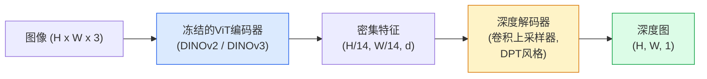

# 单目深度与几何估计

> 深度图是一个单通道图像，其中每个像素代表距离相机的距离。在过去，没有立体视觉或LiDAR的情况下，从单个RGB帧预测深度是不可能的。到2026年，一个冻结的ViT编码器（Vision Transformer）加上一个轻量级头部模型能够达到与真实值相差百分之几的精度。

**类型：** 构建 + 使用
**语言：** Python
**先决条件：** 第4阶段课程14（ViT）、第4阶段课程17（自监督视觉）、第4阶段课程07（U-Net）
**时间：** 约60分钟

## 学习目标

- 区分相对深度和度量深度，并说明每个生产模型（MiDaS、Marigold、Depth Anything V3、ZoeDepth）解决的是哪一种
- 使用Depth Anything V3（DINOv2骨干网络）来预测任意单张图像的深度，无需校准
- 从单张图像解释单目深度为何有效（透视线索、纹理梯度、学习到的先验）以及它无法恢复什么（绝对尺度、被遮挡的几何结构）
- 使用深度图和小孔相机内参将2D检测结果提升为3D点

## 问题

深度是2D计算机视觉中缺失的维度。给定RGB图像，你知道物体在图像平面中的位置；但不知道它们有多远。深度传感器（立体视觉装置、LiDAR、飞行时间传感器）直接解决了这个问题，但它们昂贵、易碎且范围有限。

单目深度估计——从单个RGB帧预测深度——过去会产生模糊、不可靠的输出。到2026年，大型预训练编码器改变了这一状况：Depth Anything V3使用冻结的DINOv2骨干网络，生成在室内、室外、医学和卫星领域都能泛化的深度图。Marigold将深度重新表述为条件扩散问题。ZoeDepth回归真实的度量距离。

深度也是2D检测和3D理解之间的桥梁：将检测框的像素乘以深度，就可以将2D物体提升为3D点云。这是每个AR遮挡系统、每个避障管道以及每个"拿起杯子"机器人的核心。

## 概念

### 相对深度与度量深度

- **相对深度** — 有序的`z`值，没有真实世界的单位。"像素A比像素B近，但距离的比例没有锚定到米。"
- **度量深度** — 距离相机的绝对距离（米）。需要模型学习图像线索与真实距离之间的统计关系。

MiDaS和Depth Anything V3产生相对深度。Marigold产生相对深度。ZoeDepth、UniDepth和Metric3D产生度量深度。度量模型对相机内参敏感；相对模型则不敏感。

### 编码器-解码器模式



Depth Anything V3冻结编码器，只训练DPT风格的解码器。编码器提供丰富的特征；解码器将这些特征插值回图像分辨率并回归深度。

### 为什么单张图像能产生深度

2D图像包含许多与深度相关的单目线索：

- **透视** — 3D中的平行线在2D中汇聚。
- **纹理梯度** — 远处的表面有更小、更密集的纹理。
- **遮挡顺序** — 近处的物体会遮挡远处的物体。
- **大小恒常性** — 已知物体（汽车、人类）提供近似尺度。
- **大气透视** — 在户外场景中，远处的物体看起来更模糊、更蓝。

在数十亿张图像上训练的ViT内部化了这些线索。只要有足够的数据和强大的骨干网络，单目深度无需任何显式的3D监督就能达到合理的精度。

### 单目深度不能做什么

- **绝对度量尺度** — 没有内参或场景中已知物体时。网络可以预测"杯子比勺子远两倍"，而不知道杯子是1米还是10米远。
- **被遮挡的几何结构** — 椅子的背面看不见，无法可靠推断。
- **真正无纹理/反射表面** — 镜子、玻璃、均匀的墙壁。网络报告看似合理但错误的深度。

### 2026年的Depth Anything V3

- 使用标准DINOv2 ViT-L/14作为编码器（冻结）。
- DPT解码器。
- 在多样化来源的姿势图像对上训练（除了光度一致性外，不需要显式的深度监督）。
- 从**任意数量的视觉输入**预测空间一致的几何结构，无论是否已知相机姿态。
- 在单目深度、任意视角几何、视觉渲染、相机姿态估计方面达到SOTA（State-of-the-Art）。

这是2026年需要深度时调用的即插即用模型。

### Marigold — 用于深度的扩散模型

Marigold（Ke等人，CVPR 2024）将深度估计重新表述为条件图像到图像扩散问题。条件：RGB。目标：深度图。使用预训练的Stable Diffusion 2 U-Net作为骨干网络。输出的深度图在物体边界处异常清晰。权衡：比前馈模型推理更慢（10-50个去噪步骤）。

### 内参与小孔相机

将像素`(u, v)`和深度`d`提升为相机坐标系中的3D点`(X, Y, Z)`：

```
fx, fy, cx, cy = 相机内参
X = (u - cx) * d / fx
Y = (v - cy) * d / fy
Z = d
```

内参来自EXIF元数据、校准图案或单目内参估计器（Perspective Fields、UniDepth）。没有内参，您仍然可以通过假设60-70°视场和中等分辨率主点来渲染点云——可用于可视化，但不适用于测量。

### 评估

两个标准指标：

- **AbsRel**（绝对相对误差）：`mean(|d_pred - d_gt| / d_gt)`。越低越好。生产模型为0.05-0.1。
- **delta < 1.25**（阈值准确率）：满足`max(d_pred/d_gt, d_gt/d_pred) < 1.25`的像素比例。越高越好。SOTA为0.9+。

对于相对深度（Depth Anything V3、MiDaS），评估使用两种指标的尺度和位移不变版本。

## 构建它

### 步骤1：深度指标

```python
import torch

def abs_rel_error(pred, target, mask=None):
    if mask is not None:
        pred = pred[mask]
        target = target[mask]
    return (torch.abs(pred - target) / target.clamp(min=1e-6)).mean().item()


def delta_accuracy(pred, target, threshold=1.25, mask=None):
    if mask is not None:
        pred = pred[mask]
        target = target[mask]
    ratio = torch.maximum(pred / target.clamp(min=1e-6), target / pred.clamp(min=1e-6))
    return (ratio < threshold).float().mean().item()
```

评估前始终屏蔽无效的深度像素（零、NaN、饱和）。

### 步骤2：尺度与位移对齐

对于相对深度模型，在计算指标前将预测与真实值对齐。最小二乘拟合`a * pred + b = target`：

```python
def align_scale_shift(pred, target, mask=None):
    if mask is not None:
        p = pred[mask]
        t = target[mask]
    else:
        p = pred.flatten()
        t = target.flatten()
    A = torch.stack([p, torch.ones_like(p)], dim=1)
    coeffs, *_ = torch.linalg.lstsq(A, t.unsqueeze(-1))
    a, b = coeffs[:2, 0]
    return a * pred + b
```

评估MiDaS / Depth Anything时，在`abs_rel_error`之前运行`align_scale_shift`。

### 步骤3：将深度提升为点云

```python
import numpy as np

def depth_to_point_cloud(depth, intrinsics):
    H, W = depth.shape
    fx, fy, cx, cy = intrinsics
    v, u = np.meshgrid(np.arange(H), np.arange(W), indexing="ij")
    z = depth
    x = (u - cx) * z / fx
    y = (v - cy) * z / fy
    return np.stack([x, y, z], axis=-1)


depth = np.random.uniform(0.5, 4.0, (240, 320))
intr = (320.0, 320.0, 160.0, 120.0)
pc = depth_to_point_cloud(depth, intr)
print(f"点云形状: {pc.shape}  (H, W, 3)")
```

一个函数，适用于所有3D提升应用。将点云导出为`.ply`并在MeshLab或CloudCompare中打开。

### 步骤4：使用合成深度场景进行冒烟测试

```python
def synthetic_depth(size=96):
    yy, xx = np.meshgrid(np.arange(size), np.arange(size), indexing="ij")
    # 地板：从近（顶部）到远（底部）的线性渐变
    depth = 1.0 + (yy / size) * 4.0
    # 中间的盒子：更近
    mask = (np.abs(xx - size / 2) < size / 6) & (np.abs(yy - size * 0.6) < size / 6)
    depth[mask] = 2.0
    return depth.astype(np.float32)


gt = torch.from_numpy(synthetic_depth(96))
pred = gt + 0.3 * torch.randn_like(gt)  # 模拟预测
aligned = align_scale_shift(pred, gt)
print(f"对齐前 absRel = {abs_rel_error(pred, gt):.3f}")
print(f"对齐后 absRel = {abs_rel_error(aligned, gt):.3f}")
```

### 步骤5：Depth Anything V3使用（参考）

```python
import torch
from transformers import pipeline
from PIL import Image

pipe = pipeline(task="depth-estimation", model="LiheYoung/depth-anything-v2-large")

image = Image.open("street.jpg").convert("RGB")
out = pipe(image)
depth_np = np.array(out["depth"])
```

三行代码。`out["depth"]`是PIL灰度图像；转换为numpy进行数学计算。对于Depth Anything V3，一旦发布，只需替换模型ID；API保持不变。

## 使用它

- **Depth Anything V3**（Meta AI / ByteDance，2024-2026）— 相对深度的默认选择。生产中最快的ViT-large骨干模型。
- **Marigold**（ETH，2024）— 最高视觉质量，推理速度慢。
- **UniDepth**（ETH，2024）— 带相机内参估计的度量深度。
- **ZoeDepth**（Intel，2023）— 度量深度；较旧但仍然可靠。
- **MiDaS v3.1** — 传统但稳定；比较的良好基线。

典型集成模式：

1. RGB帧到达。
2. 深度模型生成深度图。
3. 检测器生成边界框。
4. 通过深度将边界框中心提升到3D；如果有点云则合并。
5. 下游应用：AR遮挡、路径规划、物体大小估计、立体视觉替代。

实时使用时，Depth Anything V2 Small（INT8量化）在518x518分辨率下在消费级GPU上达到约30 fps。

## 部署它

本课程生成：

- `outputs/prompt-depth-model-picker.md` — 根据延迟、度量与相对需求以及场景类型，在Depth Anything V3、Marigold、UniDepth、MiDaS之间进行选择。
- `outputs/skill-depth-to-pointcloud.md` — 一个技能，使用正确的内参处理将深度图构建为点云，并导出为`.ply`。

## 练习

1. **（简单）** 在您的桌面上任意10张图像上运行Depth Anything V2。将深度保存为灰度PNG并检查。识别一个预测深度看起来错误的物体，并解释为什么单目线索失败了。
2. **（中等）** 给定来自Depth Anything V2的RGB +深度，提升为点云并使用`open3d`渲染。比较两个场景（室内/室外）并注意哪个看起来更可信。
3. **（困难）** 拍五对仅因已知物体位置不同而不同的图像（例如，瓶子移动30厘米更近）。使用UniDepth在两幅图像上预测度量深度。报告预测的距离差与真实30厘米的对比。

## 关键术语

| 术语 | 人们怎么说 | 实际含义 |
|------|----------------|----------------------|
| 单目深度 | "单图像深度" | 从单个RGB帧估计深度，无立体视觉或LiDAR |
| 相对深度 | "有序深度" | 没有真实世界单位的有序z值 |
| 度量深度 | "绝对距离" | 以米为单位的深度；需要校准或使用度量监督训练的模型 |
| AbsRel | "绝对相对误差" | |d_pred - d_gt| / d_gt的平均值；标准深度指标 |
| Delta准确率 | "delta < 1.25" | 预测与真实值相差在25%以内的像素比例 |
| 小孔相机 | "fx, fy, cx, cy" | 用于将(u, v, d)提升为(X, Y, Z)的相机模型 |
| DPT | "密集预测Transformer" | 在冻结的ViT编码器顶部使用的卷积基础解码器，用于深度估计 |
| DINOv2骨干 | "它有效的原因" | 自监督特征，能够在没有深度标签的情况下跨领域泛化 |

## 延伸阅读

- [Depth Anything V3论文页面](https://depth-anything.github.io/) — 使用DINOv2编码器的SOTA单目深度
- [Marigold（Ke等人，CVPR 2024）](https://marigoldmonodepth.github.io/) — 基于扩散的深度估计
- [UniDepth（Piccinelli等人，2024）](https://arxiv.org/abs/2403.18913) — 带内参的度量深度
- [MiDaS v3.1（Intel ISL）](https://github.com/isl-org/MiDaS) — 相对深度的标准基线
- [DINOv3博客文章（Meta）](https://ai.meta.com/blog/dinov3-self-supervised-vision-model/) — 提升深度准确率的编码器家族