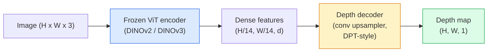

# 单目深度和几何估计

> 深度图是单通道图像，其中每个像素与相机的距离为一定。过去，如果没有立体声或激光雷达，从一个RB帧预测它是不可能的。到2026年，冷冻ViT编码器加上轻量级头部的检测结果将低于地面真实值的百分之几。

** 类型：** 构建+使用
** 语言：** Python
** 先决条件：** 第4阶段第14课（ViT）、第4阶段第17课（自我监督视觉）、第4阶段第07课（U-Net）
** 时间：** ~60分钟

## 学习目标

- 区分每个生产模型（MiDaS、Marigold、Depth Anything V3、ZoeDepth）所解决的相对和度量深度以及状态
- 使用Depth Anything V3（DINOv2主干）在无需校准的情况下预测任意单个图像的深度
- 解释为什么单目深度可以从单个图像中发挥作用（透视线索、纹理梯度、学习的先验）以及它无法恢复的内容（绝对比例、被遮挡的几何）
- 使用深度图和针孔相机本质将2D检测提升到3D点

## 问题

深度是2D计算机视觉中缺失的轴。如果给定了Ruby，您就知道事物出现在图像平面中的位置;您不知道它们有多远。深度传感器（立体钻机、激光雷达、飞行时间）可以直接解决这个问题，但价格昂贵、脆弱且范围有限。

单目深度估计--从单个Ruby帧预测深度--用于产生模糊、不可靠的输出。到2026年，大型预训练编码器改变了这一点：Depth Anything V3使用冻结的DINOv 2主干网，并生成可概括于室内、室外、医疗和卫星领域的深度图。Marigold将深度重新定义为条件扩散问题。ZoeDepth回归真实的度量距离。

深度也是2D检测和3D理解之间的桥梁：将检测到的盒子的像素乘以深度，就可以将2D对象提升到3D点云中。这是每个AR遮挡系统、每个避障管道和每个“捡杯”机器人的核心。

## 概念

### 相对深度与公制深度

- ** 相对深度 ** -有序的“z”值，没有现实世界的单位。“像素A比像素B更近，但距离比并不以米为单位。"
- ** 米制深度 ** -距相机的绝对距离，单位为米。要求模型了解图像线索和真实距离之间的统计关系。

MiDaS和Depth Anything V3产生相对深度。万寿菊产生相对深度。ZoeDepth、UniDepth和Metric 3D产生度量深度。指标模型对相机本质敏感;相对模型则不然。

### 编码器-解码器模式



Depth Anything V3冻结编码器并仅训练DPT风格的解码器。编码器提供丰富的特征;解码器将它们内插回图像分辨率并回归深度。

### 为什么单个图像会产生深度

2D图像包含许多与深度相关的单目线索：

- ** 透视 ** -3D中的平行线在2D中收敛。
- ** 纹理渐变 * -远处的表面纹理更小、更密集。
- ** 遮挡顺序 ** -较近的物体遮挡较远的物体。
- ** 大小恒定性 ** -已知物体（汽车、人类）给出了大致的比例。
- ** 大气透视 ** -远处的物体在户外场景中显得更加朦胧和蓝色。

对数十亿张图像进行训练的ViT将这些线索内化。有了足够的数据和强大的支柱，单目深度可以在没有任何明确的3D监督的情况下达到合理的准确度。

### 单目深度不能做什么

- ** 绝对度量尺度 ** 场景中没有本质或已知对象。该网络可以预测“杯子距离是勺子距离的两倍”，而不知道杯子距离是1 m还是10 m。
- ** 封闭的几何形状 ** -椅子的靠背是不可见的，并且无法可靠地推断。
- ** 真正无纹理/反射表面 ** -镜子、玻璃、均匀的墙壁。该网络报告的深度看似合理，但错误。

### 深度Anything V3 2026年

- 香草DINOv 2 ViT-L/14作为编码器（冷冻）。
- DPT解码器。
- 接受来自不同来源的已摆好图像对的培训（除了感光一致性之外，不需要明确的深度监督）。
- Predicts spatially consistent geometry from **an arbitrary number of visual inputs, with or without known camera poses**.
- SOTA跨越单目深度、任何视图几何、视觉渲染、相机姿态估计。

当您在2026年需要深度时，这是可以调用的临时模型。

### Marigold — diffusion for depth

Marigold (Ke et al., CVPR 2024) reframes depth estimation as conditional image-to-image diffusion. Conditioning: RGB. Target: depth map. Uses a pretrained Stable Diffusion 2 U-Net as backbone. Output depth maps are exceptionally sharp at object boundaries. Trade-off: slower inference than feed-forward models (10-50 denoising steps).

### 本质和针孔相机

要将深度为“d”的像素“（u，v）”提升到相机坐标中的3D点“（X，Y，Z）”：

```
fx, fy, cx, cy = camera intrinsics
X = (u - cx) * d / fx
Y = (v - cy) * d / fy
Z = d
```

Intrinsics come from EXIF metadata, a calibration pattern, or a monocular intrinsics estimator (Perspective Fields, UniDepth). Without intrinsics, you can still render a point cloud by assuming a 60-70° FOV and moderate-resolution principals — usable for visualisation, not for measurement.

### 评价

两个标准指标：

- **AbsRel**（绝对相对误差）：' mean（|d_pred - d_gt|/ d_gt）'。低越好。生产型号为0.05-0.1。
- **delta < 1.25**（阈值准确性）：“max（d_pred/d_gt，d_gt/d_pred）< 1.25”的像素比例。越高越好。SOTA为0.9+。

对于相对深度（Depth Anything V3、MiDaS），评估使用两个指标的比例和位移不变版本。

## 建设党

### 第1步：深度指标

```python
import torch

def abs_rel_error(pred, target, mask=None):
    if mask is not None:
        pred = pred[mask]
        target = target[mask]
    return (torch.abs(pred - target) / target.clamp(min=1e-6)).mean().item()


def delta_accuracy(pred, target, threshold=1.25, mask=None):
    if mask is not None:
        pred = pred[mask]
        target = target[mask]
    ratio = torch.maximum(pred / target.clamp(min=1e-6), target / pred.clamp(min=1e-6))
    return (ratio < threshold).float().mean().item()
```

在评估之前始终屏蔽无效深度像素（零、NaN、饱和）。

### 第2步：比例和移动对齐

对于相对深度模型，在计算指标之前将预测与地面事实保持一致。“a * pred + b =目标”的最小平方匹配：

```python
def align_scale_shift(pred, target, mask=None):
    if mask is not None:
        p = pred[mask]
        t = target[mask]
    else:
        p = pred.flatten()
        t = target.flatten()
    A = torch.stack([p, torch.ones_like(p)], dim=1)
    coeffs, *_ = torch.linalg.lstsq(A, t.unsqueeze(-1))
    a, b = coeffs[:2, 0]
    return a * pred + b
```

当评估MiDaS / Depth Anything时，在“abs_rel_错误”之前运行“ign_scale_shift”。

### 第3步：将深度提升到点云

```python
import numpy as np

def depth_to_point_cloud(depth, intrinsics):
    H, W = depth.shape
    fx, fy, cx, cy = intrinsics
    v, u = np.meshgrid(np.arange(H), np.arange(W), indexing="ij")
    z = depth
    x = (u - cx) * z / fx
    y = (v - cy) * z / fy
    return np.stack([x, y, z], axis=-1)


depth = np.random.uniform(0.5, 4.0, (240, 320))
intr = (320.0, 320.0, 160.0, 120.0)
pc = depth_to_point_cloud(depth, intr)
print(f"point cloud shape: {pc.shape}  (H, W, 3)")
```

一个功能，每个3D提升应用程序。将点云输出到“.ply”并在MeshLab或CloudCompare中打开。

### 第4步：使用合成深度场景进行烟雾测试

```python
def synthetic_depth(size=96):
    yy, xx = np.meshgrid(np.arange(size), np.arange(size), indexing="ij")
    # Floor: linear gradient from near (top) to far (bottom)
    depth = 1.0 + (yy / size) * 4.0
    # Box in the middle: closer
    mask = (np.abs(xx - size / 2) < size / 6) & (np.abs(yy - size * 0.6) < size / 6)
    depth[mask] = 2.0
    return depth.astype(np.float32)


gt = torch.from_numpy(synthetic_depth(96))
pred = gt + 0.3 * torch.randn_like(gt)  # simulated prediction
aligned = align_scale_shift(pred, gt)
print(f"before align  absRel = {abs_rel_error(pred, gt):.3f}")
print(f"after align   absRel = {abs_rel_error(aligned, gt):.3f}")
```

### 第5步：深度Anything V3的使用（参考）

```python
import torch
from transformers import pipeline
from PIL import Image

pipe = pipeline(task="depth-estimation", model="LiheYoung/depth-anything-v2-large")

image = Image.open("street.jpg").convert("RGB")
out = pipe(image)
depth_np = np.array(out["depth"])
```

三行。' out[' depth ']'是PIL灰度;对于数学，转换为numpy。对于Depth Anything V3，具体而言，请在发布后交换模型id; API保持不变。

## 使用它

- **Depth Anything V3**（Meta AI /字节跳动，2024-2026）-相对深度的默认值。生产中最快的ViT大型主干型号。
- ** 万寿菊 **（ETH，2024年）-最高的视觉质量，缓慢的推理。
- **UniDepth** (ETH, 2024) — metric depth with camera intrinsics estimation.
- **ZoeDepth**（英特尔，2023）-指标深度;较旧，仍然可靠。
- **MiDaS v3.1** -传统但稳定;用于比较的良好基线。

典型集成模式：

1. RB帧到达。
2. 深度模型生成深度图。
3. 检测器产生盒子。
4. 通过深度将框重心提升到3D;如果可用，与点云合并。
5. 下游：AR遮挡、路径规划、对象尺寸估计、立体声替换。

对于实时使用，Depth Anything V2 Small（INT 8量化）在518 x518的消费级图形处理器上的每秒速度约为30帧。

## 把它运

本课产生：

- '输出/prompt-depth-model-picker.md '-在Depth Anything V3、Marigold、UniDepth、MiDaS给定延迟、指标与相对需求和场景类型之间进行选择。
- '输出/skill-depth-to-pointcloud.md '-一种通过正确的内在函数处理从深度图构建点云并输出到'的技能。

## 演习

1. **（简单）** 在您办公桌的任何10张图像上运行Depth Anything V2。将深度保存为灰度PNG并进行检查。识别一个预测深度看起来错误的物体，并解释为什么单目线索失败。
2. **（中等）** 给定Depth Anything V2的RB+深度，提升到点云并使用“open 3d”渲染。比较两个场景（室内/室外）并注意哪个看起来更可信。
3. **（困难）** 拍摄五对图像，仅在已知物体的位置上有所不同（例如，瓶子向前移动30厘米）。使用UniDepth来预测两者的指标深度。报告预测距离增量与真实30厘米。

## 关键术语

| Term | 别人怎么说 | 它实际上意味着什么 |
|------|----------------|----------------------|
| 单目深度 | “单图像深度” | 从一个Ruby帧进行深度估计，没有立体声或LiDART |
| 相对深度 | “有序深度” | 没有现实世界单位的有序z值 |
| 米制深度 | “绝对距离” | 深度以米为单位;需要校准或接受过公制监督培训的模型 |
| AbsRel | “绝对相对误差” | 平均值 | d_pred - d_gt | / d_gt;标准深度指标 |
| Delta准确性 | “增量< 1.25” | Fraction of pixels with prediction within 25% of ground truth |
| Pinhole camera | “fx，fy，cx，cy” | 用于将（u，v，d）提升到（X，Y，Z）的相机模型 |
| DPT | “密集预测Transformer” | 基于Conv的解码器在冷冻ViT编码器之上使用以实现深度 |
| DINOv2主干 | “它有效的原因” | 自我监督功能，可在没有深度标签的情况下在各个领域进行推广 |

## 进一步阅读

- [Depth Anything V3 paper page](https://depth-anything.github.io/) — SOTA monocular depth with DINOv2 encoder
- [万寿菊（Ke等人，CVPR 2024）]（https：//marigoldmonodepth.github.io/）-基于扩散的深度估计
- [UniDepth（Piccinelli等人，2024）]（https：//arxiv.org/abs/2403.18913）-具有内部特征的指标深度
- [MiDaS v3.1（英特尔SAL）]（https：//github.com/isl-org/MiDaS）-典型的相对深度基线
- [DINOv 3博客文章（Meta）]（https：//ai.meta.com/blog/dinov3-self-supervised-vision-model/）-提高深度准确性的编码器系列
