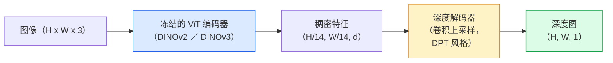

# 单目深度与几何估计（Monocular Depth & Geometry Estimation）

> 译注：本文译自同目录 [`en.md`](./en.md)。术语遵循仓根 [TRANSLATION_GUIDE.md](../../../../TRANSLATION_GUIDE.md)。

> 深度图（depth map）是一张单通道图像，每个像素代表它到相机的距离。从单张 RGB 帧预测深度，过去没有立体相机或 LiDAR 是不可能办到的。到 2026 年，一个冻结的 ViT encoder 加一个轻量 head，就能逼近 ground truth 几个百分点之内。

**Type:** Build + Use
**Languages:** Python
**Prerequisites:** Phase 4 Lesson 14 (ViT), Phase 4 Lesson 17 (Self-Supervised Vision), Phase 4 Lesson 07 (U-Net)
**Time:** ~60 minutes

## 学习目标（Learning Objectives）

- 区分相对深度（relative depth）与度量深度（metric depth），并说明每个生产级模型（MiDaS、Marigold、Depth Anything V3、ZoeDepth）解决的是哪一个
- 用 Depth Anything V3（DINOv2 backbone）对任意单图预测深度，无需任何标定
- 解释为什么从单张图像就能做深度估计（透视线索、纹理梯度、学到的先验），以及它无法恢复什么（绝对尺度、被遮挡的几何）
- 借助深度图与针孔相机内参（pinhole camera intrinsics），把 2D 检测提升（lift）到 3D 点

## 问题（Problem）

深度是 2D 计算机视觉里缺失的那根轴。给你 RGB，你知道东西在图像平面上的位置；但你不知道它们离你多远。深度传感器（立体相机、LiDAR、ToF）能直接解决这个问题，但贵、易坏、且距离受限。

单目深度估计——从单张 RGB 帧预测深度——过去输出又糊又不靠谱。到 2026 年，大型预训练 encoder 改变了局面：Depth Anything V3 用一个冻结的 DINOv2 backbone，产出的深度图能跨室内、室外、医学、卫星等不同领域泛化。Marigold 把深度重新表述为一个条件扩散（conditional diffusion）问题。ZoeDepth 直接回归真实的度量距离。

深度也是 2D 检测通往 3D 理解的桥梁：把检测框里的像素乘上深度，2D 物体就被提升成了 3D 点云。这是每个 AR 遮挡系统、每条避障流水线、每个「把杯子拿起来」的机器人的核心。

## 概念（Concept）

### 相对深度 vs 度量深度（Relative vs metric depth）

- **相对深度（relative depth）**——有序的 `z` 值，没有真实世界单位。「像素 A 比像素 B 近，但距离的比例不锚定到米。」
- **度量深度（metric depth）**——以米为单位的相机绝对距离。要求模型已经学到图像线索与真实距离之间的统计关系。

MiDaS 和 Depth Anything V3 输出相对深度。Marigold 输出相对深度。ZoeDepth、UniDepth、Metric3D 输出度量深度。度量模型对相机内参敏感；相对模型不敏感。

### encoder-decoder 范式（The encoder-decoder pattern）



Depth Anything V3 冻结 encoder，只训练 DPT 风格的 decoder。encoder 提供丰富特征；decoder 把它们插值回图像分辨率，并回归出深度。

### 单张图像为什么能产生深度（Why a single image produces depth at all）

一张 2D 图像里有许多与深度相关的单目线索：

- **透视（Perspective）**——3D 中平行的线在 2D 中会汇聚。
- **纹理梯度（Texture gradient）**——远处的表面纹理更小、更密。
- **遮挡顺序（Occlusion order）**——近处物体会遮住远处物体。
- **大小恒常性（Size constancy）**——已知物体（车、人）能给出近似尺度。
- **大气透视（Atmospheric perspective）**——户外场景里，远处物体看起来更朦胧、更偏蓝。

一个在数十亿张图像上训练过的 ViT 已经把这些线索内化了。只要数据够多、backbone 够强，单目深度无需任何显式 3D 监督就能拿到合理精度。

### 单目深度做不到的事（What monocular depth cannot do）

- **绝对的度量尺度（Absolute metric scale）**——没有内参或场景里没有已知物体时拿不到。网络可以预测「杯子比勺子远一倍」，但不知道杯子是 1 米还是 10 米外。
- **被遮挡的几何（Occluded geometry）**——椅子背面看不见，无法可靠推断。
- **真正无纹理 / 反射的表面**——镜子、玻璃、纯色墙。网络会给出一个看起来合理但其实错的深度。

### 2026 年的 Depth Anything V3（Depth Anything V3 in 2026）

- 原版 DINOv2 ViT-L/14 作为 encoder（冻结）。
- DPT decoder。
- 在多源带位姿的图像对上训练（除了光度一致性外不需要显式深度监督）。
- 能从**任意数量的视觉输入预测空间一致的几何，无论是否已知相机位姿**。
- 在单目深度、任意视图几何、视觉渲染、相机位姿估计上均为 SOTA。

这就是 2026 年要用深度时即插即用的模型。

### Marigold——把扩散用在深度上（Marigold — diffusion for depth）

Marigold（Ke et al., CVPR 2024）把深度估计重新表述为条件 image-to-image 扩散问题。条件：RGB。目标：深度图。backbone 用预训练的 Stable Diffusion 2 U-Net。输出深度图在物体边界处特别锐利。代价：推理比前馈模型慢（10–50 步去噪）。

### 内参与针孔相机（Intrinsics and the pinhole camera）

要把一个像素 `(u, v)` 与深度 `d` 提升到相机坐标系下的 3D 点 `(X, Y, Z)`：

```
fx, fy, cx, cy = camera intrinsics
X = (u - cx) * d / fx
Y = (v - cy) * d / fy
Z = d
```

内参可以来自 EXIF 元数据、标定图案，或一个单目内参估计器（Perspective Fields、UniDepth）。没有内参时，你仍然可以假设 60–70° FOV 和居中的主点来渲染点云——可视化够用，但别拿去做测量。

### 评估（Evaluation）

两个标准指标：

- **AbsRel**（绝对相对误差，absolute relative error）：`mean(|d_pred - d_gt| / d_gt)`。越低越好，生产模型在 0.05–0.1。
- **delta < 1.25**（阈值精度，threshold accuracy）：满足 `max(d_pred/d_gt, d_gt/d_pred) < 1.25` 的像素比例。越高越好，SOTA 0.9+。

对相对深度模型（Depth Anything V3、MiDaS），评估时这两项指标都用尺度-偏移不变（scale-and-shift invariant）的版本。

## 动手实现（Build It）

### 第 1 步：深度指标（Depth metrics）

```python
import torch

def abs_rel_error(pred, target, mask=None):
    if mask is not None:
        pred = pred[mask]
        target = target[mask]
    return (torch.abs(pred - target) / target.clamp(min=1e-6)).mean().item()


def delta_accuracy(pred, target, threshold=1.25, mask=None):
    if mask is not None:
        pred = pred[mask]
        target = target[mask]
    ratio = torch.maximum(pred / target.clamp(min=1e-6), target / pred.clamp(min=1e-6))
    return (ratio < threshold).float().mean().item()
```

评估前永远要把无效深度像素（零、NaN、饱和）mask 掉。

### 第 2 步：尺度-偏移对齐（Scale-and-shift alignment）

对相对深度模型，算指标前要把预测对齐到 ground truth。最小二乘拟合 `a * pred + b = target`：

```python
def align_scale_shift(pred, target, mask=None):
    if mask is not None:
        p = pred[mask]
        t = target[mask]
    else:
        p = pred.flatten()
        t = target.flatten()
    A = torch.stack([p, torch.ones_like(p)], dim=1)
    coeffs, *_ = torch.linalg.lstsq(A, t.unsqueeze(-1))
    a, b = coeffs[:2, 0]
    return a * pred + b
```

评估 MiDaS / Depth Anything 时，先跑 `align_scale_shift` 再跑 `abs_rel_error`。

### 第 3 步：把深度提升为点云（Lift depth to a point cloud）

```python
import numpy as np

def depth_to_point_cloud(depth, intrinsics):
    H, W = depth.shape
    fx, fy, cx, cy = intrinsics
    v, u = np.meshgrid(np.arange(H), np.arange(W), indexing="ij")
    z = depth
    x = (u - cx) * z / fx
    y = (v - cy) * z / fy
    return np.stack([x, y, z], axis=-1)


depth = np.random.uniform(0.5, 4.0, (240, 320))
intr = (320.0, 320.0, 160.0, 120.0)
pc = depth_to_point_cloud(depth, intr)
print(f"point cloud shape: {pc.shape}  (H, W, 3)")
```

一个函数，所有 3D 提升场景通用。把点云导出为 `.ply`，用 MeshLab 或 CloudCompare 打开。

### 第 4 步：用合成深度场景做冒烟测试（Smoke test with a synthetic depth scene）

```python
def synthetic_depth(size=96):
    yy, xx = np.meshgrid(np.arange(size), np.arange(size), indexing="ij")
    # Floor: linear gradient from near (top) to far (bottom)
    depth = 1.0 + (yy / size) * 4.0
    # Box in the middle: closer
    mask = (np.abs(xx - size / 2) < size / 6) & (np.abs(yy - size * 0.6) < size / 6)
    depth[mask] = 2.0
    return depth.astype(np.float32)


gt = torch.from_numpy(synthetic_depth(96))
pred = gt + 0.3 * torch.randn_like(gt)  # simulated prediction
aligned = align_scale_shift(pred, gt)
print(f"before align  absRel = {abs_rel_error(pred, gt):.3f}")
print(f"after align   absRel = {abs_rel_error(aligned, gt):.3f}")
```

### 第 5 步：Depth Anything V3 用法（参考）（Depth Anything V3 usage (reference)）

```python
import torch
from transformers import pipeline
from PIL import Image

pipe = pipeline(task="depth-estimation", model="LiheYoung/depth-anything-v2-large")

image = Image.open("street.jpg").convert("RGB")
out = pipe(image)
depth_np = np.array(out["depth"])
```

三行。`out["depth"]` 是 PIL 灰度图；做数学时转成 numpy。专门要 Depth Anything V3 的话，等模型发布后把 model id 换掉就行，API 不变。

## 用起来（Use It）

- **Depth Anything V3**（Meta AI / ByteDance，2024–2026）——相对深度的默认选择。生产中跑得最快的 ViT-large-backbone 模型。
- **Marigold**（ETH，2024）——视觉质量最高，推理慢。
- **UniDepth**（ETH，2024）——带相机内参估计的度量深度。
- **ZoeDepth**（Intel，2023）——度量深度；旧一些，但仍然可靠。
- **MiDaS v3.1**——遗留但稳定；做对比时不错的 baseline。

典型集成范式：

1. 来一帧 RGB。
2. 深度模型产出深度图。
3. 检测器产出 box。
4. 把 box 中心通过深度提升到 3D；如果有点云就合并进去。
5. 下游：AR 遮挡、路径规划、物体尺寸估计、立体相机替换。

实时场景下，Depth Anything V2 Small（INT8 量化）在消费级 GPU 上 518×518 分辨率可达 ~30 fps。

## 上线部署（Ship It）

本节产出：

- `outputs/prompt-depth-model-picker.md`——根据延迟、度量 vs 相对的需要、场景类型，在 Depth Anything V3、Marigold、UniDepth、MiDaS 之间做选择。
- `outputs/skill-depth-to-pointcloud.md`——一个 skill，可从深度图构建点云，正确处理内参，并导出为 `.ply`。

## 练习（Exercises）

1. **（简单）** 用 Depth Anything V2 跑你桌面上的任意 10 张图。把深度存成灰度 PNG 看一看。挑出一个预测深度明显不对的物体，解释为什么单目线索失效了。
2. **（中等）** 给定 RGB + Depth Anything V2 的深度，提升成点云，用 `open3d` 渲染。对比室内 / 室外两个场景，说说哪个看起来更可信。
3. **（困难）** 拍五对图片，每对之间只差一个已知物体的位置变化（比如瓶子靠近 30 cm）。用 UniDepth 对两边都预测度量深度。报告预测的距离差和真实 30 cm 的差距。

## 关键术语（Key Terms）

| 术语 | 大家平时怎么说 | 它实际是什么 |
|------|----------------|----------------------|
| Monocular depth（单目深度） | 「单图深度」 | 从单张 RGB 帧做深度估计，不用立体相机或 LiDAR |
| Relative depth（相对深度） | 「有序深度」 | 没有真实世界单位的有序 z 值 |
| Metric depth（度量深度） | 「绝对距离」 | 以米为单位的深度；需要标定，或用度量监督训练过的模型 |
| AbsRel | 「绝对相对误差」 | |d_pred - d_gt| / d_gt 的平均；标准深度指标 |
| Delta accuracy（阈值精度） | 「delta < 1.25」 | 预测在 ground truth ±25% 之内的像素占比 |
| Pinhole camera（针孔相机） | 「fx, fy, cx, cy」 | 把 (u, v, d) 提升到 (X, Y, Z) 用的相机模型 |
| DPT | 「Dense Prediction Transformer」 | 在冻结 ViT encoder 上接的、基于卷积的深度 decoder |
| DINOv2 backbone | 「就是它在起作用」 | 跨域泛化、不需要深度标签的自监督特征 |

## 延伸阅读（Further Reading）

- [Depth Anything V3 paper page](https://depth-anything.github.io/) —— 用 DINOv2 encoder 的 SOTA 单目深度
- [Marigold (Ke et al., CVPR 2024)](https://marigoldmonodepth.github.io/) —— 基于扩散的深度估计
- [UniDepth (Piccinelli et al., 2024)](https://arxiv.org/abs/2403.18913) —— 带内参的度量深度
- [MiDaS v3.1 (Intel ISL)](https://github.com/isl-org/MiDaS) —— 相对深度的经典 baseline
- [DINOv3 blog post (Meta)](https://ai.meta.com/blog/dinov3-self-supervised-vision-model/) —— 把深度精度顶上来的 encoder 系列
