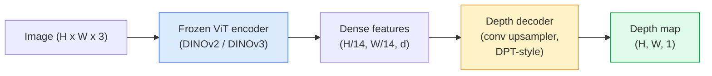

# 单目深度与几何估计

> 深度图是单通道图像，其中每个像素是距离相机的距离。从单张 RGB 帧预测深度曾经在没有立体视觉或 LiDAR 的情况下是不可能的。2026 年，一个冻结的 ViT 编码器加上轻量级头就能达到真实标注的百分之几以内。

**类型：** 构建 + 使用
**语言：** Python
**前置条件：** 阶段 4 第 14 课（ViT），阶段 4 第 17 课（自监督视觉），阶段 4 第 07 课（U-Net）
**时间：** ~60 分钟

## 学习目标

- 区分相对深度和度量深度，并说明每个生产模型（MiDaS、Marigold、Depth Anything V3、ZoeDepth）解决的是哪一种
- 使用 Depth Anything V3（DINOv2 骨干）预测任意单张图像的深度，无需任何标定
- 解释为什么单目深度能从单张图像中工作（透视线索、纹理梯度、学习到的先验），以及它无法恢复什么（绝对尺度、被遮挡的几何体）
- 使用深度图和小孔相机内参将 2D 检测结果提升为 3D 点

## 问题

深度是 2D 计算机视觉中缺失的轴。给定 RGB，你知道物体在图像平面中出现的位置；你不知道它们有多远。深度传感器（立体设备、LiDAR、飞行时间）直接解决了这个问题，但昂贵、脆弱且范围有限。

单目深度估计——从单张 RGB 帧预测深度——曾经产生模糊、不可靠的输出。到 2026 年，大型预训练编码器改变了这一点：Depth Anything V3 使用冻结的 DINOv2 骨干，产生的深度图可泛化到室内、室外、医学和卫星领域。Marigold 将深度重新定义为条件扩散问题。ZoeDepth 回归真正的度量距离。

深度也是 2D 检测和 3D 理解之间的桥梁：将检测到的框的像素乘以深度，你就将 2D 物体提升到了 3D 点云。这是每个 AR 遮挡系统、每个避障流水线和每个"拿起杯子"机器人的核心。

## 概念

### 相对深度 vs 度量深度

- **相对深度**——没有真实世界单位的排序后的 `z` 值。"像素 A 比像素 B 近，但距离的比例不以米为单位。"
- **度量深度**——以米为单位的到相机的绝对距离。要求模型已学习图像线索与真实距离之间的统计关系。

MiDaS 和 Depth Anything V3 产生相对深度。Marigold 产生相对深度。ZoeDepth、UniDepth 和 Metric3D 产生度量深度。度量模型对相机内参敏感；相对模型则不然。

### 编码器-解码器模式


```mermaid
flowchart LR
    IMG["Image (H x W x 3)"] --> ENC["Frozen ViT encoder<br/>(DINOv2 / DINOv3)"]
    ENC --> FEATS["Dense features<br/>(H/14, W/14, d)"]
    FEATS --> DEC["Depth decoder<br/>(conv upsampler,<br/>DPT-style)"]
    DEC --> DEPTH["Depth map<br/>(H, W, 1)"]

    style ENC fill:#dbeafe,stroke:#2563eb
    style DEC fill:#fef3c7,stroke:#d97706
    style DEPTH fill:#dcfce7,stroke:#16a34a
```

Depth Anything V3 冻结编码器，仅训练 DPT 风格的解码器。编码器提供丰富的特征；解码器将它们插值回图像分辨率并回归深度。

### 为什么单张图像能产生深度

2D 图像包含许多与深度相关的单目线索：

- **透视**——3D 中的平行线在 2D 中汇聚。
- **纹理梯度**——远处的表面有更小、更密集的纹理。
- **遮挡顺序**——更近的物体遮挡更远的物体。
- **大小恒常性**——已知物体（汽车、人类）提供近似尺度。
- **大气透视**——在室外场景中，远处的物体看起来更模糊、更蓝。

在数十亿张图像上训练的 ViT 将这些线索内化。有了足够的数据和强大的骨干，单目深度无需任何显式 3D 监督就能达到合理的精度。

### 单目深度无法做到的事情

- **绝对度量尺度**——没有内参或场景中的已知物体。网络可以预测"杯子是勺子的两倍远"，而不知道杯子是 1 米还是 10 米远。
- **被遮挡的几何体**——椅子的背面不可见，无法可靠推断。
- **真正无纹理 / 反射表面**——镜子、玻璃、均匀的墙壁。网络报告似是而非但错误的深度。

### 2026 年的 Depth Anything V3

- 纯 DINOv2 ViT-L/14 作为编码器（冻结）。
- DPT 解码器。
- 在来自多种来源的已标定图像对上训练（除了光度一致性外，不需要显式的深度监督）。
- 从**任意数量的视觉输入中**预测空间一致的几何体，**无论是否已知相机位姿**。
- 在单目深度、任意视角几何、视觉渲染、相机位姿估计方面达到 SOTA。

这是 2026 年当你需要深度时应直接调用的模型。

### Marigold——用于深度的扩散

Marigold（Ke 等人, CVPR 2024）将深度估计重新定义为条件图像到图像扩散。条件：RGB。目标：深度图。使用预训练的 Stable Diffusion 2 U-Net 作为骨干。输出的深度图在物体边界处异常锐利。权衡：推理速度比前馈模型慢（10-50 个去噪步）。

### 内参和小孔相机

要将像素 `(u, v)` 及其深度 `d` 提升到相机坐标中的 3D 点 `(X, Y, Z)`：

```
fx, fy, cx, cy = camera intrinsics
X = (u - cx) * d / fx
Y = (v - cy) * d / fy
Z = d
```

内参来自 EXIF 元数据、标定图案或单目内参估计器（Perspective Fields、UniDepth）。没有内参，你仍然可以通过假设 60-70° FOV 和中等分辨率原则来渲染点云——可用于可视化，不可用于测量。

### 评估

两个标准指标：

- **AbsRel**（绝对相对误差）：`mean(|d_pred - d_gt| / d_gt)`。越低越好。生产模型为 0.05-0.1。
- **delta < 1.25**（阈值精度）：满足 `max(d_pred/d_gt, d_gt/d_pred) < 1.25` 的像素比例。越高越好。SOTA 为 0.9+。

对于相对深度（Depth Anything V3、MiDaS），评估使用两种指标的尺度和平移不变版本。

## 构建

### 步骤 1：深度指标

```python
import torch

def abs_rel_error(pred, target, mask=None):
    if mask is not None:
        pred = pred[mask]
        target = target[mask]
    return (torch.abs(pred - target) / target.clamp(min=1e-6)).mean().item()


def delta_accuracy(pred, target, threshold=1.25, mask=None):
    if mask is not None:
        pred = pred[mask]
        target = target[mask]
    ratio = torch.maximum(pred / target.clamp(min=1e-6), target / pred.clamp(min=1e-6))
    return (ratio < threshold).float().mean().item()
```

在评估前始终遮蔽无效深度像素（零、NaN、饱和）。

### 步骤 2：尺度和平移对齐

对于相对深度模型，在计算指标前将预测与真实标注对齐。最小二乘拟合 `a * pred + b = target`：

```python
def align_scale_shift(pred, target, mask=None):
    if mask is not None:
        p = pred[mask]
        t = target[mask]
    else:
        p = pred.flatten()
        t = target.flatten()
    A = torch.stack([p, torch.ones_like(p)], dim=1)
    coeffs, *_ = torch.linalg.lstsq(A, t.unsqueeze(-1))
    a, b = coeffs[:2, 0]
    return a * pred + b
```

在评估 MiDaS / Depth Anything 时，在 `abs_rel_error` 之前运行 `align_scale_shift`。

### 步骤 3：将深度提升为点云

```python
import numpy as np

def depth_to_point_cloud(depth, intrinsics):
    H, W = depth.shape
    fx, fy, cx, cy = intrinsics
    v, u = np.meshgrid(np.arange(H), np.arange(W), indexing="ij")
    z = depth
    x = (u - cx) * z / fx
    y = (v - cy) * z / fy
    return np.stack([x, y, z], axis=-1)


depth = np.random.uniform(0.5, 4.0, (240, 320))
intr = (320.0, 320.0, 160.0, 120.0)
pc = depth_to_point_cloud(depth, intr)
print(f"point cloud shape: {pc.shape}  (H, W, 3)")
```

一个函数，适用于每个 3D 提升应用。将点云导出为 `.ply` 并在 MeshLab 或 CloudCompare 中打开。

### 步骤 4：使用合成深度场景进行冒烟测试

```python
def synthetic_depth(size=96):
    yy, xx = np.meshgrid(np.arange(size), np.arange(size), indexing="ij")
    # 地面：从近（顶部）到远（底部）的线性梯度
    depth = 1.0 + (yy / size) * 4.0
    # 中间的一个盒子：更近
    mask = (np.abs(xx - size / 2) < size / 6) & (np.abs(yy - size * 0.6) < size / 6)
    depth[mask] = 2.0
    return depth.astype(np.float32)


gt = torch.from_numpy(synthetic_depth(96))
pred = gt + 0.3 * torch.randn_like(gt)  # 模拟预测
aligned = align_scale_shift(pred, gt)
print(f"before align  absRel = {abs_rel_error(pred, gt):.3f}")
print(f"after align   absRel = {abs_rel_error(aligned, gt):.3f}")
```

### 步骤 5：Depth Anything V3 使用（参考）

```python
import torch
from transformers import pipeline
from PIL import Image

pipe = pipeline(task="depth-estimation", model="LiheYoung/depth-anything-v2-large")

image = Image.open("street.jpg").convert("RGB")
out = pipe(image)
depth_np = np.array(out["depth"])
```

三行代码。`out["depth"]` 是一个 PIL 灰度图；转换为 numpy 进行数学计算。对于 Depth Anything V3 的特定版本，发布后替换模型 ID；API 保持不变。

## 使用

- **Depth Anything V3**（Meta AI / ByteDance, 2024-2026）——相对深度的默认选择。生产中速度最快的 ViT-large 骨干模型。
- **Marigold**（ETH, 2024）——视觉质量最高，推理速度慢。
- **UniDepth**（ETH, 2024）——带相机内参估计的度量深度。
- **ZoeDepth**（Intel, 2023）——度量深度；较老，仍然可靠。
- **MiDaS v3.1**——遗留但稳定；良好的比较基线。

典型集成模式：

1. RGB 帧到达。
2. 深度模型产生深度图。
3. 检测器产生框。
4. 通过深度将框中心提升到 3D；如果可用则与点云合并。
5. 下游：AR 遮挡、路径规划、物体大小估计、立体替换。

对于实时使用，Depth Anything V2 Small（INT8 量化）在消费级 GPU 上在 518x518 分辨率下达到约 30 fps。

## 交付

本课产出：

- `outputs/prompt-depth-model-picker.md`——根据延迟、度量-vs-相对需求和场景类型选择 Depth Anything V3、Marigold、UniDepth、MiDaS。
- `outputs/skill-depth-to-pointcloud.md`——一个技能，从深度图构建点云，具有正确的内参处理和 `.ply` 导出。

## 练习

1. **（简单）** 在桌面的任意 10 张图像上运行 Depth Anything V2。将深度保存为灰度 PNG 并检查。找出一个预测深度看起来错误的物体，并解释为什么单目线索失效了。
2. **（中等）** 给定来自 Depth Anything V2 的 RGB + 深度，提升为点云并用 `open3d` 渲染。比较两个场景（室内 / 室外）并注意哪个看起来更可信。
3. **（困难）** 取五对仅因已知物体位置不同（例如，瓶子移近了 30 cm）的图像。使用 UniDepth 预测两者的度量深度。报告预测距离差值与真实 30 cm 的对比。

## 关键术语

| 术语 | 人们说的 | 实际含义 |
|------|----------------|----------------------|
| 单目深度 | "单图像深度" | 从单张 RGB 帧估计深度，无需立体视觉或 LiDAR |
| 相对深度 | "排序的深度" | 无真实世界单位的排序 z 值 |
| 度量深度 | "绝对距离" | 以米为单位的深度；需要标定或用度量监督训练的模型 |
| AbsRel | "绝对相对误差" | |d_pred - d_gt| / d_gt 的均值；标准深度指标 |
| Delta 精度 | "delta < 1.25" | 预测在真实值 25% 以内的像素比例 |
| 小孔相机 | "fx, fy, cx, cy" | 用于将 (u, v, d) 提升到 (X, Y, Z) 的相机模型 |
| DPT | "密集预测 Transformer" | 基于卷积的解码器，用于冻结 ViT 编码器之上的深度估计 |
| DINOv2 骨干 | "它能工作的原因" | 无需深度标签即可跨领域泛化的自监督特征 |

## 延伸阅读

- [Depth Anything V3 论文页面](https://depth-anything.github.io/)——使用 DINOv2 编码器的 SOTA 单目深度
- [Marigold（Ke 等人, CVPR 2024）](https://marigoldmonodepth.github.io/)——基于扩散的深度估计
- [UniDepth（Piccinelli 等人, 2024）](https://arxiv.org/abs/2403.18913)——带内参的度量深度
- [MiDaS v3.1（Intel ISL）](https://github.com/isl-org/MiDaS)——规范的相对深度基线
- [DINOv3 博客文章（Meta）](https://ai.meta.com/blog/dinov3-self-supervised-vision-model/)——提升深度精度的编码器家族
