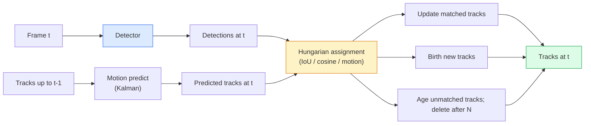

# Multi-Object Tracking & Video Memory

> tracking は detection と association の組み合わせである。各 frame で検出し、今回の frame の detections を前回 frame の tracks に ID で対応付ける。

**種別:** 構築
**言語:** Python
**前提条件:** Phase 4 Lesson 06 (YOLO Detection), Phase 4 Lesson 08 (Mask R-CNN), Phase 4 Lesson 24 (SAM 3)
**所要時間:** 約60分

## 学習目標

- tracking-by-detection と query-based tracking を区別し、algorithm families (SORT、DeepSORT、ByteTrack、BoT-SORT、SAM 2 memory tracker、SAM 3.1 Object Multiplex) を挙げる
- classic tracking-by-detection のために IoU + Hungarian assignment を from scratch で実装する
- SAM 2 の memory bank と、IoU-based association より occlusion に強い理由を説明する
- 3 つの tracking metrics (MOTA、IDF1、HOTA) を読み、use case ごとに重要な metric を選ぶ

## 問題

detector は single frame 内の objects の位置を教える。tracker は frame `t` の detection が、frame `t-1` のどの detection と同じ object かを教える。これがなければ、line を横切る objects を数えたり、occlusion を通る ball を追ったり、「car #4 が 8 秒間 lane にいる」と知ることはできない。

tracking は video-facing product のすべてに不可欠である。sports analytics、surveillance、autonomous driving、medical video analysis、wildlife monitoring、wordmark counting などで使われる。中核となる building blocks は共通している。per-frame detector、motion model (Kalman filter など)、association step (IoU / cosine / learned features 上の Hungarian algorithm)、track lifecycle (birth、update、death) である。

2026 年には 2 つの新しい pattern が加わった。**SAM 2 memory-based tracking** (motion-model association ではなく feature-memory) と **SAM 3.1 Object Multiplex** (同一 concept の多くの instances に shared memory を使う) である。この lesson では、まず classical stack を扱い、その後 memory-based approach に進む。

## 概念

### Tracking-by-detection



2026 年に目にする tracker のほぼすべては、この loop の変種である。違いは次の通り。

- **SORT** (2016): Kalman filter + IoU Hungarian。simple、fast、appearance model なし。
- **DeepSORT** (2017): SORT + track ごとの CNN-based appearance feature (ReID embedding)。crossing に強い。
- **ByteTrack** (2021): low-confidence detections を second stage として associate する。appearance features 不要だが MOT17 の top performer。
- **BoT-SORT** (2022): Byte + camera motion compensation + ReID。
- **StrongSORT / OC-SORT** — より良い motion と appearance を備えた ByteTrack descendants。

### Kalman filter を 1 段落で

Kalman filter は track ごとに covariance 付き state `(x, y, w, h, dx, dy, dw, dh)` を保持する。各 frame で constant-velocity model により state を **predict** し、matched detection で **update** する。predict uncertainty が高いほど、update は detection をより信頼する。これにより smooth trajectory と、短い occlusion (1-5 frames) を通じて track を継続する能力が得られる。

classical tracker はすべて、motion-prediction step で Kalman filter を使う。

### Hungarian algorithm

`M x N` cost matrix (tracks x detections) が与えられたとき、total cost を最小化する one-to-one assignment を見つける。cost は通常 `1 - IoU(track_bbox, detection_bbox)`、または appearance features の negative cosine similarity である。runtime は O((M+N)^3)。M、N が ~1000 までなら、`scipy.optimize.linear_sum_assignment` で Python でも十分速い。

### ByteTrack の key idea

standard trackers は low-confidence detections (< 0.5) を捨てる。ByteTrack はそれらを **second-stage candidates** として残す。tracks を high-confidence detections に match した後、unmatched tracks が少し緩い IoU threshold で low-confidence detections と match を試みる。これにより短い occlusion や crowd 付近の ID switch を回復できる。

### SAM 2 memory-based tracking

SAM 2 は per-instance spatio-temporal features の **memory bank** を保持して video を扱う。ある frame に prompt (click、box、text) が与えられると、その instance を memory に encode する。後続 frame では、memory が新しい frame の features に対して cross-attended され、decoder が同じ instance の mask を新しい frame で生成する。

Kalman filter も Hungarian assignment もない。association は memory-attention operation の中に implicit に含まれる。

Pros:
- large occlusions に強い (memory が多くの frames にわたって instance identity を保持する)。
- SAM 3 の text prompts と組み合わせると open-vocabulary。
- separate motion model なしで動く。

Cons:
- many-object tracking では ByteTrack より遅い。
- memory bank が増えるため、context window に制限がある。

### SAM 3.1 Object Multiplex

従来の SAM 2 / SAM 3 tracking は instance ごとに separate memory bank を持つ。50 objects なら 50 memory banks である。Object Multiplex (March 2026) はそれらを **per-instance query tokens** 付きの single shared memory にまとめる。cost は instance 数に対して sub-linear に scale する。

Multiplex は 2026 年の crowd tracking の新しい default である。concert crowds、warehouse workers、traffic intersections で使われる。

### 知っておくべき 3 つの metrics

- **MOTA (Multi-Object Tracking Accuracy)** — 1 - (FN + FP + ID switches) / GT。error type で weighted された、detection と association failures を混ぜた single metric。
- **IDF1 (ID F1)** — ID precision と recall の harmonic mean。各 ground-truth track が時間を通じてどれだけ ID を保つかに特化する。ID-switch-sensitive tasks では MOTA より良い。
- **HOTA (Higher Order Tracking Accuracy)** — detection accuracy (DetA) と association accuracy (AssA) に分解する。2020 年以降の community standard で最も包括的。

surveillance (who is who) では IDF1 を report する。sports analytics (counting passes) では HOTA。一般的な academic comparison でも HOTA。

## 実装

### Step 1: IoU-based cost matrix

```python
import numpy as np


def bbox_iou(a, b):
    """
    a, b: (N, 4) arrays of [x1, y1, x2, y2].
    Returns (N_a, N_b) IoU matrix.
    """
    ax1, ay1, ax2, ay2 = a[:, 0], a[:, 1], a[:, 2], a[:, 3]
    bx1, by1, bx2, by2 = b[:, 0], b[:, 1], b[:, 2], b[:, 3]
    inter_x1 = np.maximum(ax1[:, None], bx1[None, :])
    inter_y1 = np.maximum(ay1[:, None], by1[None, :])
    inter_x2 = np.minimum(ax2[:, None], bx2[None, :])
    inter_y2 = np.minimum(ay2[:, None], by2[None, :])
    inter = np.clip(inter_x2 - inter_x1, 0, None) * np.clip(inter_y2 - inter_y1, 0, None)
    area_a = (ax2 - ax1) * (ay2 - ay1)
    area_b = (bx2 - bx1) * (by2 - by1)
    union = area_a[:, None] + area_b[None, :] - inter
    return inter / np.clip(union, 1e-8, None)
```

### Step 2: minimal SORT-style tracker

brevity のため fixed constant-velocity Kalman は省略する。ここでは simple IoU association を使う。本番では Kalman predict が必須である。`sort` Python package が full version を提供する。

```python
from scipy.optimize import linear_sum_assignment


class Track:
    def __init__(self, tid, bbox, frame):
        self.id = tid
        self.bbox = bbox
        self.last_frame = frame
        self.hits = 1

    def update(self, bbox, frame):
        self.bbox = bbox
        self.last_frame = frame
        self.hits += 1


class SimpleTracker:
    def __init__(self, iou_threshold=0.3, max_age=5):
        self.tracks = []
        self.next_id = 1
        self.iou_threshold = iou_threshold
        self.max_age = max_age

    def step(self, detections, frame):
        if not self.tracks:
            for d in detections:
                self.tracks.append(Track(self.next_id, d, frame))
                self.next_id += 1
            return [(t.id, t.bbox) for t in self.tracks]

        track_boxes = np.array([t.bbox for t in self.tracks])
        det_boxes = np.array(detections) if len(detections) else np.empty((0, 4))

        iou = bbox_iou(track_boxes, det_boxes) if len(det_boxes) else np.zeros((len(track_boxes), 0))
        cost = 1 - iou
        cost[iou < self.iou_threshold] = 1e6

        matched_track = set()
        matched_det = set()
        if cost.size > 0:
            row, col = linear_sum_assignment(cost)
            for r, c in zip(row, col):
                if cost[r, c] < 1.0:
                    self.tracks[r].update(det_boxes[c], frame)
                    matched_track.add(r); matched_det.add(c)

        for i, d in enumerate(det_boxes):
            if i not in matched_det:
                self.tracks.append(Track(self.next_id, d, frame))
                self.next_id += 1

        self.tracks = [t for t in self.tracks if frame - t.last_frame <= self.max_age]
        return [(t.id, t.bbox) for t in self.tracks]
```

60 lines。per-frame detections を受け取り、per-frame track IDs を返す。real systems では Kalman predict、ByteTrack の second-stage re-match、appearance features を追加する。

### Step 3: synthetic trajectory test

```python
def synthetic_frames(num_frames=20, num_objects=3, H=240, W=320, seed=0):
    rng = np.random.default_rng(seed)
    starts = rng.uniform(20, 200, size=(num_objects, 2))
    velocities = rng.uniform(-5, 5, size=(num_objects, 2))
    frames = []
    for f in range(num_frames):
        dets = []
        for i in range(num_objects):
            cx, cy = starts[i] + f * velocities[i]
            dets.append([cx - 10, cy - 10, cx + 10, cy + 10])
        frames.append(dets)
    return frames


tracker = SimpleTracker()
for f, dets in enumerate(synthetic_frames()):
    tracks = tracker.step(dets, f)
```

straight lines で動く 3 objects は、20 frames すべてで ID を保つはずである。

### Step 4: ID-switch metric

```python
def count_id_switches(tracks_per_frame, gt_per_frame):
    """
    tracks_per_frame:  list of list of (track_id, bbox)
    gt_per_frame:      list of list of (gt_id, bbox)
    Returns number of ID switches.
    """
    prev_assignment = {}
    switches = 0
    for tracks, gts in zip(tracks_per_frame, gt_per_frame):
        if not tracks or not gts:
            continue
        t_boxes = np.array([b for _, b in tracks])
        g_boxes = np.array([b for _, b in gts])
        iou = bbox_iou(g_boxes, t_boxes)
        for g_idx, (gt_id, _) in enumerate(gts):
            j = iou[g_idx].argmax()
            if iou[g_idx, j] > 0.5:
                t_id = tracks[j][0]
                if gt_id in prev_assignment and prev_assignment[gt_id] != t_id:
                    switches += 1
                prev_assignment[gt_id] = t_id
    return switches
```

これは simplified IDF1-adjacent metric である。ground-truth object に割り当てられる predicted track ID が何回変わったかを数える。real MOTA / IDF1 / HOTA tooling は `py-motmetrics` と `TrackEval` にある。

## 使う

2026 年の production trackers:

- `ultralytics` — YOLOv8 + ByteTrack / BoT-SORT built-in。`results = model.track(source, tracker="bytetrack.yaml")`。default。
- `supervision` (Roboflow) — ByteTrack wrappers と annotation utilities。
- SAM 2 / SAM 3.1 — `processor.track()` 経由の memory-based tracking。
- Custom stack: detector (YOLOv8 / RT-DETR) + `sort-tracker` / `OC-SORT` / `StrongSORT`。

選び方:

- pedestrians / cars / boxes を 30+ fps で追う: **ByteTrack with ultralytics**。
- crowd 内の single class の many instances: **SAM 3.1 Object Multiplex**。
- identifiable appearance を持つ heavy occlusions: **DeepSORT / StrongSORT** (ReID features)。
- sports / complex interactions: **BoT-SORT** または learned trackers (MOTRv3)。

## 成果物

この lesson が生成するもの:

- `outputs/prompt-tracker-picker.md` — scene type、occlusion patterns、latency budget に基づいて SORT / ByteTrack / BoT-SORT / SAM 2 / SAM 3.1 を選ぶ。
- `outputs/skill-mot-evaluator.md` — ground-truth tracks に対する MOTA / IDF1 / HOTA の complete evaluation harness を書く。

## 演習

1. **(Easy)** 上の synthetic tracker を 3、10、30 objects で実行する。それぞれの ID-switch count を report する。simple IoU-only association がどこで失敗し始めるかを特定する。
2. **(Medium)** association 前に constant-velocity Kalman predict step を追加する。短い (2-3 frame) occlusion で ID switch が起きなくなることを示す。
3. **(Hard)** `transformers` 経由で SAM 2 の memory-based tracker を alternative tracker backend として統合する。crowd の 30-second clip で SimpleTracker と SAM 2 の両方を実行し、目立つ 5 人の ground-truth IDs を手で label して ID-switch counts を比較する。

## 重要用語

| Term | よく言われる表現 | 実際の意味 |
|------|----------------|----------------------|
| Tracking-by-detection | "Detect then associate" | per-frame detector + IoU / appearance 上の Hungarian assignment |
| Kalman filter | "Motion predict" | smooth track predictions と occlusion handling のための linear dynamics + covariance |
| Hungarian algorithm | "Optimal assignment" | minimum-cost bipartite matching problem を解く。`scipy.optimize.linear_sum_assignment` |
| ByteTrack | "Low-confidence second pass" | unmatched tracks を low-confidence detections に再 match し、短い occlusion を回復する |
| DeepSORT | "SORT + appearance" | cross-frame matching 用 ReID feature を追加し、ID preservation を改善する |
| Memory bank | "SAM 2 trick" | frames をまたいで保存される per-instance spatio-temporal features。explicit association を cross-attention が置き換える |
| Object Multiplex | "SAM 3.1 shared memory" | fast many-object tracking のための per-instance queries 付き single shared memory |
| HOTA | "Modern tracking metric" | detection と association accuracy に分解する community standard |

## 参考資料

- [SORT (Bewley et al., 2016)](https://arxiv.org/abs/1602.00763) — 最小の tracking-by-detection paper
- [DeepSORT (Wojke et al., 2017)](https://arxiv.org/abs/1703.07402) — appearance feature を追加
- [ByteTrack (Zhang et al., 2022)](https://arxiv.org/abs/2110.06864) — low-confidence second pass
- [BoT-SORT (Aharon et al., 2022)](https://arxiv.org/abs/2206.14651) — camera motion compensation
- [HOTA (Luiten et al., 2020)](https://arxiv.org/abs/2009.07736) — decomposed tracking metric
- [SAM 2 video segmentation (Meta, 2024)](https://ai.meta.com/sam2/) — memory-based tracker
- [SAM 3.1 Object Multiplex (Meta, March 2026)](https://ai.meta.com/blog/segment-anything-model-3/)
