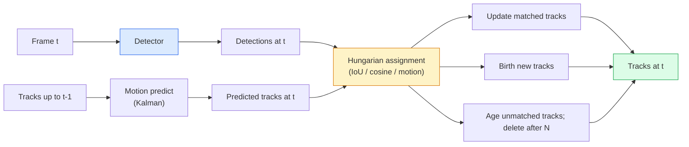

# Çoklu Nesne İzleme ve Video Belleği

> İzleme, tespit artı ilişkilendirmedir. Her kareyi algılayın. Bu karenin algılamalarını son karenin izleriyle kimliğe göre eşleştirin.

**Tür:** Yapım
**Diller:** Python
**Önkoşullar:** Aşama 4 Ders 06 (YOLO Tespiti), Aşama 4 Ders 08 (Maske R-CNN), Aşama 4 Ders 24 (SAM 3)
**Süre:** ~60 dakika

## Öğrenme Hedefleri

- Algılamaya göre izlemeyi sorgu tabanlı izlemeden ayırın ve algoritma ailelerini adlandırın (SORT, DeepSORT, ByteTrack, BoT-SORT, SAM 2 bellek izleyici, SAM 3.1 Object Multiplex)
- Klasik algılamaya göre izleme için IoU + Macarca atamasını sıfırdan uygulayın
- SAM 2'nin bellek bankasını ve tıkanmayı neden IoU tabanlı ilişkilendirmeden daha iyi işlediğini açıklayın
- Üç izleme metriğini (MOTA, IDF1, HOTA) okuyun ve belirli bir kullanım durumu için hangisinin önemli olduğunu seçin

## Sorun

Bir dedektör size nesnelerin tek bir karede nerede olduğunu söyler. Bir izleyici, `t` çerçevesindeki hangi algılamanın, `t-1` çerçevesindeki algılamayla aynı nesne olduğunu söyler. Bu olmadan, bir çizgiyi geçen nesneleri sayamaz, bir tıkanıklığın içinden geçen bir topu takip edemez veya "4 numaralı arabanın 8 saniyedir şeritte olduğunu" bilemezsiniz.

Takip, videoyla karşı karşıya olan her ürün için gereklidir: spor analitiği, gözetim, otonom sürüş, tıbbi video analizi, yaban hayatı izleme, marka sayımı. Temel yapı taşları paylaşılıyor: kare başına bir algılayıcı, bir hareket modeli (Kalman filtresi veya daha zengin bir şey), bir ilişkilendirme adımı (IoU / kosinüs / öğrenilen özelliklere ilişkin Macar algoritması) ve bir izleme yaşam döngüsü (doğum, güncelleme, ölüm).

2026 iki yeni model getirdi: **SAM 2 bellek tabanlı izleme** (hareket modeli ilişkilendirmesi yerine özellik-bellek) ve **SAM 3.1 Object Multiplex** (aynı konseptin birçok örneği için paylaşılan bellek). Bu derste önce klasik yığın, ardından belleğe dayalı yaklaşım anlatılmaktadır.

## Konsept

### Tespit yoluyla izleme



2026'da karşılaşacağınız her iz sürücü bu döngünün bir varyasyonu. Farklılıklar:

- **SORT** (2016): Kalman filtresi + IoU Macarca. Basit, hızlı, görünüm gerektirmeyen model.
- **DeepSORT** (2017): SORT + parça başına CNN tabanlı görünüm özelliği (ReID embedding). Geçişleri daha iyi idare eder.
- **ByteTrack** (2021): güven düzeyi düşük tespitleri ikinci aşama olarak ilişkilendirir; hiçbir görünüm özelliğine gerek yok ancak MOT17'de en iyi performansa sahip.
- **BoT-SORT** (2022): Bayt + kamera hareket telafisi + ReID.
- **StrongSORT / OC-SORT** — Daha iyi hareket ve görünüme sahip ByteTrack alt öğeleri.

### Bir paragrafta Kalman filtresi

Bir Kalman filtresi, bir kovaryansla iz başına `(x, y, w, h, dx, dy, dw, dh)` durumunu korur. Her karede, sabit hız modelini kullanarak durumu **tahmin edin**, ardından eşleşen algılamayla **güncelleyin**. Güncelleme, tahmin belirsizliği yüksek olduğunda tespite daha fazla güvenir. Bu, düzgün yörüngeler ve kısa bir tıkanma (1-5 kare) boyunca bir yola devam etme yeteneği sağlar.

Her klasik izleyici, hareket tahmini adımında bir Kalman filtresi kullanır.

### Macar algoritması

Bir `M x N` maliyet matrisi (x algılamayı izler) verildiğinde, toplam maliyeti en aza indiren bire bir atamayı bulun. Maliyet genellikle `1 - IoU(track_bbox, detection_bbox)` veya görünüm özelliklerinin negatif kosinüs benzerliğidir. Çalışma zamanı O((M+N)^3); M, N'den ~1000'e kadar Python'da `scipy.optimize.linear_sum_assignment` aracılığıyla yeterince hızlıdır.

### ByteTrack'in temel fikri

Standart izleyiciler düşük güvenirliliğe sahip tespitleri düşürür (< 0,5). ByteTrack onları **ikinci aşama adayları** olarak tutar: Parçaları yüksek güvenilirliğe sahip algılamalarla eşleştirdikten sonra, eşleşmeyen parçalar düşük güvenilirliğe sahip algılamaları biraz daha gevşek bir IoU eşiğiyle eşleştirmeye çalışır. Kısa tıkanıklıkları giderir, kalabalıkların yakınında kimlik değiştirir.

### SAM 2 bellek tabanlı izleme

SAM 2, örnek başına uzay-zamansal özelliklerden oluşan bir **bellek bankası** tutarak videoyu yönetir. Bir karede bir prompt (tıklama, kutu, metin) verildiğinde, örneği belleğe kodlar. Sonraki karelerde, belleğe yeni karenin özelliklerine göre çapraz katılım sağlanır ve kod çözücü, yeni karede aynı örnek için bir maske üretir.

Kalman filtresi yok, Macar ataması yok. İlişkilendirme hafıza-dikkat operasyonunda örtülüdür.

Artıları:
- Sağlamdan büyük tıkanmalara kadar (bellek, örnek kimliğini birçok karede taşır).
- SAM 3'ün metni prompt'lerle birleştirildiğinde açık kelime dağarcığı.
- Ayrı bir hareket modeli olmadan çalışır.

Eksileri:
- Çok nesne takibi için ByteTrack'ten daha yavaştır.
- Hafıza bankası büyüyor; context window'yi sınırlar.

### SAM 3.1 Nesne Çoğullaması

Önceki SAM 2 / SAM 3 izleme, örnek başına ayrı bir bellek bankası tutar. 50 nesne için 50 hafıza bankası. Object Multiplex (Mart 2026), **örnek başına sorgu token** ile bunları tek bir paylaşılan belleğe daraltır. Maliyet, örnek sayısına göre alt doğrusal olarak ölçeklenir.

Multiplex, 2026'da kalabalık takibinin yeni varsayılanıdır: konser kalabalıkları, depo çalışanları, trafik kavşakları.

### Bilinmesi gereken üç ölçüm

- **MOTA (Çoklu Nesne İzleme Doğruluğu)** — 1 - (FN + FP + ID anahtarları) / GT. Hata türüne göre ağırlıklandırılmıştır; algılama ve ilişkilendirme hatalarını birleştiren tek bir ölçüm.
- **IDF1 (ID F1)** — Kimlik kesinliği ve geri çağırmanın harmonik ortalaması. Özellikle her gerçek hakikat izinin zaman içinde kimliğini ne kadar iyi koruduğuna odaklanır. Kimlik anahtarına duyarlı görevler için MOTA'dan daha iyidir.
- **HOTA (Yüksek Dereceli İzleme Doğruluğu)** — tespit doğruluğu (DetA) ve ilişkilendirme doğruluğu (AssA) olarak ayrılır. 2020'den bu yana topluluk standardı; en kapsamlı.

Gözetim için (kim kimdir): IDF1 sizin bildirdiğiniz şeydir. Spor analitiği için (geçişleri sayma): HOTA. Genel akademik karşılaştırma için: HOTA.

## İnşa Et

### Adım 1: IoU tabanlı maliyet matrisi

```python
import numpy as np


def bbox_iou(a, b):
    """
    a, b: (N, 4) arrays of [x1, y1, x2, y2].
    Returns (N_a, N_b) IoU matrix.
    """
    ax1, ay1, ax2, ay2 = a[:, 0], a[:, 1], a[:, 2], a[:, 3]
    bx1, by1, bx2, by2 = b[:, 0], b[:, 1], b[:, 2], b[:, 3]
    inter_x1 = np.maximum(ax1[:, None], bx1[None, :])
    inter_y1 = np.maximum(ay1[:, None], by1[None, :])
    inter_x2 = np.minimum(ax2[:, None], bx2[None, :])
    inter_y2 = np.minimum(ay2[:, None], by2[None, :])
    inter = np.clip(inter_x2 - inter_x1, 0, None) * np.clip(inter_y2 - inter_y1, 0, None)
    area_a = (ax2 - ax1) * (ay2 - ay1)
    area_b = (bx2 - bx1) * (by2 - by1)
    union = area_a[:, None] + area_b[None, :] - inter
    return inter / np.clip(union, 1e-8, None)
```

### Adım 2: Minimal SORT tarzı izleyici

Sabit sabit hız Kalman, kısa olması açısından çıkarılmıştır - burada basit bir IoU ilişkilendirmesi kullanıyoruz; Üretimde Kalman'ın öngörüsü esastır. `sort` Python paketi tam sürümü sağlar.

```python
from scipy.optimize import linear_sum_assignment


class Track:
    def __init__(self, tid, bbox, frame):
        self.id = tid
        self.bbox = bbox
        self.last_frame = frame
        self.hits = 1

    def update(self, bbox, frame):
        self.bbox = bbox
        self.last_frame = frame
        self.hits += 1


class SimpleTracker:
    def __init__(self, iou_threshold=0.3, max_age=5):
        self.tracks = []
        self.next_id = 1
        self.iou_threshold = iou_threshold
        self.max_age = max_age

    def step(self, detections, frame):
        if not self.tracks:
            for d in detections:
                self.tracks.append(Track(self.next_id, d, frame))
                self.next_id += 1
            return [(t.id, t.bbox) for t in self.tracks]

        track_boxes = np.array([t.bbox for t in self.tracks])
        det_boxes = np.array(detections) if len(detections) else np.empty((0, 4))

        iou = bbox_iou(track_boxes, det_boxes) if len(det_boxes) else np.zeros((len(track_boxes), 0))
        cost = 1 - iou
        cost[iou < self.iou_threshold] = 1e6

        matched_track = set()
        matched_det = set()
        if cost.size > 0:
            row, col = linear_sum_assignment(cost)
            for r, c in zip(row, col):
                if cost[r, c] < 1.0:
                    self.tracks[r].update(det_boxes[c], frame)
                    matched_track.add(r); matched_det.add(c)

        for i, d in enumerate(det_boxes):
            if i not in matched_det:
                self.tracks.append(Track(self.next_id, d, frame))
                self.next_id += 1

        self.tracks = [t for t in self.tracks if frame - t.last_frame <= self.max_age]
        return [(t.id, t.bbox) for t in self.tracks]
```

60 satır. Kare başına tespitler alır, kare başına parça kimliklerini döndürür. Gerçek sistemler Kalman tahminini, ByteTrack'in ikinci aşama yeniden eşleştirmesini ve görünüm özelliklerini ekler.

### Adım 3: Sentetik yörünge testi

```python
def synthetic_frames(num_frames=20, num_objects=3, H=240, W=320, seed=0):
    rng = np.random.default_rng(seed)
    starts = rng.uniform(20, 200, size=(num_objects, 2))
    velocities = rng.uniform(-5, 5, size=(num_objects, 2))
    frames = []
    for f in range(num_frames):
        dets = []
        for i in range(num_objects):
            cx, cy = starts[i] + f * velocities[i]
            dets.append([cx - 10, cy - 10, cx + 10, cy + 10])
        frames.append(dets)
    return frames


tracker = SimpleTracker()
for f, dets in enumerate(synthetic_frames()):
    tracks = tracker.step(dets, f)
```

Düz bir çizgide hareket eden üç nesnenin kimlikleri 20 karenin tamamında korunmalıdır.

### Adım 4: Kimlik değiştirme ölçümü

```python
def count_id_switches(tracks_per_frame, gt_per_frame):
    """
    tracks_per_frame:  list of list of (track_id, bbox)
    gt_per_frame:      list of list of (gt_id, bbox)
    Returns number of ID switches.
    """
    prev_assignment = {}
    switches = 0
    for tracks, gts in zip(tracks_per_frame, gt_per_frame):
        if not tracks or not gts:
            continue
        t_boxes = np.array([b for _, b in tracks])
        g_boxes = np.array([b for _, b in gts])
        iou = bbox_iou(g_boxes, t_boxes)
        for g_idx, (gt_id, _) in enumerate(gts):
            j = iou[g_idx].argmax()
            if iou[g_idx, j] > 0.5:
                t_id = tracks[j][0]
                if gt_id in prev_assignment and prev_assignment[gt_id] != t_id:
                    switches += 1
                prev_assignment[gt_id] = t_id
    return switches
```

Bu basitleştirilmiş bir IDF1-bitişik metriğidir: bir gerçek nesnenin kendisine atanmış tahmini izleme kimliğini kaç kez değiştirdiğini sayın. Gerçek MOTA / IDF1 / HOTA takımları `py-motmetrics` ve `TrackEval`'de yaşıyor.

## Kullan onu

2026'daki üretim takipçileri:

- `ultralytics` — YOLOv8 + ByteTrack / BoT-SORT yerleşik. `results = model.track(source, tracker="bytetrack.yaml")`. Varsayılan.
- `supervision` (Roboflow) — ByteTrack sarmalayıcıları ve açıklama yardımcı programları.
- SAM 2 / SAM 3.1 — `processor.track()` aracılığıyla bellek tabanlı izleme.
- Özel yığın: dedektör (YOLOv8 / RT-DETR) + `sort-tracker` / `OC-SORT` / `StrongSORT`.

Toplama:

- 30+ fps'de yayalar / arabalar / kutular: **Ultralytics özellikli ByteTrack**.
- Kalabalık içinde bir sınıfın birçok örneği: **SAM 3.1 Object Multiplex**.
- Tanımlanabilir görünüme sahip ağır tıkanmalar: **DeepSORT / StrongSORT** (ReID özellikleri).
- Spor / karmaşık etkileşimler: **BoT-SORT** veya öğrenilmiş izleyiciler (MOTRv3).

## Gönderin

Bu ders şunları üretir:

- `outputs/prompt-tracker-picker.md` — sahne türüne, tıkanma modellerine ve gecikme bütçesine göre SORT / ByteTrack / BoT-SORT / SAM 2 / SAM 3.1'i seçer.
- `outputs/skill-mot-evaluator.md` — MOTA / IDF1 / HOTA için gerçek izlere karşı eksiksiz bir değerlendirme sistemi yazar.

## Egzersizler

1. **(Kolay)** Yukarıdaki sentetik izleyiciyi 3, 10 ve 30 nesneyle çalıştırın. Her durumda kimlik değiştirme sayısını bildirin. Basit, yalnızca IoU ilişkilendirmesinin nerede başarısız olmaya başladığını belirleyin.
2. **(Orta)** İlişkilendirmeden önce sabit hızlı Kalman tahmin adımını ekleyin. Kısa (2-3 kare) tıkanmaların artık kimlik değişikliklerine neden olmadığını gösterin.
3. **(Zor)** SAM 2'nin bellek tabanlı izleyicisini (`transformers` aracılığıyla) alternatif bir izleyici arka ucu olarak entegre edin. Kalabalığın 30 saniyelik bir klibinde hem SimpleTracker'ı hem de SAM 2'yi çalıştırın ve 5 göze çarpan kişi için gerçek kimlikleri manuel olarak etiketleyerek kimlik değiştirme sayılarını karşılaştırın.

## Anahtar Terimler

| Dönem | İnsanlar ne diyor | Aslında ne anlama geliyor |
|------|----------------|----------------------|
| Tespit yoluyla izleme | "Algıla ve ilişkilendir" | Çerçeve başına algılayıcı + IoU/görünümde Macarca atama |
| Kalman filtresi | "Hareket tahmini" | Sorunsuz iz tahminleri ve tıkanma yönetimi için doğrusal dinamikler + kovaryans |
| Macar algoritması | "Optimal atama" | Minimum maliyetli iki parçalı eşleştirme problemini çözer; `scipy.optimize.linear_sum_assignment` |
| ByteTrack | "Düşük güven gerektiren ikinci geçiş" | Kısa tıkanmaları düzeltmek için eşleşmeyen izleri düşük güvenilirliğe sahip tespitlerle yeniden eşleştirin |
| DerinSORT | "SIRALA + görünüm" | Çerçeveler arası eşleştirme için bir ReID özelliği ekler; kimlik koruması için daha iyi |
| Bellek bankası | "SAM 2 numarası" | Kareler arasında depolanan örnek başına uzay-zamansal özellikler; çapraz dikkat açık çağrışımın yerini alıyor |
| Nesne Çoklu | "SAM 3.1 paylaşılan bellek" | Hızlı çok nesne takibi için örnek başına sorgularla tek paylaşımlı bellek |
| HOTA | "Modern izleme metriği" | Tespit ve ilişkilendirme doğruluğuna ayrışır; topluluk standardı |

## Daha Fazla Okuma

- [SORT (Bewley ve diğerleri, 2016)](https://arxiv.org/abs/1602.00763) — minimum düzeyde tespit yoluyla izleme kağıdı
- [DeepSORT (Wojke ve diğerleri, 2017)](https://arxiv.org/abs/1703.07402) — görünüm özelliği ekler
- [ByteTrack (Zhang ve diğerleri, 2022)](https://arxiv.org/abs/2110.06864) — düşük güvenilirliğe sahip ikinci geçiş
- [BoT-SORT (Aharon ve diğerleri, 2022)](https://arxiv.org/abs/2206.14651) — kamera hareket dengelemesi
- [HOTA (Luiten ve diğerleri, 2020)](https://arxiv.org/abs/2009.07736) — ayrıştırılmış izleme metriği
- [SAM 2 video segmentasyonu (Meta, 2024)](https://ai.meta.com/sam2/) — bellek tabanlı izleyici
- [SAM 3.1 Object Multiplex (Meta, Mart 2026)](https://ai.meta.com/blog/segment-anything-model-3/)
