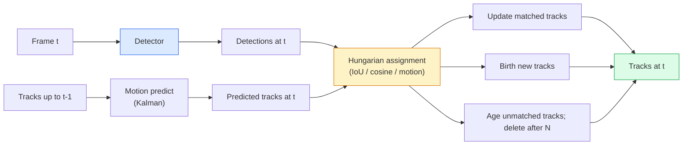

# 多目标跟踪和视频存储

> 跟踪就是检测加关联。检测每一帧。通过ID将此帧的检测结果与最后一帧的曲目进行匹配。

** 类型：** 构建
** 语言：** Python
** 先决条件：** 第4阶段第06课（YOLO检测）、第4阶段第08课（MaskR-CNN）、第4阶段第24课（Sam 3）
** 时间：** ~60分钟

## 学习目标

- 区分逐检测跟踪与基于查询的跟踪并命名算法系列（SORT、DeepSORT、ByteTrack、BoT-SORT、Sam 2内存跟踪器、Sam 3.1对象多路）
- 从头开始实施IoU +匈牙利分配，以实现经典的检测跟踪
- 解释Sam 2的存储库以及为什么它比基于IoU的关联更好地处理遮挡
- 阅读三个跟踪指标（MOTA、IDF 1、HOTA）并选择对给定用例重要的指标

## 问题

A detector tells you where the objects are in a single frame. A tracker tells you which detection in frame `t` is the same object as a detection in frame `t-1`. Without that, you cannot count objects crossing a line, follow a ball through an occlusion, or know "car #4 has been in the lane for 8 seconds."

跟踪对于每个面向视频的产品都至关重要：体育分析、监控、自动驾驶、医疗视频分析、野生动物监控、Wordmark计数。核心构建块是共享的：每帧检测器、运动模型（卡尔曼过滤器或更丰富的东西）、关联步骤（IoU /cos/学习特征上的匈牙利算法）和轨迹生命周期（出生、更新、死亡）。

2026 带来了两种新模式：**Sam 2基于内存的跟踪 **（特征内存而不是运动模型关联）和 **Sam 3.1对象多重 **（同一概念的许多实例的共享内存）。本课首先介绍经典堆栈，然后是基于内存的方法。

## 概念

### 检测跟踪



2026年您将遇到的每个跟踪器都是该循环的变体。差异：

- **SORT**（2016）：卡尔曼过滤器+ IoU匈牙利语。简单、快速、无需外观型号。
- **DeepSORT**（2017）：SORT +基于CNN的每首曲目外观特征（ReID嵌入）。更好地处理交叉点。
- **ByteTrack**（2021）：将低置信度检测关联为第二阶段;不需要外观功能，但在MOT 17上表现最佳。
- **BoT-SORT**（2022）：字节+相机运动补偿+ ReID。
- **StrongSORT / OC-SORT** -具有更好运动和外观的字节追踪后代。

### 一段中的卡尔曼过滤器

卡尔曼过滤器通过协方差维持每个轨道状态“（x，y，w，h，Dx，dy，DW，dh）”。在每一帧，使用恒速模型 ** 预测 ** 状态，然后使用匹配的检测 ** 更新 **。当预测不确定性较高时，更新更信任检测。这提供了平滑的轨迹以及通过短遮挡（1-5帧）继续轨迹的能力。

每个经典跟踪器都在运动预测步骤中使用卡尔曼过滤器。

### 匈牙利算法

给定“M x N”成本矩阵（跟踪x个检测），找到最小化总成本的一对一分配。成本通常是“1 - IoU（track_bbox，Detection_bbox）”或外观特征的负cos相似度。为O（（M+N）#3）;对于M、N高达~1000，在Python中通过“scipy. optimal.linear_sum_assign”足够快。

### ByteTrack的核心想法

标准跟踪器会降低低置信度检测（< 0.5）。ByteTrack将它们保留为 ** 第二阶段候选 **：将曲目与高置信度检测进行匹配后，未匹配的曲目尝试将低置信度检测与稍微宽松的IoU阈值进行匹配。恢复短暂阻塞，人群附近的ID开关。

### Sam 2基于内存的跟踪

Sam 2通过保留每个实例时空特征的 ** 存储库 ** 来处理视频。给定一个帧上的提示（单击、框、文本），它会将实例编码到内存中。在后续帧上，内存与新帧的特征交叉关注，解码器为新帧中的同一实例产生一个屏蔽。

没有卡尔曼过滤器，没有匈牙利分配。这种关联隐含在记忆-注意力操作中。

优点：
- 对大遮挡具有鲁棒性（内存跨多个帧携带实例身份）。
- 与Sam 3的文本提示结合使用时的开放词汇。
- 无需单独的运动模型即可工作。

缺点：
- 用于多对象跟踪的速度比ByteTrack慢。
- 内存库增长;限制上下文窗口。

### Sam 3.1对象多工

之前的Sam 2 / Sam 3跟踪为每个实例保留单独的内存库。适用于50个对象、50个内存库。对象多重（2026年3月）将它们折叠到一个共享内存中，并使用 ** 每个实例查询令牌 **。成本在实例数量上呈次线性扩展。

Multiple是2026年人群跟踪的新默认值：音乐会人群、仓库工人、交通路口。

### 需要了解的三个指标

- **MOTA（多目标跟踪准确性）** - 1 -（FN + FP + ID开关）/GT。按错误类型加权;将检测和关联失败合并的单一指标。
- ** IDF 1（ID F1）** -ID精度和召回率的调和平均值。特别关注每个地面真相曲目随着时间的推移保持其ID的情况。对于ID开关敏感的任务，比MOTA更好。
- **HOTA（更高级跟踪准确度）** -分解为检测准确度（DetA）和关联准确度（AssA）。自2020年以来的社区标准;最全面。

对于监视（谁是谁）：IDF 1是您报告的内容。对于体育分析（统计通行证）：HOTA。一般学术比较：HOTA。

## 建设党

### 第1步：基于IoU的成本矩阵

```python
import numpy as np


def bbox_iou(a, b):
    """
    a, b: (N, 4) arrays of [x1, y1, x2, y2].
    Returns (N_a, N_b) IoU matrix.
    """
    ax1, ay1, ax2, ay2 = a[:, 0], a[:, 1], a[:, 2], a[:, 3]
    bx1, by1, bx2, by2 = b[:, 0], b[:, 1], b[:, 2], b[:, 3]
    inter_x1 = np.maximum(ax1[:, None], bx1[None, :])
    inter_y1 = np.maximum(ay1[:, None], by1[None, :])
    inter_x2 = np.minimum(ax2[:, None], bx2[None, :])
    inter_y2 = np.minimum(ay2[:, None], by2[None, :])
    inter = np.clip(inter_x2 - inter_x1, 0, None) * np.clip(inter_y2 - inter_y1, 0, None)
    area_a = (ax2 - ax1) * (ay2 - ay1)
    area_b = (bx2 - bx1) * (by2 - by1)
    union = area_a[:, None] + area_b[None, :] - inter
    return inter / np.clip(union, 1e-8, None)
```

### 第2步：最小的SORT风格跟踪器

为简洁起见，省略了固定恒速卡尔曼-我们在这里使用简单的IoU关联;在生产中，卡尔曼预测至关重要。' sort ' Python包提供完整版本。

```python
from scipy.optimize import linear_sum_assignment


class Track:
    def __init__(self, tid, bbox, frame):
        self.id = tid
        self.bbox = bbox
        self.last_frame = frame
        self.hits = 1

    def update(self, bbox, frame):
        self.bbox = bbox
        self.last_frame = frame
        self.hits += 1


class SimpleTracker:
    def __init__(self, iou_threshold=0.3, max_age=5):
        self.tracks = []
        self.next_id = 1
        self.iou_threshold = iou_threshold
        self.max_age = max_age

    def step(self, detections, frame):
        if not self.tracks:
            for d in detections:
                self.tracks.append(Track(self.next_id, d, frame))
                self.next_id += 1
            return [(t.id, t.bbox) for t in self.tracks]

        track_boxes = np.array([t.bbox for t in self.tracks])
        det_boxes = np.array(detections) if len(detections) else np.empty((0, 4))

        iou = bbox_iou(track_boxes, det_boxes) if len(det_boxes) else np.zeros((len(track_boxes), 0))
        cost = 1 - iou
        cost[iou < self.iou_threshold] = 1e6

        matched_track = set()
        matched_det = set()
        if cost.size > 0:
            row, col = linear_sum_assignment(cost)
            for r, c in zip(row, col):
                if cost[r, c] < 1.0:
                    self.tracks[r].update(det_boxes[c], frame)
                    matched_track.add(r); matched_det.add(c)

        for i, d in enumerate(det_boxes):
            if i not in matched_det:
                self.tracks.append(Track(self.next_id, d, frame))
                self.next_id += 1

        self.tracks = [t for t in self.tracks if frame - t.last_frame <= self.max_age]
        return [(t.id, t.bbox) for t in self.tracks]
```

60 线进行每帧检测，返回每帧磁道ID。真实系统添加了卡尔曼预测、ByteTrack的第二阶段重新匹配和外观功能。

### 第3步：合成轨迹测试

```python
def synthetic_frames(num_frames=20, num_objects=3, H=240, W=320, seed=0):
    rng = np.random.default_rng(seed)
    starts = rng.uniform(20, 200, size=(num_objects, 2))
    velocities = rng.uniform(-5, 5, size=(num_objects, 2))
    frames = []
    for f in range(num_frames):
        dets = []
        for i in range(num_objects):
            cx, cy = starts[i] + f * velocities[i]
            dets.append([cx - 10, cy - 10, cx + 10, cy + 10])
        frames.append(dets)
    return frames


tracker = SimpleTracker()
for f, dets in enumerate(synthetic_frames()):
    tracks = tracker.step(dets, f)
```

直线移动的三个对象应在所有20个帧中保持其ID。

### 第4步：ID切换指标

```python
def count_id_switches(tracks_per_frame, gt_per_frame):
    """
    tracks_per_frame:  list of list of (track_id, bbox)
    gt_per_frame:      list of list of (gt_id, bbox)
    Returns number of ID switches.
    """
    prev_assignment = {}
    switches = 0
    for tracks, gts in zip(tracks_per_frame, gt_per_frame):
        if not tracks or not gts:
            continue
        t_boxes = np.array([b for _, b in tracks])
        g_boxes = np.array([b for _, b in gts])
        iou = bbox_iou(g_boxes, t_boxes)
        for g_idx, (gt_id, _) in enumerate(gts):
            j = iou[g_idx].argmax()
            if iou[g_idx, j] > 0.5:
                t_id = tracks[j][0]
                if gt_id in prev_assignment and prev_assignment[gt_id] != t_id:
                    switches += 1
                prev_assignment[gt_id] = t_id
    return switches
```

这是一个简化的IDF 1邻近指标：计算地面真相对象更改其分配的预测轨迹ID的次数。真正的MOTA /IDF 1/ HOTA工具存在于“py-motmetrics”和“TrackEval”中。

## 使用它

2026年生产追踪者：

- “ultralytics”-YOLOv 8 + ByteTrack / BoT-SORT内置。' results = model.track（source，Tracker=“bytetrack.yaml”）'。默认.
- “监督”（Roboflow）- ByteTrack包装器加上注释实用程序。
- Sam 2 / Sam 3.1 -通过“处理器.track（）”进行基于内存的跟踪。
- 自定义堆栈：detector（YOLOv 8/ RT-DETR）+ `sort-tracker` / `OC-SORT` / `StrongSORT`。

采摘：

- 30+ fps的行人/汽车/盒子：** 配备ultralytics的字节Track **。
- 人群中一个类的许多实例：**Sam 3.1对象多重 **。
- 外观可识别的重度咬合：**DeepSORT / StrongSORT**（ReID功能）。
- 运动/复杂交互：**BoT-SORT** 或学习跟踪器（MOTRv 3）。

## 把它运

本课产生：

- '输出/prompt-tracker-picker.md '-选择SORT / ByteTrack / BoT-SORT / Sam 2 / Sam 3.1给定的场景类型、遮挡模式和延迟预算。
- '输出/skill-mot-evaluator.md '-针对地面真相轨道编写了MOTA /IDF 1/ HOTA的完整评估工具。

## 演习

1. **（简单）** 使用3、10和30个对象运行上面的合成跟踪器。报告每种情况下的ID切换计数。识别简单的仅IoU关联在哪里开始失败。
2. **（中等）** 在关联之前添加一个恒速卡尔曼预测步骤。显示短（2-3帧）遮挡不再导致ID切换。
3. **（硬）** 将Sam 2的基于内存的跟踪器（通过“Transformers”）集成为替代跟踪器后台。在30秒的人群片段上运行SimpleTracker和Sam 2，并比较ID切换计数，手动标记5个突出人物的地面真相ID。

## 关键术语

| Term | 别人怎么说 | 它实际上意味着什么 |
|------|----------------|----------------------|
| 检测跟踪 | “检测然后关联” | 每帧检测器+IoU /外观上的匈牙利分配 |
| 卡尔曼滤波 | “运动预测” | 线性动态+协方差，实现平滑的轨迹预测和遮挡处理 |
| 匈牙利算法 | “最佳分配” | 解决最小成本双方匹配问题;“scipy. optimate.linear_sum_assign” |
| 字节追踪 | “低信心二次通过” | 将不匹配的轨迹与低置信度检测重新匹配，以恢复短遮挡 |
| DeepSORT | “SORT +外观” | 添加ReID功能用于跨框架匹配;更好地保存ID |
| 存储体 | “Sam 2技巧” | 跨帧存储的每实例时空特征;交叉注意取代显式关联 |
| 对象复用 | “Sam 3.1共享内存” | 单个共享内存，支持按实例查询，可实现快速多对象跟踪 |
| HOTA | “现代跟踪指标” | 分解为检测和关联准确性;社区标准 |

## 进一步阅读

- [SORT（Bewley等人，2016）]（https：//arxiv.org/abs/1602.00763）-最小的检测跟踪纸
- [DeepSORT（Wojke等人，2017）]（https：//arxiv.org/abs/1703.07402）-添加外观功能
- [ByteTrack（张等人，2022）]（https：//arxiv.org/ab/2110.06864）-低置信度第二次通过
- [BoT-SORT（Aharon等人，2022）]（https：//arxiv.org/abs/2206.14651）-摄像机运动补偿
- [HOTA（Luiten等人，2020）]（https：//arxiv.org/ab/2009.07736）-分解的跟踪指标
- [SAM 2视频分段（Meta，2024）]（https：//ai.meta.com/sam2/）-基于内存的跟踪器
- [SAM 3.1对象多重（Meta，2026年3月）]（https：//ai.meta.com/blog/segment-anything-model-3/）
