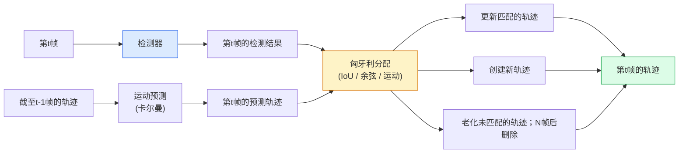

# 多目标跟踪与视频记忆

> 跟踪就是检测加关联。检测每一帧。将当前帧的检测结果与上一帧的轨迹通过ID进行匹配。

**类型：** 构建
**语言：** Python
**先修要求：** 第4阶段 第06课（YOLO检测）、第4阶段 第08课（Mask R-CNN）、第4阶段 第24课（SAM 3）
**时长：** 约60分钟

## 学习目标

- 区分基于检测的跟踪（tracking-by-detection）与基于查询的跟踪（query-based tracking），并说出算法家族名称（SORT、DeepSORT、ByteTrack、BoT-SORT、SAM 2 记忆跟踪器、SAM 3.1 对象复用器（Object Multiplex））
- 从零实现IoU + 匈牙利（Hungarian）分配，用于经典基于检测的跟踪
- 解释SAM 2的内存库（memory bank）及其为何比基于IoU的关联更能处理遮挡
- 解读三种跟踪指标（MOTA、IDF1、HOTA），并根据具体使用场景选择合适指标

## 问题描述

检测器告诉你单帧中物体在哪里。跟踪器告诉你第`t`帧中的哪个检测结果与第`t-1`帧中的检测结果是同一个物体。没有跟踪器，你就无法统计穿过一条线的物体数量、跟踪被遮挡的球、或者知道“4号车在车道上已经行驶了8秒”。

跟踪对于每一个面向视频的产品都至关重要：体育分析、监控、自动驾驶、医学视频分析、野生动物监测、商标计数。核心构建模块是共通的：每帧检测器、运动模型（卡尔曼滤波器或更复杂的模型）、关联步骤（基于IoU/余弦/学习特征的匈牙利算法）、以及轨迹生命周期（诞生、更新、消亡）。

2026年带来了两种新模式：**基于SAM 2记忆的跟踪**（特征记忆代替运动模型关联）和**SAM 3.1对象复用器**（同一概念的多个实例共享内存）。本课程首先讲解经典堆栈，然后介绍基于记忆的方法。

## 概念

### 基于检测的跟踪



你在2026年遇到的每个跟踪器都是这个循环的变体。差异在于：

- **SORT**（2016）：卡尔曼滤波器 + IoU匈牙利。简单、快速、无外观模型。
- **DeepSORT**（2017）：SORT + 基于CNN的每个轨迹外观特征（ReID嵌入）。能更好地处理交叉。
- **ByteTrack**（2021）：将低置信度检测作为第二阶段进行关联；无需外观特征，但在MOT17上为最佳表现。
- **BoT-SORT**（2022）：Byte + 相机运动补偿 + ReID。
- **StrongSORT / OC-SORT** —— ByteTrack的后代，改进了运动和外观。

### 卡尔曼滤波器（一句话解释）

卡尔曼滤波器维护每个轨迹的状态`(x, y, w, h, dx, dy, dw, dh)`及其协方差。在每一帧，使用**恒定速度模型****预测**状态，然后使用匹配的检测结果**更新**。当预测不确定性高时，更新更信任检测结果。这提供了平滑的轨迹，并能够在短时遮挡（1-5帧）中继续跟踪轨迹。

每个经典跟踪器都在运动预测步骤中使用卡尔曼滤波器。

### 匈牙利算法

给定一个`M x N`代价矩阵（轨迹 x 检测），找到使总代价最小的一对一分配。代价通常是`1 - IoU(轨迹边界框, 检测边界框)`或外观特征的负余弦相似度。运行时间复杂度为O((M+N)^3)；当M、N最多约1000时，在Python中通过`scipy.optimize.linear_sum_assignment`可以快速运行。

### ByteTrack的核心思想

标准跟踪器丢弃低置信度检测（< 0.5）。ByteTrack将其保留为**第二阶段候选**：将轨迹与高置信度检测匹配后，未匹配的轨迹尝试与低置信度检测进行匹配，使用稍宽松的IoU阈值。这有助于恢复短时遮挡，减少人群中的ID切换。

### SAM 2基于记忆的跟踪

SAM 2通过维护每个实例的**时空特征内存库**来处理视频。给定一帧上的提示（点击、选框、文本），它将实例编码到内存中。在后续帧中，内存与新帧的特征进行交叉注意力计算，解码器为同一实例在新帧中生成掩码。

没有卡尔曼滤波器，没有匈牙利分配。关联隐含在内存-注意力操作中。

优点：
- 对较大遮挡具有鲁棒性（内存跨多帧保持实例身份）。
- 结合SAM 3的文本提示时，具有开放词汇能力。
- 无需单独的运动模型。

缺点：
- 对于多对象跟踪，比ByteTrack慢。
- 内存库会增长；限制上下文窗口。

### SAM 3.1对象复用器

之前的SAM 2 / SAM 3跟踪为每个实例维护一个独立的内存库。对于50个对象，需要50个内存库。对象复用器（2026年3月）将它们合并为一个**带有每个实例查询令牌**的共享内存。成本随实例数量亚线性增长。

复用器是2026年人群跟踪的新默认选择：音乐会人群、仓库工人、交通路口。

### 三个需要了解的指标

- **MOTA（多目标跟踪准确率）** —— 1 - (漏检 + 误检 + ID切换) / 真实值。按错误类型加权；一个合并了检测失败和关联失败的单一指标。
- **IDF1（ID F1分数）** —— ID精确率与召回率的调和均值。特别关注每个真实轨迹随时间保持其ID的好坏程度。对于ID切换敏感的任务优于MOTA。
- **HOTA（高阶跟踪准确率）** —— 分解为检测准确率（DetA）和关联准确率（AssA）。自2020年以来的社区标准；最全面。

监控（谁是谁）：报告IDF1。体育分析（传球计数）：使用HOTA。一般学术比较：使用HOTA。

## 构建

### 步骤1：基于IoU的代价矩阵

```python
import numpy as np


def bbox_iou(a, b):
    """
    a, b: (N, 4) 数组，格式为 [x1, y1, x2, y2]。
    返回 (N_a, N_b) 的IoU矩阵。
    """
    ax1, ay1, ax2, ay2 = a[:, 0], a[:, 1], a[:, 2], a[:, 3]
    bx1, by1, bx2, by2 = b[:, 0], b[:, 1], b[:, 2], b[:, 3]
    inter_x1 = np.maximum(ax1[:, None], bx1[None, :])
    inter_y1 = np.maximum(ay1[:, None], by1[None, :])
    inter_x2 = np.minimum(ax2[:, None], bx2[None, :])
    inter_y2 = np.minimum(ay2[:, None], by2[None, :])
    inter = np.clip(inter_x2 - inter_x1, 0, None) * np.clip(inter_y2 - inter_y1, 0, None)
    area_a = (ax2 - ax1) * (ay2 - ay1)
    area_b = (bx2 - bx1) * (by2 - by1)
    union = area_a[:, None] + area_b[None, :] - inter
    return inter / np.clip(union, 1e-8, None)
```

### 步骤2：最小化的SORT风格跟踪器

为简洁起见，省略了固定恒定速度卡尔曼滤波器——这里我们使用简单的IoU关联；在生产环境中，卡尔曼预测至关重要。`sort` Python包提供了完整版本。

```python
from scipy.optimize import linear_sum_assignment


class Track:
    def __init__(self, tid, bbox, frame):
        self.id = tid
        self.bbox = bbox
        self.last_frame = frame
        self.hits = 1

    def update(self, bbox, frame):
        self.bbox = bbox
        self.last_frame = frame
        self.hits += 1


class SimpleTracker:
    def __init__(self, iou_threshold=0.3, max_age=5):
        self.tracks = []
        self.next_id = 1
        self.iou_threshold = iou_threshold
        self.max_age = max_age

    def step(self, detections, frame):
        if not self.tracks:
            for d in detections:
                self.tracks.append(Track(self.next_id, d, frame))
                self.next_id += 1
            return [(t.id, t.bbox) for t in self.tracks]

        track_boxes = np.array([t.bbox for t in self.tracks])
        det_boxes = np.array(detections) if len(detections) else np.empty((0, 4))

        iou = bbox_iou(track_boxes, det_boxes) if len(det_boxes) else np.zeros((len(track_boxes), 0))
        cost = 1 - iou
        cost[iou < self.iou_threshold] = 1e6

        matched_track = set()
        matched_det = set()
        if cost.size > 0:
            row, col = linear_sum_assignment(cost)
            for r, c in zip(row, col):
                if cost[r, c] < 1.0:
                    self.tracks[r].update(det_boxes[c], frame)
                    matched_track.add(r); matched_det.add(c)

        for i, d in enumerate(det_boxes):
            if i not in matched_det:
                self.tracks.append(Track(self.next_id, d, frame))
                self.next_id += 1

        self.tracks = [t for t in self.tracks if frame - t.last_frame <= self.max_age]
        return [(t.id, t.bbox) for t in self.tracks]
```

60行代码。输入逐帧检测结果，返回逐帧轨迹ID。实际系统会添加卡尔曼预测、ByteTrack的第二阶段重新匹配和外观特征。

### 步骤3：合成轨迹测试

```python
def synthetic_frames(num_frames=20, num_objects=3, H=240, W=320, seed=0):
    rng = np.random.default_rng(seed)
    starts = rng.uniform(20, 200, size=(num_objects, 2))
    velocities = rng.uniform(-5, 5, size=(num_objects, 2))
    frames = []
    for f in range(num_frames):
        dets = []
        for i in range(num_objects):
            cx, cy = starts[i] + f * velocities[i]
            dets.append([cx - 10, cy - 10, cx + 10, cy + 10])
        frames.append(dets)
    return frames


tracker = SimpleTracker()
for f, dets in enumerate(synthetic_frames()):
    tracks = tracker.step(dets, f)
```

三个沿直线移动的物体应在全部20帧中保持它们的ID。

### 步骤4：ID切换指标

```python
def count_id_switches(tracks_per_frame, gt_per_frame):
    """
    tracks_per_frame:  列表的列表，每个元素是 (track_id, bbox)
    gt_per_frame:      列表的列表，每个元素是 (gt_id, bbox)
    返回ID切换次数。
    """
    prev_assignment = {}
    switches = 0
    for tracks, gts in zip(tracks_per_frame, gt_per_frame):
        if not tracks or not gts:
            continue
        t_boxes = np.array([b for _, b in tracks])
        g_boxes = np.array([b for _, b in gts])
        iou = bbox_iou(g_boxes, t_boxes)
        for g_idx, (gt_id, _) in enumerate(gts):
            j = iou[g_idx].argmax()
            if iou[g_idx, j] > 0.5:
                t_id = tracks[j][0]
                if gt_id in prev_assignment and prev_assignment[gt_id] != t_id:
                    switches += 1
                prev_assignment[gt_id] = t_id
    return switches
```

这是一个简化的IDF1近似指标：统计一个真实对象改变其分配到的预测轨迹ID的次数。真正的MOTA / IDF1 / HOTA工具位于`py-motmetrics`和`TrackEval`中。

## 使用

2026年的生产跟踪器：

- `ultralytics` —— YOLOv8 + 内置ByteTrack / BoT-SORT。`results = model.track(source, tracker="bytetrack.yaml")`。默认选项。
- `supervision`（Roboflow） —— ByteTrack封装器及标注工具。
- SAM 2 / SAM 3.1 —— 基于记忆的跟踪，通过`processor.track()`实现。
- 自定义堆栈：检测器（YOLOv8 / RT-DETR）+ `sort-tracker` / `OC-SORT` / `StrongSORT`。

选择指南：

- 行人 / 车辆 / 箱子，30+ fps：**ByteTrack with ultralytics**。
- 人群中同一类的多个实例：**SAM 3.1对象复用器**。
- 严重遮挡但外观可识别：**DeepSORT / StrongSORT**（ReID特征）。
- 体育 / 复杂交互：**BoT-SORT**或学习型跟踪器（MOTRv3）。

## 产出

本课程生成：

- `outputs/prompt-tracker-picker.md` —— 根据场景类型、遮挡模式和延迟预算选择SORT / ByteTrack / BoT-SORT / SAM 2 / SAM 3.1。
- `outputs/skill-mot-evaluator.md` —— 编写一个完整的评估工具，用于针对真实轨迹计算MOTA / IDF1 / HOTA。

## 练习

1. **(简单)** 使用上述合成跟踪器分别测试3、10和30个物体。报告每种情况下的ID切换次数。指出简单的仅IoU关联在何处开始失效。
2. **(中等)** 在关联之前添加一个恒定速度卡尔曼预测步骤。证明短时（2-3帧）遮挡不再导致ID切换。
3. **(困难)** 集成SAM 2的基于记忆的跟踪器（通过`transformers`）作为替代跟踪后端。在30秒的人群视频上同时运行SimpleTracker和SAM 2，手动标注5个显著人物的真实ID，比较ID切换次数。

## 关键术语

| 术语 | 人们怎么说 | 实际含义 |
|------|------------|----------|
| 基于检测的跟踪 | "先检测后关联" | 逐帧检测器 + 基于IoU/外观的匈牙利分配 |
| 卡尔曼滤波器 | "运动预测" | 线性动力学+协方差，用于平滑轨迹预测和遮挡处理 |
| 匈牙利算法 | "最优分配" | 求解最小成本二分图匹配问题；`scipy.optimize.linear_sum_assignment` |
| ByteTrack | "低置信度第二遍" | 将未匹配的轨迹与低置信度检测重新匹配，以恢复短时遮挡 |
| DeepSORT | "SORT + 外观" | 添加ReID特征用于跨帧匹配；更好的ID保持能力 |
| 内存库 | "SAM 2技巧" | 每个实例的跨帧时空特征存储；交叉注意力替代显式关联 |
| 对象复用器 | "SAM 3.1共享内存" | 单共享内存配每个实例的查询，用于快速多对象跟踪 |
| HOTA | "现代跟踪指标" | 分解为检测和关联准确率；社区标准 |

## 延伸阅读

- [SORT (Bewley et al., 2016)](https://arxiv.org/abs/1602.00763) —— 最小的基于检测的跟踪论文
- [DeepSORT (Wojke et al., 2017)](https://arxiv.org/abs/1703.07402) —— 添加外观特征
- [ByteTrack (Zhang et al., 2022)](https://arxiv.org/abs/2110.06864) —— 低置信度第二遍
- [BoT-SORT (Aharon et al., 2022)](https://arxiv.org/abs/2206.14651) —— 相机运动补偿
- [HOTA (Luiten et al., 2020)](https://arxiv.org/abs/2009.07736) —— 分解式跟踪指标
- [SAM 2视频分割 (Meta, 2024)](https://ai.meta.com/sam2/) —— 基于记忆的跟踪器
- [SAM 3.1对象复用器 (Meta, 2026年3月)](https://ai.meta.com/blog/segment-anything-model-3/)