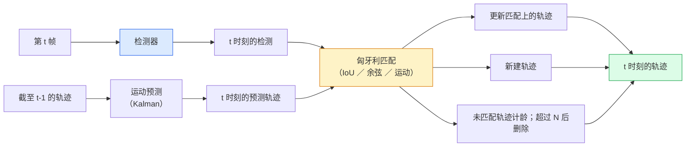

# 多目标跟踪与视频记忆（Multi-Object Tracking & Video Memory）

> 译注：本文译自同目录 [`en.md`](./en.md)。术语遵循仓根 [TRANSLATION_GUIDE.md](../../../../TRANSLATION_GUIDE.md)。

> 跟踪 = 检测 + 关联。每一帧都做检测，再按 ID 把当前帧的检测和上一帧的轨迹匹配起来。

**Type:** Build
**Languages:** Python
**Prerequisites:** Phase 4 Lesson 06（YOLO 检测）、Phase 4 Lesson 08（Mask R-CNN）、Phase 4 Lesson 24（SAM 3）
**Time:** ~60 minutes

## 学习目标（Learning Objectives）

- 区分 tracking-by-detection 与 query-based tracking，并叫得出主要算法家族（SORT、DeepSORT、ByteTrack、BoT-SORT、SAM 2 memory tracker、SAM 3.1 Object Multiplex）
- 从零实现 IoU + 匈牙利（Hungarian）分配，跑通经典的 tracking-by-detection
- 解释 SAM 2 的 memory bank（记忆库）是什么，以及它为什么比基于 IoU 的关联更扛遮挡
- 看懂三大跟踪指标（MOTA、IDF1、HOTA），并知道在特定场景下该看哪一个

## 问题（Problem）

检测器告诉你单帧里物体在哪。跟踪器告诉你第 `t` 帧里的某个检测和第 `t-1` 帧里的某个检测是不是同一个物体。没有这一步，你就没法统计穿过某条线的物体数量、没法在遮挡中追着一颗球、也没法说出「4 号车已经在这条车道上停了 8 秒」。

跟踪是所有视频类产品的核心：体育分析、安防监控、自动驾驶、医疗视频分析、野生动物监测、文字标识统计。它的基础组件是共通的：逐帧检测器、运动模型（Kalman filter 或更复杂的版本）、关联步骤（在 IoU / 余弦相似度 / 学习到的特征上跑匈牙利算法），以及轨迹生命周期管理（生、更新、死）。

2026 年带来了两种新范式：**SAM 2 memory-based tracking**（用 feature memory 替代运动模型做关联）和 **SAM 3.1 Object Multiplex**（同一概念的多个实例共享一份记忆）。本课先讲经典栈，再讲基于记忆的方法。

## 概念（Concept）

### Tracking-by-detection



2026 年你能见到的每一个跟踪器，都是这个循环的变体。区别在于：

- **SORT**（2016）：Kalman filter + IoU 匈牙利。简单、快，没有外观模型。
- **DeepSORT**（2017）：SORT + 每条轨迹一份 CNN 外观特征（ReID embedding）。在交叉场景下表现更好。
- **ByteTrack**（2021）：把低置信度检测作为第二阶段去关联；不需要外观特征，但在 MOT17 上拿了第一。
- **BoT-SORT**（2022）：Byte + 相机运动补偿 + ReID。
- **StrongSORT / OC-SORT**——ByteTrack 的衍生版本，运动和外观建模都更强。

### 一段话讲清 Kalman filter

Kalman filter 给每条轨迹维护一个状态 `(x, y, w, h, dx, dy, dw, dh)` 和它的协方差。每帧先用恒速模型 **predict** 状态，再用匹配上的检测做 **update**。当 predict 不确定性大时，update 就更信任检测。这样可以拿到平滑的轨迹，并且能在短时间遮挡（1–5 帧）里把轨迹延续下去。

每个经典跟踪器都在运动预测这一步用了 Kalman filter。

### 匈牙利算法（Hungarian algorithm）

给一个 `M x N` 的代价矩阵（轨迹 × 检测），求总代价最小的一一对应分配。代价通常是 `1 - IoU(track_bbox, detection_bbox)`，或外观特征的负余弦相似度。复杂度 O((M+N)^3)；M、N 在 1000 以内时，用 `scipy.optimize.linear_sum_assignment` 在 Python 里跑得够快。

### ByteTrack 的关键想法

标准跟踪器会丢掉低置信度检测（< 0.5）。ByteTrack 把它们留着当 **第二阶段候选**：在用高置信度检测匹配完轨迹之后，未匹配的轨迹会用一个稍宽松的 IoU 阈值再去匹配低置信度检测。这能挽回短遮挡和拥挤场景下的 ID 切换。

### SAM 2 memory-based tracking

SAM 2 处理视频时维护一个 **memory bank**，记录每个实例的时空特征。给定一帧上的 prompt（点击 / 框 / 文本），它会把这个实例编码进 memory。在后续帧里，memory 会和新帧的特征做 cross-attention，decoder 据此给出该实例在新帧里的 mask。

没有 Kalman filter，没有匈牙利分配。关联隐式地藏在 memory-attention 操作里。

优点：

- 抗大范围遮挡（memory 在多帧之间携带实例身份）。
- 配合 SAM 3 的文本 prompt，可以做开放词表（open-vocabulary）。
- 不需要单独的运动模型。

缺点：

- 多目标跟踪场景下比 ByteTrack 慢。
- memory bank 会越攒越大，限制了 context window。

### SAM 3.1 Object Multiplex

之前 SAM 2 / SAM 3 的跟踪是每个实例一份 memory bank。50 个物体就是 50 份 memory。Object Multiplex（2026 年 3 月）把它们合并到一份共享 memory 里，用 **per-instance query token** 做区分。代价随实例数次线性增长。

Multiplex 是 2026 年人群跟踪的新默认方案：演唱会人群、仓库工人、十字路口车流。

### 必须懂的三个指标

- **MOTA（Multi-Object Tracking Accuracy）**——1 - (FN + FP + ID switches) / GT。按错误类型加权；一个把检测和关联失败混在一起的单一指标。
- **IDF1（ID F1）**——ID 精确率和召回率的调和平均。专门衡量每条 ground-truth 轨迹是否能在时间上保持同一个 ID。对 ID 切换敏感的任务比 MOTA 更合适。
- **HOTA（Higher Order Tracking Accuracy）**——拆成检测准确度（DetA）和关联准确度（AssA）。2020 年以来的社区标准，最全面。

安防（认人）：报 IDF1。体育分析（数传球次数）：HOTA。一般学术对比：HOTA。

## 动手实现（Build It）

### Step 1：基于 IoU 的代价矩阵

```python
import numpy as np


def bbox_iou(a, b):
    """
    a, b: (N, 4) arrays of [x1, y1, x2, y2].
    Returns (N_a, N_b) IoU matrix.
    """
    ax1, ay1, ax2, ay2 = a[:, 0], a[:, 1], a[:, 2], a[:, 3]
    bx1, by1, bx2, by2 = b[:, 0], b[:, 1], b[:, 2], b[:, 3]
    inter_x1 = np.maximum(ax1[:, None], bx1[None, :])
    inter_y1 = np.maximum(ay1[:, None], by1[None, :])
    inter_x2 = np.minimum(ax2[:, None], bx2[None, :])
    inter_y2 = np.minimum(ay2[:, None], by2[None, :])
    inter = np.clip(inter_x2 - inter_x1, 0, None) * np.clip(inter_y2 - inter_y1, 0, None)
    area_a = (ax2 - ax1) * (ay2 - ay1)
    area_b = (bx2 - bx1) * (by2 - by1)
    union = area_a[:, None] + area_b[None, :] - inter
    return inter / np.clip(union, 1e-8, None)
```

### Step 2：最简版 SORT 风格跟踪器

为了精简，这里没写恒速 Kalman——只用了简单的 IoU 关联；生产里 Kalman predict 是必不可少的。完整版可以用 `sort` Python 包。

```python
from scipy.optimize import linear_sum_assignment


class Track:
    def __init__(self, tid, bbox, frame):
        self.id = tid
        self.bbox = bbox
        self.last_frame = frame
        self.hits = 1

    def update(self, bbox, frame):
        self.bbox = bbox
        self.last_frame = frame
        self.hits += 1


class SimpleTracker:
    def __init__(self, iou_threshold=0.3, max_age=5):
        self.tracks = []
        self.next_id = 1
        self.iou_threshold = iou_threshold
        self.max_age = max_age

    def step(self, detections, frame):
        if not self.tracks:
            for d in detections:
                self.tracks.append(Track(self.next_id, d, frame))
                self.next_id += 1
            return [(t.id, t.bbox) for t in self.tracks]

        track_boxes = np.array([t.bbox for t in self.tracks])
        det_boxes = np.array(detections) if len(detections) else np.empty((0, 4))

        iou = bbox_iou(track_boxes, det_boxes) if len(det_boxes) else np.zeros((len(track_boxes), 0))
        cost = 1 - iou
        cost[iou < self.iou_threshold] = 1e6

        matched_track = set()
        matched_det = set()
        if cost.size > 0:
            row, col = linear_sum_assignment(cost)
            for r, c in zip(row, col):
                if cost[r, c] < 1.0:
                    self.tracks[r].update(det_boxes[c], frame)
                    matched_track.add(r); matched_det.add(c)

        for i, d in enumerate(det_boxes):
            if i not in matched_det:
                self.tracks.append(Track(self.next_id, d, frame))
                self.next_id += 1

        self.tracks = [t for t in self.tracks if frame - t.last_frame <= self.max_age]
        return [(t.id, t.bbox) for t in self.tracks]
```

60 行。吃逐帧检测，吐每帧的轨迹 ID。真实系统会再加上 Kalman predict、ByteTrack 的二次匹配，以及外观特征。

### Step 3：合成轨迹测试

```python
def synthetic_frames(num_frames=20, num_objects=3, H=240, W=320, seed=0):
    rng = np.random.default_rng(seed)
    starts = rng.uniform(20, 200, size=(num_objects, 2))
    velocities = rng.uniform(-5, 5, size=(num_objects, 2))
    frames = []
    for f in range(num_frames):
        dets = []
        for i in range(num_objects):
            cx, cy = starts[i] + f * velocities[i]
            dets.append([cx - 10, cy - 10, cx + 10, cy + 10])
        frames.append(dets)
    return frames


tracker = SimpleTracker()
for f, dets in enumerate(synthetic_frames()):
    tracks = tracker.step(dets, f)
```

三个沿直线运动的物体，应该在 20 帧里始终保持各自的 ID 不变。

### Step 4：ID 切换指标

```python
def count_id_switches(tracks_per_frame, gt_per_frame):
    """
    tracks_per_frame:  list of list of (track_id, bbox)
    gt_per_frame:      list of list of (gt_id, bbox)
    Returns number of ID switches.
    """
    prev_assignment = {}
    switches = 0
    for tracks, gts in zip(tracks_per_frame, gt_per_frame):
        if not tracks or not gts:
            continue
        t_boxes = np.array([b for _, b in tracks])
        g_boxes = np.array([b for _, b in gts])
        iou = bbox_iou(g_boxes, t_boxes)
        for g_idx, (gt_id, _) in enumerate(gts):
            j = iou[g_idx].argmax()
            if iou[g_idx, j] > 0.5:
                t_id = tracks[j][0]
                if gt_id in prev_assignment and prev_assignment[gt_id] != t_id:
                    switches += 1
                prev_assignment[gt_id] = t_id
    return switches
```

这是一个简化版的、和 IDF1 相近的指标：数一个 ground-truth 物体被分配到的预测轨迹 ID 改变了多少次。真正的 MOTA / IDF1 / HOTA 工具链在 `py-motmetrics` 和 `TrackEval` 里。

## 用起来（Use It）

2026 年的生产级跟踪器：

- `ultralytics` —— YOLOv8 + 内置的 ByteTrack / BoT-SORT。`results = model.track(source, tracker="bytetrack.yaml")`。事实上的默认。
- `supervision`（Roboflow）—— ByteTrack 封装加上一些标注工具。
- SAM 2 / SAM 3.1 —— 通过 `processor.track()` 用基于 memory 的跟踪。
- 自组栈：检测器（YOLOv8 / RT-DETR）+ `sort-tracker` / `OC-SORT` / `StrongSORT`。

怎么挑：

- 30+ fps 的行人 / 车辆 / 货箱：**ultralytics 里的 ByteTrack**。
- 同一类物体在拥挤场景中的多实例：**SAM 3.1 Object Multiplex**。
- 重度遮挡 + 外观可识别：**DeepSORT / StrongSORT**（带 ReID 特征）。
- 体育 / 复杂交互场景：**BoT-SORT**，或学习型跟踪器（MOTRv3）。

## 上线部署（Ship It）

本课产出：

- `outputs/prompt-tracker-picker.md` —— 根据场景类型、遮挡模式、延迟预算，从 SORT / ByteTrack / BoT-SORT / SAM 2 / SAM 3.1 里挑一个。
- `outputs/skill-mot-evaluator.md` —— 写一套完整的评估脚手架，对着 ground-truth 轨迹算 MOTA / IDF1 / HOTA。

## 练习（Exercises）

1. **（简单）** 用上面那个合成跟踪器，分别跑 3、10、30 个物体，报告每种情况下的 ID 切换次数。指出仅 IoU 关联从哪个规模开始崩。
2. **（中等）** 在关联之前加一步恒速 Kalman predict。证明短时间（2–3 帧）的遮挡不再造成 ID 切换。
3. **（困难）** 把 SAM 2 的 memory-based tracker（通过 `transformers`）作为另一个跟踪 backend 接进来。在一段 30 秒的人群片段上同时跑 SimpleTracker 和 SAM 2，对比 ID 切换次数；为其中 5 个显著人物手工打 ground-truth ID。

## 关键术语（Key Terms）

| 术语 | 大家平时怎么说 | 它实际是什么 |
|------|----------------|----------------------|
| Tracking-by-detection | 「先检测再关联」 | 逐帧检测器 + 在 IoU / 外观上跑匈牙利分配 |
| Kalman filter | 「运动预测」 | 线性动力学 + 协方差，用于平滑轨迹预测和遮挡处理 |
| 匈牙利算法（Hungarian algorithm） | 「最优分配」 | 解最小代价二部图匹配；`scipy.optimize.linear_sum_assignment` |
| ByteTrack | 「低置信度二次匹配」 | 把没匹配上的轨迹再去和低置信度检测匹配，挽回短遮挡 |
| DeepSORT | 「SORT + 外观」 | 加一份 ReID 特征做跨帧匹配，更好地保持 ID |
| Memory bank | 「SAM 2 的招」 | 跨帧存储的 per-instance 时空特征；用 cross-attention 替代显式关联 |
| Object Multiplex | 「SAM 3.1 共享 memory」 | 单份共享 memory，用 per-instance query 做快速多目标跟踪 |
| HOTA | 「现代跟踪指标」 | 拆成检测准确度和关联准确度；社区标准 |

## 延伸阅读（Further Reading）

- [SORT (Bewley et al., 2016)](https://arxiv.org/abs/1602.00763) —— 最简的 tracking-by-detection 论文
- [DeepSORT (Wojke et al., 2017)](https://arxiv.org/abs/1703.07402) —— 加上外观特征
- [ByteTrack (Zhang et al., 2022)](https://arxiv.org/abs/2110.06864) —— 低置信度二次匹配
- [BoT-SORT (Aharon et al., 2022)](https://arxiv.org/abs/2206.14651) —— 相机运动补偿
- [HOTA (Luiten et al., 2020)](https://arxiv.org/abs/2009.07736) —— 拆解式跟踪指标
- [SAM 2 video segmentation (Meta, 2024)](https://ai.meta.com/sam2/) —— 基于 memory 的跟踪器
- [SAM 3.1 Object Multiplex (Meta, March 2026)](https://ai.meta.com/blog/segment-anything-model-3/)
