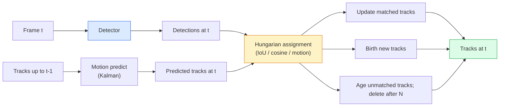

# 27 · 多目标跟踪与视频记忆

> 跟踪 = 检测 + 关联。逐帧检测，再按 ID 把当前帧的检测与上一帧的轨迹做匹配。

**类型：** 实战构建
**语言：** Python
**前置：** 第 4 阶段第 06 课（YOLO 检测）、第 4 阶段第 08 课（Mask R-CNN）、第 4 阶段第 24 课（SAM 3）
**时长：** 约 60 分钟

## 学习目标

- 区分「按检测跟踪（tracking-by-detection）」与「基于查询的跟踪（query-based tracking）」，并说出各算法家族（SORT、DeepSORT、ByteTrack、BoT-SORT、SAM 2 记忆跟踪器、SAM 3.1 Object Multiplex）
- 从零实现 IoU + 匈牙利算法（Hungarian）分配，搭建经典的按检测跟踪流程
- 解释 SAM 2 的「记忆库（memory bank）」，以及它为何比基于 IoU 的关联更善于处理遮挡
- 读懂三个跟踪指标（MOTA、IDF1、HOTA），并能为给定场景选出最重要的那一个

## 问题所在

检测器告诉你单帧画面里物体在哪里。跟踪器则告诉你：第 `t` 帧的某个检测，和第 `t-1` 帧的某个检测是否是同一个物体。没有这一点，你就无法统计越线的物体数量、无法在遮挡中追踪一个球，也无法知道「4 号车已经在这条车道上待了 8 秒」。

跟踪对每一个面向视频的产品都至关重要：体育分析、安防监控、自动驾驶、医学视频分析、野生动物监测、商标计数。其核心构件是共通的：一个逐帧检测器、一个运动模型（卡尔曼滤波或更复杂的模型）、一个关联步骤（在 IoU / 余弦相似度 / 学习到的特征上跑匈牙利算法）、以及一套轨迹生命周期（诞生、更新、消亡）。

2026 年带来了两种新范式：**SAM 2 基于记忆的跟踪**（用特征记忆替代运动模型做关联）和 **SAM 3.1 Object Multiplex**（同一概念的多个实例共享记忆）。本课先讲经典技术栈，再讲基于记忆的方法。

## 核心概念

### 按检测跟踪（tracking-by-detection）



你在 2026 年遇到的每一个跟踪器，都是这个循环的变体。差异在于：

- **SORT**（2016）：卡尔曼滤波 + IoU 匈牙利算法。简单、快速，没有外观模型。
- **DeepSORT**（2017）：SORT + 每条轨迹一个基于 CNN 的外观特征（ReID 嵌入）。更善于处理交叉穿插。
- **ByteTrack**（2021）：把低置信度检测作为第二阶段再做一次关联；无需外观特征，却是 MOT17 上的顶尖选手。
- **BoT-SORT**（2022）：Byte + 相机运动补偿 + ReID。
- **StrongSORT / OC-SORT**——ByteTrack 的后裔，拥有更好的运动模型和外观模型。

### 一段话讲清卡尔曼滤波

卡尔曼滤波（Kalman filter）为每条轨迹维护一个状态 `(x, y, w, h, dx, dy, dw, dh)` 及其协方差。每一帧先用恒速模型做**预测（predict）**，再用匹配上的检测做**更新（update）**。当预测不确定性较高时，更新会更信任检测结果。这样既能得到平滑的轨迹，又能在短暂遮挡（1-5 帧）中让轨迹延续下去。

每一个经典跟踪器都在运动预测步骤中使用卡尔曼滤波。

### 匈牙利算法

给定一个 `M x N` 的代价矩阵（轨迹 x 检测），找出使总代价最小的一对一分配。代价通常是 `1 - IoU(track_bbox, detection_bbox)`，或外观特征余弦相似度的负值。其运行复杂度为 O((M+N)^3)；当 M、N 在约 1000 以内时，用 `scipy.optimize.linear_sum_assignment` 在 Python 里跑足够快。

### ByteTrack 的关键思想

标准跟踪器会丢弃低置信度检测（< 0.5）。ByteTrack 把它们留作**第二阶段候选**：先用高置信度检测匹配轨迹，然后让未匹配的轨迹用稍微宽松一点的 IoU 阈值去匹配低置信度检测。由此能恢复短暂遮挡，减少拥挤场景附近的 ID 切换。

### SAM 2 基于记忆的跟踪

SAM 2 处理视频的方式是维护一个**记忆库（memory bank）**，里面存放每个实例的时空特征。给定某一帧上的提示（点击、框、文本），它把该实例编码进记忆。在后续帧中，记忆会与新帧的特征做交叉注意力（cross-attention），解码器随即在新帧中为同一实例生成掩码。

没有卡尔曼滤波，没有匈牙利分配。关联隐含在记忆-注意力运算之中。

优点：

- 对大幅遮挡鲁棒（记忆能跨越许多帧携带实例身份）。
- 与 SAM 3 的文本提示结合后可做开放词表（open-vocabulary）跟踪。
- 无需单独的运动模型即可工作。

缺点：

- 在多目标跟踪上比 ByteTrack 慢。
- 记忆库会持续增长，限制了上下文窗口。

### SAM 3.1 Object Multiplex

此前的 SAM 2 / SAM 3 跟踪会为每个实例维护一个独立的记忆库。50 个物体就要 50 个记忆库。Object Multiplex（2026 年 3 月）把它们合并为一个共享记忆，并使用**每实例查询令牌（per-instance query tokens）**。其开销随实例数量呈次线性增长。

Multiplex 是 2026 年人群跟踪的新默认方案：演唱会人群、仓库工人、交通路口。

### 必须了解的三个指标

- **MOTA（多目标跟踪准确度，Multi-Object Tracking Accuracy）**——1 -（FN + FP + ID 切换）/ GT。按错误类型加权；单一指标，但把检测失败和关联失败混在了一起。
- **IDF1（ID F1）**——ID 精确率与召回率的调和平均。专门衡量每条真值轨迹在时间上保持其 ID 的好坏程度。在对 ID 切换敏感的任务上优于 MOTA。
- **HOTA（高阶跟踪准确度，Higher Order Tracking Accuracy）**——分解为检测准确度（DetA）与关联准确度（AssA）。自 2020 年起成为社区标准，最为全面。

安防监控（谁是谁）：报告 IDF1。体育分析（统计传球次数）：HOTA。一般学术对比：HOTA。

## 动手构建

### 第 1 步：基于 IoU 的代价矩阵

```python
import numpy as np


def bbox_iou(a, b):
    """
    a, b: [x1, y1, x2, y2] 组成的 (N, 4) 数组。
    返回 (N_a, N_b) 的 IoU 矩阵。
    """
    ax1, ay1, ax2, ay2 = a[:, 0], a[:, 1], a[:, 2], a[:, 3]
    bx1, by1, bx2, by2 = b[:, 0], b[:, 1], b[:, 2], b[:, 3]
    inter_x1 = np.maximum(ax1[:, None], bx1[None, :])
    inter_y1 = np.maximum(ay1[:, None], by1[None, :])
    inter_x2 = np.minimum(ax2[:, None], bx2[None, :])
    inter_y2 = np.minimum(ay2[:, None], by2[None, :])
    inter = np.clip(inter_x2 - inter_x1, 0, None) * np.clip(inter_y2 - inter_y1, 0, None)
    area_a = (ax2 - ax1) * (ay2 - ay1)
    area_b = (bx2 - bx1) * (by2 - by1)
    union = area_a[:, None] + area_b[None, :] - inter
    return inter / np.clip(union, 1e-8, None)
```

### 第 2 步：极简 SORT 风格跟踪器

为简洁起见，省略了固定恒速卡尔曼滤波——这里只用简单的 IoU 关联；在生产环境中卡尔曼预测是必不可少的。`sort` 这个 Python 包提供了完整版本。

```python
from scipy.optimize import linear_sum_assignment


class Track:
    def __init__(self, tid, bbox, frame):
        self.id = tid
        self.bbox = bbox
        self.last_frame = frame
        self.hits = 1

    def update(self, bbox, frame):
        self.bbox = bbox
        self.last_frame = frame
        self.hits += 1


class SimpleTracker:
    def __init__(self, iou_threshold=0.3, max_age=5):
        self.tracks = []
        self.next_id = 1
        self.iou_threshold = iou_threshold
        self.max_age = max_age

    def step(self, detections, frame):
        if not self.tracks:
            for d in detections:
                self.tracks.append(Track(self.next_id, d, frame))
                self.next_id += 1
            return [(t.id, t.bbox) for t in self.tracks]

        track_boxes = np.array([t.bbox for t in self.tracks])
        det_boxes = np.array(detections) if len(detections) else np.empty((0, 4))

        iou = bbox_iou(track_boxes, det_boxes) if len(det_boxes) else np.zeros((len(track_boxes), 0))
        cost = 1 - iou
        cost[iou < self.iou_threshold] = 1e6

        matched_track = set()
        matched_det = set()
        if cost.size > 0:
            row, col = linear_sum_assignment(cost)
            for r, c in zip(row, col):
                if cost[r, c] < 1.0:
                    self.tracks[r].update(det_boxes[c], frame)
                    matched_track.add(r); matched_det.add(c)

        for i, d in enumerate(det_boxes):
            if i not in matched_det:
                self.tracks.append(Track(self.next_id, d, frame))
                self.next_id += 1

        self.tracks = [t for t in self.tracks if frame - t.last_frame <= self.max_age]
        return [(t.id, t.bbox) for t in self.tracks]
```

60 行代码。输入逐帧的检测结果，输出逐帧的轨迹 ID。真实系统还会加上卡尔曼预测、ByteTrack 的第二阶段重匹配，以及外观特征。

### 第 3 步：合成轨迹测试

```python
def synthetic_frames(num_frames=20, num_objects=3, H=240, W=320, seed=0):
    rng = np.random.default_rng(seed)
    starts = rng.uniform(20, 200, size=(num_objects, 2))
    velocities = rng.uniform(-5, 5, size=(num_objects, 2))
    frames = []
    for f in range(num_frames):
        dets = []
        for i in range(num_objects):
            cx, cy = starts[i] + f * velocities[i]
            dets.append([cx - 10, cy - 10, cx + 10, cy + 10])
        frames.append(dets)
    return frames


tracker = SimpleTracker()
for f, dets in enumerate(synthetic_frames()):
    tracks = tracker.step(dets, f)
```

三个沿直线运动的物体，应当在全部 20 帧中保持各自的 ID 不变。

### 第 4 步：ID 切换指标

```python
def count_id_switches(tracks_per_frame, gt_per_frame):
    """
    tracks_per_frame:  由 (track_id, bbox) 列表组成的列表
    gt_per_frame:      由 (gt_id, bbox) 列表组成的列表
    返回 ID 切换的次数。
    """
    prev_assignment = {}
    switches = 0
    for tracks, gts in zip(tracks_per_frame, gt_per_frame):
        if not tracks or not gts:
            continue
        t_boxes = np.array([b for _, b in tracks])
        g_boxes = np.array([b for _, b in gts])
        iou = bbox_iou(g_boxes, t_boxes)
        for g_idx, (gt_id, _) in enumerate(gts):
            j = iou[g_idx].argmax()
            if iou[g_idx, j] > 0.5:
                t_id = tracks[j][0]
                if gt_id in prev_assignment and prev_assignment[gt_id] != t_id:
                    switches += 1
                prev_assignment[gt_id] = t_id
    return switches
```

这是一个简化的、近似 IDF1 的指标：统计一个真值物体被分配的预测轨迹 ID 改变了多少次。真正的 MOTA / IDF1 / HOTA 工具链在 `py-motmetrics` 和 `TrackEval` 中。

## 上手使用

2026 年的生产级跟踪器：

- `ultralytics`——YOLOv8 + 内置的 ByteTrack / BoT-SORT。`results = model.track(source, tracker="bytetrack.yaml")`。默认选择。
- `supervision`（Roboflow）——ByteTrack 封装，外加标注工具。
- SAM 2 / SAM 3.1——通过 `processor.track()` 做基于记忆的跟踪。
- 自定义技术栈：检测器（YOLOv8 / RT-DETR）+ `sort-tracker` / `OC-SORT` / `StrongSORT`。

如何选型：

- 行人 / 车辆 / 箱子，30+ fps：**用 ultralytics 跑 ByteTrack**。
- 人群中同一类别的大量实例：**SAM 3.1 Object Multiplex**。
- 外观可辨识的重度遮挡：**DeepSORT / StrongSORT**（ReID 特征）。
- 体育 / 复杂交互：**BoT-SORT** 或学习型跟踪器（MOTRv3）。

## 交付落地

本课产出：

- `outputs/prompt-tracker-picker.md`——根据场景类型、遮挡模式和延迟预算，在 SORT / ByteTrack / BoT-SORT / SAM 2 / SAM 3.1 之间做选型。
- `outputs/skill-mot-evaluator.md`——针对真值轨迹，编写一套完整的 MOTA / IDF1 / HOTA 评估框架。

## 练习

1. **（简单）** 用上面的合成跟踪器分别在 3、10、30 个物体的场景下运行。报告每种情况下的 ID 切换次数。找出仅靠简单 IoU 关联开始失效的临界点。
2. **（中等）** 在关联之前加入一个恒速卡尔曼预测步骤。证明短暂（2-3 帧）的遮挡不再引起 ID 切换。
3. **（困难）** 把 SAM 2 基于记忆的跟踪器（通过 `transformers`）集成为一个备选的跟踪后端。在一段 30 秒的人群片段上同时运行 SimpleTracker 和 SAM 2，对比 ID 切换次数；为 5 个显著人物手动标注真值 ID。

## 关键术语

| 术语 | 人们常说的 | 实际含义 |
|------|----------------|----------------------|
| 按检测跟踪（Tracking-by-detection） | 「先检测，再关联」 | 逐帧检测器 + 在 IoU / 外观上跑匈牙利分配 |
| 卡尔曼滤波（Kalman filter） | 「运动预测」 | 线性动力学 + 协方差，用于平滑轨迹预测和遮挡处理 |
| 匈牙利算法（Hungarian algorithm） | 「最优分配」 | 求解最小代价二分匹配问题；`scipy.optimize.linear_sum_assignment` |
| ByteTrack | 「低置信度二次匹配」 | 把未匹配轨迹重新匹配到低置信度检测，以恢复短暂遮挡 |
| DeepSORT | 「SORT + 外观」 | 加入 ReID 特征做跨帧匹配；更利于保持 ID |
| 记忆库（Memory bank） | 「SAM 2 的招数」 | 跨帧存储的每实例时空特征；用交叉注意力替代显式关联 |
| Object Multiplex | 「SAM 3.1 共享记忆」 | 单个共享记忆 + 每实例查询，实现快速的多目标跟踪 |
| HOTA | 「现代跟踪指标」 | 分解为检测准确度与关联准确度；社区标准 |

## 延伸阅读

- [SORT（Bewley 等人，2016）](https://arxiv.org/abs/1602.00763)——极简的按检测跟踪论文
- [DeepSORT（Wojke 等人，2017）](https://arxiv.org/abs/1703.07402)——加入外观特征
- [ByteTrack（Zhang 等人，2022）](https://arxiv.org/abs/2110.06864)——低置信度二次匹配
- [BoT-SORT（Aharon 等人，2022）](https://arxiv.org/abs/2206.14651)——相机运动补偿
- [HOTA（Luiten 等人，2020）](https://arxiv.org/abs/2009.07736)——分解式跟踪指标
- [SAM 2 视频分割（Meta，2024）](https://ai.meta.com/sam2/)——基于记忆的跟踪器
- [SAM 3.1 Object Multiplex（Meta，2026 年 3 月）](https://ai.meta.com/blog/segment-anything-model-3/)
