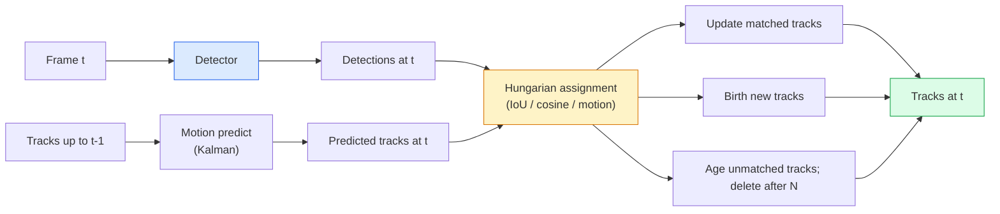

# 多目标追踪与视频记忆

> 追踪是检测加关联。检测每一帧。将这一帧的检测结果与上一帧的轨迹按 ID 匹配。

**类型：** 构建
**语言：** Python
**前置条件：** 阶段 4 第 06 课（YOLO 检测），阶段 4 第 08 课（Mask R-CNN），阶段 4 第 24 课（SAM 3）
**时间：** ~60 分钟

## 学习目标

- 区分基于检测的追踪和基于查询的追踪，并说出算法家族（SORT、DeepSORT、ByteTrack、BoT-SORT、SAM 2 记忆追踪器、SAM 3.1 Object Multiplex）
- 从头实现 IoU + Hungarian 分配用于经典的基于检测的追踪
- 解释 SAM 2 的记忆库以及为什么它在处理遮挡方面优于基于 IoU 的关联
- 阅读三个追踪指标（MOTA、IDF1、HOTA）并为给定用例选择正确的指标

## 问题

检测器告诉你物体在单帧中的位置。追踪器告诉你第 `t` 帧中的哪个检测与第 `t-1` 帧中的检测是同一个物体。没有它，你无法统计越过一条线的物体数量、跟踪一个球穿过遮挡物，或者知道"4 号车已在车道内行驶了 8 秒"。

追踪对每个面向视频的产品都至关重要：体育分析、监控、自动驾驶、医学视频分析、野生动物监测、文字标记计数。核心构建模块是共享的：每帧检测器、运动模型（卡尔曼滤波器或更复杂的模型）、关联步骤（在 IoU / 余弦 / 学习特征上的 Hungarian 算法）以及追踪生命周期（出生、更新、死亡）。

2026 年带来了两种新模式：**基于 SAM 2 记忆的追踪**（特征记忆而非运动模型关联）和 **SAM 3.1 Object Multiplex**（对于同一概念的多个实例的共享记忆）。本课先讲解经典堆栈，然后是基于记忆的方法。

## 概念

### 基于检测的追踪


```mermaid
flowchart LR
    F1["Frame t"] --> DET["Detector"] --> D1["Detections at t"]
    PREV["Tracks up to t-1"] --> PREDICT["Motion predict<br/>(Kalman)"]
    PREDICT --> PRED["Predicted tracks at t"]
    D1 --> ASSOC["Hungarian assignment<br/>(IoU / cosine / motion)"]
    PRED --> ASSOC
    ASSOC --> UPDATE["Update matched tracks"]
    ASSOC --> NEW["Birth new tracks"]
    ASSOC --> DEAD["Age unmatched tracks; delete after N"]
    UPDATE --> NEXT["Tracks at t"]
    NEW --> NEXT
    DEAD --> NEXT

    style DET fill:#dbeafe,stroke:#2563eb
    style ASSOC fill:#fef3c7,stroke:#d97706
    style NEXT fill:#dcfce7,stroke:#16a34a
```

你在 2026 年遇到的每个追踪器都是这个循环的变体。区别在于：

- **SORT**（2016）：卡尔曼滤波 + IoU Hungarian。简单、快速，无外观模型。
- **DeepSORT**（2017）：SORT + 每个轨迹的基于 CNN 的外观特征（ReID 嵌入）。更好地处理交叉。
- **ByteTrack**（2021）：将低置信度检测作为第二阶段关联；不需要外观特征但在 MOT17 上表现最佳。
- **BoT-SORT**（2022）：Byte + 相机运动补偿 + ReID。
- **StrongSORT / OC-SORT**——ByteTrack 的后代，具有更好的运动和外观模型。

### 卡尔曼滤波器（一句话概括）

卡尔曼滤波器维护每个轨迹的状态 `(x, y, w, h, dx, dy, dw, dh)` 及其协方差。在每一帧，使用恒定速度模型**预测**状态，然后与匹配的检测**更新**。当预测的不确定性高时，更新更信任检测。这提供了平滑的轨迹以及在短遮挡（1-5 帧）期间继续追踪的能力。

每个经典追踪器在运动预测步骤中都使用卡尔曼滤波器。

### Hungarian 算法

给定一个 `M x N` 成本矩阵（轨迹 x 检测），找到使总成本最小化的一对一分配。成本通常是 `1 - IoU(track_bbox, detection_bbox)` 或外观特征的负余弦相似度。运行时间为 O((M+N)^3)；对于 M、N 最多约 1000，通过 `scipy.optimize.linear_sum_assignment` 在 Python 中足够快。

### ByteTrack 的关键思想

标准追踪器丢弃低置信度检测（< 0.5）。ByteTrack 将它们保留为**第二阶段候选**：在将轨迹与高置信度检测匹配后，未匹配的轨迹尝试以略微宽松的 IoU 阈值与低置信度检测匹配。恢复短遮挡、靠近人群时的 ID 切换。

### SAM 2 基于记忆的追踪

SAM 2 通过维护每个实例的时空特征**记忆库**来处理视频。给定一帧上的提示（点击、框、文本），它将实例编码到记忆中。在后续帧上，记忆与新帧的特征进行交叉注意力，解码器为同一实例在新帧中生成掩码。

没有卡尔曼滤波器，没有 Hungarian 分配。关联隐含在记忆-注意力操作中。

优点：
- 对严重遮挡具有鲁棒性（记忆跨许多帧携带实例身份）。
- 与 SAM 3 的文本提示结合时具有开放词汇能力。
- 无需单独的运动模型。

缺点：
- 对于多物体追踪比 ByteTrack 慢。
- 记忆库增长；限制上下文窗口。

### SAM 3.1 Object Multiplex

先前的 SAM 2 / SAM 3 追踪为每个实例维护一个独立的记忆库。对于 50 个物体，需要 50 个记忆库。Object Multiplex（2026 年 3 月）将它们合并为一个共享记忆，带有**每个实例的查询 token**。成本随实例数量亚线性增长。

Multiplex 是 2026 年人群追踪的新默认选择：音乐会人群、仓库工人、交通路口。

### 需要知道的三个指标

- **MOTA（多目标追踪精度）**——1 - (FN + FP + ID 切换) / GT。按错误类型加权；一个将检测和关联失败混为一谈的单一指标。
- **IDF1（ID F1）**——ID 精度和召回率的调和平均值。专门关注每个真实轨迹在时间上保持其 ID 的程度。对于 ID 切换敏感的任务优于 MOTA。
- **HOTA（高阶追踪精度）**——分解为检测精度（DetA）和关联精度（AssA）。自 2020 年以来的社区标准；最全面。

对于监控（谁是谁）：报告 IDF1。对于体育分析（计数传球）：HOTA。对于一般学术比较：HOTA。

## 构建

### 步骤 1：基于 IoU 的成本矩阵

```python
import numpy as np


def bbox_iou(a, b):
    """
    a, b: (N, 4) 数组 [x1, y1, x2, y2]。
    返回 (N_a, N_b) IoU 矩阵。
    """
    ax1, ay1, ax2, ay2 = a[:, 0], a[:, 1], a[:, 2], a[:, 3]
    bx1, by1, bx2, by2 = b[:, 0], b[:, 1], b[:, 2], b[:, 3]
    inter_x1 = np.maximum(ax1[:, None], bx1[None, :])
    inter_y1 = np.maximum(ay1[:, None], by1[None, :])
    inter_x2 = np.minimum(ax2[:, None], bx2[None, :])
    inter_y2 = np.minimum(ay2[:, None], by2[None, :])
    inter = np.clip(inter_x2 - inter_x1, 0, None) * np.clip(inter_y2 - inter_y1, 0, None)
    area_a = (ax2 - ax1) * (ay2 - ay1)
    area_b = (bx2 - bx1) * (by2 - by1)
    union = area_a[:, None] + area_b[None, :] - inter
    return inter / np.clip(union, 1e-8, None)
```

### 步骤 2：最小 SORT 风格追踪器

为简洁起见省略了固定速度卡尔曼滤波——我们在这里使用简单的 IoU 关联；在生产中卡尔曼预测是必不可少的。`sort` Python 包提供了完整版本。

```python
from scipy.optimize import linear_sum_assignment


class Track:
    def __init__(self, tid, bbox, frame):
        self.id = tid
        self.bbox = bbox
        self.last_frame = frame
        self.hits = 1

    def update(self, bbox, frame):
        self.bbox = bbox
        self.last_frame = frame
        self.hits += 1


class SimpleTracker:
    def __init__(self, iou_threshold=0.3, max_age=5):
        self.tracks = []
        self.next_id = 1
        self.iou_threshold = iou_threshold
        self.max_age = max_age

    def step(self, detections, frame):
        if not self.tracks:
            for d in detections:
                self.tracks.append(Track(self.next_id, d, frame))
                self.next_id += 1
            return [(t.id, t.bbox) for t in self.tracks]

        track_boxes = np.array([t.bbox for t in self.tracks])
        det_boxes = np.array(detections) if len(detections) else np.empty((0, 4))

        iou = bbox_iou(track_boxes, det_boxes) if len(det_boxes) else np.zeros((len(track_boxes), 0))
        cost = 1 - iou
        cost[iou < self.iou_threshold] = 1e6

        matched_track = set()
        matched_det = set()
        if cost.size > 0:
            row, col = linear_sum_assignment(cost)
            for r, c in zip(row, col):
                if cost[r, c] < 1.0:
                    self.tracks[r].update(det_boxes[c], frame)
                    matched_track.add(r); matched_det.add(c)

        for i, d in enumerate(det_boxes):
            if i not in matched_det:
                self.tracks.append(Track(self.next_id, d, frame))
                self.next_id += 1

        self.tracks = [t for t in self.tracks if frame - t.last_frame <= self.max_age]
        return [(t.id, t.bbox) for t in self.tracks]
```

60 行。接收每帧检测，返回每帧轨迹 ID。真实系统添加卡尔曼预测、ByteTrack 的第二阶段重匹配和外观特征。

### 步骤 3：合成轨迹测试

```python
def synthetic_frames(num_frames=20, num_objects=3, H=240, W=320, seed=0):
    rng = np.random.default_rng(seed)
    starts = rng.uniform(20, 200, size=(num_objects, 2))
    velocities = rng.uniform(-5, 5, size=(num_objects, 2))
    frames = []
    for f in range(num_frames):
        dets = []
        for i in range(num_objects):
            cx, cy = starts[i] + f * velocities[i]
            dets.append([cx - 10, cy - 10, cx + 10, cy + 10])
        frames.append(dets)
    return frames


tracker = SimpleTracker()
for f, dets in enumerate(synthetic_frames()):
    tracks = tracker.step(dets, f)
```

三个沿直线运动的物体应在所有 20 帧中保持其 ID。

### 步骤 4：ID 切换指标

```python
def count_id_switches(tracks_per_frame, gt_per_frame):
    """
    tracks_per_frame:  列表的列表 (track_id, bbox)
    gt_per_frame:      列表的列表 (gt_id, bbox)
    返回 ID 切换次数。
    """
    prev_assignment = {}
    switches = 0
    for tracks, gts in zip(tracks_per_frame, gt_per_frame):
        if not tracks or not gts:
            continue
        t_boxes = np.array([b for _, b in tracks])
        g_boxes = np.array([b for _, b in gts])
        iou = bbox_iou(g_boxes, t_boxes)
        for g_idx, (gt_id, _) in enumerate(gts):
            j = iou[g_idx].argmax()
            if iou[g_idx, j] > 0.5:
                t_id = tracks[j][0]
                if gt_id in prev_assignment and prev_assignment[gt_id] != t_id:
                    switches += 1
                prev_assignment[gt_id] = t_id
    return switches
```

这是简化的接近 IDF1 的指标：计算真实物体更改其分配的预测轨迹 ID 的次数。真正的 MOTA / IDF1 / HOTA 工具位于 `py-motmetrics` 和 `TrackEval` 中。

## 使用

2026 年的生产追踪器：

- `ultralytics`——YOLOv8 + ByteTrack / BoT-SORT 内置。`results = model.track(source, tracker="bytetrack.yaml")`。默认选择。
- `supervision`（Roboflow）——ByteTrack 包装器加上标注实用工具。
- SAM 2 / SAM 3.1——通过 `processor.track()` 的基于记忆的追踪。
- 自定义堆栈：检测器（YOLOv8 / RT-DETR）+ `sort-tracker` / `OC-SORT` / `StrongSORT`。

选择建议：

- 行人 / 汽车 / 盒子在 30+ fps：**使用 ultralytics 的 ByteTrack**。
- 人群中同一类别的多个实例：**SAM 3.1 Object Multiplex**。
- 严重遮挡且具有可识别外观：**DeepSORT / StrongSORT**（ReID 特征）。
- 体育 / 复杂交互：**BoT-SORT** 或学习型追踪器（MOTRv3）。

## 交付

本课产出：

- `outputs/prompt-tracker-picker.md`——根据场景类型、遮挡模式和延迟预算选择 SORT / ByteTrack / BoT-SORT / SAM 2 / SAM 3.1。
- `outputs/skill-mot-evaluator.md`——编写一个针对真实标注轨迹的 MOTA / IDF1 / HOTA 完整评估工具。

## 练习

1. **（简单）** 使用 3、10 和 30 个物体运行上述合成追踪器。报告每种情况下的 ID 切换次数。确定简单的 IoU 仅关联开始失效的点。
2. **（中等）** 在关联前添加恒定速度卡尔曼预测步骤。展示短遮挡（2-3 帧）不再导致 ID 切换。
3. **（困难）** 集成 SAM 2 的基于记忆的追踪器（通过 `transformers`）作为替代追踪后端。在人流的 30 秒片段上同时运行 SimpleTracker 和 SAM 2，比较 ID 切换次数，为 5 个显著人物手动标记真实 ID。

## 关键术语

| 术语 | 人们说的 | 实际含义 |
|------|----------------|----------------------|
| 基于检测的追踪 | "检测后关联" | 每帧检测器 + 对 IoU / 外观进行 Hungarian 分配 |
| 卡尔曼滤波器 | "运动预测" | 线性动力学 + 协方差，用于平滑轨迹预测和遮挡处理 |
| Hungarian 算法 | "最优分配" | 解决最小成本二分匹配问题；`scipy.optimize.linear_sum_assignment` |
| ByteTrack | "低置信度第二次通行" | 将未匹配的轨迹与低置信度检测重匹配以恢复短遮挡 |
| DeepSORT | "SORT + 外观" | 添加 ReID 特征用于跨帧匹配；更好地保持 ID |
| 记忆库 | "SAM 2 技巧" | 每个实例的时空特征跨帧存储；交叉注意力替代显式关联 |
| Object Multiplex | "SAM 3.1 共享记忆" | 单个共享记忆带有每实例查询，用于快速多物体追踪 |
| HOTA | "现代追踪指标" | 分解为检测和关联精度；社区标准 |

## 延伸阅读

- [SORT（Bewley 等人, 2016）](https://arxiv.org/abs/1602.00763)——最小的基于检测的追踪论文
- [DeepSORT（Wojke 等人, 2017）](https://arxiv.org/abs/1703.07402)——添加外观特征
- [ByteTrack（Zhang 等人, 2022）](https://arxiv.org/abs/2110.06864)——低置信度第二次通行
- [BoT-SORT（Aharon 等人, 2022）](https://arxiv.org/abs/2206.14651)——相机运动补偿
- [HOTA（Luiten 等人, 2020）](https://arxiv.org/abs/2009.07736)——分解的追踪指标
- [SAM 2 视频分割（Meta, 2024）](https://ai.meta.com/sam2/)——基于记忆的追踪器
- [SAM 3.1 Object Multiplex（Meta, 2026 年 3 月）](https://ai.meta.com/blog/segment-anything-model-3/)
