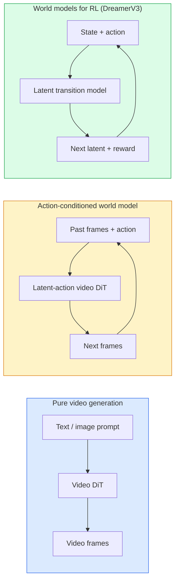

# World Models & Video Diffusion

> scene の次の数秒を予測する video model は world simulator である。その予測を actions で condition すれば、learned game engine になる。

**種別:** 学習 + 構築
**言語:** Python
**前提条件:** Phase 4 Lesson 10 (Diffusion), Phase 4 Lesson 12 (Video Understanding), Phase 4 Lesson 23 (DiT + Rectified Flow)
**所要時間:** 約75分

## 学習目標

- pure video generation model (Sora 2) と action-conditioned world model (Genie 3、DreamerV3) の違いを説明する
- video DiT を説明する: spatio-temporal patches、3D position encoding、(T, H, W) tokens 全体の joint attention
- world model が robotics にどう接続されるかを追跡する: VLM plans → video model simulates → inverse dynamics emits actions
- use case (creative video、interactive sim、autonomous-driving synthesis) に応じて Sora 2、Genie 3、Runway GWM-1 Worlds、Wan-Video、HunyuanVideo を選ぶ

## 問題

video generation と world modelling は 2026 年に収束した。1 分間の coherent video を生成できる model は、ある意味で world の動き方、つまり object permanence、gravity、causality、style を学んでいる。その予測を actions (walk left、open the door) で condition すれば、video model は game engine、driving simulator、robotics environment を置き換えられる learnable simulator になる。

stakes は具体的である。Genie 3 は single image から playable environments を生成する。Runway GWM-1 Worlds は無限に explore できる scenes を合成する。Sora 2 は synchronised audio と modelled physics を持つ minute-long videos を生成する。NVIDIA Cosmos-Drive、Wayve Gaia-2、Tesla DrivingWorld は autonomous-vehicle training data のために realistic driving video を生成する。world-model paradigm は robotics の sim-to-real を静かに置き換えつつある。

この lesson は Phase 4 の「big picture」lesson である。image generation、video understanding、agentic reasoning を、主要 research が向かっている dominant architecture pattern に接続する。

## 概念

### world-modelling の 3 つの families



- **Sora 2** は prompts で condition された pure video generation である。action interface はない。mid-rollout で「steer」することはできない。
- **Genie 3**、**GWM-1 Worlds**、**Mirage / Magica** は action-conditioned world models である。observed video から latent actions を推定し、その actions で future frame predictions を condition する。interactive であり、key を押したり camera を動かしたりすると scene が応答する。
- **DreamerV3** と classic RL world-model family は、明示的な action conditioning を持つ latent space で予測し、reward signal で train される。visual さは低いが、sample-efficient RL にはより有用である。

### Video DiT architecture

```
Video latent:          (C, T, H, W)
Patchify (spatial):    grid of P_h x P_w patches per frame
Patchify (temporal):   group P_t frames into a temporal patch
Resulting tokens:      (T / P_t) * (H / P_h) * (W / P_w) tokens
```

positional encoding は 3D であり、(t, h, w) coordinate ごとに rotary または learned embedding を持つ。attention には次の形がある。

- **Full joint** — すべての token がすべての token に attend する。N tokens に対して O(N^2)。long videos では prohibitive。
- **Divided** — temporal attention (同じ spatial position、time across: `(H*W) * T^2`) と spatial attention (同じ timestep、space across: `T * (H*W)^2`) を交互に行う。TimeSformer と多くの video DiT で使われる。
- **Window** — (t, h, w) の local windows。Video Swin で使われる。

2026 年の video diffusion model はすべて、この 3 pattern のどれかに AdaLN conditioning (Lesson 23) と rectified flow を組み合わせている。

### actions で condition する: latent action models

Genie は consecutive frames の pair の間の action を discriminatively に予測することで、frame ごとの **latent action** を学ぶ。model の decoder は、明示的な keyboard keys ではなく、この inferred latent action で condition される。inference では user が latent action を指定する、または fresh prior から sample し、その action と整合する next frame を model が生成する。

Sora は action interface を完全に省く。decoder は past spacetime tokens から next spacetime tokens を予測する。prompt は開始状態を condition するが、generation 中に steer するものはない。

### Physical plausibility

Sora 2 の 2026 年 release は **physical plausibility** を明示的に打ち出した。weight、balance、object permanence、cause-and-effect である。team は hand-rated plausibility scores で測定し、dropped objects、characters colliding、failures-on-purpose (missed jump) で Sora 1 より目に見えて改善した。

plausibility は今も支配的な failure mode である。2024-2025 年の、人が spaghetti を食べたり glasses から飲んだりする videos は、model に persistent object representation が不足していることを示した。2026 年の models (Sora 2、Runway Gen-5、HunyuanVideo) はこれらを減らしたが、なくしてはいない。

### Autonomous driving world models

driving world models は trajectories、bounding boxes、navigation maps で condition された realistic road scenes を生成する。用途:

- **Cosmos-Drive-Dreams** (NVIDIA) — RL training のために minutes of driving video を生成する。
- **Gaia-2** (Wayve) — policy evaluation 用の trajectory-conditioned scene synthesis。
- **DrivingWorld** (Tesla) — varied weather、time-of-day、traffic conditions を simulate する。
- **Vista** (ByteDance) — reactive driving scene synthesis。

これらは corner cases のための高価な real-world data collection を置き換える。夜間の pedestrian jaywalks、icy intersections、unusual vehicle types のような事例は、通常なら何百万 miles もの走行が必要になる。

### Robotics stack: VLM + video model + inverse dynamics

新興の three-component robotics loop:

1. **VLM** が goal ("pick up the red cup") を parse し、high-level action sequence を plan する。
2. **Video generation model** が各 action を実行したらどう見えるかを simulate する。つまり observations を N frames 先まで予測する。
3. **Inverse dynamics model** が、それらの observations を生み出す concrete motor commands を抽出する。

これは reward shaping と sample-heavy RL を置き換える。world model が imagination を担い、inverse dynamics が actuation の loop を閉じる。Genie Envisioner はその 1 つの実装であり、多くの research groups がこの structure に収束している。

### Evaluation

- **Visual quality** — FVD (Fréchet Video Distance)、user studies。
- **Prompt alignment** — frame ごとの CLIPScore、VQA-style evaluation。
- **Physical plausibility** — benchmark suite 上の hand-rated score (Sora 2 の internal benchmark、VBench)。
- **Controllability** (interactive world models 向け) — action → observation consistency。prior state に戻れるか。

### 2026 年の model landscape

| Model | Use | Parameters | Output | License |
|-------|-----|------------|--------|---------|
| Sora 2 | text-to-video, audio | — | 1-min 1080p + audio | API only |
| Runway Gen-5 | text/image-to-video | — | 10s clips | API |
| Runway GWM-1 Worlds | interactive world | — | infinite 3D rollout | API |
| Genie 3 | interactive world from image | 11B+ | playable frames | research preview |
| Wan-Video 2.1 | open text-to-video | 14B | high-quality clips | non-commercial |
| HunyuanVideo | open text-to-video | 13B | 10s clips | permissive |
| Cosmos / Cosmos-Drive | autonomous driving sim | 7-14B | driving scenes | NVIDIA open |
| Magica / Mirage 2 | AI-native game engine | — | modifiable worlds | product |

## 実装

### Step 1: video を 3D patchify する

```python
import torch
import torch.nn as nn


class VideoPatch3D(nn.Module):
    def __init__(self, in_channels=4, dim=64, patch_t=2, patch_h=2, patch_w=2):
        super().__init__()
        self.proj = nn.Conv3d(
            in_channels, dim,
            kernel_size=(patch_t, patch_h, patch_w),
            stride=(patch_t, patch_h, patch_w),
        )
        self.patch_t = patch_t
        self.patch_h = patch_h
        self.patch_w = patch_w

    def forward(self, x):
        # x: (N, C, T, H, W)
        x = self.proj(x)
        n, c, t, h, w = x.shape
        tokens = x.reshape(n, c, t * h * w).transpose(1, 2)
        return tokens, (t, h, w)
```

kernel と等しい stride を持つ 3D conv は spatio-temporal patchifier として働く。`(T, H, W) -> (T/2, H/2, W/2)` の token grid になる。

### Step 2: 3D rotary position encoding

Rotary Position Embeddings (RoPE) を `t`、`h`、`w` axes に別々に適用する。

```python
def rope_3d(tokens, t_dim, h_dim, w_dim, grid):
    """
    tokens: (N, T*H*W, D)
    grid: (T, H, W) sizes
    t_dim + h_dim + w_dim == D
    """
    T, H, W = grid
    n, seq, d = tokens.shape
    if t_dim + h_dim + w_dim != d:
        raise ValueError(f"t_dim+h_dim+w_dim ({t_dim}+{h_dim}+{w_dim}) must equal D={d}")
    assert seq == T * H * W
    t_idx = torch.arange(T, device=tokens.device).repeat_interleave(H * W)
    h_idx = torch.arange(H, device=tokens.device).repeat_interleave(W).repeat(T)
    w_idx = torch.arange(W, device=tokens.device).repeat(T * H)
    # Simplified: just scale channels by frequencies. Real RoPE rotates pairs.
    freqs_t = torch.exp(-torch.log(torch.tensor(10000.0)) * torch.arange(t_dim // 2, device=tokens.device) / (t_dim // 2))
    freqs_h = torch.exp(-torch.log(torch.tensor(10000.0)) * torch.arange(h_dim // 2, device=tokens.device) / (h_dim // 2))
    freqs_w = torch.exp(-torch.log(torch.tensor(10000.0)) * torch.arange(w_dim // 2, device=tokens.device) / (w_dim // 2))
    emb_t = torch.cat([torch.sin(t_idx[:, None] * freqs_t), torch.cos(t_idx[:, None] * freqs_t)], dim=-1)
    emb_h = torch.cat([torch.sin(h_idx[:, None] * freqs_h), torch.cos(h_idx[:, None] * freqs_h)], dim=-1)
    emb_w = torch.cat([torch.sin(w_idx[:, None] * freqs_w), torch.cos(w_idx[:, None] * freqs_w)], dim=-1)
    return tokens + torch.cat([emb_t, emb_h, emb_w], dim=-1)
```

simplified additive form である。real RoPE は frequencies に基づいて paired channels を rotate する。positional information は同じである。

### Step 3: divided attention block

```python
class DividedAttentionBlock(nn.Module):
    def __init__(self, dim=64, heads=2):
        super().__init__()
        self.time_attn = nn.MultiheadAttention(dim, heads, batch_first=True)
        self.space_attn = nn.MultiheadAttention(dim, heads, batch_first=True)
        self.ln1 = nn.LayerNorm(dim)
        self.ln2 = nn.LayerNorm(dim)
        self.ln3 = nn.LayerNorm(dim)
        self.mlp = nn.Sequential(nn.Linear(dim, 4 * dim), nn.GELU(), nn.Linear(4 * dim, dim))

    def forward(self, x, grid):
        T, H, W = grid
        n, seq, d = x.shape
        # time attention: same (h, w), across t
        xt = x.view(n, T, H * W, d).permute(0, 2, 1, 3).reshape(n * H * W, T, d)
        a, _ = self.time_attn(self.ln1(xt), self.ln1(xt), self.ln1(xt), need_weights=False)
        xt = (xt + a).reshape(n, H * W, T, d).permute(0, 2, 1, 3).reshape(n, seq, d)
        # space attention: same t, across (h, w)
        xs = xt.view(n, T, H * W, d).reshape(n * T, H * W, d)
        a, _ = self.space_attn(self.ln2(xs), self.ln2(xs), self.ln2(xs), need_weights=False)
        xs = (xs + a).reshape(n, T, H * W, d).reshape(n, seq, d)
        xs = xs + self.mlp(self.ln3(xs))
        return xs
```

time attention は各 spatial position 内で time across に attend し、space attention は各 frame 内で positions across に attend する。1 つの O((THW)^2) operation ではなく、2 つの O(T^2 + (HW)^2) operations になる。これが TimeSformer と現代の video DiT の中核である。

### Step 4: tiny video DiT を組み立てる

```python
class TinyVideoDiT(nn.Module):
    def __init__(self, in_channels=4, dim=64, depth=2, heads=2):
        super().__init__()
        self.patch = VideoPatch3D(in_channels=in_channels, dim=dim, patch_t=2, patch_h=2, patch_w=2)
        self.blocks = nn.ModuleList([DividedAttentionBlock(dim, heads) for _ in range(depth)])
        self.out = nn.Linear(dim, in_channels * 2 * 2 * 2)

    def forward(self, x):
        tokens, grid = self.patch(x)
        for blk in self.blocks:
            tokens = blk(tokens, grid)
        return self.out(tokens), grid
```

working video generator ではない。すべての piece の shape が正しいことを示す structural demo である。

### Step 5: shapes を確認する

```python
vid = torch.randn(1, 4, 8, 16, 16)  # (N, C, T, H, W)
model = TinyVideoDiT()
out, grid = model(vid)
print(f"input  {tuple(vid.shape)}")
print(f"tokens grid {grid}")
print(f"output {tuple(out.shape)}")
```

patching 後は `grid = (4, 8, 8)`、`out = (1, 256, 32)` を期待する。head は per-token spatio-temporal patches へ project し、それを video に un-patchify できる状態にする。

## 使う

2026 年の production access patterns:

- **Sora 2 API** (OpenAI) — text-to-video、synchronized audio。premium pricing。
- **Runway Gen-5 / GWM-1** (Runway) — image-to-video、interactive worlds。
- **Wan-Video 2.1 / HunyuanVideo** — open-source self-host。
- **Cosmos / Cosmos-Drive** (NVIDIA) — driving simulation open weights。
- **Genie 3** — research preview、request access。

interactive world-model demo を作るなら、quality のために Wan-Video から始め、interactivity のために latent-action adapter を重ねる。autonomous driving simulation では、Cosmos-Drive が 2026 年の open reference である。

野外で使われる robotics stack:

1. Language goal -> VLM (Qwen3-VL) -> high-level plan。
2. Plan -> latent-action video model -> imagined rollout。
3. Rollout -> inverse dynamics model -> low-level actions。
4. Actions executed -> observation fed back into step 1。

## 成果物

この lesson が生成するもの:

- `outputs/prompt-video-model-picker.md` — task、license、latency に基づいて Sora 2 / Runway / Wan / HunyuanVideo / Cosmos から選ぶ。
- `outputs/skill-physical-plausibility-checks.md` — ship 前に generated video に対して実行する automated checks (object permanence、gravity、continuity) を定義する skill。

## 演習

1. **(Easy)** patch-t=2、patch-h=8、patch-w=8 の 5-second 360p video の token count を計算する。この size での attention memory を考察する。
2. **(Medium)** 上の divided attention block を full joint attention block に置き換え、shape と parameter count を測定する。real video models で divided attention が必要な理由を説明する。
3. **(Hard)** minimal latent-action video model を作る。任意の simple 2D game から (frame_t, action_t, frame_{t+1}) triples の dataset を用意し、action embeddings で condition した tiny video DiT を train し、different actions が different next frames を生成することを示す。

## 重要用語

| Term | よく言われる表現 | 実際の意味 |
|------|----------------|----------------------|
| World model | "Learned simulator" | state と action が与えられたとき future observations を予測する model |
| Video DiT | "Spacetime transformer" | 3D patchification と divided attention を持つ diffusion transformer |
| Latent action | "Inferred control" | frame pairs から推定される discrete または continuous action latent。next-frame generation の condition に使う |
| Divided attention | "Time then space" | block ごとに time across と space across の 2 つの attention operation を行い、O(N^2) を扱いやすくする |
| Object permanence | "Things stay real" | video models が学ぶべき scene property。food や glassware での古典的 failure mode |
| FVD | "Fréchet Video Distance" | FID の video equivalent。primary visual quality metric |
| Inverse dynamics model | "Observations to actions" | (state, next state) が与えられたとき、それらをつなぐ action を出力する。robotics loop を閉じる |
| Cosmos-Drive | "NVIDIA driving sim" | RL と evaluation 用の open-weights autonomous-driving world model |

## 参考資料

- [Sora technical report (OpenAI)](https://openai.com/index/video-generation-models-as-world-simulators/)
- [Genie: Generative Interactive Environments (Bruce et al., 2024)](https://arxiv.org/abs/2402.15391) — latent action world models
- [TimeSformer (Bertasius et al., 2021)](https://arxiv.org/abs/2102.05095) — video transformers の divided attention
- [DreamerV3 (Hafner et al., 2023)](https://arxiv.org/abs/2301.04104) — RL 向け world models
- [Cosmos-Drive-Dreams (NVIDIA, 2025)](https://research.nvidia.com/labs/toronto-ai/cosmos-drive-dreams/) — driving world model
- [Top 10 Video Generation Models 2026 (DataCamp)](https://www.datacamp.com/blog/top-video-generation-models)
- [From Video Generation to World Model — survey repo](https://github.com/ziqihuangg/Awesome-From-Video-Generation-to-World-Model/)
