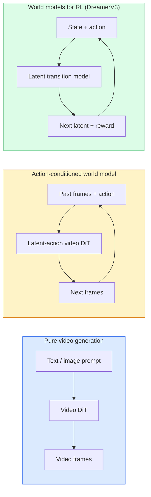

# Dünya Modelleri ve Video Yayılımı

> Bir sahnenin sonraki saniyelerini tahmin eden bir video modeli, bir dünya simülatörüdür. Bu tahmini eylemlere göre koşullandırdığınızda öğrenilmiş bir oyun motorunuz olur.

**Tür:** Öğren + Oluştur
**Diller:** Python
**Önkoşullar:** Aşama 4 Ders 10 (Yayılma), Aşama 4 Ders 12 (Video Anlama), Aşama 4 Ders 23 (DiT + Düzeltilmiş Akış)
**Süre:** ~75 dakika

## Öğrenme Hedefleri

- Saf video oluşturma modeli (Sora 2) ile aksiyona dayalı dünya modeli (Genie 3, DreamerV3) arasındaki farkı açıklayın
- Bir video DiT'yi tanımlayın: uzay-zamansal yamalar, 3 boyutlu konum kodlaması, (T, H, W) token'ler arasında ortak dikkat
- Bir dünya modelinin robotiğe nasıl bağlandığını izleyin: VLM planları → video modeli simüle eder → ters dinamikler eylemleri yayar
- Belirli bir kullanım durumu için Sora 2, Genie 3, Runway GWM-1 Worlds, Wan-Video ve HunyuanVideo arasından seçim yapın (yaratıcı video, etkileşimli simülasyon, otonom sürüş sentezi)

## Sorun

Video üretimi ve dünya modellemesi 2026'da bir araya geldi. Tutarlı bir dakikalık video oluşturabilen bir model, bir bakıma dünyanın nasıl hareket ettiğini öğrenmiş oldu: nesne kalıcılığı, yerçekimi, nedensellik, stil. Bu tahmini eylemlere (sola yürüme, kapıyı açma) bağlıyorsanız, video modeli bir oyun motorunun, sürüş simülatörünün veya robotik ortamın yerini alabilecek öğrenilebilir bir simülatör haline gelir.

Riskler somuttur. Genie 3, tek bir görüntüden oynanabilir ortamlar oluşturur. Pist GWM-1 Worlds, sonsuz sayıda keşfedilebilir sahneyi sentezliyor. Sora 2, senkronize ses ve modellenmiş fizik ile bir dakikalık videolar üretiyor. NVIDIA Cosmos-Drive, Wayve Gaia-2 ve Tesla DrivingWorld, otonom araç eğitim verileri için gerçekçi sürüş videoları oluşturuyor. Dünya modeli paradigması, robotik alanında simülasyondan gerçeğe sessizce geçiş yapıyor.

Bu ders 4. Aşamanın "büyük resim" dersidir. Görüntü oluşturma, video anlama ve agentic akıl yürütmeyi, baskın araştırmanın yöneldiği mimari modelle birleştirir.

## Konsept

### Dünya modellemenin üç ailesi



- **Sora 2**, prompt'lere dayalı saf video oluşturma teknolojisidir. Eylem arayüzü yok. Kullanıma sunmanın ortasında onu "yönlendiremezsiniz".
- **Genie 3**, **GWM-1 Worlds**, **Mirage / Magica** aksiyona dayalı dünya modelleridir. Gözlemlenen videodan gizli eylemleri çıkarın, ardından gelecekteki çerçeve tahminlerini eylemlere göre koşullandırın. Etkileşimli — tuşlara bastığınızda veya bir kamerayı hareket ettirdiğinizde sahne yanıt verir.
- **DreamerV3** ve klasik RL dünya modeli ailesi, bir ödül sinyaliyle eğitilmiş, açık eylem koşullandırmalı gizli bir alanda tahmin yapar. Daha az görsel; örnek verimli RL için daha kullanışlıdır.

### Video DiT mimarisi

```
Video latent:          (C, T, H, W)
Patchify (spatial):    grid of P_h x P_w patches per frame
Patchify (temporal):   group P_t frames into a temporal patch
Resulting tokens:      (T / P_t) * (H / P_h) * (W / P_w) tokens
```

Konumsal kodlama 3 boyutludur: (t, h, w) koordinatı başına döner veya öğrenilmiş bir embedding. Dikkat şunlar olabilir:

- **Tam ortak** — tüm token'ler tüm token'lere katılır. N token ile O(N^2). Uzun videolar için yasaklayıcıdır.
- **Bölünmüş** — alternatif zamansal dikkat (zaman boyunca aynı uzamsal konum: `(H*W) * T^2`) ve uzamsal dikkat (uzay boyunca aynı zaman adımı: `T * (H*W)^2`). TimeSformer ve çoğu video DiT tarafından kullanılır.
- **Pencere** — (t, h, w) içindeki yerel pencereler. Video Swin tarafından kullanılır.

Her 2026 video dağıtım modeli, bu üç modelden birinin yanı sıra AdaLN koşullandırmasını (Ders 23) ve düzeltilmiş akışı kullanır.

### Eylemlere ilişkin koşullandırma: gizli eylem modelleri

Genie, bir çift ardışık kare arasındaki eylemi ayrımcı bir şekilde tahmin ederek, kare başına **gizli bir eylemi** öğrenir. Modelin kod çözücüsü daha sonra açık klavye tuşlarını değil, çıkarsanan gizli eylemi koşullandırır. inference'de kullanıcı gizli bir eylem belirleyebilir (veya yeni bir önceki eylemden örnek alabilir) ve model, bu eylemle tutarlı bir sonraki kareyi oluşturur.

Sora, aksiyon arayüzünü tamamen atlıyor. Kod çözücüsü, geçmiş uzay-zaman token'lerden sonraki uzay-zaman token'lerini tahmin eder. Prompt başlangıcı koşullandırır; hiçbir şey onu neslin ortasında yönlendiremez.

### Fiziksel inandırıcılık

Sora 2'nin 2026 sürümü açıkça **fiziksel inandırıcılığın** reklamını yapıyordu: ağırlık, denge, nesne kalıcılığı, neden-sonuç. Ekip tarafından elle derecelendirilmiş inandırıcılık puanları aracılığıyla ölçülmüştür; Model, Sora 1'e kıyasla düşen nesneler, karakterlerin çarpışması ve kasıtlı başarısızlıklar (kaçırılan atlama) konusunda gözle görülür şekilde iyileşiyor.

Olasılık baskın başarısızlık modu olmaya devam ediyor. Spagetti yiyen veya bardaktan içki içen insanların yer aldığı 2024-2025 videoları, modelin kalıcı nesne temsilinin eksikliğini ortaya çıkardı. 2026 modelleri (Sora 2, Runway Gen-5, HunyuanVideo) bunları azaltır ancak ortadan kaldırmaz.

### Otonom sürüş dünyası modelleri

Sürüş dünyası modelleri, yörüngelere, sınırlayıcı kutulara veya navigasyon haritalarına göre koşullandırılmış gerçekçi yol sahneleri oluşturur. Kullanımı:

- **Cosmos-Drive-Dreams** (NVIDIA) — RL eğitimi için dakikalarca sürüş videosu oluşturur.
- **Gaia-2** (Wayve) — politika değerlendirmesi için yörüngeye bağlı sahne sentezi.
- **DrivingWorld** (Tesla) — çeşitli hava koşullarını, günün saatini ve trafik koşullarını simüle eder.
- **Vista** (ByteDance) — reaktif sürüş sahnesi sentezi.

Aksi takdirde milyonlarca kilometre sürüş gerektirecek köşe durumları (geceleri yayaların kırmızı ışıkta geçmesi, buzlu kavşaklar, olağandışı araç türleri) için gerçek dünyadaki pahalı veri toplamanın yerini alıyorlar.

### Robotik yığını: VLM + video modeli + ters dinamikler

Ortaya çıkan üç bileşenli robotik döngü:

1. **VLM** hedefi ayrıştırır ("kırmızı kupayı kaldır"), üst düzey bir aksiyon sekansı planlar.
2. **Video oluşturma modeli** her bir eylemin nasıl gerçekleştirileceğini simüle eder ve N kare ilerideki gözlemleri tahmin eder.
3. **Ters dinamik modeli** bu gözlemleri üretecek somut motor komutlarını çıkarır.

Bu, ödül şekillendirmenin ve örnek ağırlıklı RL'nin yerini alır. Dünya modeli hayal gücünü yapar; ters dinamikler harekete geçirildiğinde döngüyü kapatır. Genie Envisioner bir örneklemedir; birçok araştırma grubu bu yapı üzerinde birleşiyor.

### Değerlendirme

- **Görsel kalite** — FVD (Fréchet Video Mesafesi), kullanıcı çalışmaları.
- **Prompt hizalama** — Çerçeve başına CLIPScore, VQA tarzı değerlendirme.
- **Fiziksel uygunluk** — benchmark paketinde (Sora 2'nin dahili benchmark, VBench) elle derecelendirilmiştir.
- **Kontrol edilebilirlik** (etkileşimli dünya modelleri için) — eylem → gözlem tutarlılığı; önceki duruma geri dönebilir misin?

### 2026'daki model manzarası

| Modeli | Kullan | Parametreler | Çıkış | Lisans |
|-------|-----|------------|--------|---------|
| Sora 2 | metinden videoya, ses | — | 1 dakika 1080p + ses | Yalnızca API |
| Pist Gen-5 | metin/görüntüden videoya | — | 10'lu yılların klipleri | API'si |
| Pist GWM-1 Dünya Şampiyonası | interaktif dünya | — | sonsuz 3D sunumu | API'si |
| Cin 3 | görüntüden etkileşimli dünya | 11B+ | oynanabilir kareler | araştırma önizlemesi |
| Wan-Video 2.1 | metinden videoya geçişi aç | 14B | yüksek kaliteli klipler | ticari olmayan |
| HunyuanVideo | metinden videoya geçişi aç | 13B | 10'lu yılların klipleri | müsamahakâr |
| Kozmos / Kozmos-Drive | otonom sürüş simülasyonu | 7-14B | sürüş sahneleri | NVIDIA açık |
| Büyü / Mirage 2 | Yapay zekaya özgü oyun motoru | — | değiştirilebilir dünyalar | ürün |

## İnşa Et

### 1. Adım: Video için 3D yamalama

```python
import torch
import torch.nn as nn


class VideoPatch3D(nn.Module):
    def __init__(self, in_channels=4, dim=64, patch_t=2, patch_h=2, patch_w=2):
        super().__init__()
        self.proj = nn.Conv3d(
            in_channels, dim,
            kernel_size=(patch_t, patch_h, patch_w),
            stride=(patch_t, patch_h, patch_w),
        )
        self.patch_t = patch_t
        self.patch_h = patch_h
        self.patch_w = patch_w

    def forward(self, x):
        # x: (N, C, T, H, W)
        x = self.proj(x)
        n, c, t, h, w = x.shape
        tokens = x.reshape(n, c, t * h * w).transpose(1, 2)
        return tokens, (t, h, w)
```

Çekirdeğe eşit adım uzunluğuna sahip bir 3B dönüşüm, uzay-zamansal yamalayıcı görevi görür. token'lerin `(T, H, W) -> (T/2, H/2, W/2)` ızgarası.

### Adım 2: 3D döner konum kodlaması

`t`, `h`, `w` eksenleri boyunca ayrı ayrı uygulanan Döner Pozisyon Embedding'ler (RoPE):

```python
def rope_3d(tokens, t_dim, h_dim, w_dim, grid):
    """
    tokens: (N, T*H*W, D)
    grid: (T, H, W) sizes
    t_dim + h_dim + w_dim == D
    """
    T, H, W = grid
    n, seq, d = tokens.shape
    if t_dim + h_dim + w_dim != d:
        raise ValueError(f"t_dim+h_dim+w_dim ({t_dim}+{h_dim}+{w_dim}) must equal D={d}")
    assert seq == T * H * W
    t_idx = torch.arange(T, device=tokens.device).repeat_interleave(H * W)
    h_idx = torch.arange(H, device=tokens.device).repeat_interleave(W).repeat(T)
    w_idx = torch.arange(W, device=tokens.device).repeat(T * H)
    # Simplified: just scale channels by frequencies. Real RoPE rotates pairs.
    freqs_t = torch.exp(-torch.log(torch.tensor(10000.0)) * torch.arange(t_dim // 2, device=tokens.device) / (t_dim // 2))
    freqs_h = torch.exp(-torch.log(torch.tensor(10000.0)) * torch.arange(h_dim // 2, device=tokens.device) / (h_dim // 2))
    freqs_w = torch.exp(-torch.log(torch.tensor(10000.0)) * torch.arange(w_dim // 2, device=tokens.device) / (w_dim // 2))
    emb_t = torch.cat([torch.sin(t_idx[:, None] * freqs_t), torch.cos(t_idx[:, None] * freqs_t)], dim=-1)
    emb_h = torch.cat([torch.sin(h_idx[:, None] * freqs_h), torch.cos(h_idx[:, None] * freqs_h)], dim=-1)
    emb_w = torch.cat([torch.sin(w_idx[:, None] * freqs_w), torch.cos(w_idx[:, None] * freqs_w)], dim=-1)
    return tokens + torch.cat([emb_t, emb_h, emb_w], dim=-1)
```

Basitleştirilmiş katkı formu. Gerçek RoPE, eşleştirilmiş kanalları frekanslarda döndürür; konum bilgileri aynıdır.

### 3. Adım: Bölünmüş dikkat bloğu

```python
class DividedAttentionBlock(nn.Module):
    def __init__(self, dim=64, heads=2):
        super().__init__()
        self.time_attn = nn.MultiheadAttention(dim, heads, batch_first=True)
        self.space_attn = nn.MultiheadAttention(dim, heads, batch_first=True)
        self.ln1 = nn.LayerNorm(dim)
        self.ln2 = nn.LayerNorm(dim)
        self.ln3 = nn.LayerNorm(dim)
        self.mlp = nn.Sequential(nn.Linear(dim, 4 * dim), nn.GELU(), nn.Linear(4 * dim, dim))

    def forward(self, x, grid):
        T, H, W = grid
        n, seq, d = x.shape
        # time attention: same (h, w), across t
        xt = x.view(n, T, H * W, d).permute(0, 2, 1, 3).reshape(n * H * W, T, d)
        a, _ = self.time_attn(self.ln1(xt), self.ln1(xt), self.ln1(xt), need_weights=False)
        xt = (xt + a).reshape(n, H * W, T, d).permute(0, 2, 1, 3).reshape(n, seq, d)
        # space attention: same t, across (h, w)
        xs = xt.view(n, T, H * W, d).reshape(n * T, H * W, d)
        a, _ = self.space_attn(self.ln2(xs), self.ln2(xs), self.ln2(xs), need_weights=False)
        xs = (xs + a).reshape(n, T, H * W, d).reshape(n, seq, d)
        xs = xs + self.mlp(self.ln3(xs))
        return xs
```

Zaman dikkati, zaman boyunca her uzamsal konuma katılır; mekan dikkati her karede konumlar arasında yer alır. Bir O((THW)^2 yerine iki O(T^2 + (HW)^2) işlemi. Bu, TimeSformer'ın ve her modern video DiT'nin özüdür.

### Adım 4: Küçük bir video DiT oluşturun

```python
class TinyVideoDiT(nn.Module):
    def __init__(self, in_channels=4, dim=64, depth=2, heads=2):
        super().__init__()
        self.patch = VideoPatch3D(in_channels=in_channels, dim=dim, patch_t=2, patch_h=2, patch_w=2)
        self.blocks = nn.ModuleList([DividedAttentionBlock(dim, heads) for _ in range(depth)])
        self.out = nn.Linear(dim, in_channels * 2 * 2 * 2)

    def forward(self, x):
        tokens, grid = self.patch(x)
        for blk in self.blocks:
            tokens = blk(tokens, grid)
        return self.out(tokens), grid
```

Çalışan bir video oluşturucu değil; her parçanın doğru şekilde şekillendiği yapısal bir demo.

### Adım 5: Şekilleri kontrol edin

```python
vid = torch.randn(1, 4, 8, 16, 16)  # (N, C, T, H, W)
model = TinyVideoDiT()
out, grid = model(vid)
print(f"input  {tuple(vid.shape)}")
print(f"tokens grid {grid}")
print(f"output {tuple(out.shape)}")
```

Yama sonrasında `grid = (4, 8, 8)` ve `out = (1, 256, 32)` bekleniyor; kafa daha sonra her token uzay-zamansal yamalara yansıtır ve yamaları kaldırılarak tekrar videoya dönüştürülmeye hazır olur.

## Kullan onu

2026 için üretime erişim modelleri:

- **Sora 2 API** (OpenAI) — metinden videoya, senkronize ses. Premium fiyatlandırma.
- **Pist Gen-5 / GWM-1** (Pist) — görüntüden videoya, etkileşimli dünyalar.
- **Wan-Video 2.1 / HunyuanVideo** — açık kaynaklı kendi kendine barındırıcı.
- **Cosmos / Cosmos-Drive** (NVIDIA) — sürüş simülasyonu açık ağırlıkları.
- **Genie 3** — araştırma önizlemesi, erişim isteği.

Etkileşimli bir dünya modeli demosu oluşturmak için: Kalite için Wan-Video ile başlayın, etkileşim için gizli eylem bağdaştırıcısını kullanın. Otonom sürüş simülasyonu için: Cosmos-Drive, 2026'nın açık referansıdır.

Robotik için vahşi doğada yığın:

1. Dil hedefi -> VLM (Qwen3-VL) -> üst düzey plan.
2. Plan -> gizli eylem video modeli -> hayal edilen sunum.
3. Kullanıma sunma -> ters dinamik modeli -> düşük seviyeli eylemler.
4. Gerçekleştirilen eylemler -> gözlem 1. adıma geri aktarılır.

## Gönderin

Bu ders şunları üretir:

- `outputs/prompt-video-model-picker.md` — Sora 2 / Runway / Wan / HunyuanVideo / Cosmos verilen görev, lisans ve gecikme arasında seçim yapar.
- `outputs/skill-physical-plausibility-checks.md` — gönderilmeden önce oluşturulan herhangi bir video üzerinde çalıştırılacak otomatik kontrolleri (nesne kalıcılığı, yerçekimi, süreklilik) tanımlayan bir beceri.

## Egzersizler

1. **(Kolay)** Patch-t=2, patch-h=8, patch-w=8'deki 5 saniyelik 360p video için token sayısını hesaplayın. Bu boyutta dikkatin hafızayla ilgili nedeni.
2. **(Orta)** Yukarıdaki bölünmüş dikkat bloğunu tam ortak dikkat bloğuyla değiştirin ve şekli ve parametre sayısını ölçün. Gerçek video modelleri için bölünmüş dikkatin neden gerekli olduğunu açıklayın.
3. **(Zor)** Minimal bir gizli eylem video modeli oluşturun: (frame_t, action_t, çerçeve_{t+1}) üçlü dataset alın (herhangi bir basit 2D oyun), embedding eylemine koşullandırılmış küçük bir video DiT eğitin ve farklı eylemlerin farklı sonraki kareler ürettiğini gösterin.

## Anahtar Terimler

| Dönem | İnsanlar ne diyor | Aslında ne anlama geliyor |
|------|----------------|----------------------|
| Dünya modeli | "Öğrenilmiş simülatör" | Durum ve eylem göz önüne alındığında gelecekteki gözlemleri tahmin eden bir model |
| Video DiT | "Uzayzaman transformer" | 3D yamalama ve bölünmüş dikkatle Difüzyon transformer |
| Gizli eylem | "Çıkartılan kontrol" | Çerçeve çiftlerinden çıkarılan ayrık veya sürekli eylem gizli; yeni çerçeve neslini koşullandırmak için kullanılır |
| Bölünmüş dikkat | "Zaman sonra uzay" | O(N^2)'yi yönetilebilir tutmak için blok başına iki dikkat işlemi (zaman ve alan genelinde) |
| Nesne kalıcılığı | "Her şey gerçek kalıyor" | Video modellerin öğrenmesi gereken sahne özelliği; gıda ve züccaciyede klasik arıza modu |
| FVD | "Fréchet Video Mesafesi" | FID'nin video eşdeğeri; birincil görsel kalite ölçüsü |
| Ters dinamik modeli | "Eylemlere ilişkin gözlemler" | Verilen (durum, sonraki durum), onları birbirine bağlayan eylemin çıktısını alır; robotik döngüsünü kapatıyor |
| Cosmos-Drive | "NVIDIA sürüş simülasyonu" | RL ve değerlendirme için açık ağırlık otonom sürüş dünya modeli |

## Daha Fazla Okuma

- [Sora teknik raporu (OpenAI)](https://openai.com/index/video-generation-models-as-world-simulators/)
- [Genie: Üretken Etkileşimli Ortamlar (Bruce ve diğerleri, 2024)](https://arxiv.org/abs/2402.15391) — gizli eylem dünyası modelleri
- [TimeSformer (Bertasius ve diğerleri, 2021)](https://arxiv.org/abs/2102.05095) — transformer videoları için bölünmüş dikkat
- [DreamerV3 (Hafner ve diğerleri, 2023)](https://arxiv.org/abs/2301.04104) — RL için dünya modelleri
- [Cosmos-Drive-Dreams (NVIDIA, 2025)](https://research.nvidia.com/labs/toronto-ai/cosmos-drive-dreams/) — sürüş dünyası modeli
- [En İyi 10 Video Oluşturma Modeli 2026 (DataCamp)](https://www.datacamp.com/blog/top-video-generation-models)
- [Video Üretiminden Dünya Modeline — anket deposu](https://github.com/ziqihuangg/Awesome-From-Video-Generation-to-World-Model/)
