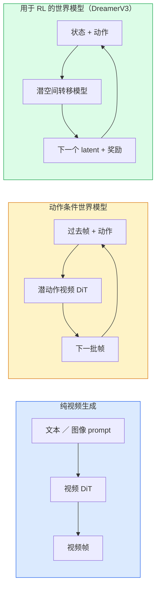

# 世界模型与视频 Diffusion（World Models & Video Diffusion）

> 译注：本文译自同目录 [`en.md`](./en.md)。术语遵循仓根 [TRANSLATION_GUIDE.md](../../../../TRANSLATION_GUIDE.md)。

> 一个能预测一段场景接下来几秒的视频模型，本质上就是一个世界模拟器。把这个预测条件化在动作上，你就拥有了一个学到的游戏引擎。

**Type:** Learn + Build
**Languages:** Python
**Prerequisites:** Phase 4 Lesson 10（Diffusion）、Phase 4 Lesson 12（Video Understanding）、Phase 4 Lesson 23（DiT + Rectified Flow）
**Time:** ~75 minutes

## 学习目标（Learning Objectives）

- 解释纯视频生成模型（Sora 2）和动作条件化的世界模型（Genie 3、DreamerV3）之间的差别
- 描述视频 DiT：时空 patch、3D 位置编码、跨 (T, H, W) token 的联合 attention
- 追踪世界模型如何嵌入到机器人系统中：VLM 规划 → 视频模型模拟 → 逆向动力学（inverse dynamics）输出动作
- 在 Sora 2、Genie 3、Runway GWM-1 Worlds、Wan-Video、HunyuanVideo 之间，根据具体用例（创意视频、交互式仿真、自动驾驶数据合成）做出选型

## 问题（The Problem）

视频生成与世界建模在 2026 年汇流到一起。一个能生成一分钟连贯视频的模型，从某种意义上说，已经学会了世界如何运动：物体恒存性、重力、因果关系、风格。如果你把这个预测条件化在动作上（向左走、开门），视频模型就变成了一个可学习的模拟器，可以替代游戏引擎、驾驶模拟器，或者机器人环境。

赌注是具体的。Genie 3 能从一张图片生成可玩环境。Runway GWM-1 Worlds 能合成无限可探索的场景。Sora 2 能产出带同步音频和物理建模的分钟级视频。NVIDIA Cosmos-Drive、Wayve Gaia-2、Tesla DrivingWorld 为自动驾驶训练数据生成逼真的驾驶视频。世界模型范式正在悄悄接管机器人领域的 sim-to-real。

这一节是 Phase 4 的「全景图」一课。它把图像生成、视频理解、agentic 推理串起来，连接成主流研究正在收敛的那个架构范式。

## 概念（The Concept）

### 世界建模的三大家族（Three families of world-modelling）



- **Sora 2** 是基于 prompt 条件化的纯视频生成。没有动作接口。你没法在 rollout 中途「掌舵」。
- **Genie 3**、**GWM-1 Worlds**、**Mirage / Magica** 是动作条件化的世界模型。从观测视频里推断出 latent 动作，再用动作来条件化未来帧的预测。是交互式的——你按键或移动相机，场景会响应。
- **DreamerV3** 以及经典 RL 世界模型家族在 latent 空间中预测，带有显式的动作条件，并在奖励信号下训练。视觉性更弱；但在 sample-efficient RL 上更有用。

### 视频 DiT 架构（Video DiT architecture）

```
Video latent:          (C, T, H, W)
Patchify (spatial):    grid of P_h x P_w patches per frame
Patchify (temporal):   group P_t frames into a temporal patch
Resulting tokens:      (T / P_t) * (H / P_h) * (W / P_w) tokens
```

位置编码是 3D 的：每个 (t, h, w) 坐标对应一个 rotary 或可学习的 embedding。Attention 可以是：

- **Full joint** —— 所有 token 互相 attend。复杂度 O(N^2)，N 是 token 数。对长视频代价过高。
- **Divided** —— 交替进行时间 attention（同一空间位置、跨时间：`(H*W) * T^2`）和空间 attention（同一时间步、跨空间：`T * (H*W)^2`）。TimeSformer 和大多数视频 DiT 都用这个。
- **Window** —— 在 (t, h, w) 中划局部窗口。Video Swin 用这个。

2026 年的每一个视频 diffusion 模型都用这三种模式之一，再加 AdaLN 条件化（Lesson 23）和 rectified flow。

### 用动作做条件：latent action 模型（Conditioning on actions: latent action models）

Genie 通过判别式地预测一对相邻帧之间的动作，给每帧学一个 **latent action**。模型的 decoder 然后在推断出来的 latent action 上做条件——而不是显式的键盘按键。推理时，用户可以指定一个 latent action（或从一个全新的先验里采样一个），模型就生成与该动作一致的下一帧。

Sora 完全跳过了动作接口。它的 decoder 从过去的时空 token 预测下一批时空 token。Prompt 决定起点；生成中途没有任何东西可以掌舵。

### 物理合理性（Physical plausibility）

Sora 2 在 2026 年的发布版本明确宣传了**物理合理性**：重量、平衡、物体恒存性、因果关系。团队通过人工评分的合理性分数来衡量；相比 Sora 1，模型在掉落的物体、人物碰撞，以及刻意失败（一次失败的跳跃）上有肉眼可见的提升。

合理性仍然是主导失败模式。2024–2025 年那些人吃意面或从玻璃杯里喝水的视频，揭示了模型缺乏持久的物体表征。2026 年的模型（Sora 2、Runway Gen-5、HunyuanVideo）减少了这些问题，但没有消除。

### 自动驾驶世界模型（Autonomous driving world models）

驾驶世界模型在轨迹、bounding box 或导航地图条件下生成逼真的道路场景。用法：

- **Cosmos-Drive-Dreams**（NVIDIA）—— 为 RL 训练生成数分钟的驾驶视频。
- **Gaia-2**（Wayve）—— 用于策略评估的轨迹条件场景合成。
- **DrivingWorld**（Tesla）—— 模拟多变的天气、时间、交通状况。
- **Vista**（字节跳动）—— 反应式驾驶场景合成。

它们替代了昂贵的真实世界数据采集，专门用于那些 corner case——夜里乱穿马路的行人、结冰的路口、罕见车型——这些场景如果走真实路测，需要数百万英里。

### 机器人技术栈：VLM + 视频模型 + 逆向动力学（Robotics stack: VLM + video model + inverse dynamics）

新兴的三组件机器人闭环：

1. **VLM** 解析目标（"pick up the red cup"），规划一个高层动作序列。
2. **视频生成模型**模拟执行每个动作的效果——预测 N 帧之后的观测。
3. **逆向动力学模型**提取出能产生这些观测的具体电机指令。

这取代了奖励塑形（reward shaping）和样本饥饿的 RL。世界模型负责想象；逆向动力学闭合执行环节。Genie Envisioner 是其中一种实现；许多研究组正在向这个结构收敛。

### 评估（Evaluation）

- **视觉质量** —— FVD（Fréchet Video Distance）、用户研究。
- **Prompt 对齐** —— 逐帧 CLIPScore，VQA 风格的评估。
- **物理合理性** —— 在一套基准上人工评分（Sora 2 的内部基准、VBench）。
- **可控性**（针对交互式世界模型）—— 动作 → 观测的一致性；能否回到先前的状态？

### 2026 年的模型版图（Model landscape in 2026）

| Model | Use | Parameters | Output | License |
|-------|-----|------------|--------|---------|
| Sora 2 | text-to-video, audio | — | 1-min 1080p + audio | API only |
| Runway Gen-5 | text/image-to-video | — | 10s clips | API |
| Runway GWM-1 Worlds | interactive world | — | infinite 3D rollout | API |
| Genie 3 | interactive world from image | 11B+ | playable frames | research preview |
| Wan-Video 2.1 | open text-to-video | 14B | high-quality clips | non-commercial |
| HunyuanVideo | open text-to-video | 13B | 10s clips | permissive |
| Cosmos / Cosmos-Drive | autonomous driving sim | 7-14B | driving scenes | NVIDIA open |
| Magica / Mirage 2 | AI-native game engine | — | modifiable worlds | product |

## 动手实现（Build It）

### 第 1 步：视频的 3D patchify（Step 1: 3D patchify for video）

```python
import torch
import torch.nn as nn


class VideoPatch3D(nn.Module):
    def __init__(self, in_channels=4, dim=64, patch_t=2, patch_h=2, patch_w=2):
        super().__init__()
        self.proj = nn.Conv3d(
            in_channels, dim,
            kernel_size=(patch_t, patch_h, patch_w),
            stride=(patch_t, patch_h, patch_w),
        )
        self.patch_t = patch_t
        self.patch_h = patch_h
        self.patch_w = patch_w

    def forward(self, x):
        # x: (N, C, T, H, W)
        x = self.proj(x)
        n, c, t, h, w = x.shape
        tokens = x.reshape(n, c, t * h * w).transpose(1, 2)
        return tokens, (t, h, w)
```

stride 等于 kernel 的 3D 卷积充当时空 patchifier。`(T, H, W) -> (T/2, H/2, W/2)` 的 token 网格。

### 第 2 步：3D rotary 位置编码（Step 2: 3D rotary position encoding）

Rotary Position Embeddings（RoPE）分别沿 `t`、`h`、`w` 三个轴施加：

```python
def rope_3d(tokens, t_dim, h_dim, w_dim, grid):
    """
    tokens: (N, T*H*W, D)
    grid: (T, H, W) sizes
    t_dim + h_dim + w_dim == D
    """
    T, H, W = grid
    n, seq, d = tokens.shape
    if t_dim + h_dim + w_dim != d:
        raise ValueError(f"t_dim+h_dim+w_dim ({t_dim}+{h_dim}+{w_dim}) must equal D={d}")
    assert seq == T * H * W
    t_idx = torch.arange(T, device=tokens.device).repeat_interleave(H * W)
    h_idx = torch.arange(H, device=tokens.device).repeat_interleave(W).repeat(T)
    w_idx = torch.arange(W, device=tokens.device).repeat(T * H)
    # Simplified: just scale channels by frequencies. Real RoPE rotates pairs.
    freqs_t = torch.exp(-torch.log(torch.tensor(10000.0)) * torch.arange(t_dim // 2, device=tokens.device) / (t_dim // 2))
    freqs_h = torch.exp(-torch.log(torch.tensor(10000.0)) * torch.arange(h_dim // 2, device=tokens.device) / (h_dim // 2))
    freqs_w = torch.exp(-torch.log(torch.tensor(10000.0)) * torch.arange(w_dim // 2, device=tokens.device) / (w_dim // 2))
    emb_t = torch.cat([torch.sin(t_idx[:, None] * freqs_t), torch.cos(t_idx[:, None] * freqs_t)], dim=-1)
    emb_h = torch.cat([torch.sin(h_idx[:, None] * freqs_h), torch.cos(h_idx[:, None] * freqs_h)], dim=-1)
    emb_w = torch.cat([torch.sin(w_idx[:, None] * freqs_w), torch.cos(w_idx[:, None] * freqs_w)], dim=-1)
    return tokens + torch.cat([emb_t, emb_h, emb_w], dim=-1)
```

这是简化的加法形式。真正的 RoPE 是按频率旋转成对的 channel；位置信息是一致的。

### 第 3 步：Divided attention block（Step 3: Divided attention block）

```python
class DividedAttentionBlock(nn.Module):
    def __init__(self, dim=64, heads=2):
        super().__init__()
        self.time_attn = nn.MultiheadAttention(dim, heads, batch_first=True)
        self.space_attn = nn.MultiheadAttention(dim, heads, batch_first=True)
        self.ln1 = nn.LayerNorm(dim)
        self.ln2 = nn.LayerNorm(dim)
        self.ln3 = nn.LayerNorm(dim)
        self.mlp = nn.Sequential(nn.Linear(dim, 4 * dim), nn.GELU(), nn.Linear(4 * dim, dim))

    def forward(self, x, grid):
        T, H, W = grid
        n, seq, d = x.shape
        # time attention: same (h, w), across t
        xt = x.view(n, T, H * W, d).permute(0, 2, 1, 3).reshape(n * H * W, T, d)
        a, _ = self.time_attn(self.ln1(xt), self.ln1(xt), self.ln1(xt), need_weights=False)
        xt = (xt + a).reshape(n, H * W, T, d).permute(0, 2, 1, 3).reshape(n, seq, d)
        # space attention: same t, across (h, w)
        xs = xt.view(n, T, H * W, d).reshape(n * T, H * W, d)
        a, _ = self.space_attn(self.ln2(xs), self.ln2(xs), self.ln2(xs), need_weights=False)
        xs = (xs + a).reshape(n, T, H * W, d).reshape(n, seq, d)
        xs = xs + self.mlp(self.ln3(xs))
        return xs
```

时间 attention 在每个空间位置内、跨时间 attend；空间 attention 在每帧内、跨空间位置 attend。两次 O(T^2 + (HW)^2) 的运算，替代一次 O((THW)^2)。这是 TimeSformer 以及每个现代视频 DiT 的核心。

### 第 4 步：拼一个迷你 video DiT（Step 4: Compose a tiny video DiT）

```python
class TinyVideoDiT(nn.Module):
    def __init__(self, in_channels=4, dim=64, depth=2, heads=2):
        super().__init__()
        self.patch = VideoPatch3D(in_channels=in_channels, dim=dim, patch_t=2, patch_h=2, patch_w=2)
        self.blocks = nn.ModuleList([DividedAttentionBlock(dim, heads) for _ in range(depth)])
        self.out = nn.Linear(dim, in_channels * 2 * 2 * 2)

    def forward(self, x):
        tokens, grid = self.patch(x)
        for blk in self.blocks:
            tokens = blk(tokens, grid)
        return self.out(tokens), grid
```

这不是一个能用的视频生成器；它是一个结构演示，证明每一块的 shape 都对得上。

### 第 5 步：检查 shape（Step 5: Check shapes）

```python
vid = torch.randn(1, 4, 8, 16, 16)  # (N, C, T, H, W)
model = TinyVideoDiT()
out, grid = model(vid)
print(f"input  {tuple(vid.shape)}")
print(f"tokens grid {grid}")
print(f"output {tuple(out.shape)}")
```

预期 patch 之后 `grid = (4, 8, 8)`、`out = (1, 256, 32)`；输出头随后投影回每个 token 的时空 patch，可以反 patchify 还原成视频。

## 用起来（Use It）

2026 年的生产级访问方式：

- **Sora 2 API**（OpenAI）—— text-to-video，同步音频。高溢价定价。
- **Runway Gen-5 / GWM-1**（Runway）—— image-to-video，交互式世界。
- **Wan-Video 2.1 / HunyuanVideo** —— 开源、可自托管。
- **Cosmos / Cosmos-Drive**（NVIDIA）—— 驾驶模拟开放权重。
- **Genie 3** —— research preview，需申请访问。

要搭一个交互式世界模型 demo：从 Wan-Video 起步拿质量，再叠加一个 latent-action 适配器拿交互性。要做自动驾驶仿真：Cosmos-Drive 是 2026 年的开源参考实现。

机器人方向，野生技术栈：

1. 语言目标 -> VLM（Qwen3-VL）-> 高层规划。
2. 规划 -> latent-action 视频模型 -> 想象出来的 rollout。
3. Rollout -> 逆向动力学模型 -> 低层动作。
4. 动作执行 -> 观测回馈到第 1 步。

## 上线部署（Ship It）

本课产出：

- `outputs/prompt-video-model-picker.md` —— 在 Sora 2 / Runway / Wan / HunyuanVideo / Cosmos 之间，根据任务、license 和延迟做选型。
- `outputs/skill-physical-plausibility-checks.md` —— 一个 skill，定义自动化检查（物体恒存性、重力、连续性），在交付任何生成视频前对其运行。

## 练习（Exercises）

1. **（简单）** 计算一段 5 秒 360p 视频在 patch-t=2、patch-h=8、patch-w=8 下的 token 数。基于这个规模思考 attention 的内存占用。
2. **（中等）** 把上面的 divided attention block 换成 full joint attention block，测一下 shape 和参数量。解释为什么真实视频模型必须用 divided attention。
3. **（困难）** 搭一个最小的 latent-action 视频模型：拿一个由 (frame_t, action_t, frame_{t+1}) 三元组组成的数据集（随便一个简单 2D 游戏），训一个以动作 embedding 为条件的迷你 video DiT，并展示不同动作会产生不同的下一帧。

## 关键术语（Key Terms）

| Term | What people say | What it actually means |
|------|----------------|----------------------|
| World model | "Learned simulator" | 给定状态和动作，预测未来观测的模型 |
| Video DiT | "Spacetime transformer" | 带 3D patchification 和 divided attention 的 diffusion transformer |
| Latent action | "Inferred control" | 从相邻帧对中推断出来的离散或连续动作 latent；用来条件化下一帧生成 |
| Divided attention | "Time then space" | 每个 block 两次 attention 运算——先跨时间再跨空间——把 O(N^2) 控制在可承受范围 |
| Object permanence | "Things stay real" | 视频模型必须学到的场景属性；食物、玻璃器皿是经典的失败模式 |
| FVD | "Fréchet Video Distance" | 视频版的 FID；主要的视觉质量指标 |
| Inverse dynamics model | "Observations to actions" | 给定 (state, next state)，输出连接二者的动作；闭合机器人闭环 |
| Cosmos-Drive | "NVIDIA driving sim" | 用于 RL 与评估的开源权重自动驾驶世界模型 |

## 延伸阅读（Further Reading）

- [Sora technical report (OpenAI)](https://openai.com/index/video-generation-models-as-world-simulators/)
- [Genie: Generative Interactive Environments (Bruce et al., 2024)](https://arxiv.org/abs/2402.15391) —— latent action 世界模型
- [TimeSformer (Bertasius et al., 2021)](https://arxiv.org/abs/2102.05095) —— 视频 transformer 的 divided attention
- [DreamerV3 (Hafner et al., 2023)](https://arxiv.org/abs/2301.04104) —— RL 的世界模型
- [Cosmos-Drive-Dreams (NVIDIA, 2025)](https://research.nvidia.com/labs/toronto-ai/cosmos-drive-dreams/) —— 驾驶世界模型
- [Top 10 Video Generation Models 2026 (DataCamp)](https://www.datacamp.com/blog/top-video-generation-models)
- [From Video Generation to World Model — survey repo](https://github.com/ziqihuangg/Awesome-From-Video-Generation-to-World-Model/)
