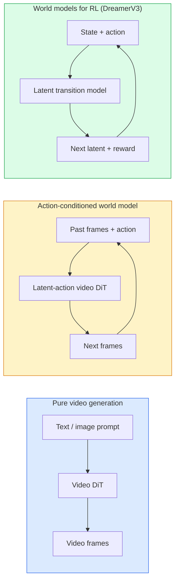

# 28 · 世界模型与视频扩散

> 一个能预测场景后续几秒画面的视频模型，本质上就是一个世界模拟器。如果让这种预测以「动作」为条件，你就得到了一个学习而来的游戏引擎。

**类型：** 学习 + 构建
**语言：** Python
**前置：** 第 4 阶段第 10 课（扩散模型）、第 4 阶段第 12 课（视频理解）、第 4 阶段第 23 课（DiT + 整流流）
**时长：** 约 75 分钟

## 学习目标

- 解释纯视频生成模型（Sora 2）与动作条件世界模型（Genie 3、DreamerV3）之间的区别
- 描述视频 DiT：时空 patch、3D 位置编码、跨 (T, H, W) token 的联合注意力
- 梳理世界模型如何接入机器人系统：视觉语言模型（VLM）规划 → 视频模型模拟 → 逆动力学输出动作
- 针对给定用例（创意视频、交互式模拟、自动驾驶合成），在 Sora 2、Genie 3、Runway GWM-1 Worlds、Wan-Video 和 HunyuanVideo 之间做出选择

## 问题所在

视频生成与世界建模在 2026 年走向了融合。一个能够生成连贯一分钟视频的模型，从某种意义上说已经学会了世界如何运动：物体恒存性、重力、因果关系、风格。如果让这种预测以「动作」（向左走、开门）为条件，视频模型就变成了一个可学习的模拟器，可以取代游戏引擎、驾驶模拟器或机器人环境。

其意义是具体而切实的。Genie 3 能从单张图像生成可游玩的环境。Runway GWM-1 Worlds 能合成可无限探索的场景。Sora 2 能生成长达一分钟、带同步音频且建模了物理规律的视频。NVIDIA Cosmos-Drive、Wayve Gaia-2 和 Tesla DrivingWorld 能为自动驾驶训练生成逼真的驾驶视频数据。世界模型范式正悄然接管机器人领域的「仿真到现实」（sim-to-real）流程。

本课是第 4 阶段的「全局视野」课。它将图像生成、视频理解与智能体推理串联起来，构成主流研究正在迈向的那种架构模式。

## 核心概念

### 世界建模的三大流派



- **Sora 2** 是以提示词为条件的纯视频生成。没有动作接口。你无法在生成过程（rollout）中途对它进行「操控」。
- **Genie 3**、**GWM-1 Worlds**、**Mirage / Magica** 是动作条件世界模型。它们从观察到的视频中推断「潜在动作」（latent action），然后以动作为条件来预测未来帧。这类模型是交互式的——你按下按键或移动摄像机，场景会随之响应。
- **DreamerV3** 以及经典的强化学习（RL）世界模型家族在潜空间中进行预测，带有显式的动作条件，并基于奖励信号训练。它们的视觉性较弱，但更适用于样本高效的强化学习。

### 视频 DiT 架构

```
Video latent:          (C, T, H, W)
Patchify (spatial):    grid of P_h x P_w patches per frame
Patchify (temporal):   group P_t frames into a temporal patch
Resulting tokens:      (T / P_t) * (H / P_h) * (W / P_w) tokens
```

位置编码是 3D 的：为每个 (t, h, w) 坐标分配一个旋转式或可学习的嵌入。注意力可以是：

- **完全联合（Full joint）**——所有 token 互相关注。在 N 个 token 上为 O(N^2) 复杂度。对长视频而言开销难以承受。
- **分离式（Divided）**——交替进行时间注意力（同一空间位置、跨时间：`(H*W) * T^2`）和空间注意力（同一时间步、跨空间：`T * (H*W)^2`）。被 TimeSformer 和大多数视频 DiT 采用。
- **窗口式（Window）**——在 (t, h, w) 上划分局部窗口。被 Video Swin 采用。

2026 年的每个视频扩散模型都采用了这三种模式之一，再加上 AdaLN 条件化（第 23 课）和整流流（rectified flow）。

### 以动作为条件：潜在动作模型

Genie 为每一帧学习一个**潜在动作（latent action）**，方法是判别式地预测一对连续帧之间发生的动作。随后，模型的解码器以推断出的潜在动作为条件——而不是以显式的键盘按键为条件。在推理时，用户可以指定一个潜在动作（或从一个新的先验分布中采样一个），模型便会生成与该动作一致的下一帧。

Sora 完全跳过了动作接口。它的解码器从过去的时空 token 预测下一个时空 token。提示词只决定开头，生成过程中途没有任何东西能操控它。

### 物理合理性

Sora 2 在 2026 年发布时明确宣传了**物理合理性（physical plausibility）**：重量、平衡、物体恒存性、因果关系。该团队通过人工评定的合理性分数来衡量；相比 Sora 1，模型在物体下落、角色碰撞以及「故意失败」（如一次没跳过去的跳跃）等场景上有明显改善。

合理性仍然是首要的失败模式。2024 至 2025 年那些人物吃意大利面或用玻璃杯喝水的视频，暴露了模型缺乏持久的物体表征。2026 年的模型（Sora 2、Runway Gen-5、HunyuanVideo）减少了但并未消除这些问题。

### 自动驾驶世界模型

驾驶世界模型以轨迹、边界框或导航地图为条件，生成逼真的道路场景。用途：

- **Cosmos-Drive-Dreams**（NVIDIA）——为强化学习训练生成数分钟的驾驶视频。
- **Gaia-2**（Wayve）——以轨迹为条件的场景合成，用于策略评估。
- **DrivingWorld**（Tesla）——模拟多样的天气、时段和交通状况。
- **Vista**（字节跳动）——响应式的驾驶场景合成。

它们替代了针对极端情况（corner case）的昂贵真实世界数据采集——夜间行人乱穿马路、结冰的路口、罕见的车型——这些场景原本需要数百万英里的实际驾驶才能采集到。

### 机器人技术栈：VLM + 视频模型 + 逆动力学

正在成型的三组件机器人闭环：

1. **VLM** 解析目标（「拿起红色杯子」），规划出一个高层动作序列。
2. **视频生成模型** 模拟执行每个动作会呈现的画面——预测未来 N 帧的观察结果。
3. **逆动力学模型（inverse dynamics model）** 提取出能够产生这些观察结果的具体电机指令。

这套方案取代了奖励塑形（reward shaping）和样本消耗巨大的强化学习。世界模型负责「想象」，逆动力学模型则在执行端闭合回路。Genie Envisioner 就是其中一种实现；许多研究团队都在收敛到这一结构。

### 评估

- **视觉质量**——FVD（Fréchet Video Distance，弗雷歇视频距离）、用户研究。
- **提示对齐度**——逐帧 CLIPScore、VQA 式评估。
- **物理合理性**——在基准测试套件上人工评定（Sora 2 的内部基准、VBench）。
- **可控性**（针对交互式世界模型）——动作 → 观察的一致性；你能否回到之前的某个状态？

### 2026 年的模型格局

| 模型 | 用途 | 参数量 | 输出 | 许可 |
|-------|-----|------------|--------|---------|
| Sora 2 | 文本生成视频、音频 | — | 1 分钟 1080p + 音频 | 仅 API |
| Runway Gen-5 | 文本/图像生成视频 | — | 10 秒片段 | API |
| Runway GWM-1 Worlds | 交互式世界 | — | 无限 3D rollout | API |
| Genie 3 | 从图像生成交互式世界 | 11B+ | 可游玩帧 | 研究预览 |
| Wan-Video 2.1 | 开源文本生成视频 | 14B | 高质量片段 | 非商用 |
| HunyuanVideo | 开源文本生成视频 | 13B | 10 秒片段 | 宽松许可 |
| Cosmos / Cosmos-Drive | 自动驾驶仿真 | 7-14B | 驾驶场景 | NVIDIA 开放 |
| Magica / Mirage 2 | AI 原生游戏引擎 | — | 可修改的世界 | 产品 |

## 动手构建

### 第 1 步：为视频做 3D patchify

```python
import torch
import torch.nn as nn


class VideoPatch3D(nn.Module):
    def __init__(self, in_channels=4, dim=64, patch_t=2, patch_h=2, patch_w=2):
        super().__init__()
        self.proj = nn.Conv3d(
            in_channels, dim,
            kernel_size=(patch_t, patch_h, patch_w),
            stride=(patch_t, patch_h, patch_w),
        )
        self.patch_t = patch_t
        self.patch_h = patch_h
        self.patch_w = patch_w

    def forward(self, x):
        # x: (N, C, T, H, W)
        x = self.proj(x)
        n, c, t, h, w = x.shape
        tokens = x.reshape(n, c, t * h * w).transpose(1, 2)
        return tokens, (t, h, w)
```

一个步长（stride）等于核大小的 3D 卷积起到了时空 patch 切分器的作用。`(T, H, W) -> (T/2, H/2, W/2)` 的 token 网格。

### 第 2 步：3D 旋转位置编码

旋转位置编码（RoPE，Rotary Position Embeddings）沿 `t`、`h`、`w` 三个轴分别应用：

```python
def rope_3d(tokens, t_dim, h_dim, w_dim, grid):
    """
    tokens: (N, T*H*W, D)
    grid: (T, H, W) sizes
    t_dim + h_dim + w_dim == D
    """
    T, H, W = grid
    n, seq, d = tokens.shape
    if t_dim + h_dim + w_dim != d:
        raise ValueError(f"t_dim+h_dim+w_dim ({t_dim}+{h_dim}+{w_dim}) must equal D={d}")
    assert seq == T * H * W
    t_idx = torch.arange(T, device=tokens.device).repeat_interleave(H * W)
    h_idx = torch.arange(H, device=tokens.device).repeat_interleave(W).repeat(T)
    w_idx = torch.arange(W, device=tokens.device).repeat(T * H)
    # 简化版：仅按频率对各通道进行缩放。真正的 RoPE 会对成对通道做旋转。
    freqs_t = torch.exp(-torch.log(torch.tensor(10000.0)) * torch.arange(t_dim // 2, device=tokens.device) / (t_dim // 2))
    freqs_h = torch.exp(-torch.log(torch.tensor(10000.0)) * torch.arange(h_dim // 2, device=tokens.device) / (h_dim // 2))
    freqs_w = torch.exp(-torch.log(torch.tensor(10000.0)) * torch.arange(w_dim // 2, device=tokens.device) / (w_dim // 2))
    emb_t = torch.cat([torch.sin(t_idx[:, None] * freqs_t), torch.cos(t_idx[:, None] * freqs_t)], dim=-1)
    emb_h = torch.cat([torch.sin(h_idx[:, None] * freqs_h), torch.cos(h_idx[:, None] * freqs_h)], dim=-1)
    emb_w = torch.cat([torch.sin(w_idx[:, None] * freqs_w), torch.cos(w_idx[:, None] * freqs_w)], dim=-1)
    return tokens + torch.cat([emb_t, emb_h, emb_w], dim=-1)
```

这是简化的加性形式。真正的 RoPE 会按频率对成对通道做旋转；但其携带的位置信息是一致的。

### 第 3 步：分离式注意力块

```python
class DividedAttentionBlock(nn.Module):
    def __init__(self, dim=64, heads=2):
        super().__init__()
        self.time_attn = nn.MultiheadAttention(dim, heads, batch_first=True)
        self.space_attn = nn.MultiheadAttention(dim, heads, batch_first=True)
        self.ln1 = nn.LayerNorm(dim)
        self.ln2 = nn.LayerNorm(dim)
        self.ln3 = nn.LayerNorm(dim)
        self.mlp = nn.Sequential(nn.Linear(dim, 4 * dim), nn.GELU(), nn.Linear(4 * dim, dim))

    def forward(self, x, grid):
        T, H, W = grid
        n, seq, d = x.shape
        # 时间注意力：固定 (h, w)，跨 t
        xt = x.view(n, T, H * W, d).permute(0, 2, 1, 3).reshape(n * H * W, T, d)
        a, _ = self.time_attn(self.ln1(xt), self.ln1(xt), self.ln1(xt), need_weights=False)
        xt = (xt + a).reshape(n, H * W, T, d).permute(0, 2, 1, 3).reshape(n, seq, d)
        # 空间注意力：固定 t，跨 (h, w)
        xs = xt.view(n, T, H * W, d).reshape(n * T, H * W, d)
        a, _ = self.space_attn(self.ln2(xs), self.ln2(xs), self.ln2(xs), need_weights=False)
        xs = (xs + a).reshape(n, T, H * W, d).reshape(n, seq, d)
        xs = xs + self.mlp(self.ln3(xs))
        return xs
```

时间注意力在每个空间位置内部跨时间进行关注；空间注意力在每一帧内部跨位置进行关注。用两次 O(T^2 + (HW)^2) 操作取代了一次 O((THW)^2) 操作。这正是 TimeSformer 以及每个现代视频 DiT 的核心。

### 第 4 步：组装一个微型视频 DiT

```python
class TinyVideoDiT(nn.Module):
    def __init__(self, in_channels=4, dim=64, depth=2, heads=2):
        super().__init__()
        self.patch = VideoPatch3D(in_channels=in_channels, dim=dim, patch_t=2, patch_h=2, patch_w=2)
        self.blocks = nn.ModuleList([DividedAttentionBlock(dim, heads) for _ in range(depth)])
        self.out = nn.Linear(dim, in_channels * 2 * 2 * 2)

    def forward(self, x):
        tokens, grid = self.patch(x)
        for blk in self.blocks:
            tokens = blk(tokens, grid)
        return self.out(tokens), grid
```

这不是一个能实际工作的视频生成器，而是一个结构性演示——展示每个组件都能正确地处理张量形状。

### 第 5 步：检查张量形状

```python
vid = torch.randn(1, 4, 8, 16, 16)  # (N, C, T, H, W)
model = TinyVideoDiT()
out, grid = model(vid)
print(f"input  {tuple(vid.shape)}")
print(f"tokens grid {grid}")
print(f"output {tuple(out.shape)}")
```

切分 patch 后，预期 `grid = (4, 8, 8)`、`out = (1, 256, 32)`；随后输出头将其投影为每个 token 对应的时空 patch，可以再被反 patch 化（un-patchify）还原成视频。

## 实际应用

2026 年的生产环境接入方式：

- **Sora 2 API**（OpenAI）——文本生成视频、同步音频。高端定价。
- **Runway Gen-5 / GWM-1**（Runway）——图像生成视频、交互式世界。
- **Wan-Video 2.1 / HunyuanVideo**——开源自托管。
- **Cosmos / Cosmos-Drive**（NVIDIA）——驾驶仿真，开放权重。
- **Genie 3**——研究预览，需申请访问权限。

要构建一个交互式世界模型 demo：先用 Wan-Video 保证质量，再叠加一个潜在动作适配器以实现交互性。要做自动驾驶仿真：Cosmos-Drive 是 2026 年的开源参考方案。

机器人领域实际运行中的技术栈：

1. 语言目标 -> VLM（Qwen3-VL）-> 高层规划。
2. 规划 -> 潜在动作视频模型 -> 想象出的 rollout。
3. Rollout -> 逆动力学模型 -> 底层动作。
4. 执行动作 -> 观察结果反馈回第 1 步。

## 交付成果

本课产出：

- `outputs/prompt-video-model-picker.md`——根据任务、许可和延迟要求，在 Sora 2 / Runway / Wan / HunyuanVideo / Cosmos 之间做出选择。
- `outputs/skill-physical-plausibility-checks.md`——一个技能（skill），定义了一组自动化检查（物体恒存性、重力、连续性），在交付任何生成视频之前运行。

## 练习

1. **（简单）** 在 patch-t=2、patch-h=8、patch-w=8 的设置下，计算一段 5 秒 360p 视频的 token 数量。推理在此规模下注意力所需的内存。
2. **（中等）** 把上面的分离式注意力块换成完全联合注意力块，测量其张量形状和参数量。解释为什么真实视频模型必须使用分离式注意力。
3. **（困难）** 构建一个最小的潜在动作视频模型：取一组 (frame_t, action_t, frame_{t+1}) 三元组数据集（任意简单的 2D 游戏即可），训练一个以动作嵌入为条件的微型视频 DiT，并展示不同动作会产生不同的下一帧。

## 关键术语

| 术语 | 人们怎么说 | 实际含义 |
|------|----------------|----------------------|
| 世界模型（World model） | 「学习而来的模拟器」 | 给定状态和动作即可预测未来观察结果的模型 |
| 视频 DiT（Video DiT） | 「时空 Transformer」 | 带有 3D patch 切分和分离式注意力的扩散 Transformer |
| 潜在动作（Latent action） | 「推断出的控制」 | 从帧对中推断出的离散或连续动作潜变量；用于对下一帧生成进行条件化 |
| 分离式注意力（Divided attention） | 「先时间后空间」 | 每个块内做两次注意力操作——先跨时间再跨空间——以将 O(N^2) 控制在可承受范围内 |
| 物体恒存性（Object permanence） | 「东西始终是真实存在的」 | 视频模型必须学会的场景属性；在食物、玻璃器皿上是经典的失败模式 |
| FVD | 「Fréchet Video Distance」 | 视频版的 FID；首要的视觉质量指标 |
| 逆动力学模型（Inverse dynamics model） | 「从观察反推动作」 | 给定 (状态, 下一状态)，输出连接二者的动作；闭合机器人回路 |
| Cosmos-Drive | 「NVIDIA 驾驶仿真」 | 用于强化学习和评估的开放权重自动驾驶世界模型 |

## 延伸阅读

- [Sora 技术报告（OpenAI）](https://openai.com/index/video-generation-models-as-world-simulators/)
- [Genie: Generative Interactive Environments（Bruce 等，2024）](https://arxiv.org/abs/2402.15391) —— 潜在动作世界模型
- [TimeSformer（Bertasius 等，2021）](https://arxiv.org/abs/2102.05095) —— 用于视频 Transformer 的分离式注意力
- [DreamerV3（Hafner 等，2023）](https://arxiv.org/abs/2301.04104) —— 用于强化学习的世界模型
- [Cosmos-Drive-Dreams（NVIDIA，2025）](https://research.nvidia.com/labs/toronto-ai/cosmos-drive-dreams/) —— 驾驶世界模型
- [2026 年十大视频生成模型（DataCamp）](https://www.datacamp.com/blog/top-video-generation-models)
- [From Video Generation to World Model —— 综述仓库](https://github.com/ziqihuangg/Awesome-From-Video-Generation-to-World-Model/)
