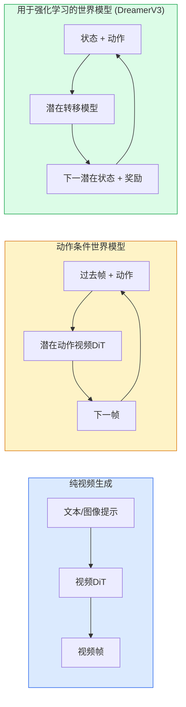

# 世界模型（World Models）与视频扩散（Video Diffusion）

> 一个能够预测场景未来几秒的视频模型就是一个世界模拟器（World Simulator）。若将该预测以动作为条件进行约束，你就得到了一个可学习的游戏引擎（Learned Game Engine）。

**类型：** 学习 + 构建  
**语言：** Python  
**前置知识：** 第四阶段第10课（扩散模型）、第四阶段第12课（视频理解）、第四阶段第23课（DiT + 整流流 Rectified Flow）  
**时间：** 约75分钟

## 学习目标

- 解释纯视频生成模型（Sora 2）与动作条件世界模型（Genie 3、DreamerV3）之间的区别
- 描述视频DiT（Video DiT）：时空块（spatio-temporal patches）、3D位置编码、跨（T, H, W）令牌的联合注意力（joint attention）
- 追踪世界模型如何接入机器人学：VLM 规划 → 视频模型模拟 → 逆动力学（Inverse Dynamics）输出动作
- 针对特定用例（创意视频、交互式模拟、自动驾驶合成）在 Sora 2、Genie 3、Runway GWM-1 Worlds、Wan-Video、HunyuanVideo 之间做出选择

## 问题

2026年，视频生成与世界模型合二为一。一个能够生成连贯一分钟视频的模型，在某种意义上已经学会了世界如何运动：物体恒存性（Object Permanence）、重力、因果性、风格。如果你以动作（向左走、开门）作为该预测的条件，视频模型就变成了一个可学习的模拟器，可以取代游戏引擎、驾驶模拟器或机器人环境。

这一点非常具体且实际。Genie 3 能从单张图像生成可交互的环境。Runway GWM-1 Worlds 能合成无限可探索的场景。Sora 2 能生成带同步音频和模拟物理的一分钟长视频。NVIDIA Cosmos-Drive、Wayve Gaia-2、Tesla DrivingWorld 能生成为自动驾驶训练数据所需的逼真驾驶视频。世界模型范式正在悄然接管机器人学中的仿真到现实（Sim-to-Real）。

本课是第四阶段的“大局观”课程，它将图像生成、视频理解和智能体推理（Agentic Reasoning）连接成主流研究正在趋近的架构模式。

## 概念

### 三种世界模型系列



- **Sora 2** 是以提示为条件的纯视频生成，没有动作接口。你无法在生成过程中“操控”它。
- **Genie 3**、**GWM-1 Worlds**、**Mirage / Magica** 是动作条件世界模型。它们从观察到的视频中推断潜在动作（Latent Actions），然后根据动作条件来预测未来帧。它们是交互式的——你按动按键或移动摄像机，场景就会做出响应。
- **DreamerV3** 和经典的强化学习世界模型系列在潜在空间中用显式动作条件进行预测，并基于奖励信号训练。视觉成分较少，但对样本高效强化学习（Sample-efficient RL）更有用。

### 视频DiT架构

```
视频潜在表示：          (C, T, H, W)
分块（空间）：         每帧按 P_h x P_w 网格分块
分块（时间）：         将 P_t 帧组合成一个时间块
结果令牌数：           (T / P_t) * (H / P_h) * (W / P_w) 个令牌
```

位置编码是3D的：每个 (t, h, w) 坐标使用旋转位置编码或可学习嵌入。注意力机制可以是：

- **全联合（Full joint）**——所有令牌相互注意，复杂度 O(N^2)（N 为令牌数）。长视频中不可行。
- **分治（Divided）**——交替进行时间注意力（同一空间位置，跨时间：`(H*W) * T^2`）和空间注意力（同一时间步，跨空间：`T * (H*W)^2`）。TimeSformer 和大多数视频DiT使用此方式。
- **窗口（Window）**——在 (t, h, w) 中使用局部窗口。Video Swin 使用此方式。

2026年每个视频扩散模型都使用这三种模式之一，并配合 AdaLN 条件（第23课）和整流流（Rectified Flow）。

### 以动作为条件：潜在动作模型（Latent Action Models）

Genie 通过判别式预测连续两帧之间的动作，为每帧学习一个**潜在动作**。然后解码器根据推断出的潜在动作进行条件约束——而不是依赖明确的键盘按键。推理时，用户可以指定一个潜在动作（或从新的先验中采样），模型就会生成与该动作一致的下一帧。

Sora 则完全跳过了动作接口。其解码器根据过去的时空令牌预测未来的时空令牌。提示条件只影响起始，生成过程中没有任何操控。

### 物理合理性（Physical Plausibility）

Sora 2 在2026年发布时明确宣传了**物理合理性**：重量、平衡、物体恒存性、因果性。该团队通过人工评分的合理性分数来衡量；与 Sora 1 相比，该模型在物体掉落、角色碰撞以及刻意失败（如未跳过的跳跃）上明显改进。

合理性仍然是主要的失败模式。2024-2025年人们吃意大利面或从玻璃杯喝水的视频暴露了模型缺乏持久的物体表征。2026年的模型（Sora 2、Runway Gen-5、HunyuanVideo）减少了这些错误，但并未完全消除。

### 自动驾驶世界模型

驾驶世界模型以轨迹、边界框或导航地图为条件，生成逼真的道路场景。用途包括：

- **Cosmos-Drive-Dreams**（NVIDIA）——为强化学习训练生成数分钟的驾驶视频。
- **Gaia-2**（Wayve）——用于策略评估的轨迹条件场景合成。
- **DrivingWorld**（Tesla）——模拟不同天气、时段、交通状况。
- **Vista**（字节跳动）——反应式驾驶场景合成。

它们替代了昂贵的真实世界数据收集，用于处理角落情况——夜间行人乱穿马路、结冰路口、不常见车型——否则需要数百万英里的驾驶数据。

### 机器人学栈：VLM + 视频模型 + 逆动力学（Inverse Dynamics）

新兴的三组件机器人循环：

1. **VLM** 解析目标（“拿起红色杯子”），规划高层次动作序列。
2. **视频生成模型** 模拟执行每个动作会看到的画面——预测 N 帧后的观测。
3. **逆动力学模型** 提取产生这些观测的具体电机指令。

这取代了奖励塑造（Reward Shaping）和样本密集的强化学习。世界模型负责想象，逆动力学负责闭环执行。Genie Envisioner 是其中一个实例；许多研究团队正在趋同于这一结构。

### 评估

- **视觉质量**——FVD（弗雷歇视频距离 Fréchet Video Distance）、用户研究。
- **提示对齐**——每帧的 CLIPScore、VQA 风格评估。
- **物理合理性**——在基准套件上人工评分（Sora 2 的内部基准、VBench）。
- **可控性**（针对交互式世界模型）——动作 → 观测一致性；能否回到之前的状态？

### 2026年模型格局

| 模型 | 用途 | 参数量 | 输出 | 许可证 |
|------|------|--------|------|--------|
| Sora 2 | 文本到视频，音频 | — | 1分钟 1080p + 音频 | 仅 API |
| Runway Gen-5 | 文本/图像到视频 | — | 10秒片段 | API |
| Runway GWM-1 Worlds | 交互式世界 | — | 无限3D展开 | API |
| Genie 3 | 从图像生成交互式世界 | 11B+ | 可玩的帧 | 研究预览 |
| Wan-Video 2.1 | 开源文本到视频 | 14B | 高质量片段 | 非商业 |
| HunyuanVideo | 开源文本到视频 | 13B | 10秒片段 | 宽松许可 |
| Cosmos / Cosmos-Drive | 自动驾驶仿真 | 7-14B | 驾驶场景 | NVIDIA 开放 |
| Magica / Mirage 2 | AI原生游戏引擎 | — | 可修改的世界 | 产品 |

## 动手构建

### 第一步：视频的3D分块

```python
import torch
import torch.nn as nn


class VideoPatch3D(nn.Module):
    def __init__(self, in_channels=4, dim=64, patch_t=2, patch_h=2, patch_w=2):
        super().__init__()
        self.proj = nn.Conv3d(
            in_channels, dim,
            kernel_size=(patch_t, patch_h, patch_w),
            stride=(patch_t, patch_h, patch_w),
        )
        self.patch_t = patch_t
        self.patch_h = patch_h
        self.patch_w = patch_w

    def forward(self, x):
        # x: (N, C, T, H, W)
        x = self.proj(x)
        n, c, t, h, w = x.shape
        tokens = x.reshape(n, c, t * h * w).transpose(1, 2)
        return tokens, (t, h, w)
```

一个步长等于核大小的3D卷积，充当时空分块器。将 `(T, H, W)` 转换为 `(T/2, H/2, W/2)` 的令牌网格。

### 第二步：3D旋转位置编码

分别沿 `t`、`h`、`w` 轴应用旋转位置嵌入（RoPE）：

```python
def rope_3d(tokens, t_dim, h_dim, w_dim, grid):
    """
    tokens: (N, T*H*W, D)
    grid: (T, H, W) 大小
    t_dim + h_dim + w_dim == D
    """
    T, H, W = grid
    n, seq, d = tokens.shape
    if t_dim + h_dim + w_dim != d:
        raise ValueError(f"t_dim+h_dim+w_dim ({t_dim}+{h_dim}+{w_dim}) 必须等于 D={d}")
    assert seq == T * H * W
    t_idx = torch.arange(T, device=tokens.device).repeat_interleave(H * W)
    h_idx = torch.arange(H, device=tokens.device).repeat_interleave(W).repeat(T)
    w_idx = torch.arange(W, device=tokens.device).repeat(T * H)
    # 简化：仅按频率缩放通道。真实的 RoPE 旋转成对通道。
    freqs_t = torch.exp(-torch.log(torch.tensor(10000.0)) * torch.arange(t_dim // 2, device=tokens.device) / (t_dim // 2))
    freqs_h = torch.exp(-torch.log(torch.tensor(10000.0)) * torch.arange(h_dim // 2, device=tokens.device) / (h_dim // 2))
    freqs_w = torch.exp(-torch.log(torch.tensor(10000.0)) * torch.arange(w_dim // 2, device=tokens.device) / (w_dim // 2))
    emb_t = torch.cat([torch.sin(t_idx[:, None] * freqs_t), torch.cos(t_idx[:, None] * freqs_t)], dim=-1)
    emb_h = torch.cat([torch.sin(h_idx[:, None] * freqs_h), torch.cos(h_idx[:, None] * freqs_h)], dim=-1)
    emb_w = torch.cat([torch.sin(w_idx[:, None] * freqs_w), torch.cos(w_idx[:, None] * freqs_w)], dim=-1)
    return tokens + torch.cat([emb_t, emb_h, emb_w], dim=-1)
```

简化的加法形式。真实的RoPE会在不同频率下旋转成对通道；位置信息是相同的。

### 第三步：分治注意力块（Divided Attention Block）

```python
class DividedAttentionBlock(nn.Module):
    def __init__(self, dim=64, heads=2):
        super().__init__()
        self.time_attn = nn.MultiheadAttention(dim, heads, batch_first=True)
        self.space_attn = nn.MultiheadAttention(dim, heads, batch_first=True)
        self.ln1 = nn.LayerNorm(dim)
        self.ln2 = nn.LayerNorm(dim)
        self.ln3 = nn.LayerNorm(dim)
        self.mlp = nn.Sequential(nn.Linear(dim, 4 * dim), nn.GELU(), nn.Linear(4 * dim, dim))

    def forward(self, x, grid):
        T, H, W = grid
        n, seq, d = x.shape
        # 时间注意力：相同 (h, w)，跨 t
        xt = x.view(n, T, H * W, d).permute(0, 2, 1, 3).reshape(n * H * W, T, d)
        a, _ = self.time_attn(self.ln1(xt), self.ln1(xt), self.ln1(xt), need_weights=False)
        xt = (xt + a).reshape(n, H * W, T, d).permute(0, 2, 1, 3).reshape(n, seq, d)
        # 空间注意力：相同 t，跨 (h, w)
        xs = xt.view(n, T, H * W, d).reshape(n * T, H * W, d)
        a, _ = self.space_attn(self.ln2(xs), self.ln2(xs), self.ln2(xs), need_weights=False)
        xs = (xs + a).reshape(n, T, H * W, d).reshape(n, seq, d)
        xs = xs + self.mlp(self.ln3(xs))
        return xs
```

时间注意力在每个空间位置内跨时间进行；空间注意力在每个帧内跨位置进行。两个 O(T^2 + (HW)^2) 操作，而不是一个 O((THW)^2) 操作。这是 TimeSformer 和所有现代视频DiT的核心。

### 第四步：组成一个小型视频DiT

```python
class TinyVideoDiT(nn.Module):
    def __init__(self, in_channels=4, dim=64, depth=2, heads=2):
        super().__init__()
        self.patch = VideoPatch3D(in_channels=in_channels, dim=dim, patch_t=2, patch_h=2, patch_w=2)
        self.blocks = nn.ModuleList([DividedAttentionBlock(dim, heads) for _ in range(depth)])
        self.out = nn.Linear(dim, in_channels * 2 * 2 * 2)

    def forward(self, x):
        tokens, grid = self.patch(x)
        for blk in self.blocks:
            tokens = blk(tokens, grid)
        return self.out(tokens), grid
```

这不是一个可运行的视频生成器，而是一个结构演示，展示每个组件形状正确。

### 第五步：检查形状

```python
vid = torch.randn(1, 4, 8, 16, 16)  # (N, C, T, H, W)
model = TinyVideoDiT()
out, grid = model(vid)
print(f"输入  {tuple(vid.shape)}")
print(f"令牌网格 {grid}")
print(f"输出 {tuple(out.shape)}")
```

预期 `grid = (4, 8, 8)` 且在分块后 `out = (1, 256, 32)`；然后输出头会投射出每个令牌的时空块，准备被反分块（Un-patchified）回视频。

## 使用它

2026年的生产访问模式：

- **Sora 2 API**（OpenAI）——文本到视频，同步音频。高级定价。
- **Runway Gen-5 / GWM-1**（Runway）——图像到视频，交互式世界。
- **Wan-Video 2.1 / HunyuanVideo**——开源自托管。
- **