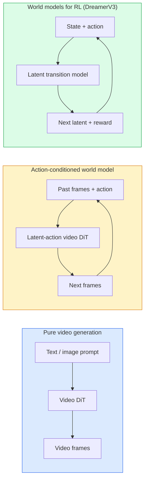

# World Models & Video Diffusion

> 预测场景下一秒的视频模型是世界模拟器。条件是对动作的预测，并且您拥有一个学习过的游戏引擎。

** 类型：** 学习+构建
** 语言：** Python
** 先决条件：** 第4阶段第10课（扩散）、第4阶段第12课（视频理解）、第4阶段第23课（DiT +纠正流）
** 时间：** ~75分钟

## Learning Objectives

- 解释纯视频生成模型（Sora 2）和动作条件世界模型（Genie 3、DreamerV3）之间的区别
- 描述视频DiT：时空补丁、3D位置编码、跨（T、H、W）标记的联合注意力
- 追踪世界模型如何融入机器人：VLM计划-视频模型模拟-逆动力学发出动作
- 针对特定用例（创意视频、交互式模拟、危险驾驶合成）在Sora 2、Genie 3、Runway GWM-1 Worlds、Wan-Video和Hunyuan Video之间进行选择

## The Problem

视频生成和世界建模将于2026年融合。从某种意义上说，一个可以生成一分钟连贯视频的模型已经了解了世界如何运动：物体永久性、重力、因果关系、风格。如果您以动作（向左转、开门）为条件，视频模型将成为可学习的模拟器，可以取代游戏引擎、驾驶模拟器或机器人环境。

赌注是具体的。Genie 3从单个图像生成可玩环境。跑道GWM-1世界综合了无限可探索的场景。Sora 2会制作一分钟长的视频，其中包含同步音频和建模物理。NVIDIA Cosmos-Drive、Wayve Gaia-2和Tesla DrivingWorld为危险车辆训练数据生成真实的驾驶视频。世界模式范式正在悄然接管机器人技术的“从简单到真实”。

本课是第4阶段的“大局”课。它将图像生成、视频理解和代理推理连接到主导研究正在走向的建筑模式中。

## The Concept

### Three families of world-modelling



- **Sora 2** 是以提示为条件的纯视频生成。无操作界面。你不能“操纵”它的中途推出。
- **Genie 3**、**GWM-1 Worlds**、**Mirage / Magica** 都是动作限定的世界模型。从观察到的视频中推断潜在的动作，然后根据动作来预测未来的帧。交互式-你按下键或移动相机和场景的反应。
- ** DreamerV 3 ** 和经典的RL世界模型家族通过显式动作条件反射在潜在空间中进行预测，并在奖励信号上进行训练。视觉效果较差;对于样本高效的RL更有用。

### Video DiT architecture

```
Video latent:          (C, T, H, W)
Patchify (spatial):    grid of P_h x P_w patches per frame
Patchify (temporal):   group P_t frames into a temporal patch
Resulting tokens:      (T / P_t) * (H / P_h) * (W / P_w) tokens
```

位置编码是3D的：每个（t，h，w）坐标的旋转或学习嵌入。注意力可以是：

- ** 完全联合 ** -所有代币都涉及所有代币。O（N2），具有N个令牌。禁止长视频。
- ** 分割 ** -交替的时间注意力（相同的空间位置，跨越时间：`（H*W）* T^2`）和空间注意力（相同的时间步长，跨越空间：`T *（H*W）^2`）。由TimeTransformer和大多数视频DiT使用。
- **Window** -（t，h，w）中的本地窗口。视频Swin

每个2026年视频扩散模型都使用这三种模式之一加上AdaLN条件反射（第23课）和纠正流。

### Conditioning on actions: latent action models

Genie通过区分性地预测一对连续帧之间的动作来学习每帧的 ** 潜在动作 **。然后，模型的解码器以推断出的潜在动作为条件，而不是以显式的键盘键为条件。在推理时，用户可以指定潜在动作（或从新的先前动作中采样一个），然后模型生成与该动作一致的下一帧。

Sora完全跳过了动作界面。它的解码器根据过去的时空令牌预测下一个时空令牌。迅速决定了开始的条件;没有什么能左右它的中期。

### Physical plausibility

Sora 2 2026年发布的明确宣传了 ** 物理可信性 **：重量、平衡、物体持久性、因果关系。由团队通过手工评定的可信度分数进行测量;与Sora 1相比，该模型在掉落物体、角色碰撞和故意故障（跳跃失误）方面有明显改善。

合理性仍然是主要的失败模式。2024-2025年人们吃意大利面或戴着眼镜喝水的视频揭示了该模型缺乏持久的对象表示。2026款型号（Sora 2、Runway Gen-5、Hunyuan Video）减少但不会消除这些。

### Autonomous driving world models

驾驶世界模型根据轨迹、边界框或导航地图生成逼真的道路场景。用途：

- **Cosmos-Drive-Dreams**（NVIDIA）-生成数分钟的驾驶视频用于RL训练。
- **Gaia-2**（Wayve）-用于政策评估的随机条件场景合成。
- **DrivingWorld**（特斯拉）-模拟不同的天气、一天中的时间、交通状况。
- **Vista**（字节跳动）-反应式驾驶场景合成。

它们取代了昂贵的现实世界数据收集，以应对拐角情况（夜间行人乱穿马路、结冰的十字路口、不寻常的车辆类型），否则这些情况需要数百万英里的驾驶。

### Robotics stack: VLM + video model + inverse dynamics

新兴的三组件机器人回路：

1. **VLM** 解析进球（“拿起红杯”），计划高级动作序列。
2. ** 视频生成模型 ** 模拟执行每个动作的样子-预测N帧前的观察结果。
3. ** 逆动力学模型 ** 提取产生这些观察结果的具体电机命令。

这取代了奖励整形和样本密集型RL。世界模型进行想象;反向动力学关闭了驱动的循环。精灵环境就是一个例子;许多研究小组正在趋同于这种结构。

### Evaluation

- ** 视觉质量 ** - FVD（Fréchet视频距离），用户研究。
- ** 提示对齐 ** -每帧CLIPScore，VQA式评估。
- ** 物理可信度 ** -在基准套件（Sora 2的内部基准，VBench）上手工评级。
- ** 可控制性 **（对于交互式世界模型）-动作→观察一致性;你能回到先前的状态吗？

### Model landscape in 2026

| 模型 | 使用 | 参数 | 输出 | 许可证 |
|-------|-----|------------|--------|---------|
| Sora 2 | 文本转视频、音频 | - | 1-最小1080 p+音频 | API仅 |
| 第五代跑道 | 文本/图像转视频 | - | 10秒剪辑 | API |
| 跑道GWM-1世界 | 互动世界 | - | 无限3D卷展 | API |
| 精灵3 | 来自图像的互动世界 | 11B+ | 可玩框架 | 研究预览 |
| Wan-Video 2.1 | 打开文本到视频 | 14B | 高质量剪辑 | 非商业 |
| 浑源视频 | 打开文本到视频 | 13B | 10秒剪辑 | 许可 |
| 宇宙/宇宙驱动器 | 自动驾驶SIM卡 | 7- 14 B | 驾驶场景 | 英伟达开放 |
| 魔法/幻影2 | 人工智能原生游戏引擎 | - | 可修改的世界 | 产品 |

## Build It

### Step 1: 3D patchify for video

```python
import torch
import torch.nn as nn


class VideoPatch3D(nn.Module):
    def __init__(self, in_channels=4, dim=64, patch_t=2, patch_h=2, patch_w=2):
        super().__init__()
        self.proj = nn.Conv3d(
            in_channels, dim,
            kernel_size=(patch_t, patch_h, patch_w),
            stride=(patch_t, patch_h, patch_w),
        )
        self.patch_t = patch_t
        self.patch_h = patch_h
        self.patch_w = patch_w

    def forward(self, x):
        # x: (N, C, T, H, W)
        x = self.proj(x)
        n, c, t, h, w = x.shape
        tokens = x.reshape(n, c, t * h * w).transpose(1, 2)
        return tokens, (t, h, w)
```

跨度等于核心的3D conv充当时空补丁器。'（T，H，W）->（T/2，H/2，W/2）'代币网格。

### Step 2: 3D rotary position encoding

旋转位置嵌入（RoPE）分别沿着“t”、“h”、“w”轴应用：

```python
def rope_3d(tokens, t_dim, h_dim, w_dim, grid):
    """
    tokens: (N, T*H*W, D)
    grid: (T, H, W) sizes
    t_dim + h_dim + w_dim == D
    """
    T, H, W = grid
    n, seq, d = tokens.shape
    if t_dim + h_dim + w_dim != d:
        raise ValueError(f"t_dim+h_dim+w_dim ({t_dim}+{h_dim}+{w_dim}) must equal D={d}")
    assert seq == T * H * W
    t_idx = torch.arange(T, device=tokens.device).repeat_interleave(H * W)
    h_idx = torch.arange(H, device=tokens.device).repeat_interleave(W).repeat(T)
    w_idx = torch.arange(W, device=tokens.device).repeat(T * H)
    # Simplified: just scale channels by frequencies. Real RoPE rotates pairs.
    freqs_t = torch.exp(-torch.log(torch.tensor(10000.0)) * torch.arange(t_dim // 2, device=tokens.device) / (t_dim // 2))
    freqs_h = torch.exp(-torch.log(torch.tensor(10000.0)) * torch.arange(h_dim // 2, device=tokens.device) / (h_dim // 2))
    freqs_w = torch.exp(-torch.log(torch.tensor(10000.0)) * torch.arange(w_dim // 2, device=tokens.device) / (w_dim // 2))
    emb_t = torch.cat([torch.sin(t_idx[:, None] * freqs_t), torch.cos(t_idx[:, None] * freqs_t)], dim=-1)
    emb_h = torch.cat([torch.sin(h_idx[:, None] * freqs_h), torch.cos(h_idx[:, None] * freqs_h)], dim=-1)
    emb_w = torch.cat([torch.sin(w_idx[:, None] * freqs_w), torch.cos(w_idx[:, None] * freqs_w)], dim=-1)
    return tokens + torch.cat([emb_t, emb_h, emb_w], dim=-1)
```

简化的添加剂形式。Real RoPE以频率旋转成对的通道;位置信息是相同的。

### Step 3: Divided attention block

```python
class DividedAttentionBlock(nn.Module):
    def __init__(self, dim=64, heads=2):
        super().__init__()
        self.time_attn = nn.MultiheadAttention(dim, heads, batch_first=True)
        self.space_attn = nn.MultiheadAttention(dim, heads, batch_first=True)
        self.ln1 = nn.LayerNorm(dim)
        self.ln2 = nn.LayerNorm(dim)
        self.ln3 = nn.LayerNorm(dim)
        self.mlp = nn.Sequential(nn.Linear(dim, 4 * dim), nn.GELU(), nn.Linear(4 * dim, dim))

    def forward(self, x, grid):
        T, H, W = grid
        n, seq, d = x.shape
        # time attention: same (h, w), across t
        xt = x.view(n, T, H * W, d).permute(0, 2, 1, 3).reshape(n * H * W, T, d)
        a, _ = self.time_attn(self.ln1(xt), self.ln1(xt), self.ln1(xt), need_weights=False)
        xt = (xt + a).reshape(n, H * W, T, d).permute(0, 2, 1, 3).reshape(n, seq, d)
        # space attention: same t, across (h, w)
        xs = xt.view(n, T, H * W, d).reshape(n * T, H * W, d)
        a, _ = self.space_attn(self.ln2(xs), self.ln2(xs), self.ln2(xs), need_weights=False)
        xs = (xs + a).reshape(n, T, H * W, d).reshape(n, seq, d)
        xs = xs + self.mlp(self.ln3(xs))
        return xs
```

时间注意力在时间上出现在每个空间位置上;空间注意力在每个位置上出现在每个帧内。两个O（T ' 2+（HW）' 2）操作，而不是一个O（THW）' 2）。这是TimeScer和所有现代视频DiT的核心。

### Step 4: Compose a tiny video DiT

```python
class TinyVideoDiT(nn.Module):
    def __init__(self, in_channels=4, dim=64, depth=2, heads=2):
        super().__init__()
        self.patch = VideoPatch3D(in_channels=in_channels, dim=dim, patch_t=2, patch_h=2, patch_w=2)
        self.blocks = nn.ModuleList([DividedAttentionBlock(dim, heads) for _ in range(depth)])
        self.out = nn.Linear(dim, in_channels * 2 * 2 * 2)

    def forward(self, x):
        tokens, grid = self.patch(x)
        for blk in self.blocks:
            tokens = blk(tokens, grid)
        return self.out(tokens), grid
```

不是一个可用的视频生成器;一个结构演示，每个部件都能正确成形。

### Step 5: Check shapes

```python
vid = torch.randn(1, 4, 8, 16, 16)  # (N, C, T, H, W)
model = TinyVideoDiT()
out, grid = model(vid)
print(f"input  {tuple(vid.shape)}")
print(f"tokens grid {grid}")
print(f"output {tuple(out.shape)}")
```

修补后预计会出现“grid =（4，8，8）”和“out =（1，256，32）”;然后头部投影到每个令牌的时空补丁，准备好重新修补成视频。

## Use It

2026年生产准入模式：

- **Sora 2 API**（OpenAI）-文本转视频，同步音频。溢价定价。
- **Runway Gen-5 / GWM-1**（Runway）-图像到视频的交互式世界。
- **Wan-Video 2.1 /Hunyuan Video ** -开源自主机。
- **Cosmos / Cosmos-Drive**（NVIDIA）-驾驶模拟开重。
- **Genie 3** -研究预览，请求访问。

对于构建一个交互式世界模型演示：从Wan-Video开始以获得质量，在潜在动作适配器上分层以获得交互性。对于自动驾驶模拟：Cosmos-Drive是2026年的开放参考。

对于机器人来说，野外的堆栈：

1. 语言目标-> VLM（Qwen 3-BL）->高水平计划。
2. 计划->潜伏视频模型->想象的推出。
3. 推出->逆动力学模型->低级动作。
4. 执行的操作->观察反馈到步骤1。

## Ship It

本课产生：

- '输出/prompt-video-model-picker.md '-在Sora 2 / Runway / Wan / HunyuanVideo / Cosmos给定任务、许可证和延迟之间进行选择。
- '输出/skill-physical-plausibility-checks.md '-一种技能，定义自动检查（物体持久性、重力、连续性），以便在运输之前对任何生成的视频运行。

## Exercises

1. **（简单）** 计算patch-t=2、patch-h=8、patch-w=8时5秒360 p视频的令牌计数。关于注意力如此大的记忆力的原因。
2. **（中）** 将上面的分开注意力块替换为完整的联合注意力块，并测量形状和参数计数。解释为什么真实视频模型需要分开注意力。
3. **（困难）** 构建最小潜伏动作视频模型：获取（Frame_t，action_t，Frame_{t+1}）三重组（任何简单的2D游戏）的数据集，训练一个以动作嵌入为条件的小视频DiT，并表明不同的动作会产生不同的下一帧。

## Key Terms

| Term | 别人怎么说 | 它实际上意味着什么 |
|------|----------------|----------------------|
| 世界模型 | “学习模拟器” | 在给定状态和动作的情况下预测未来观察的模型 |
| 视频DIT | “时空Transformer” | 具有3D补丁和分散注意力的扩散Transformer |
| 潜在行动 | “推断控制” | 从帧对推断出的离散或连续动作潜伏;用于调节下一帧的生成 |
| 分开注意力 | “时间然后空间” | 每个块进行两次注意力操作-跨时间然后跨空间-以保持O（N#2）可管理 |
| 物体恒存 | “事情保持真实” | 视频模型必须学习的场景属性;食物，玻璃器皿的经典故障模式 |
| FvD | “弗雷谢特视频距离” | 相当于DID的视频;主要视觉质量指标 |
| 逆动力学模型 | “对行动的意见” | 给定（状态，下一状态），输出连接它们的动作;关闭机器人循环 |
| 宇宙驱动器 | “英伟达驾驶模拟游戏” | 开放权重的危险驱动世界模型用于RL和评估 |

## Further Reading

- [Sora技术报告（OpenAI）]（https：//openai.com/index/video-generation-models-as-world-simulators/）
- [Genie：生成交互式环境（Bruce等人，2024）]（https：//arxiv.org/abs/2402.15391）-潜在动作世界模型
- [TimeSformer（Bertasius等人，2021）]（https：//arxiv.org/ab/2102.05095）-对视频变形金刚的关注分散
- [DreamerV 3（哈夫纳等人，2023）]（https：//arxiv.org/abs/2301.04104）-RL的世界模型
- [Cosmos-Drive-Dreams（NVIDIA，2025）]（https：//research.nvidia.com/labs/toronto-ai/Cosmos-drive-dreams/）-驾驶世界模型
- [Top 2026年10个视频生成模型（DataCamp）]（https：//www.guardianamp.com/blog/top-video-generation-models）
- [From视频生成到世界模型-调查报告]（https：//github.com/ziqihuang/Awesome-From-Video-Generation-to-World-Model/）
