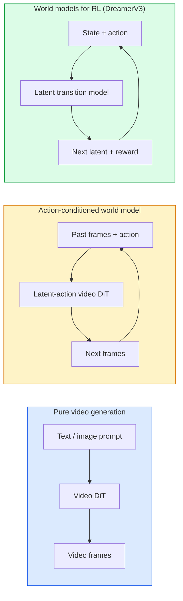

# 世界模型与视频扩散

> 一个预测场景接下来几秒的视频模型就是一个世界模拟器。在该预测上以动作为条件，你就拥有了一个学习到的游戏引擎。

**类型：** 学习 + 构建
**语言：** Python
**前置条件：** 阶段 4 第 10 课（扩散），阶段 4 第 12 课（视频理解），阶段 4 第 23 课（DiT + Rectified Flow）
**时间：** ~75 分钟

## 学习目标

- 解释纯视频生成模型（Sora 2）与动作条件世界模型（Genie 3、DreamerV3）之间的区别
- 描述视频 DiT：时空 patch、3D 位置编码、跨 (T, H, W) token 的联合注意力
- 追踪世界模型如何接入机器人技术：VLM 规划 → 视频模型模拟 → 逆动力学发出动作
- 在 Sora 2、Genie 3、Runway GWM-1 Worlds、Wan-Video 和 HunyuanVideo 之间为给定用例（创意视频、交互式模拟、自动驾驶合成）做出选择

## 问题

视频生成和世界建模在 2026 年融合了。一个能够生成连贯一分钟视频的模型在某种意义上已经学会了世界如何运动：物体恒存、重力、因果关系、风格。如果你以动作（向左走、开门）为条件进行预测，视频模型就变成了一个可学习的模拟器，可以替代游戏引擎、驾驶模拟器或机器人环境。

其影响是具体的。Genie 3 从单张图像生成可玩的环境。Runway GWM-1 Worlds 合成无限的可探索场景。Sora 2 生成带同步音频和建模物理的一分钟长视频。NVIDIA Cosmos-Drive、Wayve Gaia-2 和 Tesla DrivingWorld 为自动驾驶训练数据生成逼真的驾驶视频。世界模型范式正悄然接管机器人领域的 sim-to-real。

本课是阶段 4 的"大局观"课程。它将图像生成、视频理解和代理推理连接成主导研究正趋同的架构模式。

## 概念

### 世界建模的三个家族


```mermaid
flowchart LR
    subgraph GEN["Pure video generation"]
        G1["Text / image prompt"] --> G2["Video DiT"] --> G3["Video frames"]
    end
    subgraph ACTION["Action-conditioned world model"]
        A1["Past frames + action"] --> A2["Latent-action video DiT"] --> A3["Next frames"]
        A3 --> A1
    end
    subgraph RL["World models for RL (DreamerV3)"]
        R1["State + action"] --> R2["Latent transition model"] --> R3["Next latent + reward"]
        R3 --> R1
    end

    style GEN fill:#dbeafe,stroke:#2563eb
    style ACTION fill:#fef3c7,stroke:#d97706
    style RL fill:#dcfce7,stroke:#16a34a
```

- **Sora 2** 是纯视频生成，以提示为条件。没有动作接口。你无法在生成过程中"引导"它。
- **Genie 3**、**GWM-1 Worlds**、**Mirage / Magica** 是动作条件世界模型。从观察到的视频推断潜在动作，然后以动作为条件预测未来帧。交互式的——你按键或移动相机，场景就会响应。
- **DreamerV3** 和经典的 RL 世界模型家族在潜在空间中操作，具有显式的动作条件化，在奖励信号上训练。可视化程度较低；对于样本高效的 RL 更有用。

### 视频 DiT 架构

```
Video latent:          (C, T, H, W)
Patchify (spatial):    每帧 P_h x P_w 的 patch 网格
Patchify (temporal):   将 P_t 帧分组为一个时间 patch
Resulting tokens:      (T / P_t) * (H / P_h) * (W / P_w) tokens
```

位置编码是 3D 的：每个 (t, h, w) 坐标的旋转或学习嵌入。注意力可以是：

- **完全联合**——所有 token 关注所有 token。N 个 token 的 O(N^2)。对于长视频不可行。
- **分体**——交替进行时间注意力（相同空间位置跨时间：`(H*W) * T^2`）和空间注意力（相同时间步跨空间：`T * (H*W)^2`）。由 TimeSformer 和大多数视频 DiT 使用。
- **窗口**——(t, h, w) 中的局部窗口。由 Video Swin 使用。

2026 年的每个视频扩散模型都使用这三种模式之一，加上 AdaLN 条件化（第 23 课）和 rectified flow。

### 以动作为条件：潜在动作模型

Genie 通过区分性地预测连续帧对之间的动作来学习每帧的**潜在动作**。模型的解码器然后以推断出的潜在动作为条件——而不是以显式的键盘按键为条件。在推理时，用户可以指定一个潜在动作（或从新鲜先验中采样一个），模型生成与该动作一致的下一帧。

Sora 完全跳过了动作接口。其解码器从过去的时空 token 预测下一时空 token。Prompt 条件化起始帧；没有东西在生成过程中引导它。

### 物理合理性

Sora 2 的 2026 年发布明确宣传了**物理合理性**：重量、平衡、物体恒存、因果关系。团队通过人工评分的合理性分数来衡量；模型在掉落物体、角色碰撞和故意失败（跳跃失误）方面相较于 Sora 1 有了明显改善。

合理性仍然是主要的失败模式。2024-2025 年人们吃意大利面或从玻璃杯喝水的视频揭示了模型缺乏持久的物体表示。2026 年的模型（Sora 2、Runway Gen-5、HunyuanVideo）减少了但并未消除这些问题。

### 自动驾驶世界模型

驾驶世界模型生成以轨迹、边界框或导航地图为条件的逼真道路场景。用途：

- **Cosmos-Drive-Dreams**（NVIDIA）——生成长达数分钟的驾驶视频用于 RL 训练。
- **Gaia-2**（Wayve）——以轨迹为条件的场景合成，用于策略评估。
- **DrivingWorld**（Tesla）——模拟多变天气、时间、交通条件。
- **Vista**（ByteDance）——响应式驾驶场景合成。

它们替代了昂贵的真实世界数据收集，用于边缘案例——夜间行人横穿马路、结冰的十字路口、不常见的车辆类型——否则需要数百万英里的驾驶。

### 机器人技术堆栈：VLM + 视频模型 + 逆动力学

新兴的三组件机器人循环：

1. **VLM** 解析目标（"拿起红杯子"），规划高层动作序列。
2. **视频生成模型** 模拟执行每个动作会是什么样子——预测未来 N 帧的观察。
3. **逆动力学模型** 提取能产生这些观察的具体电机指令。

这替代了奖励塑造和样本密集的 RL。世界模型进行想象；逆动力学闭环到执行。Genie Envisioner 是其中一个实例；许多研究团队正趋近于这个结构。

### 评估

- **视觉质量**——FVD（Fr\échet Video Distance）、用户研究。
- **提示对齐**——每帧 CLIPScore、VQA 风格评估。
- **物理合理性**——在基准套件（Sora 2 的内部基准、VBench）上人工评分。
- **可控性**（对于交互式世界模型）——动作 → 观察一致性；你能回到之前的状态吗？

### 2026 年模型格局

| 模型 | 用途 | 参数 | 输出 | 许可 |
|-------|-----|------------|--------|---------|
| Sora 2 | 文生视频、音频 | — | 1 分钟 1080p + 音频 | 仅 API |
| Runway Gen-5 | 文本/图像转视频 | — | 10 秒片段 | API |
| Runway GWM-1 Worlds | 交互式世界 | — | 无限 3D 展开 | API |
| Genie 3 | 从图像交互世界 | 11B+ | 可玩帧 | 研究预览 |
| Wan-Video 2.1 | 开源文生视频 | 14B | 高质量片段 | 非商业 |
| HunyuanVideo | 开源文生视频 | 13B | 10 秒片段 | 宽松 |
| Cosmos / Cosmos-Drive | 自动驾驶模拟 | 7-14B | 驾驶场景 | NVIDIA 开放 |
| Magica / Mirage 2 | AI 原生游戏引擎 | — | 可修改的世界 | 产品 |

## 构建

### 步骤 1：3D 视频 Patch 化

```python
import torch
import torch.nn as nn


class VideoPatch3D(nn.Module):
    def __init__(self, in_channels=4, dim=64, patch_t=2, patch_h=2, patch_w=2):
        super().__init__()
        self.proj = nn.Conv3d(
            in_channels, dim,
            kernel_size=(patch_t, patch_h, patch_w),
            stride=(patch_t, patch_h, patch_w),
        )
        self.patch_t = patch_t
        self.patch_h = patch_h
        self.patch_w = patch_w

    def forward(self, x):
        # x: (N, C, T, H, W)
        x = self.proj(x)
        n, c, t, h, w = x.shape
        tokens = x.reshape(n, c, t * h * w).transpose(1, 2)
        return tokens, (t, h, w)
```

一个步长等于卷积核的 3D 卷积充当时空 patch 化器。`(T, H, W) -> (T/2, H/2, W/2)` token 网格。

### 步骤 2：3D 旋转位置编码

沿 `t`、`h`、`w` 轴分别应用的旋转位置嵌入（RoPE）：

```python
def rope_3d(tokens, t_dim, h_dim, w_dim, grid):
    """
    tokens: (N, T*H*W, D)
    grid: (T, H, W) sizes
    t_dim + h_dim + w_dim == D
    """
    T, H, W = grid
    n, seq, d = tokens.shape
    if t_dim + h_dim + w_dim != d:
        raise ValueError(f"t_dim+h_dim+w_dim ({t_dim}+{h_dim}+{w_dim}) must equal D={d}")
    assert seq == T * H * W
    t_idx = torch.arange(T, device=tokens.device).repeat_interleave(H * W)
    h_idx = torch.arange(H, device=tokens.device).repeat_interleave(W).repeat(T)
    w_idx = torch.arange(W, device=tokens.device).repeat(T * H)
    # 简化：仅按频率缩放通道。真正的 RoPE 旋转成对通道。
    freqs_t = torch.exp(-torch.log(torch.tensor(10000.0)) * torch.arange(t_dim // 2, device=tokens.device) / (t_dim // 2))
    freqs_h = torch.exp(-torch.log(torch.tensor(10000.0)) * torch.arange(h_dim // 2, device=tokens.device) / (h_dim // 2))
    freqs_w = torch.exp(-torch.log(torch.tensor(10000.0)) * torch.arange(w_dim // 2, device=tokens.device) / (w_dim // 2))
    emb_t = torch.cat([torch.sin(t_idx[:, None] * freqs_t), torch.cos(t_idx[:, None] * freqs_t)], dim=-1)
    emb_h = torch.cat([torch.sin(h_idx[:, None] * freqs_h), torch.cos(h_idx[:, None] * freqs_h)], dim=-1)
    emb_w = torch.cat([torch.sin(w_idx[:, None] * freqs_w), torch.cos(w_idx[:, None] * freqs_w)], dim=-1)
    return tokens + torch.cat([emb_t, emb_h, emb_w], dim=-1)
```

简化的加法形式。真正的 RoPE 以频率旋转配对通道；位置信息相同。

### 步骤 3：分体注意力块

```python
class DividedAttentionBlock(nn.Module):
    def __init__(self, dim=64, heads=2):
        super().__init__()
        self.time_attn = nn.MultiheadAttention(dim, heads, batch_first=True)
        self.space_attn = nn.MultiheadAttention(dim, heads, batch_first=True)
        self.ln1 = nn.LayerNorm(dim)
        self.ln2 = nn.LayerNorm(dim)
        self.ln3 = nn.LayerNorm(dim)
        self.mlp = nn.Sequential(nn.Linear(dim, 4 * dim), nn.GELU(), nn.Linear(4 * dim, dim))

    def forward(self, x, grid):
        T, H, W = grid
        n, seq, d = x.shape
        # 时间注意力：相同 (h, w) 跨 t
        xt = x.view(n, T, H * W, d).permute(0, 2, 1, 3).reshape(n * H * W, T, d)
        a, _ = self.time_attn(self.ln1(xt), self.ln1(xt), self.ln1(xt), need_weights=False)
        xt = (xt + a).reshape(n, H * W, T, d).permute(0, 2, 1, 3).reshape(n, seq, d)
        # 空间注意力：相同 t 跨 (h, w)
        xs = xt.view(n, T, H * W, d).reshape(n * T, H * W, d)
        a, _ = self.space_attn(self.ln2(xs), self.ln2(xs), self.ln2(xs), need_weights=False)
        xs = (xs + a).reshape(n, T, H * W, d).reshape(n, seq, d)
        xs = xs + self.mlp(self.ln3(xs))
        return xs
```

时间注意力在每个空间位置内跨时间进行；空间注意力在每个帧内跨位置进行。两次 O(T^2 + (HW)^2) 操作，而非一次 O((THW)^2)。这是 TimeSformer 和每个现代视频 DiT 的核心。

### 步骤 4：组成微型视频 DiT

```python
class TinyVideoDiT(nn.Module):
    def __init__(self, in_channels=4, dim=64, depth=2, heads=2):
        super().__init__()
        self.patch = VideoPatch3D(in_channels=in_channels, dim=dim, patch_t=2, patch_h=2, patch_w=2)
        self.blocks = nn.ModuleList([DividedAttentionBlock(dim, heads) for _ in range(depth)])
        self.out = nn.Linear(dim, in_channels * 2 * 2 * 2)

    def forward(self, x):
        tokens, grid = self.patch(x)
        for blk in self.blocks:
            tokens = blk(tokens, grid)
        return self.out(tokens), grid
```

不是一个能工作的视频生成器；而是一个每个部件形状都正确的结构演示。

### 步骤 5：检查形状

```python
vid = torch.randn(1, 4, 8, 16, 16)  # (N, C, T, H, W)
model = TinyVideoDiT()
out, grid = model(vid)
print(f"input  {tuple(vid.shape)}")
print(f"tokens grid {grid}")
print(f"output {tuple(out.shape)}")
```

期望 `grid = (4, 8, 8)` 和 `out = (1, 256, 32)` 在 patch 化后；然后头部投影到每个 token 的时空 patch，准备重新 patchify 回视频。

## 使用

2026 年的生产访问模式：

- **Sora 2 API**（OpenAI）——文生视频，同步音频。高级定价。
- **Runway Gen-5 / GWM-1**（Runway）——图像转视频，交互式世界。
- **Wan-Video 2.1 / HunyuanVideo**——开源自托管。
- **Cosmos / Cosmos-Drive**（NVIDIA）——驾驶模拟开源权重。
- **Genie 3**——研究预览，请求访问。

要构建交互式世界模型演示：从 Wan-Video 开始以保证质量，加上潜在动作适配器以实现交互性。对于自动驾驶模拟：Cosmos-Drive 是 2026 年的开放参考。

对于机器人技术，实际中的堆栈：

1. 语言目标 → VLM（Qwen3-VL）→ 高层计划。
2. 计划 → 潜在动作视频模型 → 想象的展开。
3. 展开 → 逆动力学模型 → 低层动作。
4. 动作执行 → 观察反馈到步骤 1。

## 交付

本课产出：

- `outputs/prompt-video-model-picker.md`——根据任务、许可和延迟选择 Sora 2 / Runway / Wan / HunyuanVideo / Cosmos。
- `outputs/skill-physical-plausibility-checks.md`——一个技能，定义自动检查（物体恒存、重力、连续性）以在发布前对任何生成的视频运行。

## 练习

1. **（简单）** 计算 5 秒 360p 视频在 patch-t=2、patch-h=8、patch-w=8 时的 token 数量。推算出此规模下注意力的内存需求。
2. **（中等）** 将上述分体注意力块替换为完全联合注意力块，测量形状和参数量。解释为什么分体注意力对真实视频模型是必要的。
3. **（困难）** 构建一个最小的潜在动作视频模型：取一个 (frame_t, action_t, frame_{t+1}) 三元组数据集（任何简单的 2D 游戏），训练一个以动作嵌入为条件的微型视频 DiT，并展示不同动作产生不同的下一帧。

## 关键术语

| 术语 | 人们说的 | 实际含义 |
|------|----------------|----------------------|
| 世界模型 | "学习到的模拟器" | 给定状态和动作预测未来观察的模型 |
| 视频 DiT | "时空 transformer" | 具有 3D patch 化和分体注意力的扩散 transformer |
| 潜在动作 | "推断的控制" | 从帧对推断的离散或连续动作潜在量；用于条件化下一帧生成 |
| 分体注意力 | "时间然后空间" | 每块两个注意力操作——跨时间然后跨空间——以保持 O(N^2) 可控 |
| 物体恒存 | "事物保持真实" | 视频模型必须学习的场景属性；关于食物、玻璃器皿的经典失败模式 |
| FVD | "Fr\échet 视频距离" | FID 的视频等价物；主要视觉质量指标 |
| 逆动力学模型 | "观察到动作" | 给定（状态，下一状态），输出连接它们的动作；闭环机器人循环 |
| Cosmos-Drive | "NVIDIA 驾驶模拟" | 用于 RL 和评估的开源权重自动驾驶世界模型 |

## 延伸阅读

- [Sora 技术报告（OpenAI）](https://openai.com/index/video-generation-models-as-world-simulators/)
- [Genie：生成式交互环境（Bruce 等人, 2024）](https://arxiv.org/abs/2402.15391)——潜在动作世界模型
- [TimeSformer（Bertasius 等人, 2021）](https://arxiv.org/abs/2102.05095)——视频 transformer 的分体注意力
- [DreamerV3（Hafner 等人, 2023）](https://arxiv.org/abs/2301.04104)——RL 的世界模型
- [Cosmos-Drive-Dreams（NVIDIA, 2025）](https://research.nvidia.com/labs/toronto-ai/cosmos-drive-dreams/)——驾驶世界模型
- [2026 年十大视频生成模型（DataCamp）](https://www.datacamp.com/blog/top-video-generation-models)
- [从视频生成到世界模型——综述仓库](https://github.com/ziqihuangg/Awesome-From-Video-Generation-to-World-Model/)
