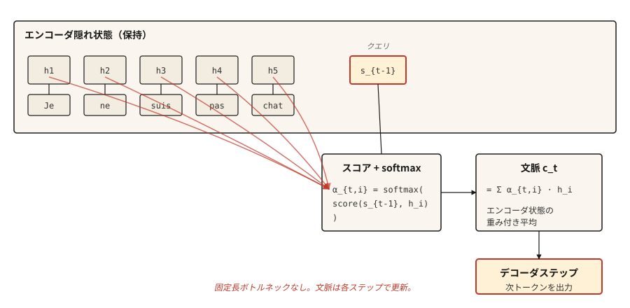

# Attention Mechanism — Atılım

> Kod çözücü, sıkıştırılmış özete gözlerini kısarak bakmayı bırakır ve kaynağın tamamına bakmaya başlar. Bundan sonrası dikkat artı mühendisliktir.

**Tür:** Yapım
**Diller:** Python
**Önkoşullar:** Aşama 5 · 09 (Sıradan Sıraya Modeller)
**Süre:** ~45 dakika

## Sorun

Ders 09 ölçülen bir başarısızlıkla sona erdi. Oyuncak kopyalama görevi konusunda eğitilmiş bir GRU kodlayıcı-kod çözücü, uzunluk 5'te %89 doğruluktan, uzunluk 80'de neredeyse şansa doğru gider. Bunun nedeni bir eğitim hatası değil yapısaldır: kodlayıcının topladığı her bilgi biti sabit boyutlu bir gizli duruma sığmak zorundadır ve kod çözücü asla başka bir şey görmez.

Bahdanau, Cho ve Bengio, 2014 yılında üç satırlık bir düzeltme yayınladılar. Kod çözücüye yalnızca son kodlayıcı durumunu vermek yerine, her kodlayıcı durumunu koruyun. Her kod çözücü adımında, ağırlıkların "kod çözücünün şu anda `i` kodlayıcı konumuna ne kadar bakması gerekiyor?" dediği kodlayıcı durumlarının ağırlıklı ortalamasını hesaplayın. Bu ağırlıklı ortalama bağlamdır ve kod çözücünün her adımını değiştirir.

Bütün fikir bu. Transformer'ler bunu genişletti. Kişisel dikkat bunu tek bir diziye uyguladı. Çok kafalı dikkat paralel olarak yürütüldü. Ancak 2014 sürümü zaten darboğazı aştı ve bir kez buna sahip olduğunuzda, transformer'lerin pivotu kavramsal değil mühendisliktir.

## Konsept



Her kod çözücü adımında `t`:

1. **sorgu** olarak önceki kod çözücü gizli durumu `s_{t-1}`'yi kullanın.
2. Her kodlayıcı gizli durumu `h_1, ..., h_T`'ye göre puanlayın. Enkoder konumu başına bir skaler.
3. Toplamı 1 olan `α_{t,1}, ..., α_{t,T}` ağırlıklarını toplamak için puanları Softmax yapın.
4. Bağlam vektörü `c_t = Σ α_{t,i} * h_i`. Kodlayıcı durumlarının ağırlıklı ortalaması.
5. Kod çözücü, `c_t` artı önceki token çıktısını alır ve sonraki token'yi üretir.

Ağırlıklı ortalama noktadır. Kod çözücünün "Je"yi "I"ye çevirmesi gerektiğinde, kodlayıcı durumunu "Je" yüksek ve diğerleri düşük olacak şekilde ağırlıklandırır. "Değil" ihtiyacı olduğunda, "pas" değerini yüksek tutar. Bağlam vektörü her adımı yeniden şekillendirir.

## Şekiller (herkesi ısıran şey)

Her dikkat uygulamasının ilk seferde yanlış gittiği nokta burasıdır. Yavaşça okuyun.

| Şey | Şekil | Notlar |
|-------|-------|-------|
| Kodlayıcı gizli durumları `H` | `(T_enc, d_h)` | BiLSTM ise `d_h = 2 * d_hidden` |
| Kod çözücünün gizli durumu `s_{t-1}` | `(d_s,)` | bir vektör |
| Dikkat puanı `e_{t,i}` | skaler | Kodlayıcı konumu başına bir adet |
| Dikkat ağırlığı `α_{t,i}` | skaler | Softmax'tan sonra tüm `i` |
| Bağlam vektörü `c_t` | `(d_h,)` | Kodlayıcı durumuyla aynı şekil |

**Bahdanau (toplam) puanı.** `e_{t,i} = v_α^T * tanh(W_a * s_{t-1} + U_a * h_i)`.

- `s_{t-1}`, `(d_s,)` şeklindedir, `h_i`, `(d_h,)` şeklindedir.
- `W_a`, `(d_attn, d_s)` şeklindedir. `U_a`, `(d_attn, d_h)` şeklindedir.
- Tanh içindeki toplamları `(d_attn,)` şeklindedir.
- `v_α`, `(d_attn,)` şeklindedir. `v_α`'nin iç çarpımı bir skalere daraltılır. **`v_α`'nin yaptığı budur.** Bu bir sihir değildir. Dikkatin sönük olduğu bir vektörü skaler bir puana dönüştüren projeksiyondur.

**Luong (çarpımlı) puanı.** Üç değişken:

- `dot`: `e_{t,i} = s_t^T * h_i`. `d_s == d_h` gerektirir. Sert kısıtlama. Kodlayıcınız çift yönlüyse atlayın.
- `general`: `W` şekilli `(d_s, d_h)` ile `e_{t,i} = s_t^T * W * h_i`. Eşit karartma kısıtlamasını kaldırır.
- `concat`: esasen Bahdanau formu. İlk ikisi daha ucuz olduğundan nadiren kullanılır.

**Adlandırmaya değer bir Bahdanau / Luong var.** Bahdanau, `s_{t-1}`'yi (mevcut kelimeyi oluşturmadan *önceki* kod çözücü durumu) kullanır. Luong, `s_t`'yi (*sonraki* durumu) kullanır. Bunları karıştırmak, hata ayıklaması son derece zor olan, ustaca yanlış gradient'ler üretir. Bir kağıt seçin ve kurallarına sadık kalın.

```figure
attention-heatmap
```

## İnşa Et

### Adım 1: katkı (Bahdanau) dikkati

```python
import numpy as np


def additive_attention(decoder_state, encoder_states, W_a, U_a, v_a):
    projected_dec = W_a @ decoder_state
    projected_enc = encoder_states @ U_a.T
    combined = np.tanh(projected_enc + projected_dec)
    scores = combined @ v_a
    weights = softmax(scores)
    context = weights @ encoder_states
    return context, weights


def softmax(x):
    x = x - np.max(x)
    e = np.exp(x)
    return e / e.sum()
```

Şekillerinizi yukarıdaki tabloya göre kontrol edin. `encoder_states`, `(T_enc, d_h)` şekline sahiptir. `projected_enc`, `(T_enc, d_attn)` şeklindedir. `projected_dec`, `(d_attn,)`'yi şekillendirir ve yayın yapar. `combined`, `(T_enc, d_attn)` şeklindedir. `scores`, `(T_enc,)` şeklindedir. `weights`, `(T_enc,)` şeklindedir. `context`, `(d_h,)` şeklindedir. Gönderin.

### Adım 2: Luong noktası ve genel

```python
def dot_attention(decoder_state, encoder_states):
    scores = encoder_states @ decoder_state
    weights = softmax(scores)
    return weights @ encoder_states, weights


def general_attention(decoder_state, encoder_states, W):
    projected = W.T @ decoder_state
    scores = encoder_states @ projected
    weights = softmax(scores)
    return weights @ encoder_states, weights
```

Her biri üç satır. Luong'un yazısının ulaşmasının nedeni budur. Çoğu görevde aynı doğruluk, çok daha az kod.

### Adım 3: üzerinde çalışılmış sayısal bir örnek

Üç kodlayıcı durumu (kabaca "kedi", "sat", "mat") ve birinciyle en fazla hizalanan kod çözücü durumu göz önüne alındığında, dikkat dağıtımı 0 konumuna odaklanır. Kod çözücü durumu sonuncuyla hizalanacak şekilde kayarsa dikkat 2. konuma hareket eder. Bağlam vektörü izler.

```python
H = np.array([
    [1.0, 0.0, 0.2],
    [0.5, 0.5, 0.1],
    [0.1, 0.9, 0.3],
])

s_close_to_cat = np.array([0.9, 0.1, 0.2])
ctx, w = dot_attention(s_close_to_cat, H)
print("weights:", w.round(3))
```

```
weights: [0.464 0.305 0.231]
```

İlk sıra kazanır. Daha sonra kod çözücü durumunu üçüncü kodlayıcı durumuna yaklaştırın ve ağırlıkların değişimini izleyin. İşte bu. Dikkat açık bir hizalamadır.

### Adım 4: neden bu transformer'lere giden köprü?

Yukarıdaki dili Q/K/V diline çevirin:

- **Sorgu** = kod çözücü durumu `s_{t-1}`
- **Anahtar** = kodlayıcı durumları (neye karşı puan aldığımız)
- **Değer** = kodlayıcı durumları (ağırlıklandırdığımız ve topladığımız değer)

Klasik dikkatte anahtarlar ve değerler aynı şeydir. Kişisel dikkat onları ayırır: K ve V için farklı öğrenilmiş yansıtmalarla bir diziyi kendisine karşı sorgulayabilirsiniz. Çok kafalı dikkat, bunu öğrenilmiş farklı yansıtmalarla paralel olarak çalıştırır. Transformer'ler tüm aşamayı birçok kez istifler ve RNN'leri düşürür.

Matematik aynı. Şekiller aynı. Bahdanau dikkatinden ölçeklendirilmiş nokta çarpım dikkatine yapılan pedagojik sıçrama çoğunlukla notasyondur.

## Kullan onu

PyTorch ve TensorFlow doğrudan dikkati çeker.

```python
import torch
import torch.nn as nn

mha = nn.MultiheadAttention(embed_dim=128, num_heads=8, batch_first=True)
query = torch.randn(2, 5, 128)
key = torch.randn(2, 10, 128)
value = torch.randn(2, 10, 128)

output, weights = mha(query, key, value)
print(output.shape, weights.shape)
```

```
torch.Size([2, 5, 128]) torch.Size([2, 5, 10])
```

Bu bir transformer dikkat katmanıdır. 5 konumlu sorgu grubu, 10 konumlu anahtar/değer grubu, her biri 128-dim, 8 kafa. `output` yeni bağlamla zenginleştirilmiş sorgulardır. `weights`, görselleştirebileceğiniz 5x10 hizalama matrisidir.

### Klasik dikkat hâlâ önemli olduğunda

- Pedagoji. Tek kafalı, tek katmanlı, RNN tabanlı versiyon her konsepti görünür kılar.
- transformer'lerin uymadığı cihaz içi sıralı görevler.
- 2014-2017'den herhangi bir makale. Bahdanau'nun kuralını bilmeden yanlış okuyacaksınız.
- MT'de ince taneli hizalama analizi. Ham dikkat ağırlıkları, transformer modellerinde bile bir yorumlanabilirlik aracıdır ve bunları okumak, bunların ne olduğunu bilmeyi gerektirir.

### Açıklama olarak dikkatin ağırlığı tuzağı

Dikkat ağırlıkları yorumlanabilir görünüyor. Bunlar, konumlar arasında toplamı bir olan ağırlıklardır; onları planlayabilirsiniz; yüksek "şuna baktım" anlamına gelir. Eleştirmenler onları seviyor.

Göründükleri kadar yorumlanabilir değiller. Jain ve Wallace (2019), bazı görevler için model tahminlerini değiştirmeden dikkat dağılımlarının değiştirilebileceğini ve keyfi alternatiflerle değiştirilebileceğini gösterdi. Dikkat ağırlıklarını, ablasyon veya karşı olgusal kontrol olmadan asla akıl yürütmenin kanıtı olarak rapor etmeyin.

## Gönderin

`outputs/prompt-attention-shapes.md` olarak kaydet:

```markdown
---
name: attention-shapes
description: Debug shape bugs in attention implementations.
phase: 5
lesson: 10
---

Given a broken attention implementation, you identify the shape mismatch. Output:

1. Which matrix has the wrong shape. Name the tensor.
2. What its shape should be, derived from (d_s, d_h, d_attn, T_enc, T_dec, batch_size).
3. One-line fix. Transpose, reshape, or project.
4. A test to catch regressions. Typically: assert `output.shape == (batch, T_dec, d_h)` and `weights.shape == (batch, T_dec, T_enc)` and `weights.sum(dim=-1) close to 1`.

Refuse to recommend fixes that silently broadcast. Broadcast-hiding bugs surface later as silent accuracy degradation, the worst kind of attention bug.

For Bahdanau confusion, insist the decoder input is `s_{t-1}` (pre-step state). For Luong, `s_t` (post-step state). For dot-product, flag dimension mismatch between query and key as the most common first-time error.
```

## Egzersizler

1. **Kolay.** `softmax` maskelemeyi uygulayarak kodlayıcıdaki token'leri doldurmanın dikkat ağırlığını sıfır almasını sağlayın. Değişken uzunluklu dizilere sahip bir parti üzerinde test yapın.
2. **Orta.** Luong `general` formuna çok kafalı dikkat ekleyin. `d_h`'yi `n_heads` gruplarına ayırın, kişi başına dikkati çalıştırın ve birleştirin. Tek kafalı durumun önceki uygulamanızla eşleştiğini doğrulayın.
3. **Zor.** Bir GRU kodlayıcı-kod çözücüyü Bahdanau dikkatiyle 09. dersteki oyuncak kopyalama görevi konusunda eğitin. Çizim doğruluğu ve dizi uzunluğu. Dikkatsizlik temel çizgisiyle karşılaştırın. Uzunluk arttıkça boşluğun genişlediğini görmeniz gerekir, bu da dikkatin darboğazı kaldırdığını doğrular.

## Anahtar Terimler

| Dönem | İnsanlar ne diyor | Aslında ne anlama geliyor |
|------|-----------------|-----------------------|
| Dikkat | Nesnelere bakmak | Bir değer dizisinin ağırlıklı ortalaması, sorgu anahtarı benzerliğinden hesaplanan ağırlıklar. |
| Sorgu, Anahtar, Değer | QKV | Üç projeksiyon: Q sorar, K neyle eşleşecek, V ne döndürülecek. |
| İlave dikkat | Bahdanau | İleri besleme puanı: `v^T tanh(W q + U k)`. |
| Çarpımsal dikkat | Luong noktası / genel | Puan `q^T k` veya `q^T W k`'dir. Çoğu görevde daha ucuz ve aynı doğruluk. |
| Hizalama matrisi | Güzel resim | `(T_dec, T_enc)` ızgarası olarak ağırlıklara dikkat edin. Modelin neye katıldığını görmek için okuyun. |

## Daha Fazla Okuma

- [Bahdanau, Cho, Bengio (2014). Hizalamayı ve Çevirmeyi Ortaklaşa Öğrenme yoluyla Nöral Makine Çevirisi](https://arxiv.org/abs/1409.0473) — makale.
- [Luong, Pham, Manning (2015). Dikkate Dayalı Nöral Makine Çevirisine Etkili Yaklaşımlar](https://arxiv.org/abs/1508.04025) — üç puan değişkeni ve bunların karşılaştırılması.
- [Jain ve Wallace (2019). Dikkat Açıklama Değildir](https://arxiv.org/abs/1902.10186) — yorumlanabilirlik uyarısı.
- [Deep Learning — Bahdanau Dikkatine Dalın](https://d2l.ai/chapter_attention-mechanisms-and-transformers/bahdanau-attention.html) — PyTorch ile çalıştırılabilir izlenecek yol.
