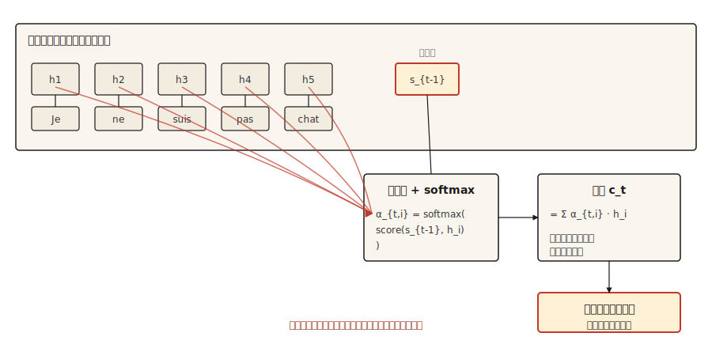

# 注意力机制-突破

> 解码器停止眯着眼睛观看压缩摘要，并开始查看整个源代码。之后的一切都是注意力加工程。

** 类型：** 构建
** 语言：** Python
** 预测：** 第5阶段· 09（序列到序列模型）
** 时间：** ~45分钟

## 问题

第09课以一次测量的失败结束。接受玩具复制任务训练的GRU编码器-解码器的准确率从长度5时的89%提高到长度80时的接近概率。原因是结构性的，而不是训练错误：编码器收集的每一位信息都必须适应一个固定大小的隐藏状态，而解码器永远看不到其他任何东西。

BahDanau、Cho和Bengio于2014年发布了三行修复方案。不要只向解码器提供最终的编码器状态，而是保留每个编码器状态。在每个解码器步骤中，计算编码器状态的加权平均值，其中权重表示“解码器现在需要查看多少编码器位置‘i’？“加权平均值就是上下文，它改变了解码器的每个步骤。

这就是整个想法。变形金刚将其扩展。自我注意力将其应用到一个序列中。多头注意力并行运行。但2014年版本已经打破了瓶颈，一旦你拥有了它，转向变压器就是工程上的，而不是概念上的。

## 概念



在每个解码器步骤' t '：

1. 使用之前的解码器隐藏状态' s_{t-1}'作为 ** 查询 **。
2. 针对每个编码器隐藏状态' h_1，.，对其进行评分h_T '。每个编码器位置一个纯量。
3. Softmax获得分数以获取注意力权重' a_{t，1}，.，a_{t，T}'总和为1。
4. 上下文载体' c_t =' a_{t，i} * h_i '。编码器状态的加权平均值。
5. 解码器采用“c_t”加上上一个输出令牌，产生下一个令牌。

加权平均值才是重点。当解码器需要将“Je”翻译为“I”时，它将编码器状态加权为“Je”高，其他状态加权为低。当它需要“不”时，它会把“通过”的权重很高。上下文载体重塑了每一步。

## 《咬所有人的东西》（The Thing That Bites Everyone）

这就是每个注意力实施第一次出错的地方。慢慢读。

| 事 | 形状 | 注意到 |
|-------|-------|-------|
| 编码器隐藏状态“H” | '（T_enc，d_h）' | 如果BiLSTM，则' d_h = 2 * d_hidden ' |
| 解码器隐藏状态& s_{t-1}' | '（d_s，）' | 一个向量 |
| 注意力得分' e_{t，i}' | 标量 | 每个编码器位置一个 |
| 注意力权重' a_{t，i}' | 标量 | 在softmax结束所有' i '之后 |
| 上下文载体' c_t ' | '（d_h，）' | 与编码器状态形状相同 |

**BahDanau（相加）分数。** ' e_{t，i} = v_a ' T * tanh（W_a * s_{t-1} + U_a * h_i）'。

- ' s_{t-1}'具有形状'（d_s，）'，'，' h_i '具有形状'（d_h，）'。
- ' W_a '具有形状'（d_attn，d_s）'。' U_a '的形状'（d_attn，d_h）'。
- 它们在tanh内的总和具有“（d_attn，）”的形状。
- “v_a”的形状为“（d_attn，）”。与“v_a”的内能积坍缩为纯量。** 这就是‘v_a’的作用。**这不是魔法。它是将注意力模糊向量转化为标量分数的投影。

**Luong（相乘）分数。**三种变体：

- ' dot '：' e_{t，i} = s_t ' T * h_i '。需要' d_s == d_h '。硬约束。如果您的编码器是双向的，则跳过。
- '一般'：' e_{t，i} = s_t ' T * W * h_i '，具有'形状'（d_s，d_h）'。初始化等暗约束。
- “concat”：本质上是BahDanau形式。很少使用，因为前两种更便宜。

** 值得命名的BahDanau / Luong gotcha。** BahDanau使用' s_{t-1}'（生成当前单词之前 * 的解码器状态）。Luong使用' s_t '（* 之后的状态 *）。将它们混合起来会产生微妙的错误渐变，非常难以调试。选择一张纸并遵守其惯例。

## 建设党

### 第1步：添加剂（BahDanau）注意力

```python
import numpy as np


def additive_attention(decoder_state, encoder_states, W_a, U_a, v_a):
    projected_dec = W_a @ decoder_state
    projected_enc = encoder_states @ U_a.T
    combined = np.tanh(projected_enc + projected_dec)
    scores = combined @ v_a
    weights = softmax(scores)
    context = weights @ encoder_states
    return context, weights


def softmax(x):
    x = x - np.max(x)
    e = np.exp(x)
    return e / e.sum()
```

对照上面的表格检查您的形状。“encoder_states”的形状为“（T_enc，d_h）”。' projected_enc '具有形状'（T_enc，d_attn）'。“projected_dec”具有形状“（d_attn，）”并广播。'组合'具有形状'（T_enc，d_attn）'。“分数”具有形状“（T_enc，）”。“权重”具有形状“（T_enc，）”。“上下文”具有形状“（d_h，）”。运送它。

### 第2步：隆点和一般

```python
def dot_attention(decoder_state, encoder_states):
    scores = encoder_states @ decoder_state
    weights = softmax(scores)
    return weights @ encoder_states, weights


def general_attention(decoder_state, encoder_states, W):
    projected = W.T @ decoder_state
    scores = encoder_states @ projected
    weights = softmax(scores)
    return weights @ encoder_states, weights
```

每条三行。这就是梁的论文登陆的原因。大多数任务的准确性相同，代码少得多。

### 第3步：工作的数字示例

给定三种编码器状态（大致为“cat”、“sat”、“mat”）和与第一种状态最一致的解码器状态，注意力分布集中在位置0。如果解码器状态发生变化以与最后一个状态对齐，则注意力转移到位置2。上下文载体跟踪。

```python
H = np.array([
    [1.0, 0.0, 0.2],
    [0.5, 0.5, 0.1],
    [0.1, 0.9, 0.3],
])

s_close_to_cat = np.array([0.9, 0.1, 0.2])
ctx, w = dot_attention(s_close_to_cat, H)
print("weights:", w.round(3))
```

```
weights: [0.464 0.305 0.231]
```

第一行获胜。然后将解码器状态移至更接近第三编码器状态并观察权重的变化。就是这样。注意力就是明确的一致。

### 第4步：为什么这是通往变压器的桥梁

将上述语言翻译成Q/K/V：

- ** 查询 ** =解码器状态' s_{t-1}'
- ** 关键 ** =编码器状态（我们根据什么评分）
- ** 值 ** =编码器状态（我们加权和相加）

在古典注意力中，钥匙和价值观是同一回事。自我关注将他们分开：您可以用不同的学习投影来对照序列本身来查询一个序列。多头注意力与不同的学习投影并行运行该序列。变形金刚多次堆叠整个舞台并丢弃RNN。

数学是一样的。形状是一样的。从BahDanau关注到规模化的点产品关注的教学跳跃主要是符号。

## 使用它

PyTorch和TensorFlow直接引起注意。

```python
import torch
import torch.nn as nn

mha = nn.MultiheadAttention(embed_dim=128, num_heads=8, batch_first=True)
query = torch.randn(2, 5, 128)
key = torch.randn(2, 10, 128)
value = torch.randn(2, 10, 128)

output, weights = mha(query, key, value)
print(output.shape, weights.shape)
```

```
torch.Size([2, 5, 128]) torch.Size([2, 5, 10])
```

这是一个Transformer注意力层。查询批次5个位置，键/值批次10个位置，每个128-dim，8个头。“输出”是新的上下文增强查询。“权重”是您可以可视化的5x 10对齐矩阵。

### 当古典关注仍然重要时

- 教育学单头、单层、基于RNN的版本使每个概念都可见。
- 变压器不适合的设备上序列任务。
- 2014-2017年的任何论文。你会在不了解巴赫达诺的惯例的情况下误读它。
- MT中的细粒度对齐分析。即使在Transformer模型上，原始注意力权重也是一种可解释性工具，阅读它们需要知道它们是什么。

### 关注权重即解释陷阱

注意力权重看起来可以解释。它们是跨位置和为一的权重;您可以绘制它们;高意味着“查看了这个”。“评论家喜欢它们。

它们并不像看起来那么可解释。Jain和Wallace（2019）表明，注意力分布可以被排列并被任意替代方案取代，而无需改变某些任务的模型预测。未经消融或反事实检查，切勿将注意力权重报告为推理证据。

## 把它运

另存为“输出/prompt-attention-shapes.md”：

```markdown
---
name: attention-shapes
description: Debug shape bugs in attention implementations.
phase: 5
lesson: 10
---

Given a broken attention implementation, you identify the shape mismatch. Output:

1. Which matrix has the wrong shape. Name the tensor.
2. What its shape should be, derived from (d_s, d_h, d_attn, T_enc, T_dec, batch_size).
3. One-line fix. Transpose, reshape, or project.
4. A test to catch regressions. Typically: assert `output.shape == (batch, T_dec, d_h)` and `weights.shape == (batch, T_dec, T_enc)` and `weights.sum(dim=-1) close to 1`.

Refuse to recommend fixes that silently broadcast. Broadcast-hiding bugs surface later as silent accuracy degradation, the worst kind of attention bug.

For Bahdanau confusion, insist the decoder input is `s_{t-1}` (pre-step state). For Luong, `s_t` (post-step state). For dot-product, flag dimension mismatch between query and key as the most common first-time error.
```

## 演习

1. ** 简单。**实现“softmax”掩蔽，以便编码器中的填充令牌获得注意力权重为零。对具有可变长度序列的批进行测试。
2. ** 中等。**为隆“将军”形式添加多头关注。将“d_h”分成“n_heads”组，按人头运行注意力，连接。验证单头案例与您早期的实现相匹配。
3. ** 很难。**训练GRU编码器-解码器，让BahDanau注意力完成第09课的玩具复制任务。绘图准确性与序列长度。与无注意基线进行比较。您应该看到差距随着长度的增长而扩大，这证实了注意力消除了瓶颈。

## 关键术语

| Term | 别人怎么说 | 它实际上意味着什么 |
|------|-----------------|-----------------------|
| 关注 | 看待事物 | 值序列的加权平均值，根据查询密钥相似度计算权重。 |
| 查询、键、值 | QKV | 三个投影：Q问，K是匹配什么，V是返回什么。 |
| 附加注意力 | Bahdanau | 前向得分：' v ' T tanh（W q + U k）'。 |
| 多重关注 | 隆点/将军 | 分数是“q ' T '或“q ' T ' W '。更便宜，大多数任务的准确性相同。 |
| 对齐矩阵 | 漂亮的照片 | 注意力权重为“（T_dec，T_enc）”网格。阅读它，看看模特在做什么。 |

## 进一步阅读

- [BahDanau、Cho、Bengio（2014）。联合学习对齐和翻译的神经机器翻译]（https：//arxiv.org/ab/1409.0473）-论文。
- [Luong，Pham，Manning（2015）。基于注意力的神经机器翻译的有效方法]（https：//arxiv.org/ab/1508.04025）-三种评分变体及其比较。
- [Jain和华莱士（2019）。注意力不是解释]（https：//arxiv.org/ab/1902.10186）-可解释性警告。
- [Dive深入深度学习- BahDanau Attention]（https：//d2l.ai/chapter_attention-mechamisms-and-transformers/bahDanau-attention.html）-使用PyTorch运行的演练。
