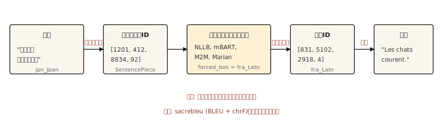

# Tradução Automatizada

> Tradução é a tarefa que pagou pesquisa em NLP por trinta anos e continua pagando agora.

**Tipo:** Construção
**Linguagens:** Python
**Pré-requisitos:** Fase 5 · 10 (Mecanismo de Attention), Fase 5 · 04 (GloVe, FastText, Subword)
**Tempo:** ~75 minutos

## O Problema

Um modelo lê uma frase num idioma e produz uma frase em outro. Comprimento varia. Ordem de palavras varia. Algumas palavras fonte mapeiam pra múltiplas palavras alvo e vice-versa. Idiomas se recusam a mapeamento um-para-um. "I miss you" em francês é "tu me manques" — literalmente "você está me faltando." Nenhum alinhamento por palavra sobrevive a isso.

Tradução automatizada é a tarefa que forçou NLP a inventar encoder-decoders, attention, transformers, e eventualmente todo o paradigma de LLM. Cada avanço chegou porque qualidade de tradução era mensurável e a lacuna entre humano e máquina era obstinada.

Essa lição pula a aula de história e ensina a pipeline funcional de 2026: encoder-decoder multilíngue pré-treinado (NLLB-200 ou mBART), tokenização de subpalavra, beam search, avaliação BLEU e chrF, e os poucos modos de falha que ainda chegam em produção sem ser detectados.

## O Conceito



MT moderna é um transformer encoder-decoder treinado em texto paralelo. O encoder lê a fonte na tokenização de seu idioma. O decoder gera o alvo, uma subpalavra por vez, usando a saída do encoder via cross-attention (lição 10). Decodificação usa beam search pra evitar a armadilha de decodificação gulosa. A saída é detokenizada, descapitalizada e pontuada contra uma referência.

Três escolhas operacionais direcionam qualidade de MT no mundo real.

- **Tokenizer.** SentencePiece BPE treinado em corpus multilíngue. Vocabulário compartilhado entre idiomas é o que habilita pares zero-shot no NLLB.
- **Tamanho do modelo.** NLLB-200 distilled 600M cabe num laptop. NLLB-200 3.3B é o padrão de produção publicado. 54.5B é o teto de pesquisa.
- **Decodificação.** Largura de beam 4-5 pra conteúdo geral. Penalidade de comprimento pra evitar saída curta demais. Decodificação restrita quando você precisa de consistência de terminologia.

## Construindo

### Passo 1: uma chamada de MT pré-treinada

```python
from transformers import AutoTokenizer, AutoModelForSeq2SeqLM

model_id = "facebook/nllb-200-distilled-600M"
tok = AutoTokenizer.from_pretrained(model_id, src_lang="eng_Latn")
model = AutoModelForSeq2SeqLM.from_pretrained(model_id)

src = "The cats are running."
inputs = tok(src, return_tensors="pt")

out = model.generate(
    **inputs,
    forced_bos_token_id=tok.convert_tokens_to_ids("fra_Latn"),
    num_beams=5,
    length_penalty=1.0,
    max_new_tokens=64,
)
print(tok.batch_decode(out, skip_special_tokens=True)[0])
```

```text
Les chats courent.
```

Três coisas importam aqui. `src_lang` diz ao tokenizer qual escrita e segmentação aplicar. `forced_bos_token_id` diz ao decoder qual idioma gerar. Ambos são truques específicos do NLLB; mBART e M2M-100 usam suas próprias convenções e não são intercambiáveis.

### Passo 2: BLEU e chrF

BLEU mede sobreposição de n-gramas entre saída e referência. Quatro tamanhos de n-grama de referência (1-4), média geométrica de precisões, penalidade de brevidade pra saída curta demais. O score fica em [0, 100]. Usado frequentemente. Frustrante de interpretar: 30 BLEU é "usável"; 40 é "bom"; 50 é "excepcional"; diferenças abaixo de 1 BLEU são ruído.

chrF mede F-score no nível de caractere. Mais sensível pra idiomas ricos morfologicamente onde BLEU subconta correspondências. Geralmente reportado junto com BLEU.

```python
import sacrebleu

hypotheses = ["Les chats courent."]
references = [["Les chats courent."]]

bleu = sacrebleu.corpus_bleu(hypotheses, references)
chrf = sacrebleu.corpus_chrf(hypotheses, references)
print(f"BLEU: {bleu.score:.1f}  chrF: {chrf.score:.1f}")
```

Sempre use `sacrebleu`. Ele normaliza tokenização pra que scores sejam comparáveis entre papers. Fazer seu próprio cálculo de BLEU é como benchmarks enganosos acontecem.

### A hierarquia de avaliação de três níveis (2026)

Avaliação de MT moderna usa três famílias de métricas complementares. Envie com pelo menos duas.

- **Heurística** (BLEU, chrF). Rápido, baseado em referência, interpretável, insensível a paráfrase. Use pra comparação legada e detecção de regressão.
- **Aprendido** (COMET, BLEURT, BERTScore). Modelos neurais treinados em julgamento humano; comparam similaridade semântica da tradução com fonte e referência. COMET tem a maior associação com pesquisa de MT desde 2023 e é o padrão de produção em 2026 onde qualidade importa.
- **LLM-como-julgador** (sem referência). Prompta um modelo grande pra pontuar traduções em fluência, adequação, tom, apropriação cultural. GPT-4-como-julgador combina com concordância humana ~80% das vezes quando o roteiro é bem desenhado. Use pra conteúdo aberto onde não existe referência.

Stack prático de 2026: `sacrebleu` pra BLEU e chrF, `unbabel-comet` pra COMET, e um LLM promptado pro sinal final que vai pro humano. Calibre cada métrica contra 50-100 exemplos rotulados por humanos antes de confiar em dados de produção.

Métricas sem referência (COMET-QE, BLEURT-QE, LLM-como-julgador) permitem avaliar traduções sem referência, o que importa pra pares de idiomas de cauda longa onde traduções de referência não existem.

### Passo 3: o que quebra em produção

A pipeline funcional acima vai traduzir fluentemente 80% do tempo e falhar silenciosamente nos 20% restantes. Modos de falha nomeados:

- **Alucinação.** Modelo inventa conteúdo que não estava na fonte. Comum em vocabulário de domínio não familiar. Sintoma: saída é fluida mas afirma fatos que a fonte não declarou. Mitigação: decodificação restrita em termos de domínio, revisão humana em conteúdo regulado, monitoramento pra saída muito mais longa que a entrada.
- **Geração off-target.** Modelo traduz pro idioma errado. NLLB é surpreendentemente propenso a isso em pares de idiomas raros. Mitigação: verifique `forced_bos_token_id` e sempre decodifique com verificação de modelo de ID de idioma na saída.
- **Deriva de terminologia.** "Sign up" vira "s'inscrire" no doc 1 e "créer um compte" no doc 2. Pra texto de UI e strings visíveis ao usuário, consistência importa mais que qualidade bruta. Mitigação: decodificação restrita por glossário ou dicionário pós-edição.
- **Incompatibilidade de formalidade.** Francês "tu" vs "vous", níveis de polidez japoneses. O modelo escolhe qual forma foi mais comum no treino. Pra conteúdo voltado pra cliente isso geralmente é errado. Mitigação: prefixo de prompt com token de formalidade se o modelo suporta, ou fine-tune num modelo pequeno em corpora exclusivamente formais.
- **Explosão de comprimento em entrada curta.** Frases de entrada muito curtas frequentemente geram traduções longas demais porque a penalidade de comprimento cai num penhasco abaixo de ~5 tokens fonte. Mitigação: limite rígido de comprimento máximo proporcional ao comprimento da fonte.

### Passo 4: fine-tuning pra um domínio

Modelos pré-treinados são generalistas. Tradução jurídica, médica ou de diálogo de jogo se beneficia mensuravelmente de fine-tuning em dados paralelos de domínio. A receita não é exótica:

```python
from transformers import Trainer, TrainingArguments
from datasets import Dataset

pairs = [
    {"src": "The defendant pleaded guilty.", "tgt": "L'accusé a plaidé coupable."},
]

ds = Dataset.from_list(pairs)


def preprocess(ex):
    return tok(
        ex["src"],
        text_target=ex["tgt"],
        truncation=True,
        max_length=128,
        padding="max_length",
    )


ds = ds.map(preprocess, remove_columns=["src", "tgt"])

args = TrainingArguments(output_dir="out", per_device_train_batch_size=4, num_train_epochs=3, learning_rate=3e-5)
Trainer(model=model, args=args, train_dataset=ds).train()
```

Alguns milhares de exemplos paralelos de alta qualidade batem algumas centenas de milhares de web-scraped ruidosos. Qualidade dos dados de treino é a maior alavanca de produção.

## Usando

Stack de produção de 2026 pra MT:

| Caso de uso | Ponto de partida recomendado |
|---------|---------------------------|
| Qualquer-para-qualquer, 200 idiomas | `facebook/nllb-200-distilled-600M` (laptop) ou `nllb-200-3.3B` (produção) |
| Centrado em inglês, alta qualidade, 50 idiomas | `facebook/mbart-large-50-many-to-many-mmt` |
| Rodadas curtas, inferência barata, inglês-francês/alemão/espanhol | Modelos Helsinki-NLP / Marian |
| Latência crítica lado do browser | Marian quantizado em ONNX (~50 MB) |
| Qualidade máxima, disposto a pagar | GPT-4 / Claude / Gemini com prompts de tradução |

LLMs agora superam modelos especializados de MT em vários pares de idiomas em 2026, particularmente em conteúdo idiomático e contexto longo. O tradeoff é custo por token e latência. Escolha um LLM quando comprimento de contexto, consistência estilística ou adaptação de domínio via prompting importa mais que throughput.

## Entregando

Salve como `outputs/skill-mt-evaluator.md`:

```markdown
---
name: mt-evaluator
description: Evaluate a machine translation output for shipping.
version: 1.0.0
phase: 5
lesson: 11
tags: [nlp, translation, evaluation]
---

Given a source text and a candidate translation, output:

1. Automatic score estimate. BLEU and chrF ranges you would expect. State whether a reference is available.
2. Five-point human-verifiable check list: (a) content preservation (no hallucinations), (b) correct language, (c) register / formality match, (d) terminology consistency with glossary if provided, (e) no truncation or length explosion.
3. One domain-specific issue to probe. E.g., for legal: named entities and statute citations. For medical: drug names and dosages. For UI: placeholder variables `{name}`.
4. Confidence flag. "Ship" / "Ship with review" / "Do not ship". Tie to the severity of issues found in step 2.

Refuse to ship a translation without a language-ID check on output. Refuse to evaluate without a reference unless the user explicitly opts in to reference-free scoring (COMET-QE, BLEURT-QE). Flag any content over 1000 tokens as likely needing chunked translation.
```

## Exercícios

1. **Fácil.** Traduza um parágrafo de 5 frases do inglês pro francês e volta pro inglês usando `nllb-200-distilled-600M`. Meça quão perto a ida-e-volta fica do original. Você deve ver preservação semântica com deriva na escolha de palavras.
2. **Médio.** Implemente uma verificação de ID de idioma nas saídas de tradução usando `fasttext lid.176` ou `langdetect`. Integre na chamada de MT pra que gerações off-target sejam capturadas antes de retornar.
3. **Difícil.** Fine-tune `nllb-200-distilled-600M` num corpus de domínio de 5.000 pares da sua escolha. Meça BLEU num conjunto de teste antes e depois do fine-tuning. Relate quais tipos de frases melhoraram e quais regrediram.

## Termos Chave

| Termo | O que a gente diz | O que realmente significa |
|------|-----------------|-----------------------|
| BLEU | Score de tradução | Precisão de n-grama com penalidade de brevidade. [0, 100]. |
| chrF | F-score de caractere | F-score no nível de caractere. Mais sensível pra idiomas ricos morfologicamente. |
| NMT | MT neural | Transformer encoder-decoder treinado em texto paralelo. O padrão pós-2017. |
| NLLB | No Language Left Behind | Família de modelos MT de 200 idiomas da Meta. |
| Decodificação restrita | Saída controlada | Força tokens ou n-gramas específicos a aparecerem/não aparecerem na saída. |
| Alucinação | Conteúdo inventado | Saída do modelo que não é suportada pela fonte. |

## Leitura Complementar

- [Costa-jussà et al. (2022). No Language Left Behind: Scaling Human-Centered Machine Translation](https://arxiv.org/abs/2207.04672) — o paper NLLB.
- [Post (2018). A Call for Clarity in Reporting BLEU Scores](https://aclanthology.org/W18-6319/) — por que `sacrebleu` é o único jeito correto de reportar BLEU.
- [Popović (2015). chrF: character n-gram F-score for automatic MT evaluation](https://aclanthology.org/W15-3049/) — o paper chrF.
- [Hugging Face MT guide](https://huggingface.co/docs/transformers/tasks/translation) — walkthrough de fine-tuning prático.
